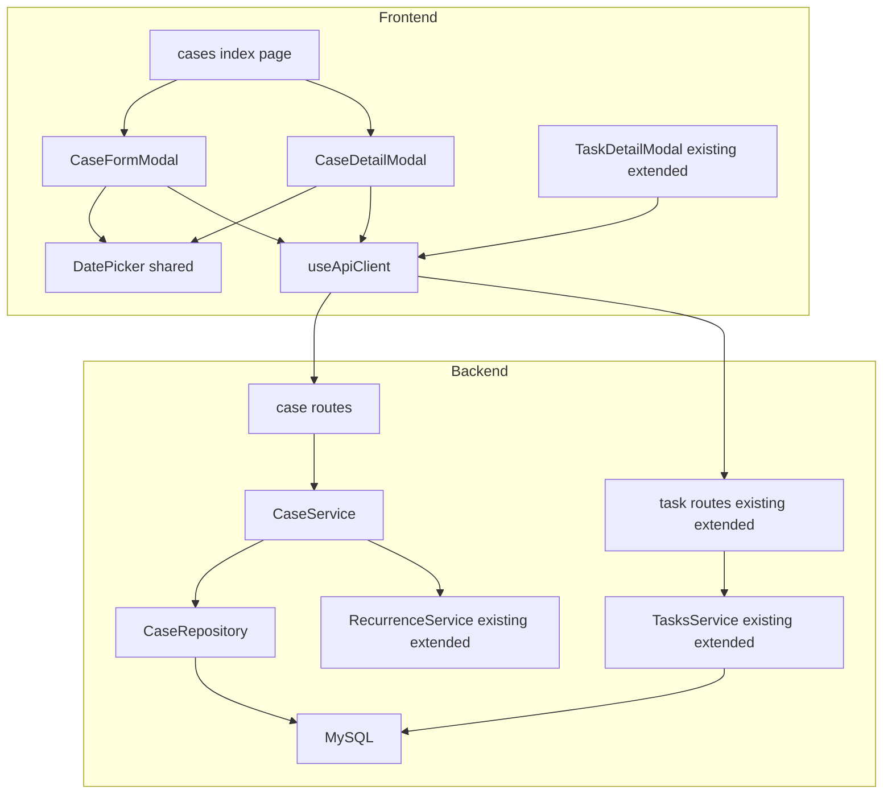
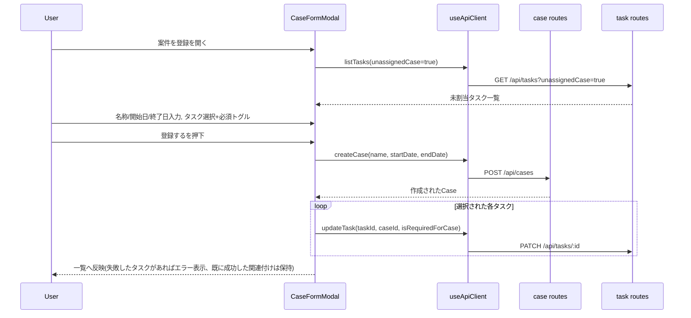
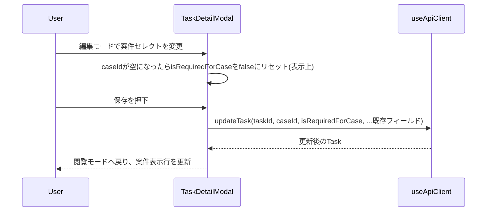
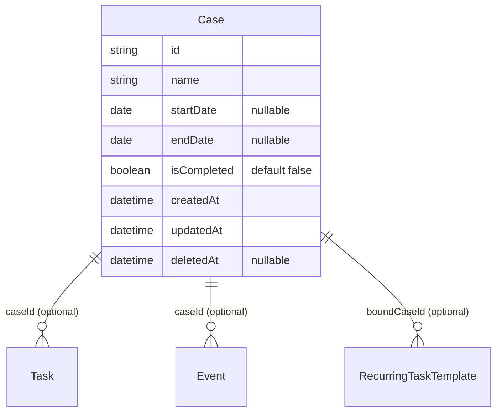

# Design Document: case-management-ux

## Overview

本機能は、既存の「納品(Delivery)」機能を「案件(Case)」へ全面改称し、開始日・終了日(いずれも任意入力)・完了フラグを追加した上で、ポップアップ形式の登録・編集UI、未割当タスクの選択関連付け、カンバン画面のタスク詳細ポップアップからの案件関連付け、およびclaude designで確定した単一日付ピッカー(開始日・終了日の入力に使用)を提供する。同デザインファミリーの時刻・日時ピッカーも再利用可能なコンポーネントとして併せて実装するが、本スペックが対応する画面には適用箇所がない。

**Users**: 案件・タスクを管理する担当ユーザーが、案件一覧・登録・編集、およびカンバン画面でのタスク編集の両方から、タスクと案件の関連付けを行う。

**Impact**: 既存の`deliveries`モジュール(バックエンド)・`frontend/pages/deliveries/`(フロントエンド)を`cases`へ全面改称・拡張する。呼称は表示文言だけでなくPrismaモデル名・テーブル/カラム名・API識別子・内部変数名まで一貫して`Case`/`case`に統一する(research.md Option A)。`tasks`/`events`/`recurrence`モジュールは`deliveryId`等の参照フィールドをリネームする形で追従する。既存の進捗算出・削除挙動(detach)は維持する。

### Goals
- 「納品」から「案件」への呼称統一を、UI表示だけでなくデータモデル・API識別子まで含めて一貫させる
- 案件に開始日・終了日(いずれも任意入力)・完了フラグを追加し、ポップアップ形式で登録・編集できるようにする
- 未割当タスクを案件登録時、またはカンバンのタスク詳細ポップアップから関連付け・必須指定できるようにする
- 既存のカンバン画面の視覚言語(Modal・カード・バッジ・view/edit切り替え)を再利用し、統一感のあるUIにする
- claude designで確定したポップアップ型の単一日付ピッカーを案件登録・編集フォームの開始日・終了日入力に適用し、同ファミリーの時刻・日時ピッカーも将来の他画面での再利用に備えて実装する

### Non-Goals
- 案件の多段階ステータス管理(進行中/保留などの状態遷移ワークフロー)
- 案件へのタスク新規作成(既存タスクの選択・関連付けのみ)
- 認証・ユーザーごとのアクセス制御、通知・リマインド配信
- 案件登録ポップアップ・タスク詳細ポップアップ以外の経路での新規タスク関連付け手段の追加(既存のタスク管理一覧画面からの割り当て変更は、表示ラベルの改称のみ行い、UI構造は変更しない)
- 繰り返しタスク生成ロジック自体の変更(トリガー元フィールド名の追従のみ)
- 時刻ピッカー・日時ピッカーの既存画面への適用(コンポーネント実装のみが対象。適用先の画面は本スペックにはない)

## Boundary Commitments

### This Spec Owns
- 案件(Case)のデータモデル・API・UI一式(旧`deliveries`モジュールの全面改称・拡張。名称・フィールド追加・汎用更新APIすべてを含む)。開始日・終了日はいずれも任意入力(nullable)とする
- タスク⇄案件の関連付け(`caseId`/`isRequiredForCase`)を設定する2つの入口: 案件登録ポップアップ(新規)とカンバンのタスク詳細ポップアップ拡張(既存モーダルへの追加)
- 案件の期限超過判定ロジック(終了日+完了フラグ基準への置き換え。終了日未設定の案件は期限超過としない)
- 未割当タスク取得のための`GET /api/tasks`フィルタ拡張(`unassignedCase`)
- アプリ全体(ダッシュボード・タスク管理画面・繰り返し設定画面を含む)の「納品」→「案件」表示文言・識別子の追従
- claude designで確定したポップアップ型の単一日付ピッカー(`DatePicker`)・時刻ピッカー(`TimePicker`)・日時ピッカー(`DateTimePicker`、日付/時刻タブ切り替え)コンポーネント一式。`DatePicker`は本スペックの案件登録・編集フォームに適用する。`TimePicker`/`DateTimePicker`は本スペックでは適用先の画面を持たない単体コンポーネントとして実装する

### Out of Boundary
- `frontend/pages/tasks/index.vue`(タスク管理一覧画面)自体のUI再デザイン。案件関連の表示ラベルの改称のみ行い、既存のUI構造(フィルタ・フォームレイアウト)は変更しない
- 案件の多段階ステータス管理、案件への新規タスク作成
- 認証・ユーザーごとのアクセス制御、通知・リマインド配信
- `recurrence`モジュールの生成ロジック自体(間隔計算・非営業日ポリシー判定)の変更。トリガー元フィールド(`endDate`)への参照更新とメソッド名の追従のみ
- 案件登録時の複数タスク関連付けにおける、単一トランザクション化(research.md Simplification参照。既存`updateTask`の逐次呼び出しで十分と判断)
- `TimePicker`/`DateTimePicker`の既存画面への適用(コンポーネント実装のみ。適用は将来の別スペックの対象)

### Allowed Dependencies
- 既存の`PATCH /api/tasks/:id`汎用更新エンドポイント(`caseId`/`isRequiredForCase`の設定ロジックは変更不要、リネームのみ)
- `frontend/components/shared/Modal.vue`(変更なしで再利用)
- カンバンの既存パターン: `TaskCard.vue`のカードスタイル、`TaskDetailModal.vue`のview⇄edit切り替え、`UnassignedBacklogPanel.vue`の検索/選択リストパターン
- `recurrence`モジュールへの外向き通知(`onCaseCreated`/`onCaseEndDateChanged`) — 呼び出し契約(引数に`Case`を渡す)は維持し、内部ロジックには手を入れない

### Revalidation Triggers
- `Case`/`Task`のデータ契約(`caseId`/`isRequiredForCase`/`startDate`/`endDate`/`isCompleted`)が変更された場合
- `recurrence`モジュールが終了日以外の基準(例: 開始日連動)を必要とするようになった場合
- 認証機能が別スペックで導入され、タスク詳細ポップアップの担当者/案件選択UXが自動化される場合(`kanban-ux-redesign` design.md Revalidation Triggersと同様の観点)
- `task-delivery-management`スペックのドキュメント上の「納品」表記と、実装後の「案件」表記の不一致が実際の開発作業で混乱を招く場合(ドキュメント自体は本スペックの対象外)

## Architecture

### Existing Architecture Analysis
- バックエンドはドメイン単位モジュール(`backend/src/modules/<domain>/`、`types/repository/service/routes`の4ファイル構成)。本スペックは`deliveries` → `cases`へのモジュール名変更を含む、既存パターンへの忠実な準拠。
- フロントエンドはNuxtのファイルベースルーティング(`pages/<domain>/index.vue`)+`useApiClient.ts`単一HTTP境界。本スペックも`pages/deliveries/` → `pages/cases/`のページ改称を行う。
- カンバン画面(`kanban-ux-redesign`スペックで確立)が、ポップアップ・カード・view/edit切り替えの視覚言語を持つ唯一の既存資産であり、本スペックはこれを踏襲する(claude design連携で確定、research.md 6章参照)。

### Architecture Pattern & Boundary Map



**Architecture Integration**:
- 選択パターン: 既存のモジュール構成をそのまま踏襲(新規パターンの導入なし)
- ドメイン境界: `cases`モジュールが案件データ・進捗算出・期限超過判定を専有。`tasks`モジュールは`caseId`/`isRequiredForCase`という外部キーのみを持ち、案件側のビジネスルール(進捗集計等)には関与しない(既存の境界を維持)
- 既存パターン維持: throwベース`HttpError`、Zod `safeParse`検証、ソフトデリートPrisma拡張、`Modal.vue`+view/edit切り替え
- 新規要素: `CaseFormModal`(登録)、`CaseDetailModal`(詳細/編集)、`DatePicker`/`TimePicker`/`DateTimePicker`(`frontend/components/shared/`配下の汎用日付・時刻入力コンポーネント)。既存の`TaskDetailModal`は破壊的変更なしで1ブロック追加
- Steering準拠: `structure.md`の「1ドメイン1ディレクトリ」「モジュール間は公開サービスインターフェース経由のみ」を維持

### Technology Stack

| Layer | Choice / Version | Role in Feature | Notes |
|-------|------------------|-----------------|-------|
| Frontend | Nuxt 4 (Vue 3) + Tailwind | 案件一覧・登録/編集ポップアップ、タスク詳細ポップアップ拡張 | 既存スタックのまま、新規ライブラリなし |
| Backend | Fastify 5 + Zod + Prisma | `cases`モジュール(改称・拡張)、`tasks`/`events`/`recurrence`モジュールの参照フィールド追従 | 既存スタックのまま |
| Data | MySQL(Prisma migrate、既存マイグレーション削除+再生成) | `deliveries`→`cases`テーブル・カラムのリネーム、フィールド追加 | 詳細は Data Models > Physical Data Model 参照 |

## File Structure Plan

### Directory Structure
```
backend/src/modules/
├── cases/                          # 旧 deliveries/ を改称・拡張
│   ├── case.types.ts               # Case, CreateCaseInput, UpdateCaseInput, CaseProgress(startDate/endDateともnullable)
│   ├── case.repository.ts          # Prisma経由データアクセス(name/startDate/endDate/isCompleted, detach-on-delete維持)
│   ├── case.service.ts             # 作成/汎用更新/進捗算出(終了日+完了フラグ基準、終了日未設定は非該当)/削除、recurrence通知(終了日設定済みの場合のみ)
│   ├── case.routes.ts              # POST/PATCH/GET/DELETE /api/cases, GET /api/cases/:id/progress
│   └── case.*.test.ts              # 既存 delivery.*.test.ts を改称・拡張
├── tasks/
│   ├── task.types.ts               # 変更: deliveryId→caseId, isRequiredForDelivery→isRequiredForCase, TaskListFilter.unassignedCase追加
│   ├── task.repository.ts          # 変更: 上記フィールド名追従 + unassignedCaseフィルタ(caseId IS NULL)
│   ├── task.routes.ts              # 変更: Zodスキーマのフィールド名追従 + unassignedCaseクエリパラメータ追加
│   └── task.service.ts             # 変更: フィールド名追従のみ(強制false等のロジックは変更なし)
├── events/
│   └── event.{types,repository,routes,service}.ts  # 変更: deliveryId→caseId のみ
├── recurrence/
│   ├── recurrence.service.ts       # 変更: onDeliveryCreated→onCaseCreated, onDeliveryDueDateChanged→onCaseEndDateChanged, delivery.dueDate→case.endDate参照
│   ├── recurrence.types.ts         # 変更: RegisterTemplateInput.boundDeliveryId→boundCaseId, deliveryOffsetDays→caseOffsetDays
│   ├── recurrence.routes.ts        # 変更: Zodスキーマの上記フィールド名 + kind列挙値 "delivery_relative"→"case_relative"
│   └── recurrence.repository.ts    # 変更: create()のフィールド名追従、findIncompleteInstance()の引数名caseId化とTask.caseId参照
├── development-stages/
│   └── (delivery言及なし、変更不要)
└── shared/
    └── business-event-logger.ts    # 変更: イベント名 delivery.created/deleted → case.created/deleted の呼び出し側追従(ロガー自体は無変更)

backend/src/prisma/
├── schema.prisma                   # 変更: Delivery→Case, Task.deliveryId→caseId, isRequiredForDelivery→isRequiredForCase,
│                                    #        RecurringTaskTemplate.boundDeliveryId→boundCaseId, deliveryOffsetDays→caseOffsetDays,
│                                    #        RecurrenceKind.delivery_relative→case_relative, Case.startDate/isCompleted追加,
│                                    #        Case.endDateをnullableに変更(必須から任意へ)
└── migrations/                     # 既存2件(20260731051829_init_domain_schema, 20260731141826_add_development_stages)を削除し、
    └── <timestamp>_init_domain_schema/migration.sql
                                     # 新規: リネーム後のスキーマから`prisma migrate dev`で再生成した単一の初期マイグレーション(詳細はData Models > Physical Data Model参照)

frontend/pages/
├── cases/
│   └── index.vue                   # 旧 deliveries/index.vue を改称・拡張: 一覧・検索・ステータスチップ・登録導線
├── index.vue                       # 変更: ダッシュボードの期限超過パネルの表示文言・API呼び出し先を追従
├── tasks/index.vue                 # 変更: caseId関連の表示ラベル・パラメータ名を追従(UI構造は変更しない)
└── recurrence/index.vue            # 変更: 案件連動テンプレートの表示ラベル・フィールド名を追従

frontend/components/
├── cases/
│   ├── CaseFormModal.vue           # 新規: 登録ポップアップ(案A、name/startDate/endDate(DatePicker使用) + 未割当タスク選択+必須トグル)
│   └── CaseDetailModal.vue         # 新規: 詳細/編集ポップアップ(view: 関連タスク進捗表示 / edit: name/startDate/endDate(DatePicker使用)/完了トグル)
├── kanban/
│   └── TaskDetailModal.vue         # 変更: 編集モードに「案件」セクション追加(セレクト+必須トグル、案件未選択時はトグル無効化)。閲覧モードに案件表示行追加
└── shared/
    ├── Modal.vue                   # 変更なし(再利用のみ)
    ├── DatePicker.vue              # 新規: 単一日付ポップアップピッカー(claude design 4a確定版)。CaseFormModal/CaseDetailModalの開始日・終了日に適用
    ├── DatePicker.helpers.ts       # 新規: 月グリッド生成・クイック選択肢(今日)の日付計算等の純関数
    ├── TimePicker.vue              # 新規: 時刻ホイールピッカー(claude design 4c確定版)。本スペックでは適用先画面なし、単体コンポーネントとして実装
    └── DateTimePicker.vue          # 新規: 日時ピッカー(claude design 4d/4e確定版、日付/時刻タブ切り替え)。DatePicker/TimePickerの表示を内部で流用。本スペックでは適用先画面なし

frontend/composables/
└── useApiClient.ts                 # 変更: Delivery→Case型改称(createCase/listCases/updateCase[汎用]/getCaseProgress/deleteCase)、
                                     #        startDate/isCompleted追加、listTasksの unassignedCase フィルタ追加、
                                     #        AppEvent/RecurringTaskTemplate/RegisterTemplateInput/RecurrenceKindの
                                     #        delivery系フィールド・列挙値もここで改称する(他に担当箇所がないため)

frontend/e2e/
├── cases.spec.ts                   # 新規: 登録(タスク選択+必須指定)・検索・ステータスチップ・期限超過表示
├── dashboard.spec.ts                # 変更: 「納品」→「案件」表記追従
└── kanban-tray-reassign.spec.ts     # 変更: 言及箇所の表記追従のみ
```

### Modified Files (要約)
- `backend/src/app.ts` — `deliveryRoutes`→`caseRoutes`の登録名変更
- `backend/src/**/*.test.ts`(モジュール横断の統合テスト) — フィールド名・イベント名の追従

## System Flows

### 案件登録(未割当タスクの選択を含む)



**キー決定**: 案件作成とタスク関連付けは単一トランザクションにしない(research.md Simplification)。タスク関連付けが一部失敗しても案件自体は作成済みのまま残り、エラーメッセージで失敗したタスク名を明示する。ユーザーはその後、案件編集または当該タスクの詳細ポップアップから再試行できる。

### タスク詳細ポップアップからの案件関連付け・必須設定



**キー決定**: バックエンドは既に`caseId`がnullなら`isRequiredForCase`を強制falseにするルールを持つ(リネームのみで変更不要)。フロントエンドは保存前にも同じ挙動をUI上で先取りして見せる(mockup 1g: 案件未選択時はトグルを無効化・グレーアウト)。

## Requirements Traceability

| Requirement | Summary | Components | Interfaces | Flows |
|---|---|---|---|---|
| 1.1, 1.2 | 呼称の統一 | cases page, CaseFormModal, CaseDetailModal, dashboard, tasks page, recurrence page | 全`Case`関連API・型 | - |
| 2.1–2.6 | 案件の登録(開始日・終了日は任意) | CaseFormModal, DatePicker, CaseService | `POST /api/cases` | 案件登録フロー |
| 3.1–3.7 | 登録時の未割当タスク選択+必須指定 | CaseFormModal, TasksService(list拡張) | `GET /api/tasks?unassignedCase=true`, `PATCH /api/tasks/:id` | 案件登録フロー |
| 4.1–4.7 | タスク詳細ポップアップからの案件関連付け・必須設定 | TaskDetailModal(拡張) | `PATCH /api/tasks/:id` | タスク詳細フロー |
| 5.1–5.5 | 案件情報の編集(開始日・終了日は任意) | CaseDetailModal, DatePicker, CaseService | `PATCH /api/cases/:id` | - |
| 6.1–6.4 | 期限超過判定(終了日未設定は非該当) | CaseService.getProgress | `GET /api/cases/:id/progress` | - |
| 7.1–7.3 | 案件一覧・進捗表示 | cases page, CaseService | `GET /api/cases`, `GET /api/cases/:id/progress` | - |
| 8.1–8.2 | 案件の削除 | CaseDetailModal, CaseService, CaseRepository | `DELETE /api/cases/:id` | - |
| 9.1–9.2 | 画面デザインの統一感 | Modal.vue(再利用), CaseFormModal, CaseDetailModal | - | - |
| 10.1–10.6 | 日付ピッカー | DatePicker | - | - |

## Components and Interfaces

| Component | Domain/Layer | Intent | Req Coverage | Key Dependencies | Contracts |
|---|---|---|---|---|---|
| CaseService | Backend/cases | 案件のCRUD・進捗算出・期限超過判定(終了日未設定を考慮) | 2, 5, 6, 7, 8 | RecurrenceService (P1) | Service, API |
| TasksService(拡張) | Backend/tasks | `caseId`/`isRequiredForCase`の設定・未割当フィルタ | 3, 4 | - | Service, API |
| RecurrenceService(拡張) | Backend/recurrence | 案件連動テンプレートの生成トリガー名・参照フィールド追従、終了日未設定時のスキップ | (adjacent) | CaseService (P0 inbound) | Service |
| CaseFormModal | Frontend/cases | 案件登録ポップアップ(案A) | 2, 3, 9 | useApiClient (P0), DatePicker (P0) | State |
| CaseDetailModal | Frontend/cases | 案件詳細/編集ポップアップ(削除操作を含む) | 5, 6, 7, 8, 9 | useApiClient (P0), DatePicker (P0) | State |
| cases index page | Frontend/cases | 一覧・検索・ステータスチップ | 1, 7 | CaseFormModal, CaseDetailModal (P0) | State |
| TaskDetailModal(拡張) | Frontend/kanban | 案件セクション追加 | 4, 9 | useApiClient (P0) | State |
| DatePicker | Frontend/shared | ポップアップ型単一日付ピッカー(claude design 4a確定版) | 10 | - | State |
| TimePicker | Frontend/shared | 時刻ホイールピッカー(claude design 4c確定版、適用先画面なし) | (adjacent) | - | State |
| DateTimePicker | Frontend/shared | 日付/時刻タブ切り替え日時ピッカー(claude design 4d/4e確定版、適用先画面なし) | (adjacent) | DatePicker (P1), TimePicker (P1) | State |

### Backend / cases

#### CaseService

| Field | Detail |
|-------|--------|
| Intent | 案件の作成・汎用更新・進捗算出・削除、および終了日+完了フラグ基準の期限超過判定(開始日・終了日は任意) |
| Requirements | 2.1, 2.2, 2.3, 2.4, 2.5, 2.6, 5.1, 5.2, 5.3, 5.4, 5.5, 6.1, 6.2, 6.3, 6.4, 7.1, 7.2, 8.1, 8.2 |

**Responsibilities & Constraints**
- `name`は空文字不可(既存`delivery.service.ts`のtrim検証を継承)
- `startDate`・`endDate`はいずれも省略可(nullable)。両方指定されている場合のみ`startDate > endDate`を検証し、違反時は`badRequest`(片方のみ指定、または両方未指定の場合はこの検証をスキップする)
- `isCompleted`は作成時は常に`false`固定(入力を受け取らない)。更新時のみ変更可能で、必須タスクの完了状況とは独立
- 進捗算出(`countRequiredTasks`/`countRequiredCompletedTasks`)は既存ロジックをフィールド名のみ変更して継承
- 削除時、紐づく`Task`/`Event`の`caseId`を`null`にdetachしてから削除(既存挙動を維持)

**Dependencies**
- Outbound: RecurrenceService — 素の`await`(try/catchなし)で呼び出す既存パターンを維持(呼び出し先が例外を投げた場合、`Case`行自体は既に作成/更新済みのまま`create`/`update`全体が例外で終わる、既存の暗黙的挙動をそのまま維持する)。呼び出しは終了日の状態遷移に応じて分岐する(P1):
  - `create`時に`endDate`が設定されている場合のみ`onCaseCreated`を呼ぶ(終了日未設定の案件は、案件連動テンプレートの生成基準日が定まらないため生成をスキップする — Requirement adjacent expectations参照)
  - `update`で`endDate`が「未設定→値あり」に変わった場合、`onCaseCreated`と同じ新規生成ロジックを呼ぶ(作成時にスキップされた生成を、終了日が確定した時点で行う)
  - `update`で`endDate`が「値あり→別の値」に変わった場合、`onCaseEndDateChanged`(既存の未完了インスタンス再計算)を呼ぶ
  - `update`で`endDate`が「値あり→未設定」に変わった場合、または`endDate`が更新対象に含まれない場合は、recurrenceを呼ばない(既に生成済みのインスタンスはそのまま残し、削除・再計算はしない)

**Contracts**: Service [x] / API [x] / Event [ ] / Batch [ ] / State [ ]

##### Service Interface
```typescript
interface CreateCaseInput {
  name: string;
  startDate?: Date;
  endDate?: Date;
}

interface UpdateCaseInput {
  name?: string;
  startDate?: Date | null;
  endDate?: Date | null;
  isCompleted?: boolean;
}

interface CaseProgress {
  requiredTotal: number;
  requiredCompleted: number;
  requiredIncomplete: number;
  isOverdueWithIncomplete: boolean; // = endDate !== null && !isCompleted && endDate < now && requiredIncomplete > 0
}

interface CaseService {
  create(input: CreateCaseInput, requestId?: string): Promise<Case>;
  update(id: string, input: UpdateCaseInput): Promise<Case>;
  getProgress(id: string): Promise<CaseProgress>;
  list(): Promise<Case[]>;
  delete(id: string, requestId?: string): Promise<void>;
}
```
- Preconditions: `create`/`update`で`startDate`と`endDate`が両方与えられる場合のみ、`startDate <= endDate`
- Postconditions: `create`は`isCompleted=false`固定。`update`の`isCompleted`変更は他フィールドと無関係に反映される
- Invariants: `isOverdueWithIncomplete`は`isCompleted=true`のとき、および`endDate`が`null`のとき、常に`false`

##### API Contract
| Method | Endpoint | Request | Response | Errors |
|--------|----------|---------|----------|--------|
| POST | /api/cases | `{ name, startDate?, endDate? }` | 201 `Case` | 400 |
| PATCH | /api/cases/:id | `{ name?, startDate?, endDate?, isCompleted? }`(`startDate`/`endDate`は`null`で未設定化可) | 200 `Case` | 400, 404 |
| GET | /api/cases/:id/progress | - | 200 `CaseProgress` | 404 |
| DELETE | /api/cases/:id | - | 204 | 404 |
| GET | /api/cases | - | 200 `Case[]` | - |

**Implementation Notes**
- Integration: `PATCH`は旧`updateDueDate`(単一フィールド専用)を汎用フィールド更新に置き換える(破壊的変更だが、旧エンドポイント利用箇所は本スペックで全て置き換えるため後方互換は不要)
- Validation: Zodスキーマで`startDate`/`endDate`を作成時`z.coerce.date().optional()`、更新時`z.coerce.date().nullable().optional()`(明示的な`null`で未設定化)、`isCompleted`を`z.boolean().optional()`とする
- Risks: 既存の`updateDeliveryDueDate`呼び出し元(フロントエンド)を`updateCase`に置き換え漏れがないか、フロントエンド全体をgrepで確認する必要がある

### Backend / tasks (既存拡張)

#### TasksService.list — 未割当フィルタ拡張

| Field | Detail |
|-------|--------|
| Intent | `caseId`が未設定のタスクのみを取得できるようにする |
| Requirements | 3.1 |

**Responsibilities & Constraints**
- 既存の`TaskListFilter`に`unassignedCase?: boolean`を追加。`true`の場合、`caseId`パラメータの指定有無に関わらず`caseId IS NULL`で絞り込む(排他的: 両方指定された場合は`unassignedCase`を優先)
- ソフトデリート済みタスクは既存の共通クエリビルダーにより除外される(変更不要)

**Contracts**: Service [x] / API [x]

##### API Contract
| Method | Endpoint | Request | Response | Errors |
|--------|----------|---------|----------|--------|
| GET | /api/tasks?unassignedCase=true | - | 200 `Task[]` | - |

**Implementation Notes**
- Integration: `task.routes.ts`のクエリスキーマに`unassignedCase: z.literal("true").optional()`(クエリパラメータは文字列で渡るため、`z.coerce.boolean()`は`"false"`が truthy 文字列としてtrueに化ける既知の落とし穴があり不採用)を追加。`task.repository.ts`の`list()`で`where.caseId = filter.unassignedCase ? null : filter.caseId`
- Risks: なし(既存の`deliveryId`フィルタと共存できる設計)

#### TasksService.update / create — フィールド名追従(ロジック変更なし)

| Field | Detail |
|-------|--------|
| Intent | `caseId`/`isRequiredForCase`という名称で既存のビジネスルールを継続する |
| Requirements | 4.1, 4.2, 4.3, 4.4, 4.5, 4.6, 4.7 |

**Responsibilities & Constraints**
- `caseId`が`null`に更新されると`isRequiredForCase`は強制的に`false`になる(既存ルール、フィールド名のみ変更)
- `caseId`が`null`の状態で`isRequiredForCase: true`を単独指定すると`validation_error`を返す(既存ルール継続)
- 削除されていない案件のみを選択肢として提示する制約(4.7)は、フロントエンド側で`GET /api/cases`が返す一覧(ソフトデリート済みを含まない、既存の共通クエリビルダーの挙動)をそのまま案件セレクトの選択肢に使うことで自動的に満たされる

**Contracts**: Service [x] / API [x]

**Implementation Notes**
- Integration: バックエンドの変更はフィールド名リネームのみ。新規ロジックは不要
- Risks: なし(research.mdで確認済みの低リスク項目)

### Backend / recurrence(既存拡張)

#### RecurrenceService.onCaseCreated / onCaseEndDateChanged

| Field | Detail |
|-------|--------|
| Intent | 案件作成・終了日変更時に、案件連動テンプレートからのタスク生成/再計算を継続する |
| Requirements | (Requirement本文には無いが、Boundary Contextの Adjacent expectations に対応) |

**Responsibilities & Constraints**
- `onDeliveryCreated`→`onCaseCreated`、`onDeliveryDueDateChanged`→`onCaseEndDateChanged`にリネーム。引数型`Delivery`→`Case`、参照フィールド`delivery.dueDate`→`case.endDate`に追従
- `RecurringTaskTemplate.boundDeliveryId`→`boundCaseId`、`deliveryOffsetDays`→`caseOffsetDays`にリネーム
- `RecurrenceKind`列挙値`delivery_relative`→`case_relative`にリネーム
- 間隔計算・非営業日ポリシー判定のロジック自体は変更しない(Out of Boundary)

**Contracts**: Service [x]

##### Service Interface
```typescript
type CaseWithEndDate = Omit<Case, "endDate"> & { endDate: Date };

interface RecurrenceService {
  onCaseCreated(caseEntity: CaseWithEndDate, requestId?: string): Promise<Task[]>;
  onCaseEndDateChanged(caseEntity: CaseWithEndDate): Promise<Task[]>;
}
```

**Implementation Notes**
- Integration: `CaseService.create`/`CaseService.update`から、終了日の状態遷移に応じて`onCaseCreated`または`onCaseEndDateChanged`を呼び出す(分岐ロジックはCaseService側が持つ — CaseServiceの項参照)。`onCaseCreated`は「案件作成時」だけでなく「編集で終了日を初めて設定したとき」にも同じ関数がそのまま呼ばれる想定(関数名・呼び出し契約は既存と同一)
- Integration(型シグネチャの訂正、endDate任意化対応時に判明): `Case.endDate`が`Date | null`になったことで、`onCaseCreated`/`onCaseEndDateChanged`の引数型`Case`のままでは、呼び出し元(CaseService)がランタイムで`endDate !== null`を検証していても、TypeScriptは関数本体を「宣言されたパラメータ型」に対して型検査するため`formatDateOnly(caseEntity.endDate)`がコンパイルエラーになる(呼び出し元での絞り込みは呼び出し先の型検査には伝播しない)。この問題は生成ロジック自体には無関係な型シグネチャの整合の話であり、Out of Boundaryが指す「間隔計算・非営業日ポリシー判定などの生成ロジック」には抵触しない。対応として、`onCaseCreated`/`onCaseEndDateChanged`の引数型を`Case`から「`endDate`が`Date`(non-null)であることを保証する型」(例: `Omit<Case, "endDate"> & { endDate: Date }`)に変更する
- 訂正(上記の型変更を実装した際に判明): `caseEntity.endDate !== null`によるプロパティレベルの絞り込みは、その後の`caseEntity.endDate`単体の読み取りしか`Date`に絞り込まない。絞り込み後も`caseEntity`(オブジェクト全体)を関数の引数としてそのまま渡す場合、`caseEntity`自体の型は`Case`(`endDate: Date | null`)のままであり、上記の新しい引数型を満たせずコンパイルエラーになる。したがって、CaseService側の呼び出し箇所でも、絞り込んだ`endDate`をローカル変数に束縛し、それを使って新しいオブジェクト(スプレッドで`{ ...caseEntity, endDate }`のように再構築)を渡す必要がある。これもキャスト(`as`)や非nullアサーション(`!`)を使わない、コンパイル時の整合性を取るだけの変更であり、生成ロジック・呼び出し契約は変えない
- Risks: `RecurrenceKind`列挙値のリネームはMySQLの`ENUM`カラム定義変更を伴う(Migration Strategy参照)。既存データに`delivery_relative`の行がある場合、リネームと同時に値も更新する必要がある

### Frontend / cases

#### CaseFormModal

| Field | Detail |
|-------|--------|
| Intent | 案件登録ポップアップ(claude design案A: カード型リスト) |
| Requirements | 2.1, 2.2, 2.3, 2.4, 2.5, 2.6, 3.1, 3.2, 3.3, 3.4, 3.5, 3.6, 3.7, 9.2, 10.1 |

**Responsibilities & Constraints**
- `shared/Modal.vue`をベースに、`title`/デフォルト/`actions`スロットへ委譲(`TaskDetailModal`と同じ構成)
- 開始日・終了日はそれぞれ独立した`shared/DatePicker.vue`で入力する(いずれも空(未設定)を許容、Requirement 2.4/10.1)
- 開くたびに`listTasks({ unassignedCase: true })`を呼び、未割当タスク一覧を取得する
- 各タスク行にトグルスイッチ(選択状態、選択時のみ活性化する必須トグル)を持つ。タスク名で絞り込む検索ボックス、「すべて選択」操作を提供
- 開始日・終了日の両方が入力されており、かつ`startDate > endDate`の場合、送信前にクライアント側でエラー表示し送信しない(バックエンドの400も併せて捕捉)。片方のみ入力、または両方未入力の場合はこの検証を行わない
- 送信: `createCase` → 選択タスク分の`updateTask`を逐次実行(System Flows参照)。タスク関連付けが一部失敗した場合もモーダルは閉じず、エラー内容と成功済みタスクを示す

**Dependencies**
- Inbound: cases index page — 登録ボタンから開く (P0)
- Outbound: useApiClient — `createCase`, `listTasks`, `updateTask` (P0); `shared/DatePicker.vue`(P0)

**Contracts**: State [x]

##### State Management
- State model: `name/startDate/endDate`のローカル`ref`、`unassignedTasks`(取得結果)、`selection: Map<taskId, { selected: boolean; isRequiredForCase: boolean }>`
- Persistence & consistency: 案件作成後、タスク関連付けの逐次実行結果を`ref<string[]>`(失敗タスクID)に保持し、エラー表示に使う
- Concurrency strategy: 単一ユーザー操作のみを想定(既存アプリ全体の前提を継承)、同時実行制御は不要

**Implementation Notes**
- Integration: `frontend/components/kanban/UnassignedBacklogPanel.vue`の検索/一覧パターンを流用(タイトル絞り込み、スクロール可能な固定高リスト)
- Validation: 送信中は二重送信防止のため送信ボタンを無効化(既存`saving`パターンを踏襲)
- Risks: 逐次`updateTask`呼び出しはタスク数が多いと時間がかかるが、想定運用規模(案件あたり必須含め数件〜十数件)では問題にならない(research.md Effort参照)

#### CaseDetailModal

| Field | Detail |
|-------|--------|
| Intent | 案件詳細(閲覧: 関連タスク進捗一覧)/編集(name/startDate/endDate/完了トグル)ポップアップ、および案件の削除操作 |
| Requirements | 5.1, 5.2, 5.3, 5.4, 5.5, 6.3, 7.2, 8.1, 8.2, 9.1, 9.2, 10.1 |

**Responsibilities & Constraints**
- `TaskDetailModal`と同じ「既定は閲覧モード→編集ボタン→編集モード→保存→閲覧モードに戻る」フローを踏襲
- 閲覧モード: 開始日・終了日(いずれも未設定の場合は「—」)・完了状態・必須タスク進捗(件数+進捗バー)、関連タスクの簡易リスト(完了/未着手アイコン+必須バッジ、mockup 1f)
- 編集モード: name/startDate/endDateの入力欄(開始日・終了日は`shared/DatePicker.vue`、いずれも空(未設定)への変更を許容、Requirement 5.3/10.1)、「この案件を完了にする」トグル(必須タスクの完了状況とは無関係に切り替え可能、5.5)
- 開始日・終了日の両方が入力されており、かつ`startDate > endDate`の場合のみ保存前にエラー表示(5.4)
- タスクの追加・解除は編集モードに含めない(Out of Boundary、登録時のみの操作)
- 削除操作: `TaskDetailModal`の`confirmingDelete`と同じインライン確認ステップ(`window.confirm`は使わない)を閲覧モードのactionsスロットに配置。確認後`DELETE /api/cases/:id`を呼び、成功時に一覧へ`deleted`イベントを発行してモーダルを閉じる(8.1, 8.2)

**Dependencies**
- Inbound: cases index page — 一覧の行クリックから開く (P0)
- Outbound: useApiClient — `getCase`または`listCases`結果の再利用、`updateCase`, `getCaseProgress`, `deleteCase` (P0); `shared/DatePicker.vue`(P0)

**Contracts**: State [x]

**Implementation Notes**
- Integration: `TaskDetailModal`の`resetForm`/`mode`切り替えパターンをそのまま流用
- Risks: なし

#### cases index page

| Field | Detail |
|-------|--------|
| Intent | 案件一覧・名称検索・ステータス絞り込みチップ・登録導線 |
| Requirements | 1.1, 1.2, 7.1, 7.2, 7.3 |

**Responsibilities & Constraints**
- 名称検索(既存パターン継承)+ステータスチップ(すべて/進行中/完了/期限超過、件数付き。claude design連携で追加確定、research.md 6章)。チップはクライアント側で`listCases`+`getCaseProgress`の結果から算出し、追加APIは不要
- 空状態(案件0件/検索ヒットなし)をmockup 1bの通り表示

**Implementation Notes**
- Integration: 既存`deliveries/index.vue`の`Promise.all`によるprogress一括取得パターンを継続
- Risks: 案件数が増えると`Promise.all(getCaseProgress)`のリクエスト数が線形に増えるが、想定運用規模では許容範囲(research.md Non-Goalsに沿う)

### Frontend / kanban(既存拡張)

#### TaskDetailModal — 案件セクション追加

| Field | Detail |
|-------|--------|
| Intent | 既存フォームへの案件セレクト+必須トグルの追加(1ブロック) |
| Requirements | 4.1, 4.2, 4.3, 4.4, 4.5, 4.6, 4.7, 9.2 |

**Responsibilities & Constraints**
- 編集モードに、優先度/開発段階/担当者と並ぶ「案件」ブロックを追加(mockup 1g): 案件セレクト(未設定を含む)+必須トグル(案件未選択時は無効化・グレーアウト)
- 案件セレクトを未設定に変更した簧、必須トグルの表示状態を即時falseにリセットする(保存前のUI先取り、実際の強制ルールはバックエンドが保証)
- 閲覧モードに「案件」表示行を1行追加(未設定時は「—」)
- 案件セレクトの選択肢は`listCases()`の結果(ソフトデリート済み除外、既存の共通クエリビルダー挙動)をそのまま使う(4.7)

**Dependencies**
- Outbound: useApiClient — `listCases`(選択肢取得), `updateTask`(既存の`save()`に`caseId`/`isRequiredForCase`を追加するのみ) (P0)

**Contracts**: State [x]

**Implementation Notes**
- Integration: 既存の`resetForm`/`save`関数に`caseId`/`isRequiredForCase`の読み書きを追加するのみ。開発段階のような別APIコールは不要(`updateTask`一発で完結、research.md Generalization参照)
- Risks: 既存フォームが煩雑にならないよう、案件ブロックは他の4項目グリッドとは別の枠線付きセクションとして視覚的に分離する(mockup 1g準拠)

### Frontend / shared(新規)

#### DatePicker

| Field | Detail |
|-------|--------|
| Intent | ポップアップ型の単一日付ピッカー(claude design 4a確定版)。案件登録・編集フォームの開始日・終了日入力に使用 |
| Requirements | 10.1, 10.2, 10.3, 10.4, 10.5, 10.6 |

**Responsibilities & Constraints**
- `v-model`の型は`string`(ISO `YYYY-MM-DD`、空文字は未設定を表す。既存フォームの「空文字=未設定」という慣習を踏襲し、`CaseFormModal`/`CaseDetailModal`の他フィールドと型を揃える)
- ポップアップ内部は「選択中の日付を表示するヘッダー」「クイック選択肢(今日)」「月カレンダーグリッド(前月/次月ナビゲーション)」「フッター(クリア/キャンセル/決定)」から構成する(claude design 4a。当初案の明日/1週間後/月末/来月1日は実装後のユーザーフィードバックにより削減し「今日」のみとした)
- クイック選択肢・カレンダー上の日付クリックは内部の「選択中」状態のみを更新し、`modelValue`(=入力欄の表示)は変更しない。「決定」クリックで初めて`update:modelValue`をemitしてポップアップを閉じる(10.3, 10.4)
- 「キャンセル」クリックまたは背景クリックは、内部の「選択中」状態を破棄してポップアップを閉じる。`modelValue`は変更しない(10.5)
- 「クリア」クリックは内部の「選択中」状態を空にするのみで、`update:modelValue`のemitやポップアップを閉じることはしない(10.6)。当初はクリアを即時反映・即座に閉じる操作として設計したが、ユーザーから「クリアがポップアップを閉じてしまうのは入力クリア以上のことをしているように感じる」とのフィードバックを受け、「決定」を経て初めて確定する他の操作と同じ扱いに改めた
- モーダル(`shared/Modal.vue`)ではなくポップオーバーとして実装する(フォームの他フィールドを隠さない)。背景クリック検知とEscキー(キャンセル相当)のハンドラを自前で持つ
- 開閉時にフェード+スケールのトランジションを適用する(claude designのmockupには表れないユーザー要望)。`v-if`は`<Transition>`が直接ラップする要素自身に付ける必要があり、祖先の`<template v-if>`に付けると閉じるたびに`<Transition>`自体が破棄されてleaveアニメーションが実行されない(実装時に発見した既知のVueの落とし穴)

**Dependencies**
- Inbound: CaseFormModal, CaseDetailModal (P0)

**Contracts**: State [x]

##### State Management
- State model: `open: boolean`(ポップアップ開閉)、`draftDate: Date | null`(選択中、決定まで確定しない)、`visibleMonth: { year: number; month: number }`(カレンダー表示中の年月)
- Persistence & consistency: `modelValue`が外部から変更された場合、次回ポップアップを開いたときに`draftDate`を`modelValue`から再初期化する
- Concurrency strategy: 単一ユーザー操作のみを想定、同時実行制御は不要

**Implementation Notes**
- Integration: 月グリッド生成・クイック選択肢(今日)の日付計算は`DatePicker.helpers.ts`の純関数に切り出し、単体テストで検証する
- Validation: なし(値の妥当性検証は呼び出し元のフォーム側で行う。DatePicker自体は任意の日付選択を許可する)
- Risks: なし

#### TimePicker / DateTimePicker(適用先画面なし)

| Field | Detail |
|-------|--------|
| Intent | claude design 4c(時刻ホイールピッカー)・4d/4e(日付/時刻タブの日時ピッカー)の確定版を再利用可能なコンポーネントとして実装する。本スペックでは適用先の画面を持たない |
| Requirements | (adjacent — Boundary CommitmentsのThis Spec Ownsに対応、個別の受け入れ基準はrequirements.mdに存在しない) |

**Responsibilities & Constraints**
- `TimePicker`: 時・分の2ホイール(相互に無限スクロール、12↔1で循環)+AM/PM列。フッターに「現在時刻」ショートカットと「キャンセル/決定」。`v-model`型は`string`(`HH:mm`形式、空文字は未設定)
- `DateTimePicker`: `DatePicker`のカレンダー表示と`TimePicker`のホイール表示をタブ切り替えで内包する(claude design 4d=日付タブ、4e=時刻タブ)。`v-model`型は`string`(ISO 8601日時、空文字は未設定)。内部実装は`DatePicker`/`TimePicker`のロジックを流用し、二重実装を避ける
- いずれも決定/キャンセル/背景クリックの挙動は`DatePicker`と同じ規約に従う

**Contracts**: State [x]

**Implementation Notes**
- Integration: 本スペックのどの画面からも呼び出されない(適用先はNon-Goals参照)。将来のスペックで時刻・日時入力が必要になった際の再利用を見込み、独立したコンポーネントとして実装する
- Risks: 利用箇所がない状態でレビュー基準(実際の呼び出し元での動作確認)を満たせないため、操作ロジックの純関数部分の単体テストのみで検証し、E2Eは追加しない(Testing Strategy参照)

## Data Models

### Logical Data Model



- `Task.caseId`(nullable FK)・`Task.isRequiredForCase`(既定false)は既存の`deliveryId`/`isRequiredForDelivery`のリネームのみで、カーディナリティ・整合性ルールは変更しない
- 削除時、`Task`/`Event`の`caseId`を`null`にdetachしてから`Case`を削除する既存挙動を維持(Requirement 8)

### Physical Data Model

MySQL、Prisma管理。

**方針(個人開発・本番未運用のため)**: 手動RENAME SQLへの書き換えは行わない。既存マイグレーションファイル一式(`20260731051829_init_domain_schema`, `20260731141826_add_development_stages`)を削除し、開発DBのデータも削除した上で、リネーム後のスキーマから単一の初期マイグレーションを生成し直す。不要なマイグレーションファイルの蓄積を避けるための方針であり、本プロジェクトでは今後の開発でも(別途指示がない限り)同様に「スキーマ変更時は既存マイグレーションとDBデータを削除し、作り直す」方針を継続する。

**変更対象**:
| 現行 | 変更後 |
|---|---|
| テーブル`deliveries` | `cases` |
| `deliveries.due_date`(NOT NULL) | `cases.end_date DATE NULL`(nullableに変更) |
| (新規) | `cases.start_date DATE NULL` |
| (新規) | `cases.is_completed BOOLEAN NOT NULL DEFAULT FALSE` |
| `tasks.delivery_id` | `tasks.case_id` |
| `tasks.is_required_for_delivery` | `tasks.is_required_for_case` |
| `events.delivery_id` | `events.case_id` |
| `recurring_task_templates.bound_delivery_id` | `recurring_task_templates.bound_case_id` |
| `recurring_task_templates.delivery_offset_days` | `recurring_task_templates.case_offset_days` |
| `RecurrenceKind`列挙値 `delivery_relative` | `case_relative` |

**マイグレーション手順**(`endDate`のnullable化は、この改称作業に伴う追加のスキーマ変更として同じ手順で行う):
1. `schema.prisma`を上記の通り更新(`@@map`/`@map`のマッピング先、および`Case.endDate`のnullable化も反映)
2. `backend/src/prisma/migrations/`配下の既存マイグレーションディレクトリ(改称作業で生成済みの`<timestamp>_init_domain_schema`を含む)を全て削除
3. 開発DB(Docker Compose `mysql`)のデータをリセット(volumeの削除等)
4. `docker compose exec backend npx prisma migrate dev --name init_domain_schema`で、最新のスキーマから単一の初期マイグレーションを生成・適用する。`non_business_days.date_active_key`のSTORED GENERATED COLUMN+UNIQUE INDEXは今回もPrismaが表現できないため、tasks.md Implementation Notes記載の手順(migration.sqlへの手動追記、`prisma migrate deploy`での適用)を再度行う

## Error Handling

### Error Strategy
既存の`error-handling.md`steeringパターン(throwベース`HttpError`、フロントの`try/catch`+`role="alert"`表示)をそのまま継続する。本スペック固有の新規パターンはない。

### Error Categories and Responses
- **400 (バリデーション)**: 開始日・終了日の両方が入力されており`startDate > endDate`である場合、案件名の空入力 → フォームのフィールド近傍にエラー表示(開始日・終了日は片方のみ、または両方未入力でもエラーにしない)
- **404**: 存在しない/削除済みの案件・タスクへの操作 → 一覧再読込を促すエラー表示
- **422 (`isRequiredForCase`単独指定)**: 既存の`validation_error`ルート → `TaskDetailModal`/`CaseFormModal`双方で捕捉し表示(通常はUI制約で発生しない想定だが、バックエンドの安全網として維持)

## Testing Strategy

- **Unit Tests (backend)**
  - `case.service.ts`: 開始日・終了日の両方が入力され`startDate > endDate`のときのみ400(片方のみ・両方未入力ではエラーにならない)、`create`は`isCompleted=false`固定、`getProgress`は`isCompleted=true`のとき`isOverdueWithIncomplete=false`(終了日超過でも)、`endDate`が`null`のとき`isOverdueWithIncomplete=false`(完了状態・超過日数に関わらず)
  - `case.service.ts`: `create`で`endDate`未指定の場合`recurrenceService.onCaseCreated`が呼ばれない、`update`で`endDate`が`null→値あり`に変わった場合は`onCaseCreated`相当の新規生成が呼ばれる、`値あり→別の値`では`onCaseEndDateChanged`が呼ばれる、`値あり→null`または`endDate`を更新しない場合はどちらも呼ばれない
  - `task.repository.ts`: `unassignedCase: true`で`caseId IS NULL`のタスクのみ返る
  - `DatePicker.helpers.ts`: クイック選択肢(今日)の日付計算、月カレンダーグリッド生成が正しい日付を返す
- **Integration Tests (backend, 実HTTP経路)**
  - `POST /api/cases` → タスク未選択でも201、開始日・終了日を省略しても201、`PATCH /api/cases/:id`でname/startDate/endDate/isCompletedを独立に更新でき、`startDate`/`endDate`を`null`で未設定に戻せる
  - `DELETE /api/cases/:id`後、紐づく`Task`/`Event`の`caseId`が`null`になっている(既存挙動のリネーム後回帰確認)
  - `recurrence`: `onCaseCreated`/`onCaseEndDateChanged`が`endDate`基準でタスクインスタンスを生成・再計算する(リネーム後回帰確認)。終了日未設定で作成した案件に案件連動テンプレートのタスクが生成されないこと、後から終了日を設定すると新規生成されることを実HTTP経路で確認する
- **E2E (Playwright)**
  - `cases.spec.ts`: 案件登録ポップアップで未割当タスク2件を選択(1件を必須指定)して登録 → 一覧に進捗「1/1」相当が表示される。ステータスチップで「期限超過」を選ぶと該当案件のみ表示される
  - `cases.spec.ts`: 開始日・終了日をいずれも未入力のまま案件を登録できること、`DatePicker`でクイック選択肢・カレンダー選択・決定・キャンセル・クリアの一連の操作が入力欄に正しく反映される/されないことを検証する
  - カンバンの既存タスク詳細ポップアップE2E拡張: 編集モードで案件を選択→必須トグルON→保存→再度開いて反映確認。案件選択を未設定に戻すと必須表示が「—」になる
  - `dashboard.spec.ts`(既存): 「納品」表記が「案件」に置き換わっていることの回帰確認
