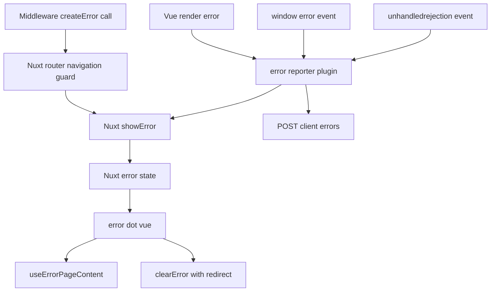

# Technical Design: error-page

## Overview

**Purpose**: 本機能は、Nuxtアプリケーション「Task Delivery Management」に共通エラーページ(`frontend/error.vue`)を新設し、404/403/401/500および汎用4xx/5xxのfatalエラー発生時に、既存の視覚言語に統一されたメッセージと導線をユーザーに提示する。

**Users**: アプリケーションの全利用者が、存在しないURLへのアクセス・権限不足・未認証・予期しない障害に遭遇した際にこの画面を見る。

**Impact**: 現在存在しない`frontend/error.vue`を新設する。加えて、`frontend/plugins/error-reporter.client.ts`が実行時のfatalエラーを捕捉してもError Pageへ遷移させていない(後述Architecture節)という既存の欠落を、同プラグインへの小さな追加で解消する。

### Goals
- statusCode(404/403/401/500/その他4xx/その他5xx)に応じた専用メッセージ・導線を`error.vue`で一元的に表示する
- ルーティング由来・実行時fatalエラーのどちらも同一のError Pageへ到達させる
- 既存の視覚言語(Tailwindの`primary`/`slate`トークン、Noto Sans JP、インラインSVG)を新規トークンなしで踏襲する

### Non-Goals
- バックエンドのエラー分類・`HttpError`パターンの変更
- `ErrorAlert.vue`(ページ内インラインエラー表示)の改修
- `error-reporter.client.ts`の通報先API・レート制限ロジック自体の変更(通報後に表示をトリガーする1点のみ追加)
- RBAC・管理者ロールの導入、ログイン画面(`login.vue`)自体の変更
- 401/403を発生させる新しい経路の追加。未ログイン時の`auth.global.ts`による`/login`誘導、scoped API 403時の`relocateAfterWorkspaceLost`は変更しない

## Boundary Commitments

### This Spec Owns
- `frontend/error.vue`: statusCodeに基づく表示内容・導線ボタンのレンダリング
- `frontend/composables/useErrorPageContent.ts`: statusCode → 表示内容(アイコン種別・コード・見出し・本文・ログイン導線要否)のマッピングロジック
- `frontend/plugins/error-reporter.client.ts`への追加: 通報後にError Page表示(`showError()`)をトリガーする処理(既存の通報ロジック自体は変更しない)

### Out of Boundary
- バックエンドのエラー分類・レスポンス形式(`backend/src/shared/http-errors.ts`等) — 変更なし、そのまま利用
- `ErrorAlert.vue`(ページ内インラインエラー表示) — 完全に別物、変更しない
- `error-reporter.client.ts`の通報先API(`POST /api/client-errors`)・レート制限(`useErrorReportRateLimit.ts`) — 変更しない
- `login.vue`・認証フロー自体の変更
- 401/403の新しい発生源。本仕様は`error.vue`が当該statusCodeを受け取ったときの表示だけを持つ
- 個別のドメインエラー(409の業務ルール違反等)の画面内表示 — これは既存の[[error-handling]]パターン(`ErrorAlert.vue`によるインライン表示)の責務であり、fatalエラーではないため本specの対象外

### Allowed Dependencies
- Nuxt標準API: `showError`, `clearError`, `useRoute`(いずれも`nuxt/app`からの自動インポート)
- 既存Tailwindトークン: `primary`カラースケール、`slate`系ニュートラル、`font-sans`(Noto Sans JP)
- `frontend/middleware/workspace-member.ts`の既存`createError({ statusCode: 404 })` — 変更せず、Requirement 4.1のトリガー元として利用
- `frontend/pages/workspaces/[workspaceId]/tasks/[taskId].vue`の既存`showError(createError({ statusCode: 404 }))` — 変更せず、error.vue新設後は同一画面に乗る
- `frontend/pages/login.vue`の既存`redirectPath()`実装(`route.query.redirect`を読む) — 401導線の接続先として利用、login.vue自体は変更しない

### Revalidation Triggers
- Nuxtのメジャーバージョンアップにより`vueApp.config.errorHandler`/`showError`の内部実装が変わった場合(本設計はNuxt 4.5.1の実装に依拠 — 詳細は`research.md`)
- `error-reporter.client.ts`のハンドラのシグネチャ・呼び出しタイミングが変わった場合
- 新しいステータスコードを専用状態として追加する場合(`useErrorPageContent.ts`の分岐拡張が必要)

## Architecture

### Existing Architecture Analysis

`research.md`の追加調査(Nuxt 4.5.1の`entry.js`/`router.js`/h3ソース確認)により、以下が判明している。

- **ルーティング由来のfatalエラー**(例: `workspace-member.ts`の`throw createError({ statusCode: 404 })`)は、Nuxtのルーターナビゲーションガードが`showError()`を直接呼び出す独立した経路を持ち、**既に正しく動作している**(Requirement 4.1は追加実装不要)
- **明示的な`showError()`**: タスク詳細ページは存在しないタスクに対し既に`showError(createError({ statusCode: 404 }))`を呼ぶ。本仕様ではこの呼び出しを変更しない。`error.vue`新設後は同じ404画面になる
- **実行時(マウント後)のVueレンダリングエラー**は、Nuxt既定の`vueApp.config.errorHandler`が初回マウント完了時に自動的に無効化される仕様であり、かつ`error-reporter.client.ts`が起動時にこのスロットを上書きしたまま`showError()`を呼んでいないため、**現状はError Pageへ到達する経路が存在しない**(Requirement 4.2の欠落)
- h3の`H3Error`は`statusCode`のデフォルト値として`500`を持つため、`window.onerror`/`unhandledrejection`由来のstatusCodeを持たないエラーも、`createError()`を通せば自動的に500として扱われる

### Architecture Pattern & Boundary Map



**Architecture Integration**:
- 選択パターン: Nuxt標準の`error.vue`ルートエラーバウンダリ + 状態マッピング用コンポーザブル。新しいアーキテクチャパターンの導入はなく、既存のNuxt規約(`error.vue`、`plugins/*.client.ts`、`composables/*.ts`)にそのまま乗る
- ドメイン境界: 表示内容の決定(`useErrorPageContent.ts`)と表示(`error.vue`)を分離し、`error-reporter.client.ts`は「実行時エラーをError Page経路に接続する」責務のみを追加で持つ(通報ロジックとは責務が異なるため、既存の`report()`関数は変更せず並置する)
- 既存パターン踏襲: `useErrorReportRateLimit.ts`と同じ「純粋関数のcomposable切り出し+Vitest単体テスト」パターン
- 新規コンポーネント理由: `error.vue`はNuxt規約上必須の新規ファイル。`useErrorPageContent.ts`は6状態の分岐をDOM非依存でテスト可能にするために分離
- Steering準拠: [[ui-design]](claude design確定済み、`research.md`参照)、[[error-handling]](フロントエンドのグローバルエラーキャッチはプラグインに一元化する方針を維持)

### Technology Stack

| Layer | Choice / Version | Role in Feature | Notes |
|-------|------------------|------------------|-------|
| Frontend | Nuxt 4.5.1 (Vue 3), `ssr: false` | `error.vue`ルートエラーバウンダリ、`showError`/`clearError`composable | 既存スタックそのまま、新規依存なし |
| Styling | Tailwind CSS(既存設定) | `primary`/`slate`トークン、`font-sans`の再利用 | `tailwind.config.ts`変更なし |

## File Structure Plan

### Directory Structure
```
frontend/
├── error.vue                          # NEW: Nuxtルートエラーバウンダリ。error propを受け取りgetErrorPageContentで
│                                       #      表示内容を決定し、アイコン+コードバッジ+見出し・本文・導線ボタンを描画
├── error.test.ts                      # NEW: error.vueの統合テスト(見出し・本文・ボタン・clearError)
├── composables/
│   ├── useErrorPageContent.ts         # NEW: 純粋関数 getErrorPageContent。statusCode -> 表示内容
│   └── useErrorPageContent.test.ts    # NEW: 単体テスト(専用4種/汎用4xx/5xx/未定義・範囲外)
├── plugins/
│   ├── error-reporter.client.ts       # MODIFIED: 3つの捕捉経路で通報(report())に加えてshowError()を呼ぶ
│   └── error-reporter.client.test.ts  # NEW: 3ハンドラの通報/表示分岐
└── e2e/
    └── error-page.spec.ts             # NEW: 404(不正なworkspaceId)経路のE2E確認
```

> `error-reporter.client.ts`の既存テストは存在しないため、`report`と`triggerErrorPage`をテスト可能な関数として切り出して新規作成する。`useErrorReportRateLimit.ts`とそのテストは変更しない。`tailwind.config.ts`は変更しない。カード・アイコン円・コードバッジなどモック固有のユーティリティクラスは`error.vue`内で使ってよい。

### Modified Files
- `frontend/plugins/error-reporter.client.ts` — 3つのハンドラそれぞれで、`report(message, stack)`呼び出しの後に`nuxtApp.runWithContext(() => showError(createNuxtErrorFromCause(...)))`相当の処理を追加する。既存の`report()`関数・レート制限(`shouldReport`)ロジックは変更しない

## System Flows

Architecture節のMermaid図が2つの発生経路(ルーティング由来/実行時)を示している。補足:

- ルーティング由来の経路(`workspace-member.ts` → ルーターガード → `showError`)はNuxt本体の既存動作であり、本specでの変更を伴わない
- 実行時の経路は、`error-reporter.client.ts`の3ハンドラいずれかが発火した時点で「通報」と「Error Page表示」を並行して行う(通報が失敗してもError Page表示には影響しない。逆も同様)
- `error.vue`からの「ホームへ戻る」「ログイン画面へ」操作は、単純な`navigateTo()`ではなく`clearError({ redirect })`を使う。Nuxtの`error`状態はルート遷移と独立して保持されるため、`clearError()`を呼ばずに`navigateTo()`だけで遷移すると、遷移後もerror.vueが表示され続ける(Nuxtの既定動作)。`clearError({ redirect: '/' })`(ホーム)、`clearError({ redirect: '/login?redirect=' + encodeURIComponent(route.fullPath) })`(ログイン、`route.fullPath`はerror.vue表示中も元のURLを保持している)を使うことで、この既定動作の落とし穴を回避する

## Requirements Traceability

| Requirement | Summary | Components | Interfaces |
|-------------|---------|------------|------------|
| 1.1 | 404表示 | error.vue, useErrorPageContent | getErrorPageContent |
| 1.2 | 403表示 | error.vue, useErrorPageContent | getErrorPageContent |
| 1.3 | 401表示 | error.vue, useErrorPageContent | getErrorPageContent |
| 1.4 | 500表示 | error.vue, useErrorPageContent | getErrorPageContent |
| 1.5 | 汎用4xxフォールバック | error.vue, useErrorPageContent | getErrorPageContent |
| 1.6 | 汎用5xxフォールバック | error.vue, useErrorPageContent | getErrorPageContent |
| 1.7 | statusCode不定時フォールバック | useErrorPageContent | getErrorPageContent(defaults to 500 content) |
| 2.1 | ホームへ戻る操作を常時表示 | error.vue | - |
| 2.2 | ホームへ戻る操作でトップへ遷移 | error.vue | clearError |
| 2.3 | 401時のみログイン導線を追加表示 | error.vue, useErrorPageContent | showLoginAction |
| 2.4 | ログイン導線でログイン画面へ遷移 | error.vue | clearError, useRoute |
| 3.1 | 既存デザイン言語との統一 | error.vue | 既存Tailwindトークン |
| 3.2 | 全状態共通のレイアウト構造 | error.vue | - |
| 4.1 | ルーティング由来fatalエラーの表示 | Nuxt router guard(既存), workspace-member.ts(既存) | showError(既存経路) |
| 4.2 | 実行時fatalエラーの表示 | error-reporter.client.ts | showError呼び出し追加 |

## Components and Interfaces

| Component | Domain/Layer | Intent | Req Coverage | Key Dependencies (P0/P1) | Contracts |
|-----------|--------------|--------|---------------|---------------------------|-----------|
| error.vue | Frontend / Page | statusCode別の表示と導線操作 | 1.1-1.6, 2.1-2.4, 3.1-3.2, 4.1-4.2 | useErrorPageContent (P0) | State |
| useErrorPageContent | Frontend / Composable | statusCode → 表示内容マッピング | 1.1-1.7 | なし(純粋関数) | Service |
| error-reporter.client.ts | Frontend / Plugin | 実行時fatalエラーをError Page経路へ接続 | 4.2 | Nuxt showError composable (P0) | State |

### Frontend / Page

#### error.vue

| Field | Detail |
|-------|--------|
| Intent | Nuxtのルートエラーバウンダリとして、`error: NuxtError`propを受け取り統一デザインで表示する |
| Requirements | 1.1, 1.2, 1.3, 1.4, 1.5, 1.6, 2.1, 2.2, 2.3, 2.4, 3.1, 3.2 |

**Responsibilities & Constraints**
- `props.error.statusCode`を`getErrorPageContent()`に渡し、返却された内容(アイコン種別・コード・見出し・本文・ログイン導線要否)を描画する
- レイアウトはNuxtのレイアウトシステム(`app.vue`/`NuxtLayout`)を経由しない独立レイアウト(claude design確定B案)。共通ヘッダーは表示しない — 認証・ワークスペース情報の取得に失敗した状態でも描画できる必要があるため(`research.md`参照)
- ボタン操作は`navigateTo()`ではなく`clearError({ redirect })`を使う(System Flows節参照)
- 見た目・見出し・本文の正本は確定モック(`Error Pages.dc.html`)。遷移の正本はこの設計(`clearError`、401時は`/login?redirect=`)であり、モックが`/login`とだけ書いている点は見た目の省略とみなす

**Dependencies**
- Inbound: Nuxtランタイム(error propを自動注入) (P0)
- Outbound: `useErrorPageContent` (P0)
- External: なし

**Contracts**: Service [ ] / API [ ] / Event [ ] / Batch [ ] / State [x]

##### State Management
- State model: `props.error`(Nuxtが注入する読み取り専用の`NuxtError`)を唯一の入力とする。コンポーネント自身は状態を持たない
- Persistence & consistency: なし(ステートレスな表示コンポーネント)
- Concurrency strategy: 不要(単一ページ、非同期処理なし)

**Implementation Notes**
- Integration: アイコンSVGは確定モックのインラインSVG(バッジ重ね方式、6状態同一仕様)を直書きする。新規アイコンライブラリは導入しない
- コードバッジはアイコン円の右下に重ねる(アイコン本体には掛けない。モックの`right:-34px; bottom:-6px`相当)。research.mdの旧記述「右外側」はモック確定仕様に合わせてこの位置を正とする
- 狭い幅: アイコン円56px、バッジは重ねたまま位置を変えない、円は中央寄せ。見出しは18px。401の2ボタンは縦積みしPrimary(ログイン画面へ)を上にする。狭い幅モックの本文短縮はビューポート都合であり、実装の本文はデスクトップ確定文言を使う
- Validation: なし(表示専用、ユーザー入力を受け付けない)
- Risks: なし。単純な条件分岐+テンプレート描画

### Frontend / Composable

#### useErrorPageContent

| Field | Detail |
|-------|--------|
| Intent | statusCodeを表示内容(アイコン種別・コード・見出し・本文・ログイン導線要否)へ決定論的に変換する純粋関数 |
| Requirements | 1.1, 1.2, 1.3, 1.4, 1.5, 1.6, 1.7 |

**Responsibilities & Constraints**
- 入力: `statusCode: number | undefined`
- 404/403/401/500の4値は下表の専用見出し・本文・アイコン種別を返す
- 400番台(上記4値以外)は汎用4xx、500番台(500以外)は汎用5xxを返す
- `statusCode`が`undefined`、400未満、または600以上(4xx/5xxのいずれでもない値)は500と同一の内容を返す
- `showLoginAction`は`statusCode === 401`のときのみ`true`
- 見出し・本文の正本は確定モック。狭い幅モックの短縮本文は使わない

確定文言(デスクトップモック):

| 入力 | icon | code | title | message | showLoginAction |
|------|------|------|-------|---------|-----------------|
| 404 | notFound | `"404"` | お探しのページが見つかりません | URLが変更されたか、削除された可能性があります。ホームから操作をやり直してください。 | false |
| 403 | forbidden | `"403"` | このページへのアクセス権限がありません | 閲覧に必要な権限が付与されていません。心当たりがない場合は、ログイン中のアカウントとワークスペースをご確認ください。 | false |
| 401 | unauthorized | `"401"` | ログインが必要です | セッションの有効期限が切れた可能性があります。再度ログインしてください。 | true |
| 500 | serverError | `"500"` | 予期せぬエラーが発生しました | 時間をおいて再度お試しください。 | false |
| その他4xx | clientErrorGeneric | `String(statusCode)` | エラーが発生しました | リクエストを処理できませんでした。操作をやり直してください。 | false |
| その他5xx | serverErrorGeneric | `String(statusCode)` | エラーが発生しました | サーバー側で問題が発生しています。時間をおいて再度お試しください。 | false |
| 上記以外 | serverError | `"500"` | 500と同じ | 500と同じ | false |

**Dependencies**
- Inbound: `error.vue` (P0)
- Outbound: なし
- External: なし

**Contracts**: Service [x] / API [ ] / Event [ ] / Batch [ ] / State [ ]

##### Service Interface
```typescript
export type ErrorPageIcon =
  | "notFound"
  | "forbidden"
  | "unauthorized"
  | "serverError"
  | "clientErrorGeneric"
  | "serverErrorGeneric";

export interface ErrorPageContent {
  icon: ErrorPageIcon;
  code: string;
  title: string;
  message: string;
  showLoginAction: boolean;
}

export function getErrorPageContent(statusCode: number | undefined): ErrorPageContent;
```
- Preconditions: なし(あらゆる`number | undefined`入力を受け付ける)
- Postconditions: 常に有効な`ErrorPageContent`を返す(例外を投げない)
- Invariants: `showLoginAction`は`statusCode === 401`の場合のみ`true`。4xx/5xxの専用・汎用のいずれにも当てはまらない入力の`code`/`title`/`message`/`icon`は500と同一

### Frontend / Plugin

#### error-reporter.client.ts (modified)

| Field | Detail |
|-------|--------|
| Intent | 既存のグローバルエラー捕捉(唯一の購読窓口)を維持したまま、通報(`report`)とError Page表示トリガー(`triggerErrorPage`)という2つの独立した反応を追加する |
| Requirements | 4.2 |

**Responsibilities & Constraints**
- **監視窓口は1つのまま**: `vueApp.config.errorHandler`/`window`の`error`/`unhandledrejection`という3つの購読箇所は増減しない([[error-handling]]の「個別ページで独自のグローバルエラーキャッチを実装しない — このプラグインに一元化する」を維持)。3ハンドラの中身は、既存の`report(message, stack)`(通報専用)と、新設する`triggerErrorPage(error)`(Error Page表示トリガー専用)という**名前で責務が分かれた2つの関数**をそれぞれ呼ぶだけにする。ハンドラ本体に通報とshowErrorの分岐ロジックを直接書き込まない
- `triggerErrorPage(error)`の実装: `showError()`はNuxtアプリケーションコンテキスト外(`window`イベントリスナー内)から呼ばれる可能性があるため、Nuxt本体の内部実装(`_showErrorUnlessCrawler`)と同様に`nuxtApp.runWithContext(() => showError(error))`で包む
- `report()`と`triggerErrorPage()`は互いに独立し、一方の失敗が他方に影響しない(既存の「通報失敗が業務に影響しない」という方針を維持。`showError()`自体が例外を投げるケースは通常ないが、呼び出しは`report()`と同様に他の処理をブロックしない位置に置く)
- **ノイズ除外(design review反映)**: `window`の`error`/`unhandledrejection`イベントは、サードパーティスクリプトやブラウザ拡張機能、中断されたfetch起因の`unhandledrejection`など、アプリのバグではない事象でも発火する。この2経路では`event.error`/`event.reason`が実際に`Error`インスタンスである場合のみ`triggerErrorPage()`を呼ぶ(`Error`インスタンスでない場合は、従来通り`report()`のみ行いError Pageへは遷移しない)。`vueApp.config.errorHandler`はアプリ自身のコンポーネントレンダリング/ライフサイクル内で発生したエラーに限定されるため、この除外は適用せず常に`triggerErrorPage()`を呼ぶ(既存の`report()`実装が`error instanceof Error ? error : new Error(String(error))`で正規化済みのものをそのまま使う)
- レート制限(`useErrorReportRateLimit.ts`)は`report()`のみに適用し、`triggerErrorPage()`には適用しない(理由: `research.md`の設計決定を参照)

**Dependencies**
- Inbound: Vueランタイム(`config.errorHandler`)、`window`(`error`/`unhandledrejection`イベント) (P0)
- Outbound: なし
- External: Nuxt `showError` composable (P0)

**Contracts**: Service [ ] / API [ ] / Event [ ] / Batch [ ] / State [x]

##### State Management
- State model: Nuxtの`nuxtApp.payload.error`(`showError`が内部で設定する)を書き込むのみで、このプラグイン自体は状態を持たない
- Persistence & consistency: `showError`の「最初の1回だけ書き込む」実装(`error.value ||= nuxtError`)により、複数回呼び出しても安全
- Concurrency strategy: 不要

**Implementation Notes**
- Integration: 既存の`report()`関数・レート制限ロジックはそのまま維持し、呼び出し箇所に1行追加する形で実装する
- Validation: なし
- Risks: 既存プラグインへの変更のため、通報機能(レート制限含む)への回帰がないことをテストで確認する(Testing Strategy参照)

## Error Handling

### Error Strategy
`error.vue`自体はエラーを発生させる操作を持たない(表示専用)ため、本節は「`error.vue`に到達するエラーの分類」を扱う。

### Error Categories and Responses
- **ルーティング由来(既存動作)**: `workspace-member.ts`等のミドルウェアが`createError({ statusCode })`をthrowすると、Nuxtルーターガードが直接`showError()`を呼び`error.vue`を表示する。本specでの変更なし
- **実行時fatalエラー(本specで追加)**: Vueレンダリングエラー・`window.onerror`・`unhandledrejection`は`error-reporter.client.ts`が捕捉し、通報と`showError()`呼び出しの両方を行う
- **業務ルール違反(対象外)**: 409等のバックエンドエラーは、既存の[[error-handling]]パターン通り各ページの`try/catch` + `ErrorAlert.vue`でインライン表示する。fatalエラーではないため`error.vue`には到達しない(この境界は本spec導入前後で変化しない)

### Monitoring
既存の`POST /api/client-errors`への通報経路(`business-event-logger.ts`等、バックエンド側)は変更しない。実行時fatalエラーが`error.vue`表示前に必ず通報される点は既存動作のまま維持される。

## Testing Strategy

### Unit Tests
- `useErrorPageContent`: 404 / 403 / 401(`showLoginAction`が`true`になること) / 500 / 汎用4xx(例: 400, 409) / 汎用5xx(例: 502, 503) / `undefined`および400未満または600以上(500と同一内容になること)で、返却される`icon`/`code`/`title`/`message`/`showLoginAction`を検証する
- `frontend/plugins/error-reporter.client.test.ts`: `report`と`triggerErrorPage`をエクスポート(または同等のテスト可能な切り出し)し、3ハンドラそれぞれで`report`と`showError`相当の処理が呼ばれることを検証する。特に`window`の`error`/`unhandledrejection`ハンドラでは、(a) `Error`インスタンスを渡した場合に`report`と`showError`の両方が呼ばれること、(b) `Error`インスタンスでない値(例: `event.error`が`null`のケース)を渡した場合に`report`のみ呼ばれ`showError`は呼ばれないこと、の両方を検証する。既存のレート制限(`useErrorReportRateLimit.test.ts`)は変更しない

### Integration Tests
- `frontend/error.test.ts`: `props.error`にstatusCode違いのモックを渡し、対応する見出し・本文・ボタン構成(401のみ2ボタン)が描画されることを確認する
- `error.vue`のボタン押下: 「ホームへ戻る」「ログイン画面へ」クリックで`clearError`が正しい`redirect`(`/`、`/login?redirect=<現在のfullPath>`)付きで呼ばれることを確認する

### E2E/UI Tests
- 存在しない/非所属の`workspaceId`へアクセス → `workspace-member.ts`の404経由でError Pageが表示され、「ホームへ戻る」で`/`に遷移することを確認する(Requirement 4.1の実地検証)

## Security Considerations

見出し・本文は確定モックの固定文言を使い、サーバー内部情報(スタックトレース・権限詳細)を埋め込まない。動的な値の埋め込みはstatusCode表示(`code`)のみに限定する。
