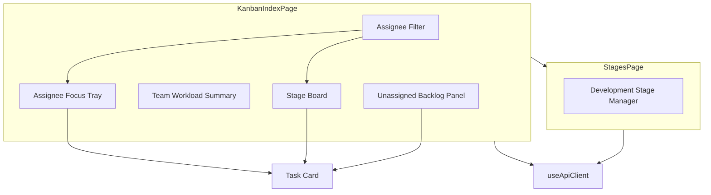
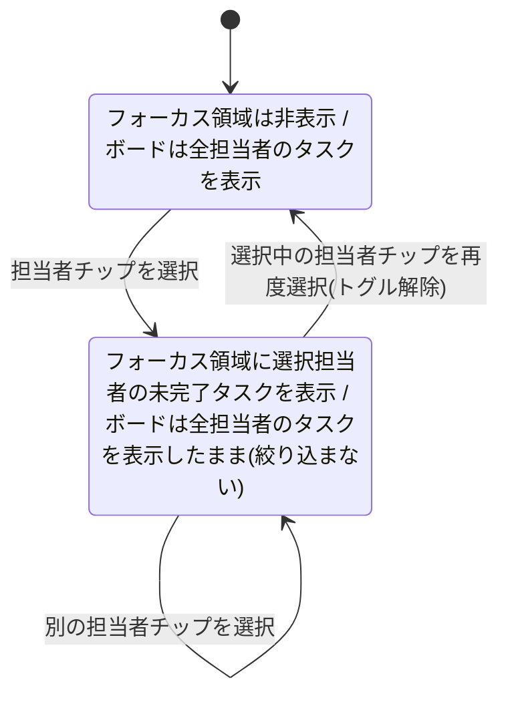

# Technical Design Document

## Overview

本機能は、`task-delivery-management`スペックのRequirement 12で実装済みのカンバン画面(`/kanban`)について、バックエンドAPI・データモデルを変更せずに情報設計とレイアウトのみを再設計する。

**Purpose**: 担当者ごとの作業状況・開発段階未設定タスク(バックログ)・タスクの進捗状況を、既存の開発段階別ボードに埋もれさせず一目で把握できるようにする。
**Users**: カンバン画面を日常的に使う開発チームメンバー(自分の担当タスクの把握)、およびPM/管理者(チーム全体の負荷把握)。
**Impact**: `/kanban`ページのレイアウトと表示ロジックを刷新し、操作頻度の低い開発段階マスタ管理(追加・名称変更・並び替え・削除)を新設する`/kanban/stages`ページへ分離する。

### Goals
- 担当者絞り込みで特定の担当者を選択すると、その人の未完了タスクを担当者フォーカス表示領域で確認できるようにする(開発段階別ボード自体は絞り込まない — 実装後のユーザーフィードバックによりRequirement 4を改訂、詳細は下記「実装後の改訂」を参照)
- チーム全体の担当者別負荷を、担当者数が増えても破綻しない形で一覧できるようにする
- 開発段階未設定のタスク(バックログ)を、通常は畳んでおき、必要な時だけ検索・ソートして確認できるようにする
- タスクカードの状態・優先度・進捗を、開発段階(カンバンの列)と混同しない形で表示する
- 開発段階マスタ管理を独立画面に分離しつつ、既存のカード移動・担当者設定の運用を壊さない

### Non-Goals
- 認証・ログインユーザーの自動判定機能の導入(将来、別スペックで再検討する)
- バックエンドAPI・データモデルの変更
- カンバン以外の画面(タスク一覧、ダッシュボード等)へのこのUX方針の展開
- ~~フォーカス領域・開発段階未設定一覧から開発段階別ボードへの「ドラッグ&ドロップ以外」の新しい移動手段(モーダル編集等)の追加~~ **(実装後の改訂により撤回、下記「実装後の改訂」4.を参照)** 詳細ポップアップの編集モードにおける開発段階選択を、キーボードアクセシビリティ確保のための移動手段として新たにスコープに含める

### 実装後の改訂(Post-Implementation Amendments)

実装完了後、ハンズオン検証を重ねる中でユーザーから寄せられた具体的なフィードバックにより、当初の設計から以下の3点が変更された。いずれもコードの不具合ではなく、実際に触った上での意図的な方針転換であり、`/kiro-validate-impl`によるレビューを経てこの文書へ反映した。

1. **開発段階別ボードの担当者絞り込みを廃止**(Requirement 4を改訂)。担当者チップを選択すると、当初は担当者フォーカス表示領域とボードの両方が絞り込まれる設計だったが、「フォーカス欄で確認できるため、ボードまで絞り込むのは二重表示で不要」というフィードバックにより、ボード側の絞り込みは廃止した。単一の選択操作自体(チーム負荷サマリーの担当者チップ)は維持し、担当者フォーカス表示領域(Requirement 1)のみを駆動する。詳細は`requirements.md` Requirement 4を参照。
2. **ドラッグ&ドロップ機構をHTML5 Drag and Drop APIからvue-draggable-plus(Sortable.js)へ変更**。「ドラッグ時のアニメーションが欲しい」というフィードバックにより、カーソル追従・持ち上げアニメーション・ドロップ先レーンのハイライト表示を実現するため、新規ライブラリ`vue-draggable-plus`を導入した。当初のTechnology Stackの「新規ライブラリを追加しない」というコミットメントからの逸脱だが、UXの観点から妥当と判断した。これに伴い、`TaskCardProps`の`draggable: boolean` propは廃止され、ドラッグの所有権はカード単体ではなくリスト側の`VueDraggable`コンポーネントへ移った(詳細は下記Technology Stack・TaskCardの項を参照)。
3. **`frontend/app.vue`(アプリ全体の共有シェル、本スペックが所有権を宣言していないファイル)への最小限の変更**。(a) アクティブなナビゲーションリンクの文字色がTailwindのクラス優先順位により意図通り描画されないバグの修正、(b) `/kanban`ページのみを`main`要素の共通幅制限(`max-w-6xl`)から除外する`definePageMeta({ fullWidth: true })`機構の追加(ボードの横スクロールに伴う不要な横スクロールバー発生と、タイトル〜チーム負荷部分とボードの表示幅不一致を解消するため)。いずれも他ページの表示に影響しないことを確認済みだが、Boundary Commitmentsの「This Spec Owns」には本来含まれない共有ファイルへの変更である。
4. **カード操作を「クリック=詳細ポップアップ」「ドラッグ移動=一定距離動かす」に分離し、キーボード操作専用の「操作メニュー」ダイアログを廃止(Requirement 8を新設)**。当初のNon-Goals「フォーカス領域・開発段階未設定一覧から開発段階別ボードへの『ドラッグ&ドロップ以外』の新しい移動手段(モーダル編集等)の追加」は、実装後にtask-delivery-managementスペックへタスク詳細取得・汎用編集API(`GET /api/tasks/:id`, `PATCH /api/tasks/:id`、同スペックtask 3.3)が追加されたことを受けて撤回し、詳細ポップアップでの閲覧・編集・削除を新たにこのスペックのスコープに含める。従来キーボード専用の「操作メニュー」ダイアログ(開発段階の移動先選択+確定)が担っていたキーボードアクセシビリティは、詳細ポップアップの編集モードにある開発段階選択項目に統合され、別ダイアログとしては存在しなくなる。詳細ポップアップは画面内の通常のコンテンツ位置(実装当初はチーム負荷サマリーの下に挿入する形になっていた)ではなく、背景を暗くした`fixed`オーバーレイとして画面中央付近に浮かべて表示する(Requirement 8.9)。ドラッグの起点判定は当初`VueDraggable`の`delay`オプション(長押し猶予)を使う想定だったが、実際に操作すると「一定時間押し続けてから動かす」感触が不自然で、実装後のユーザーフィードバックにより撤回し、Sortableの既定である移動量閾値のみで区別する方式(`delay`オプションは設定しない)に変更した — クリック/タップで動かさずに離せば詳細ポップアップ、少しでも意味のある距離動かせば即座にドラッグが始まる、という以前からこのコードベースが前提としていた区別に戻っている。あわせて、担当者フォーカス欄へのドラッグによる担当変更(Requirement 9を新設)は、task-delivery-managementスペックの新しい汎用編集API(`PATCH /api/tasks/:id`)を使うことで、既存の担当者がいても上書きできるようにする(従来`updateDevelopmentStage`の「担当者未設定時のみ設定」という制約に依存していたための挙動を撤廃)。task-delivery-managementスペックRequirement 12.6〜12.8(開発段階列移動時の担当者温存ルール)自体は変更しない — 12.8が対象とする「開発段階列への移動」と、Requirement 9が対象とする「担当者フォーカス欄への移動」は別の操作であるため抵触しない。

5. **詳細ポップアップを共通`Modal`コンポーネントとして切り出し、アニメーションを追加し、クリック取りこぼしバグを修正(Requirement 8.9〜8.12を新設)**。ユーザーが実際に操作したところ、(a) タスクカードを少し動かしてから離した直後にクリックすると、1〜2回に1回程度クリックが空振りする不具合、(b) ポップアップの表示・非表示にアニメーションがなく唐突に感じる、(c) 「今後もよく使うので」という理由でのコンポーネント化、の3点のフィードバックを受けた。(a)については、ドラッグライブラリ(SortableJS)が完了したドラッグ操作の直後にブラウザ標準の`click`イベントを抑制する既知の挙動が疑われた(スクリプトによる自動再現では確定できなかったが、実際のユーザー操作由来の報告であり、`click`イベントに依存すること自体がドラッグライブラリと同一要素を共有する限り本質的に脆弱なため、原因の確証有無によらず対策した)。`TaskCard`のクリック検知を、ネイティブ`click`イベントではなく`pointerdown`/`pointerup`の座標差分(`clickMoveThreshold`、6px)による自前判定に変更し、SortableJSの`click`処理系に一切依存しない形にした。(b)(c)については、`frontend/components/shared/Modal.vue`を新設し、オーバーレイ+開閉アニメーション(Vueの`<Transition name="modal">`、背景フェード+パネルのフェード/スケール)+フォーカストラップ+右上の閉じるボタン(×)+`title`/デフォルト/`actions`の3スロット構成を持つ汎用ダイアログシェルとして切り出した。`TaskDetailModal`はこの`Modal`を使う形に書き換え、今後の新規ポップアップもこの`Modal`を土台にする想定とする(Boundary Commitmentsに追加、下記参照)。

## Boundary Commitments

### This Spec Owns
- `/kanban`ページの表示構成・レイアウト、および担当者別集計・開発段階未設定判定・検索/ソート・子タスク進捗算出といったクライアント側の導出計算
- 新設する`/kanban/stages`ページ(開発段階マスタ管理の専用画面)
- 上記画面が使用する新規Vueコンポーネント群(`frontend/components/kanban/`配下)
- **(実装後の改訂5.)** `frontend/components/shared/Modal.vue`(汎用ダイアログシェル)。`frontend/components/shared/`配下は本来どのスペックも専有しない共有領域だが、この汎用モーダルは本スペックの詳細ポップアップ(Requirement 8)から切り出したものであり、将来的に他画面から再利用されても内容(スロット構成・アニメーション・フォーカストラップの基本契約)を変える場合は本スペックとの整合を確認する

### Out of Boundary
- バックエンドのルート・サービス・リポジトリ・データモデル(`backend/src/modules/tasks`, `development-stages`, `users`等) — 変更しない
- 認証・現在ユーザーの自動判定の仕組み
- `task-delivery-management`スペックのRequirement 12で定義された業務ルール自体(開発段階削除時にタスクの開発段階を未設定へ戻す、担当者未設定タスクの移動時に担当者選択を求める等) — そのまま引き継ぎ、変更しない

### Allowed Dependencies
- `frontend/composables/useApiClient.ts`(唯一のHTTP境界、型・メソッドとも変更せずに利用)
- `frontend/components/users/AssigneeFilter.vue`が確立した「単一select・デフォルトは全件」というパターン
- 既存の`Task`/`User`/`DevelopmentStage`型(`useApiClient.ts`で定義済み、変更なし)
- `frontend/app.vue`(アプリ全体の共有ナビゲーション・レイアウトシェル) — 実装後の改訂により、以下2点に限り最小限の変更を許容する: (1) `/kanban`ページの`fullWidth`ルートメタに応じて`main`要素の`max-w-6xl`制限を切り替えるロジック、(2) アクティブなナビゲーションリンクの表示色バグ修正。他ページの表示・挙動に影響を与えない変更に限る(詳細は「実装後の改訂」参照)

### Revalidation Triggers
- Task/User/DevelopmentStageのAPI契約(エンドポイント・レスポンス形状)が変更された場合
- 認証・現在ユーザー概念が別スペックで導入された場合(Requirement 1の「担当者フォーカス」を自動判定の「自分」に置き換えられる可能性がある)
- タスク総件数が現在の想定運用規模(チーム10名程度、開発段階未設定バックログ50件規模)を大幅に超えた場合(クライアント側計算のみで賄う前提が崩れる、`research.md` Risks参照)

## Architecture

### Existing Architecture Analysis

- 現状の`/kanban`ページは、開発段階マスタ管理UIとカンバンボードが同一ページに同居し、`ref`/`computed`によるページローカルな状態管理のみで構成されている(グローバルストア・状態管理ライブラリは使用しない、既存design.md方針)。
- カード移動はブラウザ標準のHTML5 Drag and Drop APIを使用し、`data-task-id`/`data-stage-id`属性がE2Eテスト(`frontend/e2e/kanban.spec.ts`)のロケータとして使われている。
- 担当者による絞り込みは`AssigneeFilter.vue`という確立済みパターン(単一select、デフォルト「すべて」)を持つ。

### Architecture Pattern & Boundary Map



**Architecture Integration**:
- **Selected pattern**: 既存パターン(ページローカル状態 + プレゼンテーショナルな子コンポーネント分割)の拡張。新規の状態管理ライブラリやグローバルストアは導入しない。
- **Domain/feature boundaries**: `/kanban`ページがボード閲覧・カード移動・担当者フォーカス・チーム負荷・バックログ検索を担当し、新設`/kanban/stages`ページが開発段階マスタのCRUDを担当する。両ページとも`useApiClient`を介してのみバックエンドと通信する。
- **Existing patterns preserved**: 全件取得+クライアント側`computed`フィルタ(既存の`unassignedStageTasks`/`tasksForStage`を拡張)、HTML5 Drag and Drop API、`data-task-id`/`data-stage-id`属性。
- **New components rationale**: 各表示領域(フォーカス・負荷サマリー・バックログ・カード)を単一責任のコンポーネントに分離することで、優先度表示ルール(色帯を使わずラベルのみで示す等、Requirement 5.2/5.3)のような横断的な表示規約を`TaskCard`に一元化し、表示箇所ごとの実装のばらつきを防ぐ。
- **Steering compliance**: `structure.md`の「1画面=1ドメイン」方針との整合を、開発段階マスタ管理の画面分離によってむしろ強化する(現状は1画面に2つの関心事が同居していた)。

### Technology Stack

| Layer | Choice / Version | Role in Feature | Notes |
|-------|------------------|-----------------|-------|
| Frontend | Nuxt 4.x (Vue 3) + TypeScript | 既存スタックを使用 | 当初は新規ライブラリを追加しない方針だったが、「実装後の改訂」に記載の通り`vue-draggable-plus`(Sortable.js)を新規導入した |
| Drag and Drop | `vue-draggable-plus`(Sortable.js) | カードの持ち上げ・カーソル追従・ドロップ先レーンのハイライト表示 | 実装後の改訂によりHTML5 Drag and Drop APIから変更(「実装後の改訂」参照)。`data-task-id`/`data-stage-id`属性によるE2Eロケータの契約は維持している |

## File Structure Plan

### Directory Structure
```
frontend/
├── pages/
│   └── kanban/
│       ├── index.vue                     # カンバンボード本体(再設計後)。担当者フィルタ、フォーカストレイ、
│       │                                  # チーム負荷サマリー、開発段階未設定バックログ、開発段階別ボードを配置
│       └── stages.vue                    # 新規: 開発段階マスタ管理画面 (Requirement 7)
├── components/
│   ├── kanban/
│   │   ├── AssigneeFocusTray.vue         # 選択中担当者の未完了タスク一覧 (Requirement 1)
│   │   ├── TeamWorkloadSummary.vue        # 担当者別件数サマリー、上位N名+まとめ表示 (Requirement 2)
│   │   ├── UnassignedBacklogPanel.vue     # 開発段階未設定タスクの折りたたみ/展開・検索・ソート (Requirement 3)
│   │   ├── TaskCard.vue                   # 状態・優先度・進捗表示を一元化したカード/リスト行 (Requirement 5)
│   │   ├── TaskDetailModal.vue            # 【実装後の改訂】タスク詳細の閲覧・編集・削除ポップアップ (Requirement 8)
│   │   └── DevelopmentStageManager.vue    # 既存のマスタ管理UI・ロジックの移設先 (Requirement 7)
│   └── shared/
│       └── Modal.vue                     # 【実装後の改訂】汎用ダイアログシェル(オーバーレイ・アニメーション・フォーカストラップ) (Requirement 8.9-8.11)
```

> `TaskCard.vue`は開発段階別ボードのカード、フォーカストレイ、展開済みバックログ一覧の行の3箇所で共用する。~~`draggable`propで、開発段階別ボード内でのみドラッグ元として振る舞う。~~ **(実装後の改訂)** ドラッグ機構が`vue-draggable-plus`へ移行したことに伴い、`draggable` propは廃止された。ドラッグの所有権はカード単体ではなく、各表示箇所を包む`VueDraggable`リストコンポーネント側が持つ(`group`設定の`pull`/`put`で、バックログ一覧は「ドラッグ元専用」、開発段階別ボードとフォーカストレイは「ドラッグ元にもドロップ先にもなれる」という区別を宣言的に表現する)。

### Modified Files
- `frontend/pages/kanban/index.vue` — 開発段階マスタ管理UI(既存の`stage-list`セクション)を削除し、`/kanban/stages`への導線リンクを追加。担当者フィルタ・`AssigneeFocusTray`・`TeamWorkloadSummary`・`UnassignedBacklogPanel`を組み込み、既存の`tasksForStage`等の`computed`を担当者フィルタ・子タスク進捗算出に対応させて拡張する。カード操作(クリック=詳細ポップアップ、ドラッグ=移動)・担当者フォーカス欄への担当変更ドラッグも実装後の改訂で追加。
- `frontend/e2e/kanban.spec.ts` — 開発段階の登録手順を`/kanban/stages`への遷移を含む形に更新する(既存テストは`/kanban`上に登録フォームがある前提のため)。
- `frontend/app.vue` — 【実装後の改訂】(1) `/kanban`ページの`fullWidth`ルートメタに応じて`main`要素の`max-w-6xl`制限を切り替えるロジック、(2) アクティブなナビゲーションリンクの表示色バグ修正。詳細は「実装後の改訂」3.・Boundary Commitmentsの「Allowed Dependencies」参照。

## System Flows

### 担当者フォーカスの選択状態遷移

> **(実装後の改訂)** 当初は「AllSelected(すべて選択)⇔AssigneeSelected」の2状態を「すべて」チップと担当者チップとで切り替える設計だったが、round 3のユーザーフィードバック(「チーム負荷の『すべて』はあまり意味がない」)により「すべて」チップ自体を廃止し、選択中の担当者チップを再クリックすると選択解除される(トグル)方式に変更した。状態としては変わらず2状態だが、遷移のトリガーが変わっている。ボード側の絞り込みも同時に廃止された(Requirement 4改訂、下記参照)。



担当者チップ(チーム負荷サマリー内)は1種類のみで、フォーカス領域(Requirement 1)をこの単一の状態で駆動する。**開発段階別ボードはこの選択状態から独立しており、常に全担当者のタスクを表示する**(当初はフォーカス領域とボードの両方をこの状態で駆動する設計だったが、ボード側の絞り込みは実装後に廃止された。Requirement 4・`research.md` Design Decision参照)。チーム負荷サマリー(Requirement 2)はこの選択状態に関わらず常に全担当者分を表示する。

### 開発段階未設定タスクのドラッグ継続

`task-delivery-management`スペックのdesign.md「カンバンでのカード移動と担当者設定」のシーケンスは変更しない。**(実装後の改訂)** 当初は展開済みの開発段階未設定一覧(Requirement 3.3)の行に、開発段階別ボードのカードと同じ`draggable`属性・`data-task-id`を付与する設計だったが、ドラッグ機構が`vue-draggable-plus`へ移行したため、`draggable`属性は使用しない。代わりに、各表示箇所を包む`VueDraggable`リストが同一のSortable `group`名を共有することで、ドラッグ元が列のカードか展開済みバックログの行かによらず同一の移動処理(担当者未設定時の確認フローを含む)が適用される。`data-task-id`/`data-stage-id`属性による識別は維持している。折りたたまれた状態(Requirement 3.2)ではドラッグ元となる要素自体が存在しないため、移動には展開操作が先に必要になる。

## Requirements Traceability

| Requirement | Summary | Components | Interfaces | Flows |
|-------------|---------|------------|------------|-------|
| 1.1-1.5 | 担当者フォーカス表示 | `AssigneeFocusTray`, `kanban/index.vue` | `AssigneeFocusTrayProps` | 担当者フォーカスの選択状態遷移 |
| 2.1-2.5 | 担当者別の作業負荷サマリー | `TeamWorkloadSummary` | `TeamWorkloadSummaryProps` | - |
| 3.1-3.6 | 開発段階未設定タスクの一覧管理 | `UnassignedBacklogPanel`, `TaskCard` | `UnassignedBacklogPanelProps` | 開発段階未設定タスクのドラッグ継続 |
| 4.1-4.4 | 担当者フォーカスの選択操作(実装後の改訂によりRequirement名称・内容を変更、ボードの絞り込みは廃止) | `TeamWorkloadSummary`(担当者チップ), `kanban/index.vue` | `TeamWorkloadSummaryProps`のv-model | 担当者フォーカスの選択状態遷移 |
| 5.1-5.5 | タスクカードの状態・優先度・進捗表示 | `TaskCard` | `TaskCardProps` | - |
| 6.1-6.2 | 既存カンバン操作の継続性 | `kanban/index.vue`, `TaskCard`, `VueDraggable`(vue-draggable-plus) | `onDropOnStage`/`confirmPendingMove`(実装後の改訂によりドラッグイベントハンドラは`vue-draggable-plus`の`@end`等へ変更、`onDragStart`は廃止) | 開発段階未設定タスクのドラッグ継続 |
| 7.1-7.4 | 開発段階マスタ管理画面の分離 | `stages.vue`, `DevelopmentStageManager` | 既存`createDevelopmentStage`等API | - |
| 8.1-8.12 | タスクカードのクリックによる詳細ポップアップと移動操作の分離(実装後の改訂により新設) | `TaskCard`, `TaskDetailModal`, `Modal`, `kanban/index.vue`, `VueDraggable`(既定の移動量閾値) | `TaskDetailModalProps`, `ModalProps` | - |
| 9.1-9.4 | 担当者フォーカス欄へのドラッグによる担当変更(実装後の改訂により新設) | `AssigneeFocusTray`, `kanban/index.vue` | `AssigneeFocusTrayProps`の`assign`イベント | - |

## Components and Interfaces

| Component | Domain/Layer | Intent | Req Coverage | Key Dependencies (P0/P1) | Contracts |
|-----------|--------------|--------|---------------|---------------------------|-----------|
| `kanban/index.vue` | Frontend/kanban | ページ全体のデータ取得・導出計算(担当者集計、バックログ抽出、子タスク進捗)・担当者フィルタ状態の管理 | 1, 2, 3, 4, 6, 8, 9 | useApiClient (P0), TaskCard (P0), AssigneeFocusTray/TeamWorkloadSummary/UnassignedBacklogPanel/TaskDetailModal (P0) | State |
| `AssigneeFocusTray` | Frontend/kanban | 選択担当者の未完了タスクを固定領域に表示。担当変更ドロップ先を兼ねる | 1.1-1.5, 9.1-9.3 | TaskCard (P0) | - |
| `TeamWorkloadSummary` | Frontend/kanban | 担当者別件数を降順表示し、収まらない場合は上位N名+まとめ表示 | 2.1-2.5 | - | State |
| `UnassignedBacklogPanel` | Frontend/kanban | 開発段階未設定タスクの折りたたみ/展開・検索・ソート | 3.1-3.6 | TaskCard (P0) | State |
| `TaskCard` | Frontend/kanban | 状態・優先度・進捗表示規約を一元化したカード/リスト行 | 5.1-5.5, 6.1-6.2, 8.1, 8.6, 8.12 | - | - |
| `TaskDetailModal` | Frontend/kanban | タスク詳細の閲覧・編集・削除ポップアップ(実装後の改訂により新設) | 8.1-8.8, 8.10, 8.11 | useApiClient (P0), Modal (P0) | API, State |
| `Modal` | Frontend/shared | 汎用ダイアログシェル(オーバーレイ・アニメーション・フォーカストラップ・閉じるボタン)(実装後の改訂5.により新設) | 8.9, 8.10, 8.11 | - | - |
| `stages.vue` + `DevelopmentStageManager` | Frontend/kanban | 開発段階マスタのCRUD操作を提供する専用画面 | 7.1-7.4 | useApiClient (P0) | State |

### Frontend/kanban

#### kanban/index.vue (ページオーケストレーション)

| Field | Detail |
|-------|--------|
| Intent | データ取得と、担当者絞り込み・バックログ・子タスク進捗の導出計算を行い、子コンポーネントへ配布する |
| Requirements | 1.1, 1.2, 1.3, 1.5, 2.1, 3.1, 3.6, 4.1, 4.2, 4.3, 4.4, 6.1, 6.2, 8.1, 8.6, 8.7, 8.8, 9.1, 9.2, 9.3, 9.4 |

**Responsibilities & Constraints**
- マウント時に`listTasks()`(全件、フィルタなし)・`listUsers()`・`listDevelopmentStages()`を取得し、以降のフィルタ・集計はすべてクライアント側`computed`で導出する(バックエンドへ追加のクエリは発行しない)
- 担当者フォーカスの選択状態(`selectedAssigneeUserId: string`、空文字列は未選択)を単一のソースオブトゥルースとして保持し、`AssigneeFocusTray`表示要否・`TeamWorkloadSummary`のハイライト対象を導出する。**(実装後の改訂)** 開発段階別ボードの表示対象はこの状態から導出しない(常に全担当者分を表示、Requirement 4改訂を参照)
- ドラッグ操作は`vue-draggable-plus`(`VueDraggable`)の`@end`/`@change`/`@add`イベントで処理する。**(実装後の改訂)** ブラウザ標準の`onDragStart`は使用しない。`onDropOnStage`/`confirmPendingMove`相当のロジック(担当者未設定タスク移動時の確認フロー)は維持しつつ、ドラッグ元が開発段階別ボードの列か展開済み`UnassignedBacklogPanel`の行か担当者フォーカス欄かによらず同一に動作させる
- **(実装後の改訂、Requirement 8)** 各`VueDraggable`は`delay`オプションを設定せず、Sortableの既定の移動量閾値のみでクリック/タップとドラッグを区別する(実装当初は`delay`による長押し猶予を採用していたが、実際の操作感が不自然だったため撤回、詳細はOverview「実装後の改訂」4.参照)。移動を伴わないクリック/タップは`TaskCard`の`click`イベント(タスク詳細ポップアップを開く)をそのまま発火させ、意味のある距離の移動は即座にSortableのドラッグを開始する。従来のキーボード専用「操作メニュー」ダイアログ(`actionMenuTaskId`等)は廃止し、`TaskCard`の`activate`(クリック/Enter/Space)は直接タスク詳細ポップアップ(`detailTaskId`)を開く一本化された導線にする
- **(実装後の改訂、Requirement 9)** 担当者フォーカス欄への`@assign`は、`updateTaskDevelopmentStage`ではなく`updateTask`(汎用編集API)を呼び、既存の担当者を問わず上書きする。ドロップ先の担当者と現在の担当者が同一の場合はAPI呼び出しを行わない

**Dependencies**
- Inbound: なし(トップレベルページ)
- Outbound: `useApiClient`(P0)、`AssigneeFocusTray`/`TeamWorkloadSummary`/`UnassignedBacklogPanel`/`TaskCard`(いずれもP0、表示委譲)

**Contracts**: Service [ ] / API [ ] / Event [ ] / Batch [ ] / State [x]

##### State Management
- **State model**: `tasks: Task[]`, `users: User[]`, `stages: DevelopmentStage[]`, `selectedAssigneeUserId: string`(空文字列="すべて")。派生状態として`focusedTasks`(選択担当者の未完了タスク、開発段階の有無を問わない)、`workloadCounts`(担当者ごとの開発段階設定済み未完了タスク件数、降順)、`backlogTasks`(`developmentStageId`が未設定のタスク)、`taskProgressById`(親タスクIDごとの子タスク完了数/全体数)を`computed`で保持する
- **Persistence & consistency**: 永続化はバックエンドAPIのみ。フィルタ選択状態はページ内`ref`で保持し、ページ遷移や再読み込みでリセットされる(要件上、永続化は求められていない)
- **Concurrency strategy**: 既存実装と同様、操作後に対象一覧を再取得(`loadTasks`/`loadStages`)して整合を取る。楽観的更新は行わない

**Implementation Notes**
- Integration: `taskProgressById`は取得済みの`tasks`配列を`parentTaskId`でグルーピングして算出する(バックエンドの追加集計APIは使わない、`research.md` Design Decision参照)
- Validation: 該当なし(表示のみ、書き込み系の入力検証は既存のバックエンドAPI・既存フォームに従う)
- Risks: タスク総件数が想定運用規模を大幅に超えた場合、`computed`による導出計算のコストが無視できなくなる可能性がある(`research.md` Risks参照、Revalidation Triggers参照)

#### AssigneeFocusTray

| Field | Detail |
|-------|--------|
| Intent | 選択中の担当者の未完了タスクを、開発段階の有無によらず固定高さの領域に表示する。ドラッグされたタスクの担当変更のドロップ先も兼ねる |
| Requirements | 1.1, 1.2, 1.3, 1.4, 1.5, 9.1, 9.2, 9.3 |

**Contracts**: Service [ ] / API [ ] / Event [ ] / Batch [ ] / State [ ]

```typescript
interface AssigneeFocusTrayProps {
  tasks: Task[]; // 呼び出し側(kanban/index.vue)が選択担当者・未完了で絞り込み済みのタスク配列
  users: User[]; // 担当者名解決用
}

// emits(実装後の改訂、Requirement 3・9でドラッグ元/ドロップ先を兼ねるようになった際に追加):
//   assign: [taskId: string]                                    — Requirement 9: ドロップされたタスクの担当変更を呼び出し側に依頼
//   end: [payload: { taskId: string; targetStageId?: string }]  — カードがこの領域からドラッグアウトされた
//   "card-activate": [taskId: string]                           — カードのクリック/Enter/Spaceで詳細ポップアップを開く
// expose: { resync: () => void }                                — 呼び出し側がドラッグ中断時に表示を巻き戻すために呼ぶ
```

**Implementation Notes**
- Integration: `tasks`が空配列の場合は0件である旨のメッセージを表示する(Requirement 1.5)。表示高さは固定し、`tasks.length`が表示可能件数を超える場合は領域内スクロールとする(Requirement 1.4)
- Integration: **(実装後の改訂、Requirement 9)** `@assign`イベントは「ドロップされたタスクの担当者を、フォーカス中の担当者に変更してよいか」を呼び出し側に問うだけで、上書き可否の判断・API呼び出し(`updateTask`)は呼び出し側(`kanban/index.vue`)が行う。本コンポーネント自身は既存の担当者の有無を判定しない(単純にドロップされたタスクIDを伝えるのみ)
- Validation: 該当なし
- Risks: なし(純粋な表示コンポーネント)

#### TeamWorkloadSummary

| Field | Detail |
|-------|--------|
| Intent | 担当者ごとの開発段階設定済み未完了タスク件数を降順表示し、画面幅に収まらない場合は上位N名+まとめ表示に切り替える |
| Requirements | 2.1, 2.2, 2.3, 2.4, 2.5 |

**Contracts**: Service [ ] / API [ ] / Event [ ] / Batch [ ] / State [x]

```typescript
interface WorkloadCount {
  user: User;
  count: number;
}

interface TeamWorkloadSummaryProps {
  counts: WorkloadCount[]; // 呼び出し側が降順ソート済みで渡す
  maxVisible?: number; // 既定値はコンポーネント内で定義し、これを超える件数は「+N名」にまとめる
}

// v-model(担当者フォーカスの選択操作、Requirement 4): defineModel<string>()相当。
// 選択中の担当者userId、空文字列は「未選択」。担当者チップのクリックで更新される。
```

##### State Management
- **State model**: `counts`の先頭`maxVisible`件をチップ表示し、残りは件数を集計して「+N名」として表示する。「+N名」を選択すると残り全員を個別に確認できる展開状態を持つ(Requirement 2.5)
- **Persistence & consistency**: 展開状態はコンポーネントローカル、永続化しない
- **Concurrency strategy**: 該当なし

**Implementation Notes**
- Integration: `counts`のソートは呼び出し側(`kanban/index.vue`)の責務とし、本コンポーネントは受け取った順序を前提に先頭`maxVisible`件を切り出すのみとする
- Validation: 該当なし
- Risks: なし

#### UnassignedBacklogPanel

| Field | Detail |
|-------|--------|
| Intent | 開発段階未設定タスクを折りたたみ状態(件数バッジのみ)で表示し、展開時に検索・ソート可能な一覧に切り替える |
| Requirements | 3.1, 3.2, 3.3, 3.4, 3.5, 3.6 |

**Contracts**: Service [ ] / API [ ] / Event [ ] / Batch [ ] / State [x]

```typescript
interface UnassignedBacklogPanelProps {
  tasks: Task[]; // 呼び出し側が developmentStageId が未設定のタスクに絞り込み済み
  users: User[];
}

// emits:
//   end: [payload: { taskId: string; targetStageId?: string }]  — カードがこの一覧からドラッグアウトされた(ドラッグ元専用、`put: false`)
//   "card-activate": [taskId: string]                           — カードのクリック/Enter/Spaceで詳細ポップアップを開く
// expose: { resync: () => void }                                — 呼び出し側がドラッグ中断時に表示を巻き戻すために呼ぶ
```

##### State Management
- **State model**: `expanded: boolean`(既定false)、`searchQuery: string`、`sortKey: "priority" | "createdAt"`をコンポーネントローカルで保持する。`expanded`が`false`の間はカード/行を一切描画せず件数バッジのみ表示する(Requirement 3.2)
- **Persistence & consistency**: いずれもコンポーネントローカル、永続化しない。ページ再読み込みで既定状態(折りたたみ)に戻る
- **Concurrency strategy**: 該当なし

**Implementation Notes**
- Integration: 展開時の各行は`TaskCard`を使用し、開発段階別ボードへのドラッグ移動を維持する。**(実装後の改訂)** ドラッグ元/ドロップ先の区別は`TaskCard`の`draggable` propではなく、この一覧を包む`VueDraggable`の`group`設定(`pull: true, put: false` — ドラッグ元専用)で宣言する(`research.md`「開発段階未設定タスクのドラッグ操作の継続」参照)
- Validation: `tasks.length === 0`の場合は0件である旨を表示する(Requirement 3.6)
- Risks: なし

#### TaskCard

| Field | Detail |
|-------|--------|
| Intent | タスクの状態・優先度・進捗表示規約を一元化し、開発段階別ボード・フォーカストレイ・展開済みバックログ一覧の間で表示の一貫性を保証する |
| Requirements | 5.1, 5.2, 5.3, 5.4, 5.5, 6.1, 6.2, 8.1, 8.6, 8.12 |

**Contracts**: Service [ ] / API [ ] / Event [ ] / Batch [ ] / State [ ]

```typescript
interface TaskProgress {
  completed: number;
  total: number;
}

interface TaskCardProps {
  task: Task;
  assigneeName?: string;
  progress?: TaskProgress; // 子タスクを持つ場合のみ呼び出し側が算出して渡す。undefinedなら進捗表示なし
}
```

> **(実装後の改訂)** 当初案にあった`draggable: boolean` propは廃止された。ドラッグ機構が`vue-draggable-plus`へ移行し、ドラッグの所有権がカード単体からリスト側の`VueDraggable`コンポーネントへ移ったため、`TaskCard`自身はドラッグ可否を意識しない(詳細は「実装後の改訂」節を参照)。

> **(実装後の改訂、Requirement 8)** `activate`イベント(クリック/Enter/Space)の意味が「操作メニューを開く」から「タスク詳細ポップアップを開く」に変わった。ドラッグの起点判定は`TaskCard`ではなく、これを包む各`VueDraggable`側の設定(`delay`を使わず、Sortable既定の移動量閾値のみ)で行うため、本コンポーネントの実装(クリックハンドラ・キーボードハンドラ)自体は変更しない。

> **(実装後の改訂5., Requirement 8.12)** マウス/ポインタ入力での`activate`発火を、ネイティブ`click`イベントから`pointerdown`/`pointerup`の座標差分判定(`clickMoveThreshold`、6px)へ変更した。タスクカードを少し動かしてから離した直後にクリックすると空振りすることがある、というユーザー報告を受けての対応(ドラッグライブラリがドラッグ完了直後の`click`を抑制する挙動が疑われるが、スクリプトによる自動再現では確定できていない)。キーボード操作(Enter/Space)は元々`click`を経由していないため影響を受けない。

**Implementation Notes**
- Integration: 状態(`task.status`)は開発段階(呼び出し側の配置列)とは独立した表示要素として常に表示する(Requirement 5.1)。優先度は色分けされた帯状の装飾要素を使わず、テキストまたはアイコンラベルでのみ表現する(Requirement 5.2, 5.3)。`progress`が渡された場合のみ進捗表示を行う(Requirement 5.4, 5.5)
- Validation: 該当なし
- Risks: 本コンポーネントが優先度・進捗の表示規約を一元的に強制する箇所であるため、将来この規約を変更する場合は本コンポーネントの変更のみで全表示箇所に反映される設計とする

#### TaskDetailModal **(実装後の改訂、Requirement 8で新設)**

| Field | Detail |
|-------|--------|
| Intent | タスクカードのクリックから開く、タスク詳細の閲覧・編集・削除を行うポップアップ |
| Requirements | 8.1, 8.2, 8.3, 8.4, 8.5, 8.8, 8.9, 8.10, 8.11 |

**Contracts**: Service [ ] / API [x] / Event [ ] / Batch [ ] / State [x]

```typescript
interface TaskDetailModalProps {
  taskId: string | null; // nullなら非表示。表示中はGET /api/tasks/:idで最新状態を取得する
  users: User[];
  stages: DevelopmentStage[]; // 開発段階選択肢(編集モード用)
}
```

##### State Management
- **State model**: `mode: "view" | "edit"`(既定`"view"`、`taskId`が変わるたびリセット)、取得済み`task`、編集用のローカルフォーム状態(タイトル・優先度・担当者・開発段階・メモ)、削除確認用の`confirmingDelete: boolean`
- **Persistence & consistency**: `taskId`が設定されるたびに`GET /api/tasks/:id`で再取得する(呼び出し側の一覧に混じった古い状態を信頼しない)。保存は`PATCH /api/tasks/:id`(汎用フィールド)と、開発段階が変更されていれば`PATCH /api/tasks/:id/development-stage`を続けて呼ぶ(task-delivery-managementスペックの既存エンドポイントをそのまま利用し、担当者は汎用編集APIの呼び出しで既に反映済みのため`assigneeUserId`は渡さない)
- **Concurrency strategy**: 保存後は`mode`を`"view"`へ戻し画面上のタスクを再取得結果に置き換える。呼び出し側には`saved`イベントで通知し、呼び出し側は一覧を再取得する

**Implementation Notes**
- Integration: **(実装後の改訂5.)** オーバーレイ・開閉アニメーション・フォーカストラップ・閉じるボタンは共通`Modal`コンポーネント(`frontend/components/shared/Modal.vue`)に委譲し、本コンポーネントは`title`/デフォルト/`actions`スロットへドメイン固有の内容(タイトル・閲覧/編集フォーム・アクションボタン)を渡すだけにする(Requirement 8.9, 8.10, 8.11)。`title`スロットにはロード済みタスクのタイトルではなく、編集フォームのローカル`title`refを渡す(編集中の入力がヘッダーにもリアルタイム反映される)
- Integration: 閲覧モードでは編集不可の表示のみとし(Requirement 8.2)、編集ボタンで編集モードへ切り替える(Requirement 8.3)。キャンセルは保存せず閲覧モードへ戻る
- Integration: 削除は確認ステップ(「本当に削除しますか?」+確定/キャンセル)を経てから`DELETE /api/tasks/:id`を呼ぶ(Requirement 8.5)。削除成功時は`deleted`イベントを発行し、呼び出し側がポップアップを閉じる
- Validation: タイトル空文字は保存不可(既存の`TasksService.update`のバリデーションに委譲、フロント側では送信前トリムのみ行う)
- Risks: なし。`.kiro/steering/error-handling.md`のパターンに従い、API呼び出しは必ずtry/catchしエラーを画面表示する

#### Modal **(実装後の改訂5.、Requirement 8.9〜8.11で新設。`frontend/components/shared/`配下の汎用コンポーネント)**

| Field | Detail |
|-------|--------|
| Intent | オーバーレイ・開閉アニメーション・フォーカストラップ・右上の閉じるボタンを備えた、再利用可能なダイアログシェル |
| Requirements | 8.9, 8.10, 8.11 |

**Contracts**: Service [ ] / API [ ] / Event [ ] / Batch [ ] / State [ ]

```typescript
interface ModalProps {
  open: boolean;
  ariaLabel: string;
}
// emits: close
// slots: #title, default(内容), #actions(省略可、指定時のみフッター行を描画)
```

**Implementation Notes**
- Integration: `open`の`v-if`をVueの`<Transition name="modal">`で包み、開閉アニメーションを提供する(Requirement 8.10)。背景(半透明オーバーレイ)とパネルの両方を1つのトランジション名で扱い、パネル側の変化はネストしたCSSセレクタ(`.modal-enter-from .modal-panel`等、main.css)で指定する
- Integration: 背景クリック(`@click.self`)・Escキー・右上の閉じるボタンのいずれでも`close`を発行する。呼び出し側はどの手段で閉じられたかを区別しない
- Integration: `useDialogFocusTrap`を内部で保持し、呼び出し側は意識しなくてよい
- Validation: 該当なし
- Risks: `frontend/components/shared/`配下は本来どのスペックも専有しない共有領域のため、他画面がこのコンポーネントを再利用する場合は契約(props/emits/スロット構成)の変更に注意する(Boundary Commitments参照)

#### stages.vue + DevelopmentStageManager

| Field | Detail |
|-------|--------|
| Intent | 開発段階マスタの追加・名称変更・並び替え・削除を、カンバン画面から独立した画面で提供する |
| Requirements | 7.1, 7.2, 7.3, 7.4 |

**Contracts**: Service [ ] / API [ ] / Event [ ] / Batch [ ] / State [x]

##### State Management
- **State model**: 既存`/kanban`ページに実装済みの`stages`/`newStageName`とその操作(`loadStages`, `createStage`, `renameStage`, `moveStage`, `deleteStage`)をそのまま移設する。ロジックの変更は行わない
- **Persistence & consistency**: 既存の`useApiClient`の`createDevelopmentStage`/`renameDevelopmentStage`/`reorderDevelopmentStages`/`deleteDevelopmentStage`をそのまま使用する(API契約は変更しない)
- **Concurrency strategy**: 既存実装と同様、操作後に`loadStages()`で再取得する

**Implementation Notes**
- Integration: `/kanban`ページには本画面への導線(リンク)を追加する(Requirement 7.2)。開発段階マスタの変更後、`/kanban`ページに遷移すると開発段階別ボードの列構成に変更が反映される(Requirement 7.4、既存の`loadStages()`をマウント時に呼ぶ既存動作で担保される)
- Validation: 既存のマスタ管理バリデーション(段階名必須等)をそのまま踏襲する
- Risks: なし(既存ロジックの移設のみ)

## Data Models

### Domain Model (Derived View Model)

本機能はバックエンドのデータモデルを変更しない。以下はクライアント側で導出するビューモデルであり、永続化はしない。

- `WorkloadCount { user: User; count: number }` — 担当者ごとの開発段階設定済み未完了タスク件数。`kanban/index.vue`が`tasks`配列を`assigneeUserId`でグルーピングして算出する
- `TaskProgress { completed: number; total: number }` — 子タスクを持つタスクの進捗。`kanban/index.vue`が`tasks`配列を`parentTaskId`でグルーピングして算出する(`status === "done"`の件数 / 全件数)

## Testing Strategy

### Unit Tests
- `TeamWorkloadSummary`: 担当者数が`maxVisible`を超える場合に上位N名+「+N名」表示に切り替わること、件数降順で並ぶこと(Requirement 2.3, 2.4, 2.5)
- `UnassignedBacklogPanel`: `expanded=false`の間はタスクを描画せず件数のみ表示すること(Requirement 3.2)、タイトルの部分一致検索が機能すること(Requirement 3.4)、優先度/作成日時でのソートが機能すること(Requirement 3.5)
- `kanban/index.vue`の進捗導出ロジック: 子タスクを持つタスクについて完了数/全体数が正しく算出されること、子タスクを持たないタスクには`progress`が渡されないこと(Requirement 5.4, 5.5)

### Integration Tests
- `kanban/index.vue`: 担当者チップで特定の担当者を選択した際に、`AssigneeFocusTray`がその担当者のタスクに連動して更新されること(Requirement 1.2)。**(実装後の改訂)** 開発段階別ボードは選択に関わらず全担当者のタスクを表示し続けることを確認する(Requirement 4、ボードの絞り込みは廃止済み)。選択中のチップを再度選択するとフォーカス領域が非表示に戻ること(Requirement 1.1)

### E2E Tests (Playwright)
- 担当者チップで特定の担当者を選択 → フォーカス領域にその担当者の未完了タスクが表示されることを確認する。**(実装後の改訂)** 開発段階別ボードは選択に関わらず全担当者のタスクを表示したままであることも確認する(Requirement 1, 4。実装は`frontend/e2e/kanban-assignee-focus.spec.ts`)
- 開発段階未設定タスクの折りたたみ表示を展開 → タイトルで検索 → 該当タスクの行を開発段階別ボードの列へドラッグ&ドロップ → 担当者未設定の場合は担当者選択が求められ、選択後に移動が完了することを確認する(Requirement 3, 6 — 既存`kanban.spec.ts`の担当者選択フローを踏襲)
- `/kanban`から開発段階マスタ管理画面への導線をたどり、開発段階を追加・名称変更 → `/kanban`に戻り、開発段階別ボードの列構成に変更が反映されていることを確認する(Requirement 7)
