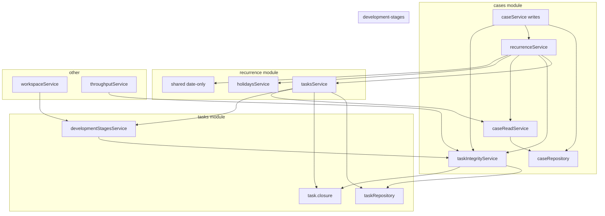
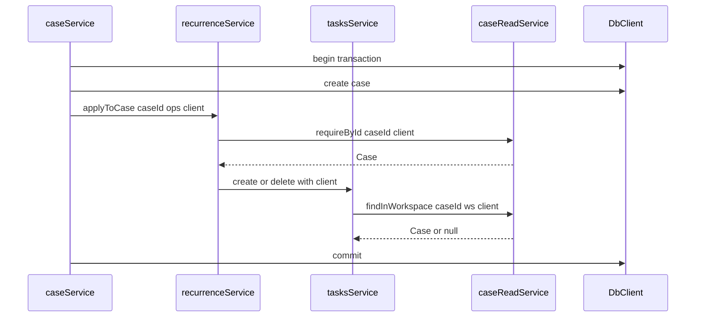
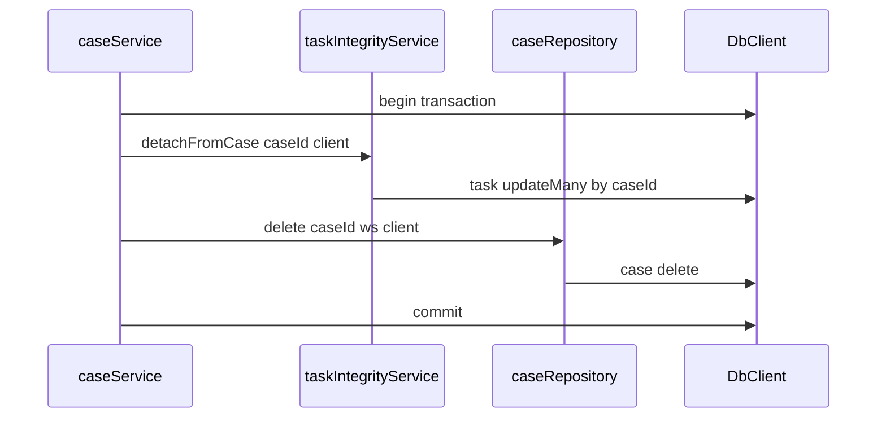
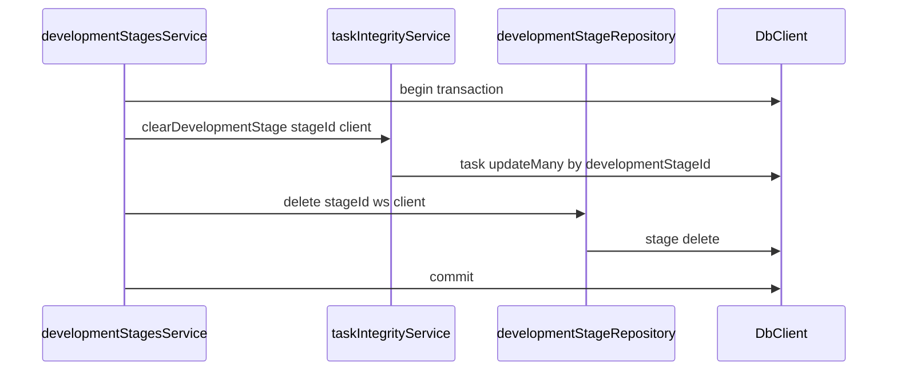

# Technical Design: module-boundary-cleanup

## Overview

**Purpose**: バックエンドのドメインモジュール間依存を、依存先が公開した手続き（通常の service、および明示した読み取り／整合専用面）経由のみに揃え、repository／他ドメイン永続化への直参照を解消する。

**Users**: バックエンド開発者・後続仕様の実装者（境界を壊さず機能追加できること）。エンドユーザー向けの画面・HTTP 契約は変えない。

**Impact**: 内部の公開メソッド追加、読み取り専用面の導入、日付ヘルパーの共有化、既存テストの追随、`structure.md` の短い追記。スキーマ・対外 API・フロントは対象外。

### Goals
- 本番コードから他モジュール repository／他ドメイン永続化の直参照をなくす
- `cases → recurrence → tasks → cases` 型の循環依存を導入しない
- 既存の複数モジュール連携書き込み・整合・集計・初期投入の振る舞いを維持する
- 完了を機械的に検査できる手段を用意し、規約を steering から参照可能にする

### Non-Goals
- フロントエンド変更、HTTP パス／JSON 形の破壊的変更
- モジュール大規模再編や新規ドメイン切り出し
- ESLint による import 禁止の強制
- velocity-dashboard 画面・要件の実装
- 完了済み仕様文書の更新

## Boundary Commitments

### This Spec Owns
- クロスモジュール直参照の解消と、必要な service 公開メソッド／読み取り面の追加
- 循環を断つ `caseReadService`（cases 読み取り専用公開面）
- 循環を断つ `taskIntegrityService`（タスク行への整合・集計専用面。`developmentStagesService` を import しない）
- タスク側に寄せる整合・集計 API（detach、必須進捗カウント、生成タスク列挙、完了期間カウント）
- 開発段階の TX 対応 `getById` とターミナル段階ブートストラップ API
- 日付のみヘルパーの `shared/date-only` への移動
- 境界・循環のガードテストと `structure.md` への TX／読み取り面／整合専用面の短い追記
- 上記に伴う既存バックエンドテストの更新

### Out of Boundary
- Nuxt／画面／E2E の変更
- Prisma スキーマ変更・マイグレーション
- HTTP ルートの追加・削除・パス変更
- import 禁止の ESLint ルール導入
- `velocity-dashboard` の機能追加そのもの

### Allowed Dependencies
- 既存 `DbClient`／soft-delete 拡張、`VerifiedWorkspaceId`、`HttpError`、business event logger
- 既存モジュールの repository（同一モジュール内のみ）と、本設計が定める service／read 公開面
- 既存 vitest／CI（新依存ライブラリは追加しない）

### Revalidation Triggers
- `caseReadService` / `taskIntegrityService` またはその公開 API のシグネチャ／意味変更
- モジュール依存方向の再定義（読み取り面・整合専用面の廃止・統合）
- soft-delete 含む完了集計の意味変更（throughput／後続ダッシュボードに波及）
- 対外 HTTP 契約を触る必要が生じた場合（本仕様の前提崩壊）

## Architecture

### Existing Architecture Analysis

- レイヤ: `routes → service → repository`。他モジュールは service 経由が規約だが、TX 内参照や副作用のため repository／Prisma 直触りが残存
- 正しい依存例: `cases → recurrenceService`、`recurrence → tasksService`／`holidaysService`、`tasks → developmentStagesService` 等
- 循環リスク: `caseService` は `recurrenceService` に依存するため、`tasks` が `caseService` を参照すると閉路になる
- `DbClient` 伝播は `tasksService.create|delete`、`recurrenceService.applyToCase` 等で実証済み。case／stage の delete は repository 内の自前 `$transaction` のみ

### Architecture Pattern & Boundary Map

Selected pattern: Hybrid（既存 service 延長 + 読み取り専用面 + 整合専用面）。



**Architecture Integration**:
- Domain boundaries: 書き込み所有は従来どおり。クロスリファレンスは公開 service／`caseReadService`／`taskIntegrityService` のみ
- Existing patterns preserved: `DbClient` 任意引数、同一モジュール内の repository 利用、対外 routes 非変更
- New components rationale:
  - `caseReadService`: write 面（recurrence 依存）から参照を切り離し、`tasks → caseService` 循環を防ぐ
  - `taskIntegrityService`: タスク行の整合・集計だけを公開し、`developmentStagesService` を import しない。これにより `stages → tasksService → stages` 循環を防ぐ
  - 日付はドメイン固有でないため `shared/`
- Steering compliance: 一方向依存、service 公開 IF、`shared/` にモジュール固有ロジックを置かない（日付のみ許容）
- 依存の禁止: `taskIntegrityService` は `developmentStagesService`／`caseService`／`recurrenceService` を import しない。`developmentStagesService` は `tasksService` を import せず `taskIntegrityService` のみを使う

### Technology Stack

| Layer | Choice | Role in Feature | Notes |
|-------|--------|-----------------|-------|
| Backend | Fastify 5 / TypeScript | service 公開 IF の追加と呼び出し置換 | 新規 npm 依存なし |
| Data access | Prisma + `DbClient` | TX 参加の読み書き | スキーマ変更なし |
| Shared | `date-only` ヘルパー | 日付のみの解釈・整形 | holidays repository から移設 |
| Docs | `structure.md` | TX 伝播・読み取り面の規約追記 | |
| Verification | Vitest ガードテスト | 直参照禁止・閉路禁止の機械検査 | madge は導入しない |

## File Structure Plan

### New Files
- `backend/src/modules/cases/case-read.service.ts` — 案件参照専用公開面（`findInWorkspace` / `requireById`）。`recurrence` や `caseService` を import しない
- `backend/src/modules/cases/case-read.service.test.ts` — TX client 経由の可視性を含む単体／統合
- `backend/src/modules/tasks/task-integrity.service.ts` — タスク行の整合・集計専用公開面。`developmentStagesService`／`caseService`／`recurrenceService` を import しない
- `backend/src/modules/tasks/task-integrity.service.test.ts` — detach／clear／進捗／期間カウント／生成列挙
- `backend/src/shared/date-only.ts` — `parseDateOnly` / `formatDateOnly`
- `backend/src/shared/date-only.test.ts` — 純関数テスト（holiday.repository から移すか新規）
- `backend/src/module-boundary.guard.test.ts` — 他モジュール `*.repository` import 禁止と service 依存閉路検査

### Modified Files

cases
- `case.service.ts` — `getProgress` は `taskIntegrityService.countRequiredForCaseProgress` を利用。`delete` は同一 TX で `taskIntegrityService.detachFromCase` → `caseRepository.delete`
- `case.repository.ts` — `tx.task`／`db.task`／`task.closure` 参照を削除。`delete` は案件行削除のみ（任意 `client`）。進捗 count メソッドは削除または integrity へ移管

tasks
- `task.service.ts` — `caseRepository` 除去、`caseReadService` 利用。stage 検証は `developmentStagesService.getById(..., client)`。必要なら integrity へ委譲するが、他モジュール向け整合 API の正本は `taskIntegrityService`
- `task.repository.ts` — integrity を支える永続操作（`updateMany`／count／findMany）。soft-delete バイパス count はここに集約
- `task.closure.ts` — tasks モジュール内（`taskIntegrityService`／`tasksService`／`task.repository`）でのみ使用

recurrence
- `recurrence.service.ts` — 日付は `shared/date-only`。案件取得は `caseReadService.requireById`。生成タスク列挙は `taskIntegrityService.listGeneratedByAnchors`。作成／削除本体は既存どおり `tasksService`

development-stages
- `development-stage.service.ts` — `getById(id, workspaceId, client?)`。`ensureTerminalStages(workspaceId, client)` 追加。`delete` は同一 TX で `taskIntegrityService.clearDevelopmentStage` → repository delete（`tasksService` は import しない）
- `development-stage.repository.ts` — `tx.task` 除去。stage 行操作のみ。`ensureTerminal` 用の `createMany` は stages 側

workspaces
- `workspace.service.ts` — 初期段階投入を `developmentStagesService.ensureTerminalStages(..., tx)` に置換

throughput
- `throughput.service.ts` — `taskIntegrityService.countCompletedInPeriodIncludingDeleted` を呼ぶ
- `throughput.repository.ts` — 削除する（集計は integrity に移し、throughput モジュールに task 永続化層を残さない）

holidays
- `holiday.repository.ts` — 日付ヘルパー定義を削除し `shared/date-only` を import

steering
- `.kiro/steering/structure.md` — TX client 伝播、読み取り専用公開面、整合専用面、他モジュールへの `task.closure` 直 import 禁止を短く追記

### Unchanged（意図的）
- 全 `*.routes.ts` のパス・Zod 公開形
- フロントエンド一式
- Prisma schema／migrations

## System Flows

### 案件作成 TX 内でのタスク参照（循環回避）



### 案件削除の整合



### 開発段階削除の整合（stages と tasksService の閉路を避ける）



## Requirements Traceability

| Requirement | Summary | Components | Interfaces | Flows |
|-------------|---------|------------|------------|-------|
| 1.1–1.4 | 公開 IF 統一・直参照禁止 | caseReadService, taskIntegrityService, stages/workspaces/throughput/recurrence 置換 | Service | 削除系フロー |
| 2.1–2.3 | 循環禁止 | caseReadService, taskIntegrityService, module-boundary.guard | Service | 案件作成 TX・段階削除 |
| 3.1–3.3 | 書き込み一貫性 | DbClient 伝播, case/stage delete オーケストレーション | Service | 削除系フロー |
| 4.1–4.6 | 既存振る舞い維持 | taskIntegrityService, ensureTerminal | Service | 削除／初期投入 |
| 5.1–5.5 | 対外契約維持 | routes 非変更（制約） | — | — |
| 6.1–6.2 | 日付ヘルパー公開 | shared/date-only | — | — |
| 7.1–7.4 | 検証と規約 | module-boundary.guard, structure.md, 既存 vitest | — | — |

## Components and Interfaces

| Component | Domain | Intent | Req Coverage | Key Dependencies | Contracts |
|-----------|--------|--------|--------------|------------------|-----------|
| caseReadService | cases | 案件参照のみ公開し循環を断つ | 1, 2, 3 | caseRepository P0 | Service |
| caseService | cases | 書き込み・進捗・削除オーケストレーション | 1, 3, 4 | recurrence P0, taskIntegrity P0 | Service |
| taskIntegrityService | tasks | タスク行の整合・集計のみ公開し stages 循環を断つ | 1, 2, 3, 4 | taskRepository P0, task.closure 内部 | Service |
| tasksService | tasks | CRUD／業務検証（caseRead・stages 参照） | 1, 3 | caseRead P0, stages P0, taskIntegrity P1 | Service |
| developmentStagesService | stages | TX 対応参照とターミナル初期投入 | 1, 3, 4 | taskIntegrity P0 for delete | Service |
| recurrenceService | recurrence | 直触り除去後も TX 適用を維持 | 1, 3, 6 | caseRead, tasksService, taskIntegrity, holidays, date-only | Service |
| workspaceService | workspaces | 作成時段階投入を stages 経由に | 1, 4 | developmentStagesService P0 | Service |
| throughputService | throughput | 完了集計を integrity 経由に | 1, 4 | taskIntegrity P0 | Service |
| date-only | shared | 日付のみヘルパー | 6 | なし | — |
| module-boundary.guard | backend root | 直参照・閉路の機械検査 | 2, 7 | ファイル走査 | — |
| structure.md | steering | 規約の可視性 | 7 | — | — |

### Backend / cases

#### caseReadService

| Field | Detail |
|-------|--------|
| Intent | recurrence／tasks が write 面に依存せず案件を参照する |
| Requirements | 1.1, 1.4, 2.1, 2.2, 3.2 |

**Responsibilities & Constraints**
- `findInWorkspace` は `caseRepository` に委譲する。`requireById` は渡した `client` の `case.findUnique({ where: { id } })` で参照し、workspace 条件を付けない
- `caseService`・`recurrenceService`・他モジュール service を import しない
- ドメイン判定ロジック（日付妥当性・テンプレ適用）は持たない

**Contracts**: Service

##### Service Interface
```typescript
import type { DbClient } from "../../shared/soft-delete.repository.js";
import type { VerifiedWorkspaceId } from "../../shared/workspace-scope.js";
import type { Case } from "./case.types.js";

export const caseReadService: {
  findInWorkspace(
    id: string,
    workspaceId: VerifiedWorkspaceId,
    client?: DbClient,
  ): Promise<Case | null>;
  /** TX 内など、workspace 検証済みの呼び出し向け。無ければ notFound。 */
  requireById(id: string, client?: DbClient): Promise<Case>;
};
```
- Preconditions: `findInWorkspace` は検証済み `workspaceId`
- Postconditions: 同一 `client` 上の未コミット行も可視
- Invariants: write／イベント発火を行わない
- `requireById` の可視性・削除済み行の扱いは、現行 recurrence の `client.case.findUnique({ where: { id } })` と同等とする（ワークスペース条件は付けない。soft-delete 拡張の既定フィルタは渡した `client` の挙動に従う）

#### caseService（変更点）

| Field | Detail |
|-------|--------|
| Intent | 案件 CRUD と進捗・削除のオーケストレーション |
| Requirements | 1.4, 3.1, 3.3, 4.1, 4.2, 4.6 |

**Responsibilities & Constraints**
- `getProgress`: `taskIntegrityService.countRequiredForCaseProgress` の結果から既存と同じ `CaseProgress` を組み立てる
- `delete`: `db.$transaction`（または渡された client）内で `taskIntegrityService.detachFromCase` → `caseRepository.delete`
- 対外 HTTP は変更しない

**Dependencies**
- Outbound: recurrenceService P0、taskIntegrityService P0、caseRepository P0

### Backend / tasks

#### taskIntegrityService

| Field | Detail |
|-------|--------|
| Intent | 他モジュールがタスク永続化に直接触らず、かつ `tasksService`（stages 依存）を経由せずに整合・集計できる |
| Requirements | 1.1–1.4, 2.1–2.2, 3.2, 4.1–4.3, 4.5, 4.6 |

**Responsibilities & Constraints**
- `taskRepository` と `task.closure` のみに依存する
- `developmentStagesService`／`caseService`／`caseReadService`／`recurrenceService` を import しない
- 案件削除・段階削除・進捗・throughput・生成タスク列挙のクロスモジュール呼び出しの正本

**Contracts**: Service

##### Service Interface
```typescript
/** recurrence の caseAnchor と同じユニオン。tasks 側で定義し、recurrence 実行時依存を作らない。 */
export type GeneratedTaskAnchor =
  | "case_start"
  | "case_end"
  | "period_month_start"
  | "period_month_end";

export type CaseProgressCounts = {
  requiredTotal: number;
  requiredCompleted: number;
};

export const taskIntegrityService: {
  detachFromCase(
    caseId: string,
    client?: DbClient,
  ): Promise<void>;

  clearDevelopmentStage(
    developmentStageId: string,
    client?: DbClient,
  ): Promise<void>;

  listGeneratedByAnchors(
    caseId: string,
    anchors: GeneratedTaskAnchor[],
    client?: DbClient,
  ): Promise<Array<{ id: string; workspaceId: string }>>;

  countRequiredForCaseProgress(
    caseId: string,
    workspaceId: VerifiedWorkspaceId,
  ): Promise<CaseProgressCounts>;

  countCompletedInPeriodIncludingDeleted(
    periodStart: Date,
    periodEnd: Date,
  ): Promise<number>;
};
```
- `detachFromCase` / `clearDevelopmentStage` の `updateMany` where は現行どおり `caseId` のみ／`developmentStageId` のみとする（workspace 条件は付けない。4.1／4.3 の振る舞い維持）
- `countRequiredForCaseProgress`: 既存 `openTaskFilter`／`completedTaskFilter` と同一規則（必須・中止除外）。こちらは workspace スコープを維持
- `countCompletedInPeriodIncludingDeleted`: 現行 throughput と同じ soft-delete バイパス（`deletedAt: undefined`）
- `GeneratedTaskAnchor` は既存 `CaseRelativeAnchor` と同一集合。recurrence 側は呼び出し時に互換な配列を渡す。集合一致は単体テストで固定する

**Implementation Notes**
- Integration: アンカー型は tasks 側定義を正とし、recurrence.types の `CaseRelativeAnchor` と値が一致することをテストで固定する（tasks → recurrence の実行時 import は禁止）
- Validation: 既存エラー型・メッセージを維持
- Risks: 集計 API の意味変更は Revalidation Trigger

#### tasksService（変更点）

| Field | Detail |
|-------|--------|
| Intent | タスク CRUD と関連リソース検証 |
| Requirements | 1.1, 1.4, 3.2 |

**Responsibilities & Constraints**
- `assertRelatedResourcesInWorkspace`: `caseReadService.findInWorkspace` と `developmentStagesService.getById(..., client)` を使用
- クロスモジュール向けの detach／集計 API は持たない（正本は `taskIntegrityService`）。モジュール内で再利用する場合のみ integrity へ委譲してよい

**Dependencies**
- Outbound: caseReadService P0、developmentStagesService P0、taskIntegrityService P1（任意委譲）、taskRepository P0

### Backend / development-stages

#### developmentStagesService（拡張）

```typescript
getById(
  id: string,
  workspaceId: VerifiedWorkspaceId,
  client?: DbClient,
): Promise<DevelopmentStage | null>;

ensureTerminalStages(
  workspaceId: VerifiedWorkspaceId,
  client: DbClient,
): Promise<void>;
```
- `ensureTerminalStages`: 現行 WS 作成と同じく完了／中止を `order` 0/1 で `createMany`
- `delete`: TX 内で `taskIntegrityService.clearDevelopmentStage` の後に stage 削除
- `tasksService` を import しない（閉路防止）

### Backend / recurrence / workspaces / throughput

- recurrence: `shared/date-only`、`caseReadService.requireById`、`taskIntegrityService.listGeneratedByAnchors` + 既存 `tasksService.create|delete`
- workspaces.create: `ensureTerminalStages` を同一 TX の `tx` で呼び、`tx.developmentStage.createMany` を削除
- throughput: `throughput.repository` を削除し、`taskIntegrityService.countCompletedInPeriodIncludingDeleted` に委譲

### Shared / date-only

```typescript
export function parseDateOnly(date: string): Date;
export function formatDateOnly(date: Date): string;
```
- holidays／recurrence の双方がここを import。repository からのヘルパー export は廃止

### Verification / module-boundary.guard.test.ts

**Responsibilities**
- `backend/src/modules/**/*.ts`（テスト除外）を走査し、他ディレクトリの `*.repository.js` を import する本番ファイルがあれば失敗
- モジュール間（`modules/<a>` → `modules/<b>`、a≠b）の `*.service.js` import グラフを構築し、閉路があれば失敗。同一モジュール内（例: `tasksService` → `taskIntegrityService`）は閉路検査の対象外
- `task.closure` を `tasks` 以外から import していれば失敗
- 追加アサーション: `development-stages` 本番ファイルが `task.service.js` を import していないこと
- 外部ツール（madge）は使わない

### Steering / structure.md

追記内容（要旨）:
- 他モジュール参照は、依存先の通常 service、または当該モジュールが明示した読み取り専用／整合専用の公開面のみ（いずれも「公開した手続き」。repository／他ドメイン永続化への直アクセスは不可）
- 複数モジュール連携書き込みは `DbClient` を渡し同一書き込み単位に参加させる
- Prisma where 断片（例: `task.closure`）は所有モジュール外へ直接 export／import しない
- `tasksService`（業務検証で他ドメインを参照しうる）と `taskIntegrityService`（タスク行整合のみ）を混同しない

## Data Models

スキーマ変更なし。論理所有のみ明確化する。

- Case／Task／DevelopmentStage の永続所有は従来どおり各モジュール repository
- 進捗・完了集計・detach／clear の**手続き所有**は `taskIntegrityService`
- 案件参照の**読み取り公開**は `caseReadService`（書き込み所有は `caseService`）

## Error Handling

- 既存 `HttpError`／`Result`／`notFound`／`badRequest` を維持。新規エラーカテゴリは作らない
- `caseReadService.requireById` は現行 recurrence の `Case not found` と同等
- TX 内失敗はロールバック（既存 applyToCase／create と同じ）

## Testing Strategy

### Unit / Module
- `date-only`: パース／フォーマットの往復
- `case-read.service`: workspace 外は null、TX 未コミット行が `client` で見える
- `task-integrity.service`: detach／clear／progress counts／period count（soft-delete 含む）／生成列挙が既存期待と一致。where が ID のみであること
- `developmentStagesService.ensureTerminalStages` / `getById` with client

### Integration / Regression
- 既存 `case.service`／`case.routes`／`development-stage`／`workspace`／`throughput`／`recurrence`／`task.service` テストがパスすること（4.x, 5.x, 7.1）
- `module-boundary.guard.test.ts` が緑（1.x, 2.x, 7.2）。特に stages↔tasksService 閉路が無いこと

### E2E / UI
- 本仕様では追加しない（5.5）

### Performance
- 対象外（クエリ形状は現行と同等の移設）

## Migration Strategy

- コードリファクタのみ。DB 移行なし
- 推奨実装順（依存の安全側）:
  1. `shared/date-only` 移設
  2. `caseReadService` + tasks の case 参照置換
  3. stages `getById(client)` + tasks の stage 参照置換
  4. `taskIntegrityService` 新設 + cases／stages／recurrence／throughput の直触り除去（stages は tasksService を import しない）
  5. `module-boundary.guard` と `structure.md` 追記
- ロールバック: Git リバート（データ移行なし）
