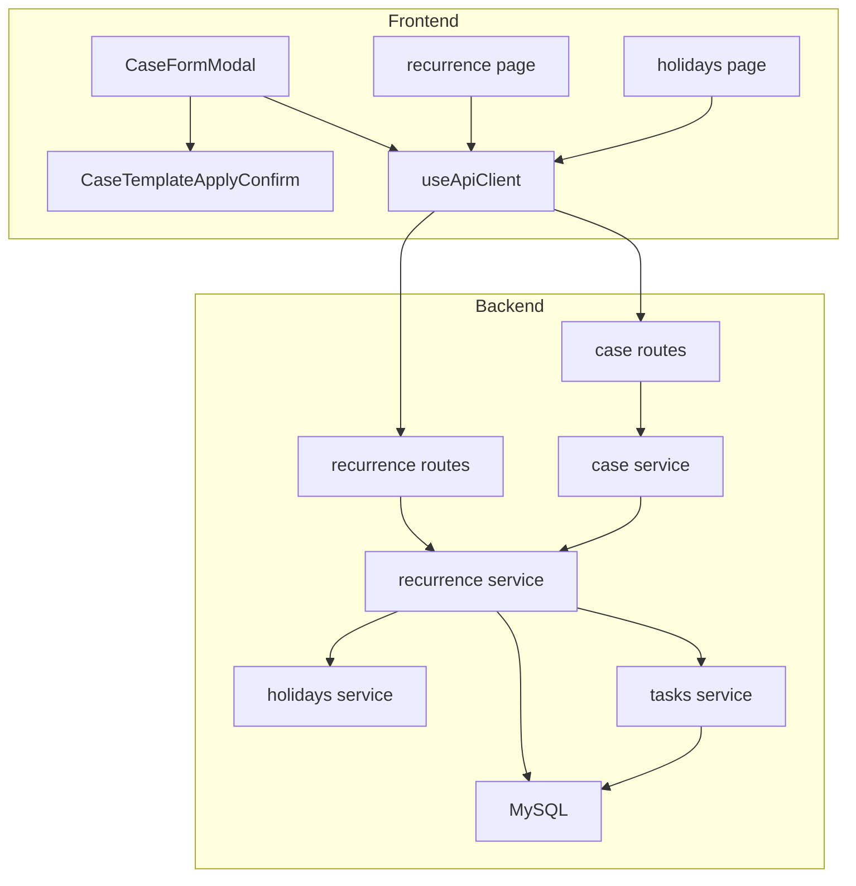
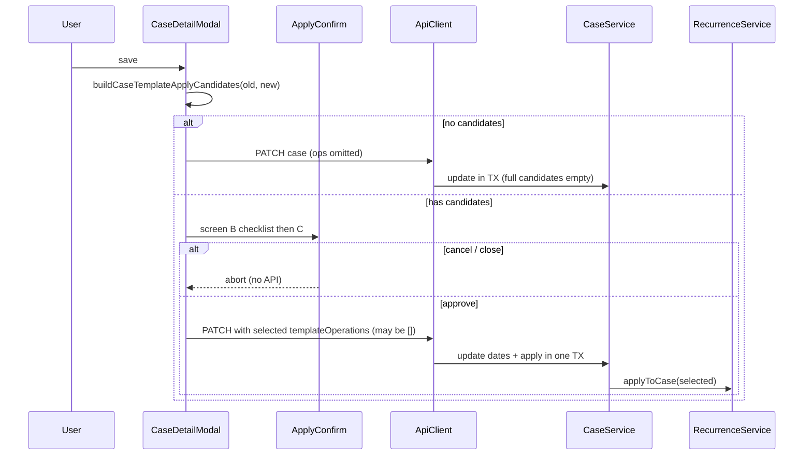

# Design Document

## Overview

本機能は、固定間隔テンプレートを廃止し、案件連動テンプレートを起点4種へ拡張する。案件へのタスク付与は常時自動同期ではなく、案件の新規作成時および編集保存時に、利用者が確認UIで選択した適用操作だけを実行する。あわせてテンプレートの停止/再開、繰り返し設定と休日マスタの画面分離、UX刷新を行う。

**Purpose**: 案件のタイミングに応じた必須タスクを、利用者の意図を確認したうえで付与・付け替える。
**Users**: タスク管理者がテンプレートと休日マスタを整備し、案件作成・編集時にテンプレートタスクを適用する。
**Impact**: `fixed_interval`・`generate-due`・`rrule` を削除する。案件フォームに確認付き適用フローを追加する。`/recurrence` と `/holidays` を分離する。

### Goals
- 固定間隔を全層から除去する
- 案件連動を起点4種・非負固定方向オフセット・停止/再開付きで提供する
- 案件作成・編集時に、起点別の追加/削除/生成し直しを確認付きで適用する
- 繰り返し設定と休日マスタを分離し、確定済みデザインに基づきUX刷新する
- `product.md` を案件連動のみの記載に更新する

### Non-Goals
- 日付変更時のサイレント自動再計算・自動追加
- オフセットが案件期間外を指すケースへの対応
- 符号付きオフセット
- 非営業日ポリシー計算ロジックの変更、祝日API自動ポーリング
- 過去specの書き換え、カレンダー機能統合、認証

## Boundary Commitments

### This Spec Owns
- `RecurringTaskTemplate` の整理(固定間隔削除、`caseAnchor` 追加)とマイグレーションリセット
- テンプレート登録・停止・再開・削除API
- 案件 create/update 経由のテンプレート適用(起点別の生成・削除・生成し直し、同一TX)
- 案件作成・編集UIの確認フロー(チェックボックス一覧 + 最終確認)
- `/recurrence` と `/holidays` の分離・UX、`product.md` / `tech.md`(rrule)の追従
- `Task` の活性行のみ一意キー(生成列)と `sourceAnchor` 追加

### Out of Boundary
- `HolidaysService` の業務ロジック本体
- `TasksService` の内部実装(公開 `create`/`delete` を利用)
- 案件の名称・完了・進捗など、日付とテンプレート適用以外の案件業務
- カレンダー画面の表示仕様(E2Eシード置換は本スペック)

### Allowed Dependencies
- `holidaysService` の営業日解決と休日CRUD/sync API
- `tasksService.create` / `tasksService.delete`
- `CaseFormModal` / `CaseDetailModal` / `Modal` / `Badge` / `ErrorAlert` / `DatePicker`
- 繰り返し・休日・案件適用確認のclaude design確定モック([[ui-design]] 充足)

### Revalidation Triggers
- `Case` の日付フィールド意味が変わった場合
- `Task` の一意制約・ソフトデリート規約が変わった場合
- `CaseFormModal` の保存フロー契約が変わった場合
- 休日/営業日API契約が変わった場合

## Architecture

### Existing Architecture Analysis
- 現行は案件 create/update から `onCaseCreated` / `onCaseEndDateChanged` を無確認で呼ぶ。本仕様ではこれを廃止し、案件 create/update に載せる `templateOperations` による明示適用へ切り替える。
- `CaseFormModal` は作成専用で、create 成功後に未割当タスク関連付けを順次行い、関連付けだけ失敗した場合は案件を残したまま再試行する。テンプレート確認はこの create の前に差し込む(後述 System Flows)。
- テンプレートはグローバル設定のまま。生成タスクは必ず `caseId` を持つ。

### Architecture Pattern & Boundary Map



**Architecture Integration**:
- 案件の日付保存とテンプレート適用は、同一リクエスト内で CaseService が1トランザクションとして実行する。適用専用の第2 HTTP は設けない
- キャンセル時はAPIを呼ばないため、案件も適用もコミットしない
- 新規作成で開始日・終了日が両方ある場合のみ、未設定確認なしで作成+適用を実行する。片方または両方未設定のときは確認後に作成する(両方未設定はタスク追加なし)
- 生成は有効テンプレートのみ。削除は当該案件・当該起点の生成済みタスクすべて(完了済み含む、現行テンプレの有無は問わない)

**templateOperations 導出の原則** (フロント/バックで分岐させない):
1. 候補構築は純関数1箇所に固定する。入力は `(旧start, 旧end, 新start, 新end)`、出力は適用操作の候補リスト。作成時の旧日付は両方 null。実装は `buildCaseTemplateApplyCandidates` として backend に置き、frontend は同ロジックを共有または移植して UI に使う(二重実装する場合もテストで入出力を一致させる)
2. `templateOperations` 省略時: CaseService が上記関数のフル候補を採用して適用する。確認スキップ経路(両方日付ありの新規作成、編集で候補ゼロ)と揃える
3. 確認UI経由: フロントが同じ候補を見せ、ユーザーが選んだ部分集合だけを `templateOperations` に載せる。CaseService は送られたリストを実行する。送られた操作がフル候補の部分集合でない場合は 400
4. ユーザーがすべて外した場合は空配列を送り、日付のみ保存する(Req 4.13)。省略(`undefined`)と空配列は区別する: 省略=フル候補、空配列=適用なし

### Technology Stack

| Layer | Choice / Version | Role in Feature | Notes |
|-------|------------------|-----------------|-------|
| Frontend | Nuxt 4 / Vue 3 | 確認UI、画面分離 | ビジュアルは claude design 確定済み |
| Backend | Fastify 5 + Zod + Prisma | テンプレAPI、案件+適用の原子更新 | `rrule` 削除 |
| Data | MySQL via Prisma | schema + migrate reset | 活性行のみ一意(生成列) |

## File Structure Plan

```
backend/src/modules/recurrence/
  recurrence.types.ts
  recurrence.repository.ts
  recurrence.service.ts          # register/stop/resume/delete + applyToCase
  recurrence.routes.ts
  *.test.ts
backend/src/modules/cases/
  case.service.ts                # 無確認フック除去。create/update で apply を同一TX実行
  caseTemplateApplyCandidates.ts # 旧→新日付から候補を構築する純関数
  case.service.test.ts
backend/src/prisma/schema.prisma # caseAnchor, sourceAnchor, 活性一意キー生成列
backend/src/prisma/migrations/.../migration.sql  # 生成列+UNIQUEの手編集(休日と同様)

frontend/components/cases/
  CaseFormModal.vue              # 未設定確認→create→未割当関連付け(既存再試行を維持)
  CaseDetailModal.vue            # 編集保存前に適用確認フローを挿入
  CaseTemplateApplyConfirm.vue   # 新規: チェックリスト + 最終確認(作成A/編集B・C)
  caseTemplateApplyCandidates.ts # backend と同仕様の候補構築(または共有)
frontend/components/recurrence/
  RecurrenceFormModal.vue
  RecurrenceDetailModal.vue
  recurrenceLabels.ts
frontend/pages/recurrence/index.vue
frontend/pages/holidays/index.vue
frontend/app.vue
frontend/composables/useApiClient.ts

.kiro/steering/product.md
.kiro/steering/tech.md
```

## System Flows

### 案件新規作成(未設定確認 + テンプレ適用 + 未割当関連付け)

既存の「create 直後に未割当タスクを順次関連付け、失敗分だけ再試行」は維持する。テンプレート確認は create の前にだけ挟む。関連付けの部分失敗は案件(とテンプレ適用)をロールバックしない(現行どおり)。

```mermaid
sequenceDiagram
    participant User as User
    participant Form as CaseFormModal
    participant Confirm as ApplyConfirm
    participant Api as ApiClient
    participant CaseSvc as CaseService
    participant RecSvc as RecurrenceService

    User->>Form: submit (dates + optional unassigned selections)
    alt start or end missing
        Form->>Confirm: screen A (unset dates)
        alt cancel / close
            Confirm-->>Form: abort (no API, form stays editable)
        else create
            Form->>Api: POST case (ops omitted or explicit)
        end
    else both dates set
        Form->>Api: POST case (ops omitted → server full candidates)
    end
    Api->>CaseSvc: create in TX
    CaseSvc->>RecSvc: applyToCase (omit=full, []=none)
    CaseSvc-->>Form: created case
    Form->>Form: emit created; fields become read-only
    Form->>Api: sequential updateTask associations
    alt all associations ok
        Form-->>User: close modal
    else some failed
        Form-->>User: stay open; retry failed only
    end
```

順序の固定:
1. バリデーション
2. 日付未設定なら画面A。キャンセルなら API なし
3. `createCase`(テンプレ適用は同一TX。両方日付ありは operations 省略可)
4. 成功後に未割当関連付け。失敗時は読み取り専用+再試行(現行)

### 案件編集保存(確認付き)

編集は `CaseDetailModal`。未割当一括関連付けフローは関与しない。



### 適用操作の種類

| Candidate key | When proposed | On execute |
|---------------|---------------|------------|
| start_generate | start null→value | 有効な case_start テンプレから生成 |
| start_regenerate | start value→other value | case_start 生成タスクを全削除後、有効テンプレから生成 |
| start_delete | start value→null | case_start 生成タスクを全削除 |
| end_generate / end_regenerate / end_delete | 終了日の対称変化 | case_end について同様 |
| month_generate | 両方ありになる | 有効な period_month_* から生成 |
| month_regenerate | 両方ありのまま日付変更 | period_month_* 生成タスクを全削除後、再生成 |
| month_delete | 両方ありから片方/両方なし | period_month_* 生成タスクを全削除 |

## Requirements Traceability

| Requirement | Summary | Components |
|-------------|---------|------------|
| 1.1–1.3 | 固定間隔廃止 | RecurrenceService/Routes/Page, schema |
| 2.1–2.8 | テンプレ登録・停止再開 | RecurrenceService, Form/Detail Modal |
| 3.1–3.6 | 案件作成時適用 | CaseFormModal, RecurrenceService.apply |
| 4.1–4.13 | 編集時確認付き適用 | CaseTemplateApplyConfirm, CaseFormModal, apply API |
| 5.1–5.8 | 生成・削除ルール | RecurrenceService, TasksService |
| 6.1–6.3 | 月初月末内容 | RecurrenceService |
| 7.1–7.4 | 画面分離 | RecurrencePage, HolidaysPage, app.vue |
| 8.1–8.3 | 繰り返しUX | RecurrencePage/Modals |
| 9.1–9.4 | 休日画面 | HolidaysPage |
| 10.1–10.3 | product | product.md |

## Components and Interfaces

| Component | Intent | Req | Contracts |
|-----------|--------|------|-----------|
| RecurrenceService | テンプレ管理と案件への明示的適用 | 1, 2, 3, 5, 6 | Service, API |
| CaseService | 無確認フック除去。create/update で日付と apply を同一TX | 3, 4 | Service |
| CaseFormModal + CaseDetailModal + CaseTemplateApplyConfirm | 作成/編集の確認付き適用 | 3, 4 | State |
| RecurrencePage/Modals | テンプレUX | 1, 2, 7, 8 | State |
| HolidaysPage | 休日UX | 7, 9 | State |

### RecurrenceService

```typescript
type CaseRelativeAnchor =
  | "case_start"
  | "case_end"
  | "period_month_start"
  | "period_month_end";

type CaseTemplateApplyOperation =
  | "start_generate"
  | "start_regenerate"
  | "start_delete"
  | "end_generate"
  | "end_regenerate"
  | "end_delete"
  | "month_generate"
  | "month_regenerate"
  | "month_delete";

interface RegisterTemplateInput {
  title: string;
  priority: "high" | "medium" | "low";
  caseAnchor: CaseRelativeAnchor;
  caseOffsetDays: number; // >= 0
  defaultMemo?: string;
  nonBusinessDayPolicy: NonBusinessDayPolicy;
}

interface RecurrenceService {
  registerTemplate(input: RegisterTemplateInput): Promise<RecurringTaskTemplate>;
  stopTemplate(id: string): Promise<void>;
  resumeTemplate(id: string): Promise<void>;
  deleteTemplate(id: string, requestId?: string): Promise<void>;
  list(): Promise<RecurringTaskTemplate[]>;
  /** CaseService 同一トランザクション内からのみ呼ぶ。公開HTTPエンドポイントは設けない */
  applyToCase(caseId: string, operations: CaseTemplateApplyOperation[], requestId?: string): Promise<void>;
}
```

### CaseService (日付 + 適用の原子更新)

```typescript
interface CaseCreateInput {
  name: string;
  startDate?: string | null;
  endDate?: string | null;
  templateOperations?: CaseTemplateApplyOperation[];
}

interface CaseUpdateInput {
  name?: string;
  startDate?: string | null;
  endDate?: string | null;
  isCompleted?: boolean;
  templateOperations?: CaseTemplateApplyOperation[];
}
```

- `create` / `update` は Prisma トランザクション内で案件行を書き込み、続けて `recurrenceService.applyToCase` を実行する
- `templateOperations` の解釈は Architecture Integration の導出原則に従う
  - 省略(`undefined`): `buildCaseTemplateApplyCandidates` のフル候補を適用
  - 空配列: 適用なし(日付等のみ)
  - 非空配列: フル候補の部分集合であること。そうでなければ 400。部分集合を適用
- 適用の一部でも失敗したらトランザクション全体をロールバックする
- 新規作成で両方日付あり: フロントは operations を省略してよい(サーバーがフル候補=`start_generate`/`end_generate`/`month_generate` 相当を適用)

API:
| Method | Endpoint | Body | Response |
|--------|----------|------|----------|
| POST | /api/recurring-templates | RegisterTemplateInput | 201 |
| GET | /api/recurring-templates | — | 200 |
| POST | /api/recurring-templates/:id/stop | — | 204 |
| POST | /api/recurring-templates/:id/resume | — | 204 |
| DELETE | /api/recurring-templates/:id | — | 204 |
| POST | /api/cases | CaseCreateInput | 201 |
| PATCH | /api/cases/:id | CaseUpdateInput | 200 |

公開の `POST /api/cases/:id/template-applies` は設けない。適用は案件 create/update に載せる。

削除対象の識別: `Task.caseId = case` かつ Task の `sourceAnchor` が対象起点。生成時に `sourceAnchor` をテンプレの `caseAnchor` からスナップショットする(新規カラム `sourceAnchor CaseRelativeAnchor?`)。テンプレ行削除後も起点別削除(5.3)を満たすため必須。

### CaseTemplateApplyConfirm

| Field | Detail |
|-------|--------|
| Intent | 適用候補をチェックボックス一覧で見せ、最終確認後に選択結果を返す |
| Requirements | 3.5–3.6, 4.1–4.4, 4.12–4.13 |
| Visual | `案件テンプレート適用確認.dc.html`(同一 design project)。詳細は `research.md`「ビジュアルデザイン確定: 案件テンプレート適用確認」 |

相互作用(見た目はclaude designで確定):
1. 画面A(作成・日付未設定時): 未設定の説明 + 開始/終了サマリー →「作成する」/「戻る」
2. 画面B(編集・候補あり): 日付変更サマリー + 候補チェックリスト(タグ: 追加/生成し直し/削除、初期オン) →「次へ」/「キャンセル」
3. 画面C: 選択内容の再掲 + 日付も保存する旨 + 破壊的操作時の注意 →「実行する」/「戻る」
4. 承認で operations 配列を親へ返却。キャンセル/×/Esc/オーバーレイで abort(保存なし)。案件フォーム上のネストモーダル
### 予定日計算

- `case_start`: startDate + offset
- `case_end`: endDate − offset
- `period_month_start`: 各暦月1日 + offset。期間外ならその月は作らない
- `period_month_end`: 各暦月末日 − offset。期間外なら作らない
- 期間内判定はオフセット直後の raw 日付で行い、その後に非営業日ポリシーを適用する
- `skip` で予定日が消える場合、その回は生成しない

## Data Models

### RecurringTaskTemplate
- 追加: `caseAnchor` NOT NULL
- `caseOffsetDays` NOT NULL、非負
- 削除: `kind`, `intervalUnit`, `intervalValue`, `boundCaseId`
- enum 追加: `CaseRelativeAnchor`
- enum 削除: `RecurrenceKind`, `IntervalUnit`

### Task
- 追加: `sourceAnchor CaseRelativeAnchor?` (テンプレート生成時にコピー)
- 生成タスクは常に `caseId` 必須
- 活性行のみ一意: `NonBusinessDay.date_active_key` と同様の STORED GENERATED COLUMN を用いる
  - 例: `template_case_date_active_key` 相当を  
    `IF(deleted_at IS NULL AND source_template_id IS NOT NULL, CONCAT(source_template_id, ':', case_id, ':', scheduled_date), NULL)`  
    のように定義し、その列に UNIQUE INDEX を張る(正確なSQL表現は migrate 手編集で固定。Prisma schema 言語では `Unsupported` + コメント)
  - 論理削除済み行は一意キーが NULL になり、同じ `(sourceTemplateId, caseId, scheduledDate)` での再生成が可能になる
- 旧 `@@unique([sourceTemplateId, scheduledDate])` は削除する

### Physical
- migrate reset(単一 init)。`non_business_days.date_active_key` と Task 活性一意キーの手編集手順を Implementation Notes に残す([[local-dev-pitfalls]] #5)

## Error Handling
- 案件 create/update の不正 operation / 存在しない case は 400/404。適用失敗時は案件更新も含め全体失敗(TXロールバック)
- 活性行同士の一意制約衝突のみ冪等 no-op(既に同じ予定の活性インスタンスがある場合)。論理削除済みとの衝突は発生しない前提

## Testing Strategy
- 起点4種の予定日・期間外スキップ・非営業日
- apply operations 各キーの生成/削除/再生成(完了済みも含む削除)
- 手動タスクが消えないこと
- 停止テンプレは生成に使われないが、旧生成タスクは削除対象になること
- CaseForm/Detail: 候補なしは直接保存、候補ありは checklist→最終確認、キャンセルで未保存(API未呼出)
- 作成: 両方日付ありは確認なし適用、片方または両方なしは未設定確認(両方なしはタスク追加なし)
- CaseForm: 確認→create→未割当関連付けの順序。関連付け失敗時も案件+テンプレ適用は残し再試行できること
- operations 省略=フル候補、`[]`=適用なし、非部分集合は 400
- create/update が apply 失敗時に案件行もロールバックすること
- regenerate 後に同一予定日の再作成ができること(活性一意キー)
- `buildCaseTemplateApplyCandidates` を frontend/backend で二重実装(または移植)する場合、同一の旧→新日付入力に対して両側の候補リスト(操作キーの集合と順序)が一致することをテストで保証する
- calendar E2E シードを案件連動作成に置換

## Migration Strategy
schema 更新 → init 再生成 → migrate reset → テスト置換 → UI実装。  
案件確認UI・繰り返し/休日UIとも claude design 確定済み(`research.md`)。

## Supporting References
- 運用ケース合意・符号付きオフセット不採用: `research.md`
- 繰り返し/休日画面デザイン: claude design project `393e75bf-c398-4b2e-9f7e-2919a82caea9` / `繰り返し設定・休日マスタ.dc.html`
- 案件適用確認UI: 同 project / `案件テンプレート適用確認.dc.html`([[ui-design]] 充足)
