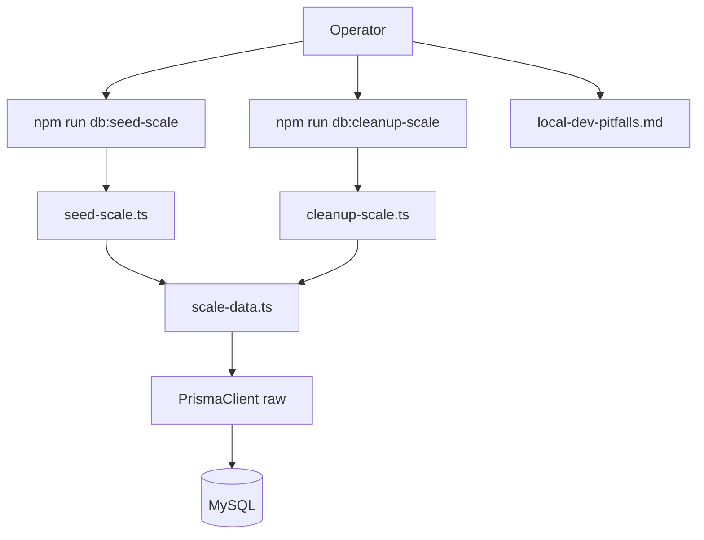
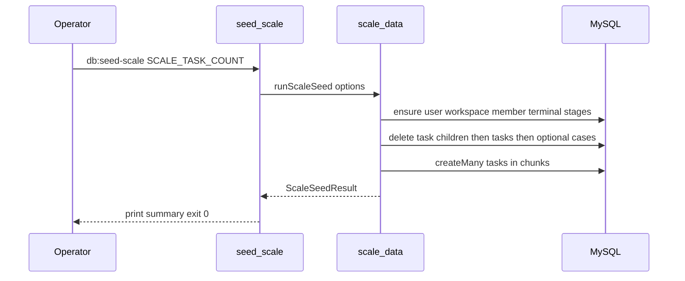
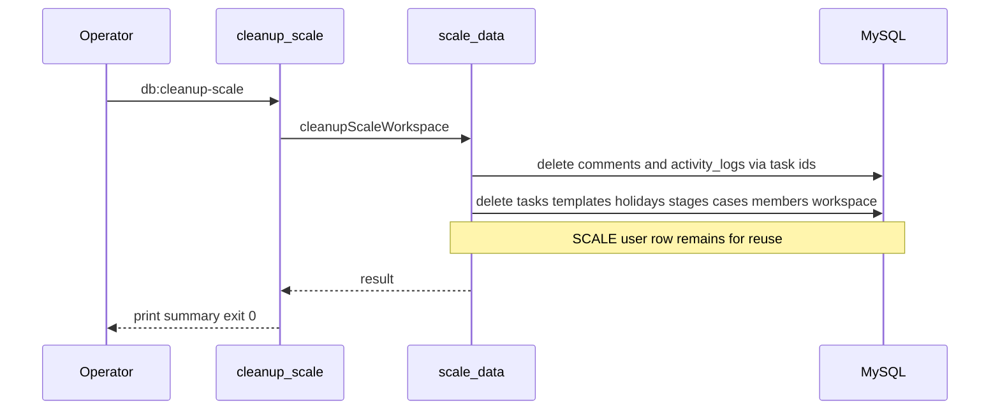

# Technical Design: scale-data-seed

## Overview

**Purpose**: 計測担当が、開発用少数デモシードとは別の入口から、負荷計測専用ワークスペースへ指定件数のタスク規模データを投入・再投入・掃除できるようにする。

**Users**: ローカルまたは計測用 DB を扱う開発者・計測担当。エンドユーザー向け UI / HTTP API は追加しない。

**Impact**: `backend/src/prisma/` に規模用 CLI と npm script を追加し、`local-dev-pitfalls.md` に手順と衝突注意を追記する。既存 `db:seed` / E2E リセットの挙動は変えない。

### Goals
- 全表消去なしで、専用 WS に再現可能な規模タスクを投入できる
- 件数指定（既定あり）と再実行時の非累積
- WS スコープの掃除手段と、後続負荷計測が使える識別子・資格情報の明示
- 共有 DB 上の衝突条件をオペレータ手順に残す

### Non-Goals
- k6 シナリオ・閾値（`api-load-harness`）
- 一覧 API / 画面の性能改善（`list-api-performance`）
- 開発用シードや E2E 全表リセットの置き換え
- HTTP 経由の bulk 投入 API
- CI 必須ゲート、本番への自動投入

## Boundary Commitments

### This Spec Owns
- 規模データ投入／掃除の CLI 入口と npm script
- 計測専用ユーザー・ワークスペース・端末段階・規模タスク（および任意の最小案件）の作成・再投入・物理削除
- 件数・日付付与比率など投入パラメータの契約（環境変数）
- 成功時のオペレータ向けサマリ出力（WS ID、件数、ログイン情報）
- `local-dev-pitfalls.md`（および必要なら `testing.md` への短い参照）の手順・注意追記

### Out of Boundary
- 負荷シナリオ本体、一覧 API のクエリ／索引改善、フロント描画最適化
- `clear-tables.ts` / `db:seed` / `db:reset-for-e2e` の意味変更
- `modules/*` への HTTP ルート追加
- Prisma スキーマ変更・マイグレーション（本仕様の必須範囲外）

### Allowed Dependencies
- 生 `PrismaClient`（soft-delete 拡張なし。デモ seed と同型）
- `@node-rs/argon2` の `hash`（既存 auth / seed と同型）
- 既存 `schema.prisma` モデル
- Docker Compose 経由の backend 実行パターン（既存 `db:seed` と同様）

### Revalidation Triggers
- 計測用固定ユーザー／WS ID、環境変数名、stdout サマリ形の変更（`api-load-harness` が再確認）
- WS スコープ物理削除の対象テーブル集合の変更（スキーマ追加時）
- 既定件数または日付付与ルールの変更（計測比較の前提）
- 投入が HTTP API や soft-delete 拡張 Client 前提に変わった場合

## Architecture

### Existing Architecture Analysis

- オペレータ用データ投入は `backend/src/prisma/` に集約（`seed.ts` → `seed-manual-data.ts` → 先頭で `clearAllTables`）
- E2E は `reset-for-e2e.ts` で同じく全表 TRUNCATE
- ドメインモジュールは HTTP + soft-delete 拡張 `db` 前提。規模の物理削除・大量 `createMany` には不向き
- Task list は WS スコープの非削除行全件。ページネーションなし

### Architecture Pattern & Boundary Map

Selected pattern: Prisma 配下の Batch / Job CLI（HTTP なし）。開発用 seed とエントリ・定数・全表消去の有無で分離する。



**Architecture Integration**:
- 依存方向: Config/Types → scale-data core → CLI entry → 生 PrismaClient → MySQL
- `seed-manual-data` / `clearAllTables` を import して実行経路に乗せない（全表消去の誤用防止）
- 固定 ID はデモ seed の `SEED_*` とは別プレフィックス（例: `SCALE_*`）

### Technology Stack

| Layer | Choice / Version | Role in Feature | Notes |
|-------|------------------|-----------------|-------|
| CLI / Runtime | Node 24 + tsx | オペレータ入口 | 既存 seed と同型 |
| Data | Prisma Client 6 + MySQL | 一括投入・物理削除 | soft-delete 拡張なし |
| Crypto | `@node-rs/argon2` | 計測ユーザー passwordHash | auth と同一 |
| Docs | local-dev-pitfalls.md | 手順と衝突注意 | steering |

新規 npm 依存は追加しない。

## File Structure Plan

### Directory Structure
```
backend/
├── package.json                          # db:seed-scale / db:cleanup-scale 追加
└── src/prisma/
    ├── seed-scale.ts                     # 投入 CLI エントリ（argv/env 読取 → 終了コード）
    ├── cleanup-scale.ts                  # 掃除 CLI エントリ
    ├── scale-data.ts                     # 確保・再投入・物理削除・サマリ構築の本体
    ├── scale-data.constants.ts           # SCALE_* 固定 ID・既定件数・メール・パスワード・チャンクサイズ
    ├── scale-data.types.ts               # ScaleSeedOptions / ScaleSeedResult 等
    ├── scale-data.test.ts                # 純関数・設定検証（件数パース、日付割当、チャンク分割）
    └── scale-data.integration.test.ts    # 小件数の投入／再投入／掃除（実 DB、後始末必須）
```

### Modified Files
- `backend/package.json` — `db:seed-scale` / `db:cleanup-scale` script
- `.kiro/steering/local-dev-pitfalls.md` — 規模 seed 節（コマンド、既定、衝突、本番禁止）
- `.kiro/steering/testing.md` — 任意: 負荷用規模データは Vitest/E2E と同時実行しない旨の一行

デモ seed・`clear-tables.ts`・ドメイン modules は変更しない（参照のみ）。

## System Flows

### 投入（再実行含む）



### 計測終了後の片付け（推奨）

計測が終わったら、専用 CLI ではなく既存の確認用シードで DB を戻す。

- `db:seed`（内部で全表 TRUNCATE → 少数デモ投入）
- 規模データもデモ以外の手動データも消える点を手順に明記（Req 7.1）

### 掃除 CLI（任意・WS スコープ）

全表消去せず規模 WS だけ外したい場合の手段として `db:cleanup-scale` を残す（Req 5）。日常の「計測終わり」は上記の `db:seed` を推奨する。



Key decisions:
- 再投入は累積追加ではなく、必要な行だけ消してから指定件数を作り直す（user / WS / member / 端末段階は残す）
- 規模投入・`cleanup-scale` は `clearAllTables` を呼ばない。計測完了時の推奨片付けだけ既存 `db:seed`（全表消去あり）を使う

## Requirements Traceability

| Requirement | Summary | Components | Interfaces | Flows |
|-------------|---------|------------|------------|-------|
| 1.1 | 専用実行入口 | package.json scripts, seed-scale.ts | Batch | 投入 |
| 1.2 | 全表消去しない | scale-data.ts | Batch | 投入 |
| 1.3 | 手順文書 | local-dev-pitfalls.md | — | — |
| 2.1 | 専用 WS | scale-data.ts ensure* | Batch | 投入 |
| 2.2 | 計測アカウント | scale-data.ts, constants | Batch | 投入 |
| 2.3 | 識別子・資格情報の提示 | ScaleSeedResult, CLI stdout | Batch | 投入 |
| 2.4 | 端末段階充足 | ensure stages | Batch | 投入 |
| 3.1 | 指定件数の可視タスク | createMany tasks | Batch | 投入 |
| 3.2 | 既定または拒否 | parseScaleTaskCount | Batch | 投入 |
| 3.3 | 再実行で非累積 | physical delete then seed | Batch | 投入 |
| 3.4 | 数千件帯を指定可 | constants default 6000, env | Batch | 投入 |
| 4.1 | 一覧で多数返る | active tasks only | Batch | 投入 |
| 4.2 | 終了予定日付き比率 | date assignment | Batch | 投入 |
| 4.3 | 関連データは WS 内 | optional case | Batch | 投入 |
| 4.4 | 削除済み水増し禁止 | no deletedAt set on seed rows | Batch | 投入 |
| 5.1–5.4 | WS スコープ掃除と手順 | cleanup-scale.ts, docs | Batch | 掃除 |
| 6.1–6.3 | 後続前提の明示、シナリオ非所有 | ScaleSeedResult, docs, Out of Boundary | — | — |
| 7.1–7.3 | 衝突・同時実行・本番禁止の注意 | local-dev-pitfalls.md | — | — |

## Components and Interfaces

| Component | Domain/Layer | Intent | Req Coverage | Key Dependencies | Contracts |
|-----------|--------------|--------|--------------|------------------|-----------|
| scale-data.constants | prisma/CLI | 固定 ID・既定値 | 2, 3 | none | State |
| scale-data.types | prisma/CLI | 入出力型 | 2, 3, 6 | none | State |
| scale-data core | prisma/CLI | 確保・削除・投入 | 1–6 | PrismaClient P0, argon2 P0 | Batch |
| seed-scale / cleanup-scale | prisma/CLI | プロセス入口 | 1, 5 | scale-data P0 | Batch |
| operator docs | steering | 手順と注意 | 1.3, 5.4, 7 | — | — |

### prisma / Batch

#### scale-data core

| Field | Detail |
|-------|--------|
| Intent | 規模 WS の確保、WS スコープ物理削除、チャンク投入、結果サマリ |
| Requirements | 1.2, 2.1–2.4, 3.1–3.4, 4.1–4.4, 5.2–5.3, 6.1–6.2 |

**Responsibilities & Constraints**
- `clearAllTables` / `seedManualConfirmationData` を呼び出さない
- soft-delete 拡張付き `shared/db` を使わない（論理削除による偽の件数合わせを防ぐ）
- デモ seed の固定 ID と衝突しない `SCALE_*` 定数のみを規模データに使う

**Dependencies**
- Outbound: 生 PrismaClient — 永続化（P0）
- External: `@node-rs/argon2` — passwordHash（P0）

**Contracts**: Batch [x]

##### Batch / Job Contract

**seed (`runScaleSeed`)**
- Trigger: `npm run db:seed-scale`（Compose: `docker compose run --rm -T backend npm run db:seed-scale`）
- Input:
  - `SCALE_TASK_COUNT`: 未設定時は既定 `6000`。正の整数以外は exit 1
  - 任意: DB 接続は既存 `DATABASE_URL`
- 処理概要:
  1. 計測ユーザー upsert（固定 ID / メール / 文書化されたパスワード）
  2. 専用 WS・メンバー・完了/中止段階を ensure（無ければ作る。再実行時は残っている前提でよい）
  3. 再投入用の部分削除のみ実施（user / WS / member / 端末段階は消さない）:
     - 当該 WS の task id 経由で `activity_logs` → `comments` を物理削除（これらの表に `workspace_id` は無い）
     - 当該 WS の `tasks` を物理削除
     - 任意で投入した `cases` があれば物理削除（テンプレ・祝日は本仕様では作らないため通常不要）
  4. 指定件数の Task を `createMany` チャンク投入。`deletedAt` は null。約 80% に `scheduledEndDate` を分散
  5. サマリを stdout（人間可読を必須。機械可読は任意の 1 行 JSON でも可。下流 harness は定数手設定でも可）
- Output (`ScaleSeedResult`): `workspaceId`, `userEmail`, `taskCount`, `scheduledEndDateCount`（パスワードは constants / 手順書を参照。開発専用である旨必須）
- Idempotency: 同一 SCALE WS への再実行は上記部分削除→再作成で指定件数に収束

**cleanup (`cleanupScaleWorkspace`)** — 任意。計測完了の推奨経路は既存 `db:seed`
- Trigger: `npm run db:cleanup-scale`
- Input: 固定 SCALE WS ID（定数）
- 処理:
  1. task id 経由で `activity_logs` → `comments` を物理削除
  2. `tasks` →（存在すれば）templates / holidays → `development_stages` → `cases` → `workspace_members` → `workspaces` を当該 WS に限定して物理削除
  3. SCALE ユーザー行は残す（再 `db:seed-scale` で再利用）
- Postcondition: 当該 WS は存在しない。その WS 向けタスクは 0
- 計測終了の推奨: 本 CLI ではなく `db:seed`（全表消去 + 確認用デモ）で開発 DB を戻す。手順書に両方を書く

##### Service Interface（型契約）
```typescript
interface ScaleSeedOptions {
  taskCount: number;
}

interface ScaleSeedResult {
  workspaceId: string;
  userId: string;
  userEmail: string;
  taskCount: number;
  scheduledEndDateCount: number;
}

interface ScaleDataOps {
  runScaleSeed(options: ScaleSeedOptions): Promise<ScaleSeedResult>;
  cleanupScaleWorkspace(): Promise<{ workspaceId: string; removed: boolean }>;
}

function parseScaleTaskCount(envValue: string | undefined, defaultCount: number): number;
```
- `parseScaleTaskCount`: 未定義 → default。空文字・非整数・`<= 0` → throw（CLI が exit 1）
- パスワード定数はソースと手順書にのみ置き、本番利用禁止をコメントと docs で明示

**Implementation Notes**
- Integration: チャンクサイズは constants（例: 1000）。MySQL プレースホルダ上限を超えないこと
- Validation: 投入後に `task.count({ where: { workspaceId, deletedAt: null } })` が `taskCount` と一致することを CLI が確認し、不一致なら exit 1
- Risks: 巨大件数は時間・ディスクを食う。手順で段階的に件数を上げるよう案内

#### CLI entries

| Field | Detail |
|-------|--------|
| Intent | 環境変数読取、core 呼び出し、exit code、サマリ表示 |
| Requirements | 1.1, 5.1, 6.1 |

**Implementation Notes**
- `seed-scale.ts` / `cleanup-scale.ts` は薄い。ロジックは `scale-data.ts` に集約
- 失敗時はメッセージを stderr、非ゼロ終了

#### Operator documentation

| Field | Detail |
|-------|--------|
| Intent | 実行方法・既定件数・資格情報・衝突・本番禁止 |
| Requirements | 1.3, 5.4, 7.1–7.3 |

記載必須:
- `db:seed-scale` の Compose 例、既定 6000 と `SCALE_TASK_COUNT`
- 計測用メール／パスワード／WS ID の参照先（constants または手順内の表）
- 計測完了後の推奨片付け: 既存 `db:seed`（全表消去 + 確認用デモ再投入）
- 任意: 全表消去せず規模 WS だけ外す `db:cleanup-scale`
- `db:seed` と E2E リセットで規模データが消えること（意図した片付けとしても使えること）
- Vitest / E2E と同時に同じ DB へ向けないこと
- 本番・共有ステージングへの無秩序な投入禁止

## Data Models

### Domain Model
- 新規ドメイン概念は「規模計測用データセット」のみ（永続モデル追加なし）
- 所有データ: 固定 ID の User / Workspace / Member / DevelopmentStage（端末） / 任意 Case / Task 多数
- 不変条件: 専用 WS に completed と cancelled の段階が少なくとも 1 つずつ存在

### Logical Data Model
- 既存テーブルのみ。規模行は `workspaceId = SCALE_WORKSPACE_ID` で識別
- タスクは階層なし・テンプレートなしを基本とし、投入を単純化（list/カレンダー負荷が主目的）

### Physical Data Model
- スキーマ変更なし
- 再投入時の部分削除順（残す: user / workspace / member / terminal stages）:
  1. `activity_logs` / `comments` — `task_id IN (SELECT id FROM tasks WHERE workspace_id = ?)`
  2. `tasks` WHERE `workspace_id = ?`
  3. 任意 `cases` WHERE `workspace_id = ?`
- `cleanup-scale` 時の追加削除順（上記のあと）: templates / holidays（作っていれば）→ `development_stages` → `cases` → `workspace_members` → `workspaces`（いずれも当該 `workspace_id`）
- 索引追加は本仕様の必須範囲外（`list-api-performance`）

## Error Handling

### Error Strategy
- 設定不正（件数）: 投入せず exit 1
- DB 接続失敗 / 一意制約: 例外を stderr に出し exit 1
- 件数検証不一致: ロールバック相当として掃除を試みたうえで失敗終了（実装が単純なら失敗を明示し、オペレータに cleanup を案内）

### Error Categories
- Operator Errors: 不正な `SCALE_TASK_COUNT`
- System Errors: DB 到達不能、ディスク不足
- ビジネス相当: なし（HTTP なし）

## Testing Strategy

### Unit Tests（`scale-data.test.ts`）
- `parseScaleTaskCount`: 未定義→既定、`"6000"`→6000、不正値で throw
- 日付割当: 指定件数・比率で `scheduledEndDate` 付き件数が期待どおり
- チャンク分割: N 件がチャンク境界で分割される

### Integration Tests（`scale-data.integration.test.ts`）
- 小件数（例: 50）で `runScaleSeed` → count 一致、`deletedAt` null、終了予定日付きが 0 より大きい
- 同 WS へ二度実行 → 件数が累積せず指定件数のまま
- `cleanupScaleWorkspace` 後 → 当該 WS が無い / タスク 0
- `clearAllTables` を呼ばないこと（スパイまたは、投入前後に無関係ユーザー行が残るフィクスチャで確認）
- `try/finally` で必ず cleanup。他テストと共有 DB のため SCALE 固定 ID のみ操作

### E2E / UI
- なし（本仕様は CLI）

### Performance
- 統合で 50 件の所要はアサートしない。手動で 6000 を一度流す手順は docs に記載（CI 必須にしない）

## Security Considerations

- 計測用パスワードは開発・計測 DB 専用。手順に本番投入禁止を明記（7.3）
- HTTP で bulk を公開しない（誤爆面を増やさない）
- 資格情報をログ基盤に機微情報として扱わない（stdout はローカル端末前提）

## Performance & Scalability

- 目的は「負荷計測用データの用意」であり、投入自体の SLA は設けない
- `createMany` チャンクでプレースホルダ上限とメモリを回避
- 既定 6000。より大きい件数はオペレータ責任で `SCALE_TASK_COUNT` を上げる

## Migration Strategy

- スキーマ移行なし
- ロールアウト: script 追加 → docs 追記 → 小件数統合テスト → 手動で 6000 投入確認
- 既存デモデータは、SCALE 固定 ID が `SEED_*` と異なれば共存可能（ただし E2E/db:seed の全表消去では両方消える）
