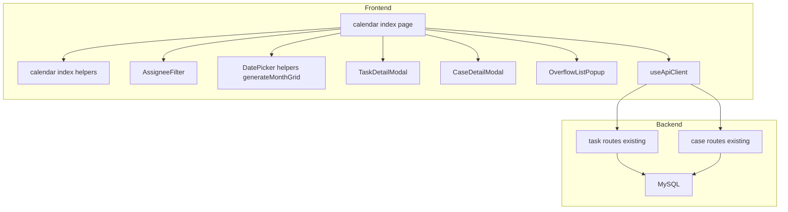
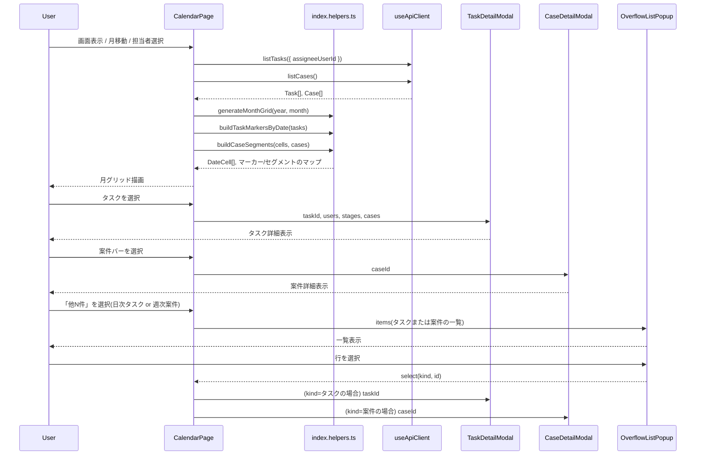
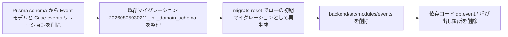

# Design Document

## Overview

本機能は、タスクの期限日と案件の期間を月表示のカレンダー上で俯瞰できる新しい`/calendar`画面を提供し、既存の`/events`(タスク・イベント統合タイムライン)画面と非タスクイベント機能を完全に置き換える。

**Purpose**: 「いつまでに何をすべきか」をタスク単位・案件単位の両方でカレンダー上に一覧できる価値を、タスク・案件の進捗を管理する利用者に届ける。
**Users**: 開発者自身または少人数チームのメンバーが、日々の期限確認・担当者ごとの状況把握に利用する。
**Impact**: `/events`画面と非タスクイベント機能(バックエンドAPI・データモデル・フロントエンドの一切)を完全に削除し、`/calendar`画面に置き換える。タスク・案件のデータモデルへの変更はない(既存の`scheduledDate`/`startDate`/`endDate`を流用)。

### Goals
- タスクの期限日(点)と案件の期間(バー)を月表示カレンダーで確認できる
- 既存のDatePicker・AssigneeFilter・TaskDetailModal・CaseDetailModalの資産を最大限再利用し、新規実装を最小化する
- 非タスクイベント機能をバックエンド・フロントエンド・データモデルの全層から漏れなく除去する

### Non-Goals
- 週表示・日表示等、月表示以外のビュー切り替え
- タスク・案件のデータモデルへの新規フィールド追加
- カレンダー画面からのタスク・案件の新規作成(既存タスク・既存案件の期限日・期間を表示するのみ)
- カレンダー上の個別タスク・案件クリックに対する独自プレビューポップアップの新規実装(既存の`TaskDetailModal`/`CaseDetailModal`をそのまま開く)

> **改訂(claude designでのビジュアルデザイン確定後)**: 当初のNon-Goal「同日に複数の案件期間が重なった場合の重なり回避レイアウトは行わない、縦積みのみ」は撤回した。claude designで確定したデザイン(research.md「ビジュアルデザイン確定」参照)は週単位のレーン割り当てによる重なり回避を採用しており、本設計もそれに合わせて`CalendarHelpers`にレーン割り当てロジックを持つ。

## Boundary Commitments

### This Spec Owns
- `/calendar`画面(フロントエンド新規ページ)の情報設計・表示ロジック(月グリッド生成の呼び出し、タスク期限日のマッピング、案件期間の週次レーン割り当て、月移動、担当者絞り込みとの連携)
- 非タスクイベント機能の完全な除去(バックエンドモジュール・Prismaスキーマ・フロントエンドページ・API クライアント・ダッシュボードの参照箇所)
- `product.md`のCore Capabilities記載の更新(非タスクイベントの記述除去)
- 「他N件」一覧ポップアップ(タスク・案件で共通のコンポーネント)の新規実装

### Out of Boundary
- タスク・案件のCRUDロジック自体(`TasksService`/`CaseService`) — 既存の`GET /api/tasks`/`GET /api/cases`をそのまま利用し、変更しない
- `TaskDetailModal`/`CaseDetailModal`/`AssigneeFilter`/`DatePicker`の内部実装 — 既存コンポーネントをpropsを渡して呼び出すのみで、内部ロジックには手を入れない
- ダッシュボード画面のそれ以外の改修(「直近のイベント」セクション削除のみ本スペックの対象)
- `recurrence`モジュールの`固定間隔`テンプレート廃止(別スペック`recurrence-simplification`の対象)

### Allowed Dependencies
- `frontend/composables/useApiClient.ts`の`listTasks`/`listCases`/`listHolidays`(既存、変更不要。`listHolidays`はclaude designで確定した祝日セルの色分け表示のために追加で利用する)
- `frontend/components/shared/DatePicker.helpers.ts`の`generateMonthGrid`/`weekdayKanji`/`computeTodayIso`/`formatSlashDate`/`DateCell`(既存の`export`関数・型をそのままimport)
- `frontend/components/kanban/TaskDetailModal.vue`(`taskId`/`users`/`stages`/`cases`のprops契約を維持したまま呼び出す)
- `frontend/components/cases/CaseDetailModal.vue`(`caseId`のprops契約を維持したまま呼び出す)
- `frontend/components/shared/StatusBadge.vue`/`PriorityBadge.vue`/`AssigneeFilter.vue`(既存、変更不要)

### Revalidation Triggers
- `DatePicker.helpers.ts`の`generateMonthGrid`のシグネチャ・`DateCell`型が変更された場合、カレンダー画面のグリッド描画ロジックを再検証する
- `TaskDetailModal`/`CaseDetailModal`のprops契約が変更された場合、カレンダー画面からの呼び出し箇所を再検証する
- `Task`/`Case`のデータモデル(特に`scheduledDate`/`startDate`/`endDate`)に変更が入った場合、カレンダー表示ロジック全体を再検証する

## Architecture

### Existing Architecture Analysis
- `structure.md`の「1画面1ドメイン」規約に従い、`frontend/pages/calendar/index.vue`を新設する。バックエンドは新規モジュールを設けず、既存の`tasks`/`cases`モジュールの公開APIをクライアント側で集約する方針(`/events`画面が採用していた「クライアント側マージ」パターンを踏襲、design.md執筆時点のresearch.md Option A判断)。
- 非タスクイベント機能の除去は、`backend/src/modules/events/`一式の削除に加え、`case.repository.ts`(削除時のEvent参照解除処理)と2つのテストファイル(`case.repository.test.ts`/`case.routes.test.ts`)への副作用がある(research.md「Light Discovery結果 4」参照)。

### Architecture Pattern & Boundary Map



**Architecture Integration**:
- 選択パターン: 既存のモジュール構成・クライアント側集約パターンをそのまま踏襲(新規パターンの導入なし)
- ドメイン境界: カレンダー画面はタスク・案件の表示専用であり、両ドメインのデータ所有権(CRUD)はそれぞれ既存の`TasksService`/`CaseService`が持ち続ける
- 既存パターンの維持: `DatePicker`の月グリッド生成、`AssigneeFilter`の単一選択パターン、`TaskDetailModal`/`CaseDetailModal`のprops駆動モーダル
- 新規要素の根拠: `frontend/pages/calendar/index.vue`(新画面)、`frontend/pages/calendar/index.helpers.ts`(タスク・案件をカレンダー表示用データへ変換する純粋関数、`kanban/index.helpers.ts`と同じ分離パターン)、`frontend/components/shared/OverflowListPopup.vue`(タスク・案件共通の「他N件」一覧ポップアップ、claude designの`詳細ポップアップ.dc.html`で確定)
- Steering準拠: `structure.md`の「1ドメイン1ディレクトリ」「モジュール間は公開サービスインターフェース経由のみ」を維持

### Technology Stack

| Layer | Choice / Version | Role in Feature | Notes |
|-------|------------------|-----------------|-------|
| Frontend | Nuxt 4 (Vue 3) + Tailwind | `/calendar`画面、月グリッド・タスク点・案件バーの描画 | 既存スタックのまま、新規ライブラリなし |
| Backend | Fastify 5 + Prisma | 既存`GET /api/tasks`/`GET /api/cases`をそのまま利用 | 新規エンドポイントなし。`events`モジュール一式を削除 |
| Data / Storage | MySQL (Prisma) | `Event`モデル・`Case.events`リレーションの削除、マイグレーションリセット | 本番データなしの前提でマイグレーション整理 |

## File Structure Plan

### Directory Structure
```
frontend/pages/calendar/           # 新設(1画面1ドメイン)
├── index.vue                      # カレンダー画面本体(月グリッド・タスク/案件表示・絞り込み・詳細モーダル起動)
└── index.helpers.ts               # 純粋ロジック: タスク/案件のカレンダー表示用データ変換、週次レーン割り当て、月移動計算

frontend/components/shared/
└── OverflowListPopup.vue          # 新設: タスク・案件共通の「他N件」一覧ポップアップ(claude design確定版)

backend/src/modules/events/        # 削除(routes/service/repository/types/testの6ファイル一式)
frontend/pages/events/             # 削除(index.vue)
```

### Modified Files
- `backend/src/app.ts` — `eventRoutes`のimport・`app.register(eventRoutes)`の登録を削除
- `backend/src/prisma/schema.prisma` — `Event`モデル・`Case.events`リレーションを削除。マイグレーションは既存の単一マイグレーション(`20260805030211_init_domain_schema`)を整理してリセット(本番データなしの前提)
- `backend/src/modules/cases/case.repository.ts` — `delete()`内の`tx.event.updateMany(...)`行を削除、コメントを「Task records」のみに修正
- `backend/src/modules/cases/case.repository.test.ts` — Event関連のセットアップ・アサーション・`hardDelete("events", ...)`を削除、テストタイトルを「Task records」のみに修正
- `backend/src/modules/cases/case.routes.test.ts` — 同上、HTTPレベルの案件削除テストからEvent関連コードを削除
- `backend/src/shared/business-event-logging.integration.test.ts` — `eventsService`のimportと`"logs event.deleted..."`テストケースを削除
- `backend/src/app.routes.test.ts` — `["/api/events", "GET"]`の行を削除
- `frontend/composables/useApiClient.ts` — `AppEvent`インターフェース、`listEvents`/`createEvent`/`deleteEvent`メソッドを削除
- `frontend/pages/index.vue`(ダッシュボード) — 「直近のイベント」セクション(`upcomingEvents`関連の状態・テンプレート)を削除
- `frontend/app.vue` — ナビゲーション項目を`{ to: "/events", label: "タイムライン" }`から`{ to: "/calendar", label: "カレンダー" }`に置き換え
- `.kiro/steering/product.md` — Core Capabilitiesの「非タスクイベント」記述を除去し、カレンダー機能の記述に更新

## System Flows



## Requirements Traceability

| Requirement | Summary | Components | Interfaces | Flows |
|-------------|---------|------------|------------|-------|
| 1.1, 1.2, 1.3 | 月表示グリッド、本日の強調 | CalendarPage, DatePicker.helpers(`generateMonthGrid`) | `generateMonthGrid` | 画面表示フロー |
| 2.1, 2.2 | タスク期限日の点表示、期限日なしタスクの除外 | CalendarPage, CalendarHelpers(`buildTaskMarkersByDate`) | `listTasks` | 画面表示フロー |
| 2.3 | 開発段階の視覚的表示 | CalendarPage(`t.stage`表示) | - | 画面表示フロー |
| 2.4 | 期限超過タスクの強調表示 | CalendarPage, CalendarHelpers(`isOverdue`算出) | - | 画面表示フロー |
| 2.5, 2.6 | 日次省略表示・一覧確認 | CalendarPage, CalendarHelpers(`truncateDayMarkers`), OverflowListPopup | - | 詳細確認フロー |
| 3.1, 3.2, 3.3, 3.4, 3.5 | 案件期間のバー/点表示、月またぎ、完了状態の区別 | CalendarPage, CalendarHelpers(`buildWeekCaseLanes`) | `listCases` | 画面表示フロー |
| 3.6 | 週次省略表示・一覧確認 | CalendarPage, CalendarHelpers(`buildWeekCaseLanes`のoverflow), OverflowListPopup | - | 詳細確認フロー |
| 4.1, 4.2, 4.3 | 月移動(前月/次月/今月) | CalendarPage, CalendarHelpers(`shiftMonth`) | - | 画面表示フロー |
| 5.1, 5.2, 5.3 | 担当者絞り込み(タスクのみ、案件バーは全件) | CalendarPage, AssigneeFilter | `listTasks({ assigneeUserId })` | 画面表示フロー |
| 6.1 | タスク詳細確認 | CalendarPage, TaskDetailModal | props: `taskId` | 詳細確認フロー |
| 6.2 | 案件詳細確認 | CalendarPage, CaseDetailModal | props: `caseId` | 詳細確認フロー |
| 7.1, 7.2 | 非タスクイベント機能の廃止 | (削除) events module, events page | - | - |
| 8.1 | ダッシュボードの整合 | frontend/pages/index.vue | - | - |
| 9.1, 9.2 | 案件バーの表示切替 | CalendarPage(`hideBars`state) | - | 画面表示フロー |

## Components and Interfaces

| Component | Domain/Layer | Intent | Req Coverage | Key Dependencies (P0/P1) | Contracts |
|-----------|--------------|--------|---------------|---------------------------|-----------|
| CalendarPage | Frontend/calendar | 月グリッド・タスク/案件表示・絞り込み・詳細モーダル起動を統括する画面 | 1, 2, 3, 4, 5, 6, 9 | useApiClient (P0), CalendarHelpers (P0), AssigneeFilter (P1), TaskDetailModal (P1), CaseDetailModal (P1), OverflowListPopup (P1) | State |
| CalendarHelpers | Frontend/calendar | タスク・案件をカレンダー表示用データへ変換する純粋関数群(週次レーン割り当てを含む) | 2, 3, 4 | DatePicker.helpers の DateCell 型 (P0) | - |
| OverflowListPopup | Frontend/shared | タスク・案件共通の「他N件」一覧ポップアップ | 2.6, 3.6 | なし(propsで一覧データを受け取るのみ) | State |

### Frontend / calendar

#### CalendarPage

| Field | Detail |
|-------|--------|
| Intent | 月表示カレンダーを描画し、担当者絞り込み・月移動・案件バー表示切替・タスク/案件の詳細確認を提供する画面コンポーネント |
| Requirements | 1.1, 1.2, 1.3, 2.1, 2.2, 2.3, 2.4, 2.5, 2.6, 3.1, 3.2, 3.3, 3.4, 3.5, 3.6, 4.1, 4.2, 4.3, 5.1, 5.2, 5.3, 6.1, 6.2, 9.1, 9.2 |

**Responsibilities & Constraints**
- 表示対象の年月・選択中の担当者・選択中のタスク/案件IDを状態として保持する
- `useApiClient`経由でタスク・案件を取得し、`CalendarHelpers`へ渡してカレンダー表示用データに変換する
- タスク・案件データの取得元は常に既存API(`listTasks`/`listCases`)であり、本コンポーネントはデータの作成・更新・削除を行わない(閲覧専用)

**Dependencies**
- Inbound: なし(ページコンポーネント)
- Outbound: `useApiClient`(P0、タスク・案件取得)、`CalendarHelpers`(P0、表示データ変換)、`AssigneeFilter`(P1、絞り込みUI)、`TaskDetailModal`/`CaseDetailModal`(P1、詳細確認)、`OverflowListPopup`(P1、省略表示の一覧確認)
- External: なし

**Contracts**: Service [ ] / API [ ] / Event [ ] / Batch [ ] / State [x]

##### State Management
- State model: `{ year: number, month: number, assigneeUserId: string, hideCaseBars: boolean, selectedTaskId: string | null, selectedCaseId: string | null, overflowPopup: { kind: "task" | "case", items: OverflowItem[] } | null, tasks: Task[], cases: Case[] }`
- Persistence & consistency: 画面ローカルstate(`ref`)のみ、永続化なし。`assigneeUserId`変更時・月移動時に`listTasks`を再取得する(`AssigneeFilter`の既存パターンと同様の`watch`)。`hideCaseBars`はローカルUI状態のみでAPI再取得を伴わない
- Concurrency strategy: 単一ユーザー操作のシーケンシャルな再取得のみを想定(既存の`/events`/`/cases`画面と同じ、楽観的並行制御は不要)

**Implementation Notes**
- Integration: `TaskDetailModal`は`users`/`stages`/`cases`のpropsも要求するため、`kanban/index.vue`と同様にこれらの一覧も併せて取得する
- Integration: 日次タスクの省略表示・週次案件の省略表示のいずれも、選択時は`overflowPopup`stateに種別(`task`/`case`)と一覧データを設定して`OverflowListPopup`を開く。`OverflowListPopup`から行が選択されると`overflowPopup`を閉じ、`selectedTaskId`/`selectedCaseId`を設定して該当の詳細モーダルを開く(ポップアップの二重表示にならないよう排他制御する)
- Validation: なし(閲覧専用画面、フォーム入力を持たない)
- Risks: `listCases()`はフィルタなしの全件取得のため、案件数が将来大きく増えた場合はクライアント側フィルタのコストが増える(research.md Option A/Bのトレードオフ参照。現状の運用規模では許容範囲)

#### CalendarHelpers

| Field | Detail |
|-------|--------|
| Intent | タスク・案件の生データを、カレンダー描画に必要な日付キー付きマーカー/週次レーンへ変換する純粋関数群(`kanban/index.helpers.ts`と同じ分離パターン、DOM非依存でユニットテスト可能) |
| Requirements | 2.1, 2.2, 2.3, 2.4, 2.5, 2.6, 3.1, 3.2, 3.3, 3.4, 3.5, 3.6, 4.1, 4.2, 4.3 |

**Responsibilities & Constraints**
- `Task[]`から、`scheduledDate`が設定されているタスクのみを日付(`YYYY-MM-DD`)ごとにグルーピングする(Requirement 2.1, 2.2)。各タスクの開発段階ラベルと、期限超過(`scheduledDate < 本日` かつ `status !== "done"`)フラグを算出する(Requirement 2.3, 2.4)
- 1日あたりの表示件数がその週の残り行数(後述のレーン予算)を超える場合、上位N件+overflowCountを算出する(Requirement 2.5, 2.6)。閾値は固定定数ではなく、`computeWeekRowBudget`が週ごとに動的に算出する値を呼び出し側から渡す。省略ラベルは`formatTaskOverflowLabel`で「他N件」とし、Nが99を超えるときは「他99+件」にキャップする(表示領域は「他99+件」が1行で収まる前提で確保する)
- `Case[]`から、週(7日分の`DateCell[]`)単位で区間スケジューリングによるレーン割り当てを行う(Requirement 3.1〜3.6、claude designで確定した「週単位レーン割り当て」方式、research.md「ビジュアルデザイン確定」参照)。開始日・終了日の両方が設定された案件は、重ならない案件同士を同じレーンに詰めて最大3レーンまで配置し、収まらない案件は週次の「他N件」としてoverflowに回す。省略ラベルは`formatCaseOverflowLabel`で「他N件」とし、Nが9を超えるときは「他9+件」にキャップする(チップ幅は「他9+件」が1行で収まるよう予約する)。開始日・終了日のいずれか一方のみ設定された案件は、設定されている方の日付から週の端までフェードするレーン項目として扱う(Requirement 3.2)。両方とも未設定の案件は対象から除外する(Requirement 3.3)。表示中の月の範囲外にはみ出す部分は算出しない(Requirement 3.4 — 週の`DateCell[]`の範囲内でのみレーン化する)。完了状態(Requirement 3.5)・案件ごとの配色インデックスもここで算出する
- 案件のレーン数(overflowチップ含む、最大3)とタスクの表示行数の合計が、どの週でも常に7行になるよう、週ごとの表示可能タスク行数を算出する(claude design「週7行固定」ロジック)
- 案件ごとに安定した配色インデックス(0〜5)を算出する(同じ案件は常に同じ色になる)
- 年月の前後移動を計算する(Requirement 4.1〜4.3)

**Dependencies**
- Inbound: `CalendarPage`(P0)
- Outbound: `DatePicker.helpers.ts`の`DateCell`型(P0、型のみ参照)
- External: なし

**Contracts**: Service [x] / API [ ] / Event [ ] / Batch [ ] / State [ ]

##### Service Interface
```typescript
interface TaskMarkerView {
  taskId: string;
  title: string;
  stage: string | null;   // 開発段階ラベル(DevelopmentStage未設定の場合はnull)
  isOverdue: boolean;      // scheduledDate < 本日 かつ status !== "done"
}

interface DayVisibleMarkers {
  visible: TaskMarkerView[];
  overflowCount: number;
}

interface CaseLaneItem {
  caseId: string;
  name: string;
  isCompleted: boolean;
  colorIndex: number;      // 0-5、colorIndexForCaseと同じ値
  startDayIndex: number;   // 週内の開始列(0=日曜 〜 6=土曜)
  endDayIndex: number;     // 週内の終了列
  openStart: boolean;      // 週の左端より前から続く(開始日未定、または月表示範囲外から継続)
  openEnd: boolean;        // 週の右端より先に続く(終了日未定、または月表示範囲外へ継続)
}

interface CaseOverflowItem {
  caseId: string;
  name: string;
  rangeLabel: string;      // 表示用の期間文字列(例: "8/17 〜 9/4")
}

interface WeekCaseLanes {
  lanes: CaseLaneItem[][]; // 最大maxLanes本、各レーンは互いに重ならない項目のみ
  overflow: CaseOverflowItem[]; // レーンに収まらなかった案件
}

interface WeekRowBudget {
  bandRows: number;  // 案件レーンに割り当てる行数(overflowチップ分を含む、0〜maxLanes)
  maxTasks: number;  // そのままタスク表示に使える行数(totalRows - bandRows)
}

interface CalendarHelpers {
  buildTaskMarkersByDate(tasks: Task[], stages: DevelopmentStage[], todayIso: string): Map<string, TaskMarkerView[]>;
  truncateDayMarkers(markers: TaskMarkerView[], maxVisible: number): DayVisibleMarkers;
  formatTaskOverflowLabel(overflowCount: number): string; // 「他N件」、N>99 は「他99+件」
  formatCaseOverflowLabel(overflowCount: number): string; // 「他N件」、N>9 は「他9+件」
  buildWeekCaseLanes(weekDays: DateCell[], cases: Case[], maxLanes: number): WeekCaseLanes;
  computeWeekRowBudget(laneCount: number, hasOverflow: boolean, totalRows: number, maxLanes: number): WeekRowBudget;
  colorIndexForCase(caseId: string): number; // 0-5、同一caseIdは常に同じ値(文字列ハッシュのmod 6)
  shiftMonth(year: number, month: number, delta: number): { year: number; month: number };
}
```
- Preconditions: `weekDays`は`generateMonthGrid`が返す`DateCell[]`のうち、ある1週間分(7要素)のスライスであること
- Postconditions: `buildTaskMarkersByDate`が返す`Map`のキーは`YYYY-MM-DD`形式のローカルカレンダー日付文字列(`DatePicker.helpers.ts`の規約と一致)。`buildWeekCaseLanes`は`lanes.length <= maxLanes`を保証し、収まらない項目は必ず`overflow`に含まれる(取りこぼしなし)
- Invariants: `scheduledDate`未設定のタスクは`buildTaskMarkersByDate`の結果に出現しない。`startDate`/`endDate`いずれも未設定の案件は`buildWeekCaseLanes`の`lanes`/`overflow`いずれにも出現しない

**Implementation Notes**
- Integration: `DateCell`は`frontend/components/shared/DatePicker.helpers.ts`からimportし、独自定義しない
- Integration: `buildWeekCaseLanes`のレーン割り当ては区間スケジューリングの貪欲法(greedy interval scheduling)で実装する: 案件を「開始日・終了日どちらか未定のものを優先」→「期間が長い順」→「開始日が早い順」でソートし、既存レーンのうち重ならないものへ先着順に配置、空きレーンがなくmaxLanesに達している場合はoverflowへ回す(claude designのモックアップ実装ロジックを踏襲)
- Integration(実装時の判断、task 7.2レビューで承認): `buildTaskMarkersByDate`は`TaskMarkerView.stage`(表示名)を`Task.developmentStageId`(ID)から解決する必要があるため、`stages: DevelopmentStage[]`引数を追加した(`kanban/index.vue`の`stageName()`と同じ解決パターン)。`isOverdue`算出を純粋関数のまま保つため、`todayIso: string`引数も追加した(`CalendarPage`側の`computeTodayIso`呼び出しと同じ規約)
- Validation: なし(表示専用の純粋関数)
- Risks: 案件期間が数ヶ月にわたる場合、`buildWeekCaseLanes`は表示中の月の各週ごとに再計算が必要(パフォーマンス上の懸念は現状の運用規模では無視できる)

### Frontend / shared

#### OverflowListPopup

| Field | Detail |
|-------|--------|
| Intent | タスク・案件の「他N件」省略表示を選択したときに開く、一覧確認用の共通ポップアップ(claude design `詳細ポップアップ.dc.html`のP3パターンを実装) |
| Requirements | 2.6, 3.6 |

**Responsibilities & Constraints**
- タイトル・行データ(名前+日付/期間ラベル)の一覧を表示し、背景クリックまたは閉じるボタンで閉じる
- 行クリックでは自身の内部で詳細を表示せず、選択された項目のkind(`task`/`case`)とidを`select`イベントで呼び出し元に通知するのみ(呼び出し元が既存の`TaskDetailModal`/`CaseDetailModal`を開く責務を持つ)
- タスク用・案件用で見た目のバリエーションを持たず、propsで渡された一覧データをそのまま描画する単一の汎用コンポーネント

**Dependencies**
- Inbound: `CalendarPage`(P0、唯一の呼び出し元)
- Outbound: なし
- External: なし

**Contracts**: Service [ ] / API [ ] / Event [x] / Batch [ ] / State [ ]

##### Event Contract
- Props: `{ open: boolean; title: string; items: Array<{ id: string; kind: "task" | "case"; label: string; meta: string }> }`
- Emits: `select: [kind: "task" | "case", id: string]`、`close: []`
- Ordering / delivery guarantees: 単純な同期イベント発火のみ、順序保証は不要(単一ユーザーのクリック操作に対する即時応答)

**Implementation Notes**
- Integration: `frontend/components/shared/`配下に配置し、将来他画面から同種の「他N件」一覧が必要になった場合の再利用を想定するが、本スペックでは`CalendarPage`からの利用のみを実装する
- Validation: なし(表示専用)
- Risks: なし(新規の小さい表示専用コンポーネント)

## Data Models

### 変更内容
本機能はデータモデルへの追加を行わない。既存の`Task.scheduledDate`・`Case.startDate`/`Case.endDate`をそのまま参照する。

非タスクイベント機能の廃止に伴い、以下を削除する:
- `Event`モデル(`backend/src/prisma/schema.prisma`)
- `Case.events`リレーション

### Migration Strategy



- 本番データが存在しない前提のため、手書きの`DROP TABLE`マイグレーションではなく、マイグレーション整理+`prisma migrate reset`で単一の初期マイグレーションに作り直す方針とする([[recurrence-simplification]]と同じ方針)
- ロールバック: 本番データがないため、スキーマ変更に伴うデータ移行リスクはない。作業単位はコミット単位でロールバック可能

## Testing Strategy

### Unit Tests
- `CalendarHelpers.buildTaskMarkersByDate`: `scheduledDate`のあるタスクのみが日付キーでグルーピングされ、`scheduledDate`未設定のタスクが除外されることを検証(Requirement 2.1, 2.2)。開発段階ラベルと期限超過フラグ(`scheduledDate < 本日` かつ未完了)が正しく算出されることを検証(Requirement 2.3, 2.4)
- `CalendarHelpers.truncateDayMarkers`: `maxVisible`引数に応じて上位N件+overflowCountが正しく算出されることを検証(Requirement 2.5, 2.6)
- `CalendarHelpers.formatTaskOverflowLabel` / `formatCaseOverflowLabel`: 件数キャップ(タスク99 / 案件9)と「他N件」「他N+件」表記を検証(Requirement 2.5, 3.6)
- `CalendarHelpers.buildWeekCaseLanes`: 重ならない案件が同じレーンに詰められること、重なる案件が別レーンに配置されること、`maxLanes`を超える場合に古いレーン優先ではなく期間の長さ・開始日でソートされた順にoverflowへ回ることを検証(Requirement 3.1, 3.6)。開始日・終了日の片方のみ設定された案件が`openStart`/`openEnd`付きのレーン項目になることを検証(Requirement 3.2)。両方とも未設定の案件が対象外になることを検証(Requirement 3.3)。週の範囲外にはみ出す部分の`startDayIndex`/`endDayIndex`が週の境界にクリップされることを検証(Requirement 3.4)。`isCompleted`が結果に反映されることを検証(Requirement 3.5)
- `CalendarHelpers.computeWeekRowBudget`: レーン数0〜3・overflow有無の組み合わせで、`bandRows + maxTasks`が常に指定した`totalRows`(7)になることを検証
- `CalendarHelpers.colorIndexForCase`: 同一`caseId`に対して常に同じ0〜5の値を返すことを検証
- `CalendarHelpers.shiftMonth`: 12月→翌年1月、1月→前年12月の年またぎを含む月移動計算を検証(Requirement 4.1, 4.2, 4.3)

### Integration Tests
- `backend/src/app.routes.test.ts`: `/api/events`ルートが登録されていないことを確認(Requirement 7.1)
- `backend/src/modules/cases/case.repository.test.ts` / `case.routes.test.ts`: 案件削除時にタスクの`caseId`のみが解除され、Event関連の副作用が存在しないことを確認(修正後のテストが green であること)
- `backend/src/shared/business-event-logging.integration.test.ts`: `event.deleted`ログのテストケースが削除され、他のログ種別(`case.created`等)のテストが引き続きgreenであることを確認

### E2E Tests
- カレンダー画面を開き、期限日を持つタスクと期間を持つ案件が月グリッド上に表示されることを確認(Requirement 1, 2, 3)
- 月移動操作(前月/次月/今月)でグリッドの表示月が切り替わることを確認(Requirement 4)
- 担当者絞り込みでタスクの表示が絞り込まれ、案件バーは絞り込みの影響を受けないことを確認(Requirement 5)
- カレンダー上のタスク・案件を選択して詳細モーダルが開くことを確認(Requirement 6)
- 「案件バー」表示切替ボタンで案件バーの表示・非表示が切り替わることを確認(Requirement 9)
- 週の案件が3件を超える場合に「他N件」チップが表示され、選択すると一覧ポップアップが開き、行選択で案件詳細モーダルに遷移することを確認(Requirement 3.6)
- 旧`/events`パスおよびナビゲーションから非タスクイベント関連の導線が存在しないことを確認(Requirement 7, 8)
