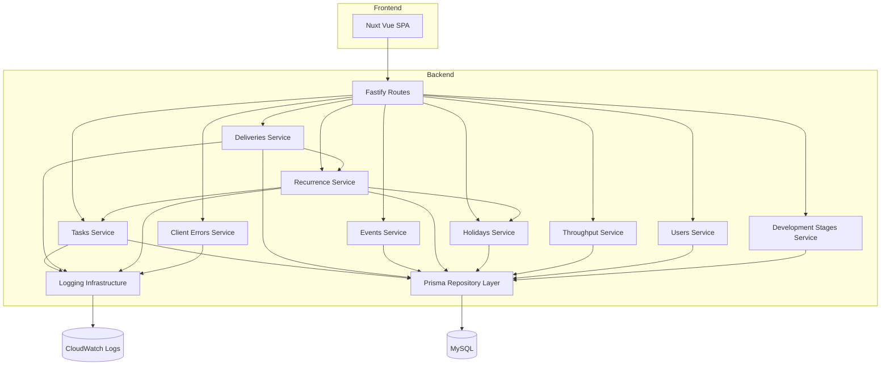
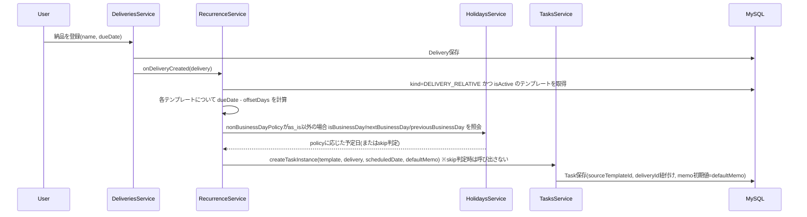
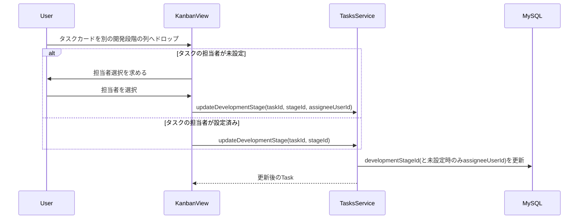
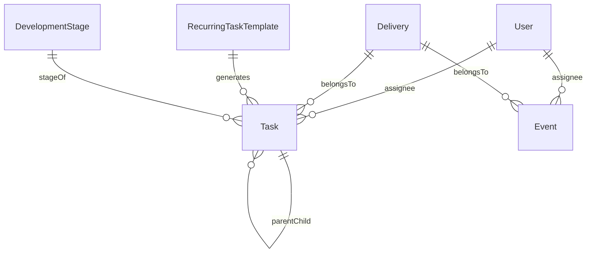

# Technical Design

## Overview

**Purpose**: 本フィーチャーは、JIRAの過剰な機能・重さを排し、納品期限を軸にタスク・イベント・繰り返しタスクを一元管理できる軽量なタスク管理システムを提供する。

**Users**: 個人開発者(将来的には小規模チーム)が、日々のタスク登録・優先度管理・納品進捗の把握・繰り返しタスクの自動生成・処理ペースの振り返りに利用する。

**Impact**: 現状ソースコードは存在せず、本設計により初めてフロントエンド/バックエンド/データベースの技術スタックとドメインモデルを確定する。

### Goals
- タスク・納品(デリバリー)・イベント・繰り返しタスクテンプレートの一元管理を実現する
- 複数の納品が並行して進行する状況を破綻なく扱える
- 固定間隔および納品連動という2種類の繰り返しタスク生成を型安全に実装する
- 期間ごとの消化タスク数の可視化と簡易な今後の目安表示を実現する
- 危険な納品・直近のイベントを横断的に把握できるダッシュボードと、ユーザー定義の開発段階に基づくカンバン管理を実現する

### Non-Goals
- タスクの重さ(見積もり工数)の自動算出(requirements.md Out of scope)
- 認証・認可の実装(ログイン、パスワード管理、権限モデル)
- JIRAとのデータ連携・移行
- リマインダー・通知機能
- 繰り返しタスク生成処理を「いつ」呼び出すか(cron/EventBridge等のスケジューラ基盤)の選定。生成ロジック自体はトリガー非依存で設計し、起動方式はインフラ検討事項として別途扱う

## Boundary Commitments

### This Spec Owns
- タスク・タスク階層(親子関係)・タスク分割・優先度・状態・メモのデータと業務ルール
- 納品(デリバリー)のデータ、必須タスクフラグ、進捗算出ロジック
- 非タスクイベントのデータと表示区分
- 繰り返しタスクテンプレート(固定間隔・納品連動)の定義と、テンプレートからのタスクインスタンス生成ロジック
- 非営業日マスタ(手動登録・手動トリガーによる外部祝日API取得)の管理と、繰り返しタスク生成時の非営業日ポリシー(そのまま登録/登録しない/次営業日/前営業日)判定
- 期間ごとの消化タスク数の集計ロジックと簡易フォーキャスト算出
- APIアクセスログ・業務イベントログ・サーバーエラーログ・フロントエンドエラーログの構造化出力とリクエストID相関
- 担当ユーザー(名前のみの軽量レコード)の管理とタスク・イベントへの割り当て・絞り込み
- 開発段階マスタ(名称・並び順のユーザー定義)の管理と、タスクへの開発段階の任意紐付け・カンバン形式での表示/移動
- 危険な納品・直近イベントを横断表示するダッシュボード(既存の納品進捗・イベント一覧ロジックの表示側集約のみ)

### Out of Boundary
- ユーザー認証・ログインセッション管理(将来別スペックで扱う)
- 通知・リマインダー配信基盤
- JIRA等外部システムとの連携・データ移行
- 祝日情報の定期的な自動ポーリング・スケジュール同期(取得は常にユーザーの手動トリガー)
- 専用のログ集約・可視化基盤(ELK、Datadog等)の構築。本スペックはCloudWatch Logsへの出力までを対象とする
- ログの長期保管ポリシー・監査要件対応
- 繰り返しタスク生成のスケジューリング実行基盤(cron/EventBridge等のインフラ選定)
- AWSへのデプロイ構成そのもの(steering `tech.md` の段階的インフラ計画に従う。本スペックはアプリケーションが将来その計画に乗ることを前提にするのみ)
- 開発段階マスタの見た目カスタマイズ(色・アイコン等)。名称と並び順のみを対象とする
- 「今このブラウザを使っているのは誰か」を推測・記憶する仕組み(認証なしのため、担当者はカード移動の都度明示的に選択する)

### Allowed Dependencies
- steering `tech.md` に記載の段階的AWSデプロイ方針(S3/CloudFront、App Runner、将来のRDS/ECS Fargate)
- MySQL(ローカル開発時はDocker、本番は将来RDSへ移行する前提のスキーマ設計とする)
- 日本の祝日を提供する外部API(手動同期トリガー時のみ呼び出す、具体候補はresearch.md参照)
- App Runnerが標準で提供するCloudWatch Logsへのstdout/stderr転送(追加のログ収集エージェントは導入しない)
- ローカル開発用のDocker Compose環境(backend/frontend/mysqlの3コンテナ)。本番のコンテナ/インフラ構成そのものはOut of Boundaryのまま
- カンバンのカード移動UI: 既定はブラウザ標準のHTML5 Drag and Dropイベント。ただし実装時のUI/UX判断により、軽量なドラッグ&ドロップライブラリ(例: `vue-draggable-plus`)を採用してもよい(判断基準はresearch.md参照)

### Revalidation Triggers
- `Task` / `Delivery` / `RecurringTaskTemplate` のデータ契約(フィールド追加・削除・意味変更)
- 繰り返しタスク生成ロジックのトリガー方式が確定した場合(呼び出し契約が固まるため)
- 認証機能を別スペックで追加する場合(`User` の扱いが「担当者選択リスト」から「ログイン主体」へ変わるため。あわせてカンバンの担当者選択UXも自動アサインへ見直す余地が生まれる)
- 開発段階マスタに名称・並び順以外の属性(色・アイコン等)を追加する場合

## Architecture

### Architecture Pattern & Boundary Map

**Architecture Integration**:
- Selected pattern: レイヤードアーキテクチャ(Controller → Service → Repository)。個人開発規模でテスタビリティと型安全性を両立できるため採用(`research.md` Architecture Pattern Evaluation参照)
- Domain/feature boundaries: バックエンドを `tasks` / `deliveries` / `events` / `recurrence` / `holidays` / `throughput` / `users` / `development-stages` の8モジュールに分割し、モジュール間は各モジュールが公開する Service インターフェース経由でのみ連携する
- Existing patterns preserved: `development-stages` は `holidays` と同じ「ユーザー定義マスタ + カンバン列の並び順」パターンに従う。マスタ削除時に参照側(`Task.developmentStageId`)をnullへ更新する処理は、`deliveries`削除時の`Task.deliveryId`null更新と同じ実装パターン(Data Models「Consistency & Integrity」参照)
- New components rationale: 各モジュールは要件の1〜複数のRequirementに対応する独立した責務境界を持つ(下表参照)。非営業日マスタは複数機能から参照されうる横断的なマスタデータであるため、`recurrence` から独立した `holidays` モジュールとして切り出す。開発段階マスタも同様の理由で `tasks` から独立した `development-stages` モジュールとして切り出す(タスクへの紐付けは`tasks`モジュールが`Task.developmentStageId`として保持する)
- Steering compliance: tech.md の段階的AWSデプロイ方針(フロント/バックエンド分離)に沿い、フロントエンドを静的SPA、バックエンドをAPIサーバーとして分離する



### Technology Stack

| Layer | Choice / Version | Role in Feature | Notes |
|-------|------------------|-----------------|-------|
| Frontend | Nuxt 4.x(Vue 3) + TypeScript | タスク一覧・納品進捗・イベント表示・繰り返し設定UI等のSPA | `nuxi generate` による静的ビルドで steering の S3+CloudFront 配信方針に適合。SSRは利用しない(SPA/静的生成モード) |
| Backend | Node.js 24(Active LTS) + TypeScript + Fastify | REST API、業務ロジック、繰り返しタスク生成 | Node 20は2026年時点でEOL済みのためNode 24を採用。Fastify選定理由は`research.md`参照 |
| Data / Storage | MySQL 8.x + Prisma ORM | タスク・納品・イベント・テンプレート・ユーザー・非営業日の永続化 | phase 1はローカル/コンテナMySQL、将来RDS(またはAurora MySQL互換)へ移行(steering方針)。実務での再利用性を優先しPostgreSQLから変更(research.md参照) |
| Validation | Zod | API入出力のスキーマ検証 | Fastifyと親和性が高い(research.md参照) |
| Recurrence Library | rrule 2.x | 固定間隔(毎日/毎週/毎月)の繰り返し日程計算 | build-vs-adopt: adopt(research.md参照) |
| Logging | Pino(Fastify標準統合) + pino-pretty(開発時) | APIアクセスログ・業務イベントログ・エラーログの構造化出力 | 本番はJSONのままstdoutへ出力しApp Runner経由でCloudWatch Logsへ転送 |
| Local Dev Runtime | Docker Compose(backend/frontend/mysqlの3サービス) | ホストのNode.jsバージョンに依存せずNode 24環境を再現し、開発者間・将来のWSL移行後でも同一の起動手順を保証する | backend/frontendはマルチステージDockerfile(dev: bind mount + ホットリロード、prod: 将来のApp Runnerイメージデプロイ/静的ビルド用)を持つ。詳細はFile Structure Plan参照 |
| Kanban Drag & Drop | 既定: ブラウザ標準HTML5 Drag and Drop API / 条件付き: 軽量ライブラリ(例: `vue-draggable-plus`) | カンバンのカード列間移動UI | build-vs-adopt: 既定はbuild(標準イベントで開始)。実装時に見た目・操作性(ドラッグ中のプレビュー表示、タッチデバイス対応等)がUXの障害になると判断した場合は、軽量ライブラリの導入に切り替えてよい(判断基準・比較はresearch.md参照。採用した場合はtasks.md Implementation Notesに理由を記録する) |

## File Structure Plan

### Directory Structure
```
docker-compose.yml               # backend/frontend/mysqlの3サービスを定義するローカル開発環境
backend/
├── Dockerfile                    # マルチステージ(dev: bind mount + ホットリロード、prod: 将来のApp Runnerイメージ用ビルド)
├── src/
│   ├── modules/
│   │   ├── tasks/              # タスク登録・一覧・階層・分割・状態・優先度・メモ・開発段階紐付け (Req 1, 2, 12)
│   │   │   ├── task.types.ts   # Task/TaskStatus/Priority 型定義(developmentStageIdを含む)
│   │   │   ├── task.repository.ts
│   │   │   ├── task.service.ts # updateDevelopmentStage(Req 12)を含む
│   │   │   └── task.routes.ts
│   │   ├── deliveries/         # 納品登録・必須フラグ・進捗算出・並行管理 (Req 3、同パターン)
│   │   ├── events/              # 非タスクイベント (Req 4、同パターン)
│   │   ├── recurrence/          # 繰り返しテンプレート・インスタンス生成 (Req 5)
│   │   │   ├── recurrence.types.ts
│   │   │   ├── recurrence.repository.ts
│   │   │   ├── recurrence.service.ts   # rrule利用/オフセット計算/繰り越し判定の呼び出しをここに集約
│   │   │   └── recurrence.routes.ts
│   │   ├── holidays/             # 非営業日マスタ・営業日判定 (Req 8)
│   │   │   ├── holiday.types.ts
│   │   │   ├── holiday.repository.ts
│   │   │   ├── holiday.service.ts    # isBusinessDay/nextBusinessDay 判定ロジック
│   │   │   └── holiday.routes.ts
│   │   ├── throughput/          # 期間消化数集計・移動平均フォーキャスト (Req 6、同パターン)
│   │   ├── users/               # 担当ユーザー登録・絞り込み (Req 7、同パターン)
│   │   ├── development-stages/  # 開発段階マスタ・並び順管理 (Req 12、holidaysと同パターン)
│   │   │   ├── development-stage.types.ts
│   │   │   ├── development-stage.repository.ts # delete時にTask.developmentStageIdをnull更新(deliveries.repositoryと同パターン)
│   │   │   ├── development-stage.service.ts
│   │   │   └── development-stage.routes.ts
│   │   └── client-errors/       # フロントエンドエラーの受信・記録 (Req 10)
│   │       ├── client-error.types.ts
│   │       ├── client-error.service.ts
│   │       └── client-error.routes.ts
│   ├── shared/
│   │   ├── result.ts              # Result<T, E>型など共通型(モジュール間で重複させない)
│   │   ├── soft-delete.repository.ts  # created_at/updated_at自動更新、deleted_at論理削除・既定フィルタの共通実装 (Req 9)
│   │   └── logger.ts              # Pinoインスタンス生成、requestId連携、業務イベントログ用ヘルパー関数 (Req 10)
│   ├── prisma/
│   │   └── schema.prisma         # 全ドメインのデータモデル定義
│   └── app.ts                    # Fastifyインスタンス生成・ルート登録・グローバルエラーハンドラ登録(Req 10)
frontend/
├── Dockerfile                    # マルチステージ(dev: Nuxt devサーバー + ホットリロード、prod: `nuxi generate`の静的ビルドのみ、常駐コンテナは持たない)
├── pages/
│   ├── index.vue                 # 状況把握用ダッシュボード(危険な納品・直近イベント) (Req 11)
│   ├── tasks/                    # タスク一覧・階層表示・分割UI (Req 1, 2)
│   ├── deliveries/               # 納品ボード・進捗表示・並行絞り込み (Req 3)
│   ├── events/                   # タスク・イベント統合タイムライン (Req 4)
│   ├── recurrence/               # 繰り返しテンプレート設定フォーム・非営業日マスタ管理 (Req 5, 8)
│   ├── throughput/               # 消化数ダッシュボード (Req 6)
│   ├── users/                    # 担当者フィルタ (Req 7)
│   └── kanban/                   # 開発段階カンバン・開発段階マスタ管理 (Req 12)
├── components/
│   └── (各pagesに対応する表示コンポーネント群。ドメインごとにサブディレクトリを切る)
├── composables/
│   └── useApiClient.ts           # バックエンドAPIクライアント(型はbackendのZodスキーマから共有)
├── plugins/
│   └── error-reporter.client.ts  # Vueのグローバルエラーハンドラ・window.onerrorを捕捉し/api/client-errorsへ送信 (Req 10)
└── nuxt.config.ts                # ssr: false による静的SPAビルド設定
```

> `deliveries` / `events` / `throughput` / `users` / `development-stages` は `tasks` と同じ repository → service → routes のパターンに従うため、非自明なファイルのみ個別記載する。フロントエンドは Nuxt の規約に従い、`pages/` がファイルベースルーティングを兼ねる。
> `docker-compose.yml` はホストのNode.jsバージョンに依存せず開発環境を再現するために導入する(research.md参照)。相対パスのみで構成し、リポジトリを別ホスト(例: WSL)へ移動しても同じ起動手順で動作する。

### Modified Files
- `backend/src/prisma/schema.prisma` — `DevelopmentStage`モデル追加、`Task.developmentStageId`(任意・null許容FK)追加
- `backend/src/modules/tasks/task.types.ts` / `task.repository.ts` / `task.service.ts` / `task.routes.ts` — `developmentStageId`フィールドと`updateDevelopmentStage`操作の追加
- `backend/src/app.ts` — `developmentStageRoutes`の登録追加
- `frontend/pages/index.vue` — 現行のリダイレクトのみの実装をダッシュボード表示に置き換え
- `frontend/composables/useApiClient.ts` — `DevelopmentStage`型・関連API呼び出し・`Task.developmentStageId`・`updateTaskDevelopmentStage`の追加
- `frontend/app.vue` — ナビゲーションへの「ダッシュボード」「カンバン」リンク追加

## System Flows

### 繰り返しタスクインスタンス生成(納品連動)



- 納品日変更時は同じ `RecurrenceService` が対象納品に紐づく未完了の自動生成タスクの予定日を再計算する(要件5.4)。完了済みタスクは再計算対象から除外する。
- テンプレートが `isActive=false` の場合、以降の生成をスキップする(要件5.6)。
- テンプレートの `defaultMemo`(共通の既定メモ)は生成時にのみタスクインスタンスへコピーされる。生成後の各インスタンスのメモ編集は独立しており、テンプレートや他インスタンスに影響しない(要件5.7〜5.9)。
- `nonBusinessDayPolicy` が `as_is` のテンプレートは `HolidaysService` を呼び出さず、算出日をそのまま予定日とする(要件8.7)。`next_business_day`/`previous_business_day` は該当日をずらして生成し(要件8.4, 8.5)、`skip` は当該回のタスクインスタンスを生成しない(要件8.6)。
- 非営業日マスタは、ユーザーが「祝日を取得」操作を行った時のみ `HolidaysService.syncFromExternalApi` 経由で外部祝日APIから更新される(要件8.8, 8.9)。定期ポーリングは行わない。

### 期間ごとの消化タスク数とフォーキャスト

- `ThroughputService.getSummary(periodType, rangeCount)` が対象期間ごとに `Task.completedAt` を集計する。
- 直近4期間の平均を「今後の目安」として返すが、有効な過去期間が2未満の場合は目安を `null` にし、フロントは「実績データ不足」を表示する(`research.md` Design Decisions参照)。

### カンバンでのカード移動と担当者設定



- 担当者が既に設定されているタスクの移動では`assigneeUserId`をリクエストに含めない(要件12.8)。サーバー側は、リクエストに`assigneeUserId`が含まれていても現在の担当者が非nullであれば無視し、既存の担当者を保持する(クライアント側のUXだけに頼らずサーバー側でも業務ルールを担保する)。
- 開発段階マスタから使用中の段階を削除した場合、当該段階が設定されていた全タスクの`developmentStageId`が`null`に更新される(要件12.5、`deliveries`削除時の`Task.deliveryId`null更新と同じ実装パターン)。

## Requirements Traceability

| Requirement | Summary | Components | Interfaces | Flows |
|-------------|---------|------------|------------|-------|
| 1.1, 1.2, 1.3, 1.4, 1.5, 1.6 | タスク登録・一覧・状態・優先度・メモ | Tasks Service | TaskService.create/update/list | - |
| 2.1, 2.2, 2.3, 2.4 | タスク階層化・分割 | Tasks Service | TaskService.addChild/splitTask | - |
| 3.1, 3.2, 3.3, 3.4, 3.5, 3.6, 3.7 | 納品管理・必須判定・並行進行 | Deliveries Service | DeliveryService.create/getProgress/list | 繰り返しタスク生成(納品連動) |
| 4.1, 4.2, 4.3 | 非タスクイベント | Events Service | EventService.create/list | - |
| 5.1, 5.2, 5.3, 5.4, 5.5, 5.6, 5.7, 5.8, 5.9 | 繰り返しタスク(固定間隔・納品連動・共通/個別メモ分離) | Recurrence Service, Tasks Service | RecurrenceService.registerTemplate/generateDueInstances | 繰り返しタスクインスタンス生成 |
| 6.1, 6.2, 6.3, 6.4 | 期間消化数の可視化・目安 | Throughput Service | ThroughputService.getSummary | 期間ごとの消化タスク数とフォーキャスト |
| 7.1, 7.2, 7.3 | 担当ユーザー割り当て・絞り込み | Users Service, Tasks Service, Events Service | UserService.list, TaskService.list(filter), EventService.list(filter) | - |
| 8.1, 8.2, 8.3, 8.4, 8.5, 8.6, 8.7, 8.8, 8.9 | 非営業日マスタ・外部祝日API手動取得・繰り越しポリシー | Holidays Service, Recurrence Service | HolidaysService.register/syncFromExternalApi/isBusinessDay/nextBusinessDay/previousBusinessDay | 繰り返しタスクインスタンス生成 |
| 9.1, 9.2, 9.3, 9.4, 9.5 | 作成日時・更新日時の記録と論理削除 | 全Backendサービス共通(Repository層) | 各Service.delete、共有Repositoryの作成/更新/論理削除規約 | - |
| 10.1, 10.2, 10.3, 10.4, 10.5, 10.6 | ログ計測(アクセス・業務イベント・エラー・フロントエンド) | Logging Infrastructure(共通)、Client Errors Service | logger.ts共通ヘルパー、ClientErrorsService.report | - |
| 11.1, 11.2, 11.3, 11.4, 11.5, 11.6 | ダッシュボードによる状況の一元把握 | Frontend(DashboardView)、Deliveries Service、Events Service | DeliveryService.list/getProgress、EventService.list | - |
| 12.1, 12.2, 12.3, 12.4, 12.5, 12.6, 12.7, 12.8, 12.9 | 開発段階マスタとカンバン管理 | Development Stages Service, Tasks Service | DevelopmentStagesService.list/create/rename/reorder/delete、TasksService.updateDevelopmentStage | カンバンでのカード移動と担当者設定 |

## Components and Interfaces

| Component | Domain/Layer | Intent | Req Coverage | Key Dependencies (P0/P1) | Contracts |
|-----------|--------------|--------|--------------|--------------------------|-----------|
| TasksService | Backend/tasks | タスクのCRUD・階層・分割・状態遷移を担う | 1, 2, 7 | Repository(P0) | Service |
| DeliveriesService | Backend/deliveries | 納品CRUD・必須タスク進捗算出・並行管理 | 3 | Repository(P0), RecurrenceService(P1) | Service |
| EventsService | Backend/events | 非タスクイベントのCRUD | 4, 7 | Repository(P0) | Service |
| RecurrenceService | Backend/recurrence | テンプレート管理・インスタンス生成ロジック | 5 | Repository(P0), TasksService(P0), HolidaysService(P1), rrule(External, P1) | Service, Batch |
| HolidaysService | Backend/holidays | 非営業日マスタの管理と営業日判定 | 8 | Repository(P0) | Service |
| ThroughputService | Backend/throughput | 期間別消化数集計・移動平均フォーキャスト | 6 | Repository(P0) | Service |
| UsersService | Backend/users | 担当ユーザーの登録・一覧 | 7 | Repository(P0) | Service |
| DevelopmentStagesService | Backend/development-stages | 開発段階マスタ(名称・並び順)の登録・編集・並び替え・削除 | 12 | Repository(P0) | Service, API |
| Logging Infrastructure | Backend/shared | Pinoロガーの共通設定、requestId相関、業務イベントログ用ヘルパー | 10 | Fastify(P0), Pino(External, P0) | - |
| ClientErrorsService | Backend/client-errors | フロントエンドの未捕捉エラーを受信しバックエンドログへ記録 | 10 | Repository(P1, 任意保存), Logging Infrastructure(P0) | Service, API |
| TaskListView 他フロントエンドコンポーネント群 | Frontend/features | 各ドメインの一覧・フォームUI | 1, 2, 3, 4, 5, 6, 7 | api/client(P0) | - |
| DashboardView | Frontend/dashboard | 危険な納品・直近イベントの横断表示、詳細画面へのドリルダウン | 11 | api/client(P0) | - |
| KanbanView | Frontend/kanban | 開発段階マスタ管理UIと、開発段階ごとのカンバン列表示・カード移動 | 12 | api/client(P0) | - |
| error-reporter.client プラグイン | Frontend/plugins | 未捕捉JSエラーの捕捉とバックエンドへの送信 | 10 | api/client(P0) | - |

> フロントエンドコンポーネントは新規の永続化・外部連携責務を持たない表示層のため、個別の詳細ブロックは省略し summary行のみとする(Implementation Note: 各featureディレクトリはAPIクライアントの型をそのまま利用し、独自の状態管理ライブラリは追加しない)。

### Backend/tasks

#### TasksService

| Field | Detail |
|-------|--------|
| Intent | タスクの登録・一覧・状態遷移・階層化・分割・開発段階紐付けを担う |
| Requirements | 1.1, 1.2, 1.3, 1.4, 1.5, 1.6, 2.1, 2.2, 2.3, 2.4, 7.1, 7.2, 12.3, 12.6, 12.7, 12.8, 12.9 |

**Responsibilities & Constraints**
- タスクの作成・更新・一覧取得、および親子関係(多階層)の整合性維持
- 分割操作は「元タスクを親化し、分割後のタスクを子タスクとして生成する」処理として実装する(research.md Design Decisions参照)
- 親タスクに未完了の子タスクが存在する場合、親タスクの完了操作を拒否し理由を返す
- タスクへの開発段階(`developmentStageId`)の紐付けは、タスクの状態(`status`)とは独立して変更できる(要件12.9)。担当者が未設定のタスクへ開発段階を設定する操作では、同一リクエストで担当者を設定できる(要件12.7)。担当者が既に設定されている場合、このリクエストの`assigneeUserId`は無視する(要件12.8)

**Dependencies**
- Inbound: Fastify Routes — HTTPリクエストの委譲(P0)
- Outbound: Repository(Prisma) — 永続化(P0)
- Outbound: RecurrenceService — 自動生成タスクインスタンスの作成先として呼び出される(P0、呼び出し方向はRecurrence→Tasksの一方向)
- Inbound: DevelopmentStagesService — マスタ削除時に`Task.developmentStageId`をnull更新するために自身のRepositoryから直接参照される(P1、`deliveries`削除時の`Task.deliveryId`null更新と同じパターン)

**Contracts**: Service [x] / API [x] / Event [ ] / Batch [ ] / State [x]

##### Service Interface
```typescript
type TaskStatus = "not_started" | "in_progress" | "done" | "on_hold";
type Priority = "high" | "medium" | "low";

interface CreateTaskInput {
  title: string;
  priority: Priority;
  memo?: string;
  deliveryId?: string;
  isRequiredForDelivery?: boolean;
  assigneeUserId?: string;
  parentTaskId?: string;
}

type TaskError =
  | { type: "not_found"; taskId: string }
  | { type: "incomplete_children"; taskId: string }
  | { type: "validation_error"; message: string };

interface TasksService {
  create(input: CreateTaskInput): Promise<Result<Task, TaskError>>;
  updateStatus(taskId: string, status: TaskStatus): Promise<Result<Task, TaskError>>;
  addChild(parentTaskId: string, input: CreateTaskInput): Promise<Result<Task, TaskError>>;
  splitTask(taskId: string, parts: CreateTaskInput[]): Promise<Result<Task[], TaskError>>;
  updateDevelopmentStage(
    taskId: string,
    developmentStageId: string | null,
    assigneeUserId?: string,
  ): Promise<Result<Task, TaskError>>;
  delete(taskId: string): Promise<Result<void, TaskError>>;
  list(filter: { deliveryId?: string; assigneeUserId?: string }): Promise<Task[]>;
}
```
- Preconditions: `splitTask` は `parts.length >= 2` を要求する
- Postconditions: `splitTask` 実行後、元タスクは `parentTaskId=null` のまま親として残り、`parts` は元タスクを親とする子タスクとして作成される。`delete` 実行後、対象タスクの `deletedAt` が設定され、以後の `list` から除外される(要件9.3, 9.4)。`updateDevelopmentStage` 実行後、`developmentStageId` は常に更新され、`assigneeUserId` は実行前の値が `null` の場合のみ引数の値で更新される(要件12.6〜12.8)。`update`(タイトル・優先度・メモ・納品・必須フラグ・担当者の汎用編集)実行後、`assigneeUserId` は渡された値で常に上書きされる(`updateDevelopmentStage`のカンバン移動時ルールとは異なり、明示的な編集操作のため既存の担当者有無を問わない)。`deliveryId`を`null`に更新した場合、`isRequiredForDelivery`は常に`false`に固定される(作成時と同じルール)
- Invariants: `parentTaskId` は循環参照を持たない

##### API Contract
| Method | Endpoint | Request | Response | Errors |
|--------|----------|---------|----------|--------|
| POST | /api/tasks | CreateTaskInput | Task | 400, 500 |
| GET | /api/tasks/:id | - | Task | 404 |
| PATCH | /api/tasks/:id | UpdateTaskInput(全フィールド省略可) | Task | 400, 404 |
| PATCH | /api/tasks/:id/status | { status: TaskStatus } | Task | 400, 404, 409 |
| POST | /api/tasks/:id/children | CreateTaskInput | Task | 400, 404 |
| POST | /api/tasks/:id/split | { parts: CreateTaskInput[] } | Task[] | 400, 404 |
| PATCH | /api/tasks/:id/development-stage | { developmentStageId: string \| null, assigneeUserId?: string } | Task | 400, 404 |
| DELETE | /api/tasks/:id | - | void | 404 |
| GET | /api/tasks | Query: deliveryId?, assigneeUserId? | Task[] | 500 |

**Implementation Notes**
- Integration: RecurrenceServiceは`TasksService.create`(Service層の関数)を直接呼び出してタスクインスタンスを生成する(公開APIは経由しないが、Repository層への直接アクセスもしない — モジュール間はService層経由でのみ連携するという一般原則に従う。**(実装後の改訂)** 当初`recurrence.repository.ts`が`taskRepository.create`(Repository層)を直接呼び出す実装になっていたが、ドキュメント整理時の監査で発見し、`TasksService.create`を呼ぶよう修正した。将来`TasksService.create`にバリデーション等の業務ルールが追加された際、繰り返し生成タスクだけそれを迂回してしまうリスクを防ぐため)
- Validation: Zodスキーマで`CreateTaskInput`を検証し、`deliveryId`未指定時は`isRequiredForDelivery`を`false`固定にする
- `UpdateTaskInput`は`{ title?, priority?, memo?: string | null, deliveryId?: string | null, isRequiredForDelivery?: boolean, assigneeUserId?: string | null }`。少なくとも1フィールドの指定を必須とする。カンバン画面の「タスク詳細/編集」導線(GET /api/tasks/:idで詳細取得後、フォーム編集→PATCH /api/tasks/:id)から利用する
- Risks: 多階層の深い入れ子は一覧描画コストに影響し得るため、フロントは遅延展開(折りたたみ)を前提に設計する

### Backend/deliveries

#### DeliveriesService

| Field | Detail |
|-------|--------|
| Intent | 納品の登録・必須タスク進捗算出・複数納品の並行管理 |
| Requirements | 3.1, 3.2, 3.3, 3.4, 3.5, 3.6, 3.7 |

**Responsibilities & Constraints**
- 納品(`name`, `dueDate`)を保持し、複数納品が同時に存在できる状態を許容する(一意な進行制約を設けない)
- 必須タスクの完了数・未完了数から進捗率を算出する
- 納品日変更時に `RecurrenceService` へ再計算を依頼する

**Dependencies**
- Inbound: Fastify Routes(P0)
- Outbound: Repository(P0)
- Outbound: RecurrenceService — 納品作成/更新イベントの通知先(P1)

**Contracts**: Service [x] / API [x] / Event [ ] / Batch [ ] / State [ ]

##### Service Interface
```typescript
interface DeliveryProgress {
  requiredTotal: number;
  requiredCompleted: number;
  requiredIncomplete: number;
  isOverdueWithIncomplete: boolean;
}

interface DeliveriesService {
  create(input: { name: string; dueDate: Date }): Promise<Delivery>;
  updateDueDate(deliveryId: string, dueDate: Date): Promise<Delivery>;
  getProgress(deliveryId: string): Promise<DeliveryProgress>;
  delete(deliveryId: string): Promise<void>;
  list(): Promise<Delivery[]>;
}
```
- Preconditions: `dueDate` は登録・更新時ともに有効な日付であること
- Postconditions: `updateDueDate` 実行後、紐づく未完了の自動生成タスクの予定日が再計算される。`delete` 実行後、対象納品の `deletedAt` が設定され、以後の `list` から除外される(要件9.3, 9.4)。紐づく Task/Event はレコード自体を保持したまま `deliveryId` が `null` に更新される(カスケード削除はしない。Data Models「Consistency & Integrity」参照)
- Invariants: `getProgress` は必須フラグが付いたタスクのみを分母・分子に用いる

##### API Contract
| Method | Endpoint | Request | Response | Errors |
|--------|----------|---------|----------|--------|
| POST | /api/deliveries | { name, dueDate } | Delivery | 400 |
| PATCH | /api/deliveries/:id | { dueDate } | Delivery | 400, 404 |
| GET | /api/deliveries/:id/progress | - | DeliveryProgress | 404 |
| DELETE | /api/deliveries/:id | - | void | 404 |
| GET | /api/deliveries | - | Delivery[] | 500 |

**Implementation Notes**
- Integration: 進捗算出はDB集計クエリで行い、アプリ側での全件ロードを避ける
- Validation: `dueDate` は過去日でも登録可能とする(既に過ぎた納品の記録用途を許容)
- Risks: 納品数が多くなった場合の一覧パフォーマンスは将来のページネーション導入で対応(現行スコープでは未実施)

### Backend/recurrence

#### RecurrenceService

| Field | Detail |
|-------|--------|
| Intent | 固定間隔・納品連動の繰り返しテンプレート管理とタスクインスタンス生成 |
| Requirements | 5.1, 5.2, 5.3, 5.4, 5.5, 5.6, 5.7, 5.8, 5.9, 8.3, 8.4, 8.5, 8.6, 8.7, 9.3, 9.4 |

**Responsibilities & Constraints**
- `kind: "fixed_interval" | "delivery_relative"` の2種のテンプレートを管理する
- fixed_intervalは`rrule`で次回発生日を計算し、任意で特定の納品に紐付けて納品日到達時に生成を打ち切れる
- delivery_relativeはグローバル設定であり、`onDeliveryCreated`/`onDeliveryDueDateChanged`フックから呼び出される
- テンプレート停止後は新規インスタンスを生成しない。既存インスタンスの状態には影響しない
- テンプレートの`defaultMemo`を生成時にタスクインスタンスの初期メモとしてコピーする(コピー後はインスタンス側で独立して編集可能)
- 算出した予定日が非営業日マスタに該当する場合、テンプレートの`nonBusinessDayPolicy`(そのまま登録/登録しない/次営業日/前営業日)に従って予定日を決定するか、生成自体をスキップする

**Dependencies**
- Inbound: DeliveriesService(納品作成/更新通知)(P0)
- Outbound: TasksService — インスタンスとしてのタスク生成(P0)
- Outbound: HolidaysService — 非営業日判定・前後の営業日算出(P1、`nonBusinessDayPolicy`が`as_is`以外のテンプレートで使用)
- External: rrule — 固定間隔の日程計算(P1)

**Contracts**: Service [x] / API [x] / Event [ ] / Batch [x] / State [x]

##### Service Interface
```typescript
type RecurrenceKind = "fixed_interval" | "delivery_relative";
type IntervalUnit = "day" | "week" | "month";
type NonBusinessDayPolicy = "as_is" | "skip" | "next_business_day" | "previous_business_day";

interface RecurringTaskTemplate {
  id: string;
  title: string;
  priority: Priority;
  kind: RecurrenceKind;
  intervalUnit?: IntervalUnit;
  intervalValue?: number;
  boundDeliveryId?: string;
  deliveryOffsetDays?: number;
  defaultMemo?: string;
  nonBusinessDayPolicy: NonBusinessDayPolicy;
  isActive: boolean;
}

interface RecurrenceService {
  registerTemplate(input: Omit<RecurringTaskTemplate, "id" | "isActive">): Promise<RecurringTaskTemplate>;
  stopTemplate(templateId: string): Promise<void>;
  deleteTemplate(templateId: string): Promise<void>;
  generateDueInstances(asOf: Date): Promise<Task[]>;
  onDeliveryCreated(delivery: Delivery): Promise<Task[]>;
  onDeliveryDueDateChanged(delivery: Delivery): Promise<Task[]>;
}
```
- `stopTemplate` は `isActive=false` にして新規生成を止める業務操作、`deleteTemplate` は `deletedAt` を設定してテンプレート自体を一覧から除外する論理削除操作であり、意味が異なる(要件9.3, 9.4)。生成済みのTaskインスタンスはどちらの操作でも変更されない。
- Preconditions: `kind="fixed_interval"` は `intervalUnit`/`intervalValue` 必須、`kind="delivery_relative"` は `deliveryOffsetDays` 必須、`nonBusinessDayPolicy`は4値のいずれか必須(既定値なし、テンプレート作成時に明示選択)
- Postconditions: `generateDueInstances` は冪等(同一`asOf`・同一テンプレートに対し重複インスタンスを作らない)。生成されたTaskの`memo`は`defaultMemo`の値で初期化される。`nonBusinessDayPolicy="skip"`かつ算出日が非営業日の場合、当該回のTaskは生成されない
- Invariants: `isActive=false` のテンプレートは`generateDueInstances`/`onDeliveryCreated`の対象外。`nonBusinessDayPolicy="as_is"`のテンプレートは`HolidaysService`を呼び出さない

##### API Contract
| Method | Endpoint | Request | Response | Errors |
|--------|----------|---------|----------|--------|
| POST | /api/recurring-templates | Omit<RecurringTaskTemplate, "id"\|"isActive"> | RecurringTaskTemplate | 400 |
| POST | /api/recurring-templates/:id/stop | - | void | 404 |
| DELETE | /api/recurring-templates/:id | - | void | 404 |
| POST | /api/recurring-templates/generate-due | { asOf?: string } | Task[] | 400 |

##### Batch / Job Contract
- Trigger: `generateDueInstances(asOf)` は将来的には外部スケジューラ(呼び出し方式は本スペックのOut of Boundary)から日次相当で呼び出される想定。スケジューラ未選定の開発段階でも検証できるよう、`POST /api/recurring-templates/generate-due`から同一ロジックを手動実行できるようにする(`asOf`省略時は現在時刻を用いる。holidaysモジュールの手動同期と同じ設計パターン)
- Input / validation: `asOf` は生成基準日時。過去日時での再実行は許容し冪等性で重複を防ぐ
- Output / destination: `TasksService` 経由で `Task` レコードを作成
- Idempotency & recovery: テンプレートIDと発生予定日の組でユニーク制約を設け、重複生成を防止する

**Implementation Notes**
- Integration: `onDeliveryCreated`/`onDeliveryDueDateChanged`はDeliveriesServiceから同期呼び出しされる(非同期メッセージングは導入しない、Simplification)。`nonBusinessDayPolicy`が`as_is`以外の場合のみHolidaysServiceを同期呼び出しする
- Validation: `deliveryOffsetDays`は0以上の整数のみ許可
- Risks: スケジューラ基盤未定のため、本番運用で自動生成が呼ばれない期間は固定間隔タスクが生成されない(research.md Risks参照)。開発・検証段階では`POST /api/recurring-templates/generate-due`による手動実行で代替できる
- `fixed_interval`テンプレートの起点日: `recurring_task_templates`に明示的な開始日カラムを設けないため、`rrule`の`dtstart`はテンプレートの`created_at`(日付部分、UTC基準)を起点とする。この起点日自体も`generateDueInstances`の対象に含む(inclusive)ため、テンプレート登録直後に`generateDueInstances`を実行すると登録日当日分のインスタンスが即時生成される

### Backend/holidays

#### HolidaysService

| Field | Detail |
|-------|--------|
| Intent | 非営業日(祝日・会社休業日)マスタの管理、外部祝日APIからの手動取得、営業日判定 |
| Requirements | 8.1, 8.2, 8.3, 8.4, 8.5, 8.6, 8.7, 8.8, 8.9 |

**Responsibilities & Constraints**
- 非営業日を`(date, label)`のマスタレコードとして保持する。ユーザーによる手動登録・削除に加え、ユーザーが明示的に操作した時のみ外部祝日APIから取得して反映する(要件8.8)
- 定期的な自動ポーリングは行わない。同期は常にユーザー操作起点の同期呼び出しとする(要件8.9)
- 指定日が非営業日マスタに該当するかを判定し、直後/直前の非営業日でない日を返す

**Dependencies**
- Inbound: RecurrenceService — 繰り越し判定時の照会(P1)
- Outbound: Repository(P0)
- External: 日本の祝日API(例: [Holidays JP API](https://holidays-jp.github.io/)、無料・認証不要のJSON API)— ユーザーの手動同期操作時のみ呼び出す(P2、詳細はresearch.md参照)

**Contracts**: Service [x] / API [x] / Event [ ] / Batch [ ] / State [ ]

##### Service Interface
```typescript
interface NonBusinessDay {
  id: string;
  date: string; // ISO 8601 date (YYYY-MM-DD)
  label?: string;
  source: "manual" | "external_api";
}

interface HolidaysService {
  register(input: { date: string; label?: string }): Promise<NonBusinessDay>;
  remove(id: string): Promise<void>;
  syncFromExternalApi(): Promise<{ added: NonBusinessDay[]; skippedExisting: number }>;
  isBusinessDay(date: string): Promise<boolean>;
  nextBusinessDay(date: string): Promise<string>;
  previousBusinessDay(date: string): Promise<string>;
  list(): Promise<NonBusinessDay[]>;
}
```
- Preconditions: `date`はISO 8601形式の妥当な日付であること
- Postconditions: `nextBusinessDay`/`previousBusinessDay`は、入力日が非営業日マスタに連続して該当する場合、該当しなくなるまで1日ずつ進める/遡ることで日付を返す。`syncFromExternalApi`は既存の`date`と重複するレコードをスキップする。`remove`実行後、対象レコードの`deletedAt`が設定され、以後の`list`・営業日判定から除外される(要件9.3, 9.4)
- Invariants: `deletedAt IS NULL`の範囲で同一`date`のレコードは重複登録できない

##### API Contract
| Method | Endpoint | Request | Response | Errors |
|--------|----------|---------|----------|--------|
| POST | /api/holidays | { date, label? } | NonBusinessDay | 400, 409 |
| DELETE | /api/holidays/:id | - | void | 404 |
| POST | /api/holidays/sync | - | { added: NonBusinessDay[]; skippedExisting: number } | 502(外部API障害時) |
| GET | /api/holidays | - | NonBusinessDay[] | 500 |

**Implementation Notes**
- Integration: RecurrenceServiceからはモジュール内関数呼び出しで参照される。`syncFromExternalApi`はフロントの「祝日を取得」ボタン等、ユーザー操作からのみ呼び出される
- Validation: `date`の一意制約はDB側のユニークインデックスで担保する
- Risks: 外部祝日APIの障害・仕様変更時は502を返し、既存マスタには影響させない(取得失敗時はマスタを変更しない)。更新頻度が低いため手動運用で許容する(research.md参照)

### Backend/throughput

#### ThroughputService

| Field | Detail |
|-------|--------|
| Intent | 期間ごとの消化タスク数集計と簡易フォーキャスト算出 |
| Requirements | 6.1, 6.2, 6.3, 6.4 |

**Responsibilities & Constraints**
- `Task.completedAt`を期間(週/月)単位に集計する
- 直近4期間の単純移動平均をフォーキャストとして返す。有効期間が2未満なら`forecast: null`

**Dependencies**
- Inbound: Fastify Routes(P0)
- Outbound: Repository(P0)

**Contracts**: Service [x] / API [x] / Event [ ] / Batch [ ] / State [ ]

##### Service Interface
```typescript
type PeriodType = "week" | "month";

interface ThroughputPeriod {
  periodStart: Date;
  periodEnd: Date;
  completedCount: number;
}

interface ThroughputSummary {
  periods: ThroughputPeriod[];
  forecastNextPeriodCount: number | null;
}

interface ThroughputService {
  getSummary(periodType: PeriodType, rangeCount: number): Promise<ThroughputSummary>;
}
```
- Preconditions: `rangeCount >= 1`
- Postconditions: `forecastNextPeriodCount`は`periods`が2件以上の場合のみ非null
- Invariants: `periods`は`periodStart`昇順

##### API Contract
| Method | Endpoint | Request | Response | Errors |
|--------|----------|---------|----------|--------|
| GET | /api/throughput | Query: periodType, rangeCount | ThroughputSummary | 400 |

**Implementation Notes**
- Integration: 期間境界(週開始曜日等)はUTC基準の月曜始まりで固定する(仕様の明確化)
- Validation: `periodType`は`week`/`month`のみ許可
- Risks: 移動平均は季節性を捉えないため、精度向上が必要になれば別途モデル変更を検討(research.md参照)

### Backend/events

#### EventsService

| Field | Detail |
|-------|--------|
| Intent | 非タスクイベントの登録・一覧 |
| Requirements | 4.1, 4.2, 4.3, 7.1, 7.2 |

**Responsibilities & Constraints**
- イベントは`title`と`occursAt`のみを必須属性とし、タスクのような状態フィールドを持たない

**Dependencies**
- Inbound: Fastify Routes(P0)
- Outbound: Repository(P0)

**Contracts**: Service [x] / API [x] / Event [ ] / Batch [ ] / State [ ]

##### Service Interface
```typescript
interface CreateEventInput {
  title: string;
  occursAt: Date;
  deliveryId?: string;
  assigneeUserId?: string;
}

interface EventsService {
  create(input: CreateEventInput): Promise<Event>;
  delete(eventId: string): Promise<void>;
  list(filter: { assigneeUserId?: string }): Promise<Event[]>;
}
```
- Postconditions: `delete` 実行後、対象イベントの `deletedAt` が設定され、以後の `list` から除外される(要件9.3, 9.4)

##### API Contract
| Method | Endpoint | Request | Response | Errors |
|--------|----------|---------|----------|--------|
| POST | /api/events | CreateEventInput | Event | 400 |
| DELETE | /api/events/:id | - | void | 404 |
| GET | /api/events | Query: assigneeUserId? | Event[] | 500 |

**Implementation Notes**
- Integration: フロントの統合タイムライン表示はTasksとEventsの2つのAPIレスポンスをクライアント側でマージする(バックエンドに統合エンドポイントは設けない、Simplification)
- Validation: `occursAt`は必須
- Risks: なし(単純CRUD)

### Backend/users

#### UsersService

| Field | Detail |
|-------|--------|
| Intent | 担当ユーザー(名前のみ)の登録・一覧提供 |
| Requirements | 7.1, 7.2, 7.3 |

**Responsibilities & Constraints**
- `User`は`name`のみを持つ軽量レコードであり、認証情報を一切持たない(Non-Goal/Out of Boundary参照)

**Dependencies**
- Outbound: Repository(P0)

**Contracts**: Service [x] / API [x] / Event [ ] / Batch [ ] / State [ ]

##### Service Interface
```typescript
interface UsersService {
  create(name: string): Promise<User>;
  delete(userId: string): Promise<void>;
  list(): Promise<User[]>;
}
```
- Postconditions: `delete` 実行後、対象ユーザーの `deletedAt` が設定され、以後の `list` から除外される。既存タスク・イベントの `assigneeUserId` 参照はそのまま残る(要件9.3, 9.4)

##### API Contract
| Method | Endpoint | Request | Response | Errors |
|--------|----------|---------|----------|--------|
| POST | /api/users | { name } | User | 400 |
| DELETE | /api/users/:id | - | void | 404 |
| GET | /api/users | - | User[] | 500 |

**Implementation Notes**
- Integration: TasksService/EventsServiceは`assigneeUserId`の参照整合性をDBの外部キー制約で担保する
- Validation: `name`は空文字不可
- Risks: なし

### Backend/development-stages

#### DevelopmentStagesService

| Field | Detail |
|-------|--------|
| Intent | 開発段階(名称・並び順)のユーザー定義マスタ管理 |
| Requirements | 12.1, 12.2, 12.4, 12.5 |

**Responsibilities & Constraints**
- 開発段階を`(name, order)`のマスタレコードとして保持する。値は固定enumではなくユーザーが自由に登録・編集・削除できる(要件12.1)
- `order`は並び替え専用の一括更新操作(`reorder`)でのみ変更する。個別レコード更新(`rename`)では`order`を変更しない
- マスタレコードを削除する際、当該段階が設定されている全タスクの`developmentStageId`を`null`に更新してから削除する(要件12.5)。削除自体は共有Repository層の論理削除規約に従う(要件9.3)

**Dependencies**
- Inbound: Fastify Routes(P0)
- Outbound: Repository(P0)
- Outbound: TasksService が所有する `tasks` テーブルへの直接更新(`delete`時のみ、P1。`deliveries`削除時の`Task.deliveryId`null更新と同じ実装パターンで、TasksServiceの公開APIは経由しない)

**Contracts**: Service [x] / API [x] / Event [ ] / Batch [ ] / State [ ]

##### Service Interface
```typescript
interface DevelopmentStage {
  id: string;
  name: string;
  order: number;
}

interface DevelopmentStagesService {
  create(name: string): Promise<DevelopmentStage>;
  rename(id: string, name: string): Promise<DevelopmentStage>;
  reorder(orderedIds: string[]): Promise<DevelopmentStage[]>;
  delete(id: string): Promise<void>;
  list(): Promise<DevelopmentStage[]>;
}
```
- Preconditions: `reorder`の`orderedIds`は、現存する(論理削除されていない)全開発段階のIDを過不足なく含むこと
- Postconditions: `reorder`実行後、各段階の`order`は`orderedIds`内の位置(0始まり)に更新される。`delete`実行後、対象段階の`deletedAt`が設定されて以後の`list`から除外され、当該段階が設定されていた全タスクの`developmentStageId`が`null`に更新される(要件12.5, 9.3, 9.4)
- Invariants: `list`は`order`昇順で返す

##### API Contract
| Method | Endpoint | Request | Response | Errors |
|--------|----------|---------|----------|--------|
| POST | /api/development-stages | { name } | DevelopmentStage | 400 |
| PATCH | /api/development-stages/:id | { name } | DevelopmentStage | 400, 404 |
| POST | /api/development-stages/reorder | { orderedIds: string[] } | DevelopmentStage[] | 400 |
| DELETE | /api/development-stages/:id | - | void | 404 |
| GET | /api/development-stages | - | DevelopmentStage[] | 500 |

**Implementation Notes**
- Integration: `delete`は「対象タスクのdevelopmentStageIdをnull更新」→「段階レコードを論理削除」をひとつのトランザクションで行う(`deliveries.repository.ts`の`delete`と同じ実装パターン)
- Validation: `name`は空文字不可。`reorder`の`orderedIds`が現存レコードと過不足なく一致するかはサービス層で検証する
- Risks: なし(単純なマスタCRUD + 一括並び替え)

### Backend/shared(Logging Infrastructure)

#### Logging Infrastructure

| Field | Detail |
|-------|--------|
| Intent | Pinoベースの構造化ログ出力を全モジュール共通で提供し、リクエストID相関とログレベル制御を行う |
| Requirements | 10.1, 10.2, 10.3, 10.5, 10.6 |

**Responsibilities & Constraints**
- Fastifyの`reqId`をログ全体の相関キーとして採用し、アクセスログ・業務イベントログ・エラーログすべてに含める
- 各Serviceは`logger.ts`が提供する`logBusinessEvent(event, entityId, context)`のようなヘルパーを通じてのみログを出力し、個別に`console.log`等を呼ばない
- `setErrorHandler`によるグローバルエラーハンドラで未処理例外を捕捉し、スタックトレース+`reqId`を記録してから適切なHTTPステータスを返す
- ログレベルは環境変数(`LOG_LEVEL`)で切り替える(開発: debug、本番: info以上)

**Dependencies**
- Inbound: 全Backendモジュール(P0)
- External: Pino(P0)、pino-pretty(開発時のみ、P2)

**Contracts**: Service [x] / API [ ] / Event [ ] / Batch [ ] / State [ ]

##### Service Interface
```typescript
type LogLevel = "debug" | "info" | "warn" | "error";

interface BusinessEventContext {
  requestId: string;
  entityId?: string;
  [key: string]: unknown;
}

interface Logger {
  logAccess(requestId: string, method: string, path: string, statusCode: number, durationMs: number): void;
  logBusinessEvent(event: string, context: BusinessEventContext): void;
  logError(error: unknown, context: BusinessEventContext): void;
}
```
- Preconditions: `context.requestId`は必須(相関キーのため)
- Postconditions: 全ログ出力はJSON形式の1行ログとして標準出力へ書き込まれる
- Invariants: ログ出力自体が業務処理の成否に影響を与えない(ログ書き込み失敗で例外を投げない)

**Implementation Notes**
- Integration: `app.ts`でFastifyの`onResponse`フックにアクセスログ出力を登録し、各Serviceの重要操作(納品作成・繰り返し生成・各削除など)で`logBusinessEvent`を呼び出す(要件10.2)
- Validation: なし(内部ユーティリティのため)
- Risks: ログに個人情報相当のデータ(担当者名など)を含める場合は将来の要件次第でマスキングが必要になる可能性がある(現時点では担当者名程度のため対象外と判断)

### Backend/client-errors

#### ClientErrorsService

| Field | Detail |
|-------|--------|
| Intent | フロントエンドで捕捉した未処理JSエラーを受信し、バックエンドと同じ形式でログに記録する |
| Requirements | 10.4 |

**Responsibilities & Constraints**
- フロントエンドから送信されたエラー情報(メッセージ、スタックトレース、発生ページURL)を受け取り、Logging Infrastructure経由でログ出力する
- 受信したエラーをDBに永続化する責務は持たない(ログとしての記録のみ。過剰な永続化を避けるSimplification)

**Dependencies**
- Inbound: Frontend `error-reporter.client`プラグイン(P0)
- Outbound: Logging Infrastructure(P0)

**Contracts**: Service [x] / API [x] / Event [ ] / Batch [ ] / State [ ]

##### Service Interface
```typescript
interface ClientErrorReport {
  message: string;
  stack?: string;
  pageUrl: string;
  occurredAt: string;
}

interface ClientErrorsService {
  report(input: ClientErrorReport): Promise<void>;
}
```
- Preconditions: `message`と`pageUrl`は必須
- Postconditions: `report`実行後、対応するエラーログが`logError`相当の形式で出力される
- Invariants: なし

##### API Contract
| Method | Endpoint | Request | Response | Errors |
|--------|----------|---------|----------|--------|
| POST | /api/client-errors | ClientErrorReport | void | 400 |

**Implementation Notes**
- Integration: フロントの`error-reporter.client`プラグインが`window.onerror`/Vueの`app.config.errorHandler`を購読し、本APIへ送信する
- Validation: リクエストボディが大きすぎる場合(スタックトレースの異常な長さ等)は上限を設けて切り詰める
- Risks: フロント側の大量エラー発生時にAPIへの送信が集中する可能性があるため、フロント側で簡易なレート制限(例: 同一エラーの連続送信を抑制)を設ける

## Data Models

### Domain Model
- **User**: 担当者。名前のみを持つ軽量エンティティ
- **Delivery**: 納品(案件)。複数が並行して存在可能なアグリゲート
- **Task**: タスク。`parentTaskId`による自己参照で多階層を表現し、`deliveryId`(任意)で納品に紐付く。`sourceTemplateId`(任意)で生成元テンプレートを追跡する
- **Event**: 非タスクイベント。状態を持たない
- **RecurringTaskTemplate**: 繰り返しタスクの定義。`kind`により固定間隔/納品連動を切り替え、`defaultMemo`(共通既定メモ)と`nonBusinessDayPolicy`(非営業日該当時の扱い: そのまま登録/登録しない/次営業日/前営業日)を持つ
- **NonBusinessDay**: 非営業日マスタ。祝日・会社休業日を手動登録する日付レコード
- **DevelopmentStage**: 開発段階マスタ。`name`と`order`を持つユーザー定義レコード。タスクへの紐付けは任意



> `NonBusinessDay` は `RecurringTaskTemplate` からFKで参照されるのではなく、生成時に `RecurrenceService` が `HolidaysService` 経由で日付照会するのみのため、上記ER図では独立エンティティとして扱う(Data Contracts上の参照関係)。

### Logical Data Model

**Structure Definition**:
- `Task.parentTaskId` は自己参照外部キー(null許容)。循環参照はアプリ層で禁止する
- `Task.deliveryId` は null許容(納品未紐付けのバックログタスクを許容するため)
- `RecurringTaskTemplate.boundDeliveryId` は `kind="fixed_interval"` のときのみ設定可能(オプション)。`kind="delivery_relative"` では常にnull(グローバル設定のため)
- `(RecurringTaskTemplate.id, scheduledDate)` の組に一意制約を設け、生成の冪等性を担保する
- `NonBusinessDay.date` は論理削除されていないレコードの範囲で一意制約を持つ(生成カラム`date_active_key`経由、Physical Data Model参照)。`RecurringTaskTemplate.defaultMemo` は生成時にのみ `Task.memo` へコピーされ、以降はDB上の参照関係を持たない(コピー後は独立フィールド)
- `Task.developmentStageId` は null許容の外部キー(`DevelopmentStage.id`参照)。既存の`Task.status`(未着手/進行中/完了/保留)とは独立したフィールドであり、一方の変更が他方の値に影響しない(要件12.9)
- `DevelopmentStage.order` は同一マスタ内での並び順を表す整数。一意制約は設けず(`reorder`一括更新時の一時的な重複を許容するため)、常に`reorder`実行後の最終状態でアプリ層が連番になるよう保証する

**Consistency & Integrity**:
- タスク完了時刻は`Task.completedAt`に記録し、`ThroughputService`の集計に用いる
- 納品削除時は紐づくTask/Eventの`deliveryId`をnullに更新する(カスケード削除はしない。誤削除によるタスク消失を防ぐ)
- 開発段階マスタ削除時は紐づくTaskの`developmentStageId`をnullに更新する(同上のパターン。要件12.5)

**共通監査カラムと論理削除規約(要件9)**:
- `tasks` / `deliveries` / `events` / `recurring_task_templates` / `non_business_days` / `users` / `development_stages` の全テーブルが `created_at`(作成日時)・`updated_at`(更新日時)・`deleted_at`(論理削除日時、null許容)を共通で持つ
- 更新系操作は必ず`updated_at`を現在時刻で更新する(Repository層の共通処理として一元化し、各Serviceでの個別実装を避ける)
- 削除操作は物理削除(`DELETE`文)を発行せず、`deleted_at`に削除時刻を設定するUPDATE操作として実装する
- 一覧・詳細取得系のクエリは既定で`deleted_at IS NULL`を条件に含める(Repository層の共通クエリビルダーで一元化し、各Serviceが個別に条件を書かないようにする)
- `ThroughputService`の期間集計は`deleted_at`の値に関わらず`completedAt`のあるレコードを対象とし、論理削除後も過去実績の値を変えない(要件9.5)

### Physical Data Model

**For Relational Databases**:
- 以下の全テーブルは `created_at`・`updated_at`・`deleted_at`(null許容)を共通で持つ(要件9.1〜9.3、詳細は Logical Data Model の共通監査カラム規約を参照)
- `tasks(id, title, status, priority, memo, delivery_id, is_required_for_delivery, parent_task_id, assignee_user_id, source_template_id, development_stage_id, completed_at, created_at, updated_at, deleted_at)`
- `deliveries(id, name, due_date, created_at, updated_at, deleted_at)`
- `events(id, title, occurs_at, delivery_id, assignee_user_id, created_at, updated_at, deleted_at)`
- `recurring_task_templates(id, title, priority, kind, interval_unit, interval_value, bound_delivery_id, delivery_offset_days, default_memo, non_business_day_policy, is_active, created_at, updated_at, deleted_at)`
  - `non_business_day_policy`: `as_is` / `skip` / `next_business_day` / `previous_business_day`
- `non_business_days(id, date, label, source, date_active_key, created_at, updated_at, deleted_at)`
  - `source`: `manual` / `external_api`
  - `date_active_key`: `deleted_at`がnullのときのみ`date`と同じ値を持ち、論理削除済みのときはnullになる生成カラム(MySQLの`STORED GENERATED COLUMN`、`IF(deleted_at IS NULL, date, NULL)`相当)
- `users(id, name, created_at, updated_at, deleted_at)`
- `development_stages(id, name, order, created_at, updated_at, deleted_at)`
- インデックス: `tasks(delivery_id)`, `tasks(parent_task_id)`, `tasks(completed_at)`, `tasks(development_stage_id)`, `events(delivery_id)`, 各テーブルの`deleted_at`(既定の一覧クエリが`deleted_at IS NULL`で絞り込むため)
- ユニーク制約: `non_business_days(date_active_key)`にUNIQUE INDEXを設定する。MySQLはUNIQUE INDEXでnull値を重複可能として扱うため、論理削除済みレコード(`date_active_key`がnull)は制約の対象外となり、同日付の再登録を許可できる(PostgreSQLの部分ユニークインデックス相当をMySQLで実現する方法、research.md参照)
- ユニーク制約: `recurring_task_templates`から生成された`tasks`は`(source_template_id, scheduled_date)`相当で重複防止(生成テーブルまたはタスク自体に`scheduled_date`列を持たせて制約化する)

## Error Handling

### Error Strategy
`Result<T, TaskError>`等の判別可能な戻り値型でサービス層のエラーを表現し、Fastifyルート層でHTTPステータスに変換する。すべてのエラーはLogging Infrastructure経由で`requestId`付きで記録する(要件10.3, 10.5)。

### Error Categories and Responses
- **User Errors (4xx)**: 不正な入力(400) / 対象が見つからない(404) / 未完了子タスクが存在する完了操作(409)
- **System Errors (5xx)**: DB接続断・想定外例外は共通エラーハンドラで500として返却
- **Business Logic Errors (422相当をここでは409で表現)**: 親タスクの完了拒否など状態遷移違反

### Monitoring(ログ計測)

要件10で定義した不具合追跡のためのログ計測を、本フィーチャーのモニタリング方針とする。

- **アクセスログ**: Fastify + Pinoにより、リクエストごとに`requestId`・メソッド・パス・ステータスコード・応答時間をJSONで出力する(要件10.1)
- **業務イベントログ**: 納品作成、繰り返しタスクインスタンス生成、各エンティティの削除など影響範囲の広い操作のみを対象に、`Logging Infrastructure.logBusinessEvent`で記録する(要件10.2、記録粒度は重要な分岐点に限定しログの肥大化を避けるSimplification)
- **エラーログ**: サーバー側例外はグローバルエラーハンドラで捕捉しスタックトレースと`requestId`を記録する(要件10.3)
- **フロントエンドエラー**: `error-reporter.client`プラグインが未捕捉のJSエラーを`/api/client-errors`へ送信し、`ClientErrorsService`がバックエンドと同じ形式でログ化する(要件10.4)
- **相関**: 全ログ種別が`requestId`を共通フィールドとして持ち、1リクエストに関する挙動を横断的に追跡できる(要件10.5)
- **出力先**: ローカル開発は`pino-pretty`で人が読める形式、本番はJSONのままstdoutへ出力し、App Runnerの標準機能でCloudWatch Logsへ転送する(追加のログ収集基盤は導入しない、research.md参照)
- **ログレベル**: `LOG_LEVEL`環境変数で`debug`/`info`/`warn`/`error`を切り替える(要件10.6)

## Testing Strategy

- **Unit Tests**
  - `RecurrenceService`: fixed_intervalテンプレートの次回発生日計算(`rrule`ラップ関数)が毎日/毎週/毎月それぞれで正しい日付を返すこと(要件5.1)
  - `RecurrenceService`: delivery_relativeテンプレートが`dueDate - offsetDays`を正しく算出すること(要件5.2)
  - `ThroughputService`: 過去期間が0/1/2件それぞれの場合の`forecastNextPeriodCount`の値(null/null/数値)(要件6.3, 6.4)
  - `TasksService.splitTask`: 分割後の子タスクが元タスクの`deliveryId`・`priority`を引き継ぐこと(要件2.3)
  - Repository共通処理: レコード更新時に`updated_at`が現在時刻に更新されること、削除操作が物理DELETEではなく`deleted_at`のUPDATEになること(要件9.1〜9.3)
  - `Logger.logBusinessEvent`/`logError`: 出力されるログがJSON形式で`requestId`を含むこと(要件10.1, 10.5)
  - `HolidaysService.nextBusinessDay`/`previousBusinessDay`: 非営業日が連続する場合に該当しなくなるまで日付を進める/遡ること(要件8.4, 8.5)
  - `DevelopmentStagesService.reorder`: `orderedIds`の順序通りに各段階の`order`が更新されること(要件12.2)
  - `TasksService.updateDevelopmentStage`: 担当者未設定のタスクでは引数の`assigneeUserId`が設定され、担当者設定済みのタスクでは引数の`assigneeUserId`が無視されること(要件12.7, 12.8)
- **Integration Tests**
  - 納品登録 → delivery_relativeテンプレートに基づくタスク自動生成のエンドツーエンド(要件5.3)
  - `POST /api/recurring-templates/generate-due` → fixed_intervalテンプレートが期日到来分だけインスタンス化され、再実行しても重複生成されないこと(要件5.1, 5.5, 5.6)
  - 納品日変更 → 未完了の自動生成タスクの予定日再計算、完了済みタスクは変更されないこと(要件5.4)
  - 親タスク完了操作 → 未完了の子タスクが存在する場合に409が返ること(要件2.4)
  - 納品進捗API → 必須タスクの完了/未完了数から正しい進捗が算出されること(要件3.4, 3.5)
  - 繰り返しタスク生成 → `defaultMemo`がインスタンスに初期反映され、個別編集後もテンプレート・他インスタンスに影響しないこと(要件5.7〜5.9)
  - 繰り返しタスク生成 → `nonBusinessDayPolicy`の4パターン(そのまま登録/登録しない/次営業日/前営業日)それぞれで生成結果(予定日または生成有無)が正しいこと(要件8.3〜8.7)
  - `HolidaysService.syncFromExternalApi` → 外部APIから取得した祝日のうち既存日付と重複するものがスキップされ、新規分のみ`source=external_api`で追加されること(要件8.8)
  - タスク削除 → 削除後に一覧APIから除外されるが、`ThroughputService`の過去期間の完了数集計値が変化しないこと(要件9.4, 9.5)
  - サーバー側で意図的に例外を発生させるテストケース → エラーログに`requestId`とスタックトレースが記録され、同一`requestId`でアクセスログと関連付けられること(要件10.3, 10.5)
  - `POST /api/client-errors` → 送信したエラー内容がバックエンドログに同じ形式で記録されること(要件10.4)
  - 開発段階マスタの削除 → 当該段階が設定されていた全タスクの`developmentStageId`が`null`に更新され、マスタの`list`から削除済み段階が除外されること(要件12.5)
- **E2E/UI Tests**
  - タスク一覧で状態・優先度がひと目で分かり、保留タスクが一覧から消えないこと(要件1.2, 1.4)
  - タスクと非タスクイベントが統合タイムラインで区別可能な形式で表示されること(要件4.2)
  - 担当者フィルタでタスク・イベントの一覧が絞り込まれること(要件7.2)
  - ダッシュボードで期限超過かつ必須タスク未完了の納品と直近イベントが表示され、項目選択で詳細画面へ遷移すること(要件11.2〜11.4)
  - カンバンで担当者未設定のタスクカードを別の開発段階列へ移動すると担当者選択が求められ、選択後にタスクの開発段階と担当者が更新されること(要件12.6, 12.7)

## Supporting References

各Serviceインターフェースが返す主要エンティティの完全な型定義。`CreateXxxInput`等の入力型は各コンポーネント節を参照。

```typescript
interface Task {
  id: string;
  title: string;
  status: TaskStatus;
  priority: Priority;
  memo?: string;
  deliveryId?: string;
  isRequiredForDelivery: boolean;
  parentTaskId?: string;
  assigneeUserId?: string;
  sourceTemplateId?: string;
  completedAt?: string;
  createdAt: string;
  updatedAt: string;
  deletedAt?: string;
}

interface Delivery {
  id: string;
  name: string;
  dueDate: string;
  createdAt: string;
  updatedAt: string;
  deletedAt?: string;
}

interface Event {
  id: string;
  title: string;
  occursAt: string;
  deliveryId?: string;
  assigneeUserId?: string;
  createdAt: string;
  updatedAt: string;
  deletedAt?: string;
}

interface User {
  id: string;
  name: string;
  createdAt: string;
  updatedAt: string;
  deletedAt?: string;
}
```

> `RecurringTaskTemplate` / `NonBusinessDay` の完全な型定義はそれぞれ Backend/recurrence、Backend/holidays の Service Interface に既出のため重複記載しない(`created_at`/`updated_at`/`deleted_at`は共通監査カラム規約により両者にも同様に付与される)。
