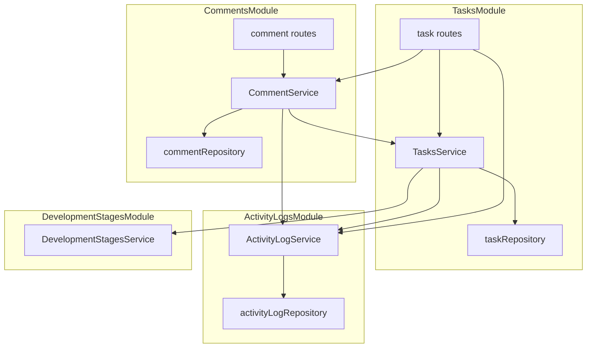
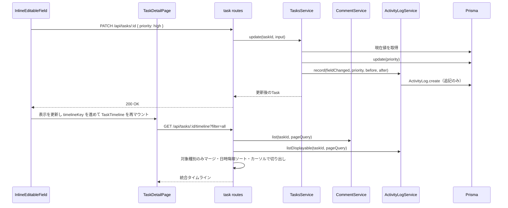
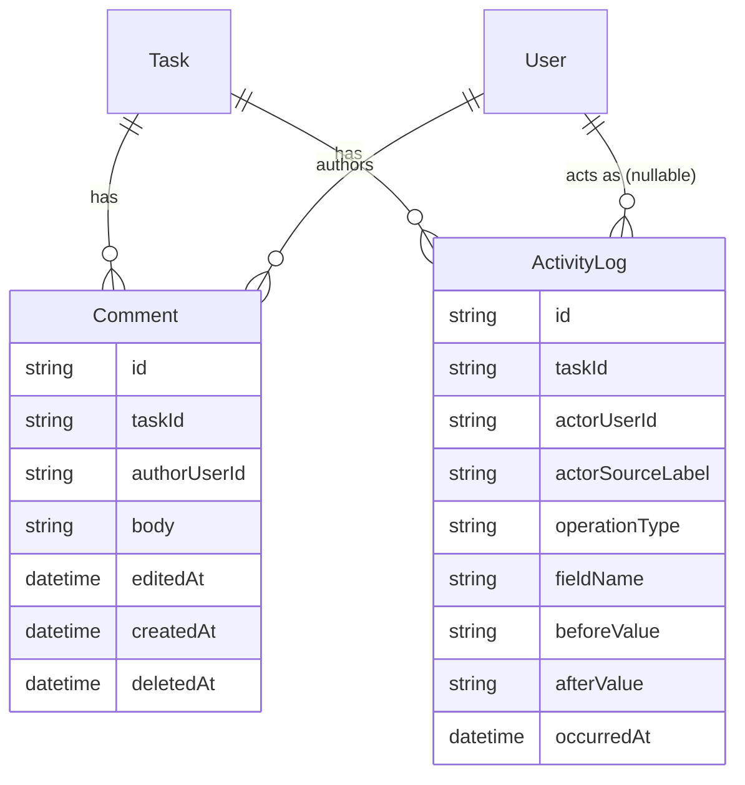

# Technical Design: task-detail

## Overview

**Purpose**: タスクの専用詳細ページを新設し、既存の `TaskDetailModal` だけでは扱えないコメント・操作ログ・タイムラインを1画面に統合する。既存の `TaskDetailModal` は簡易表示を基本とし、ステータス以外の軽微編集と詳細ページへの導線を残す。

**Users**: ワークスペースのメンバーが、カンバン/カレンダーからの簡易確認では足りない場面（経緯の確認、コメントでの議論、変更履歴の追跡）で利用する。

**Impact**: `tasks` モジュールの更新API（`PATCH /api/tasks/:id`）が `parentTaskId` と `scheduledEndDate`（終了予定日）を受け付けるよう拡張される。作成API（`POST /api/tasks`）も任意の `scheduledEndDate` を受け付け、複製（Requirement 2.9）を1回の POST で完結できるようにする。`TasksService` の書き込み系メソッド（`create`/`update`/`updateStatus`/`updateDevelopmentStage`/`addChild`/`splitTask`/`delete`）すべてに操作ログ記録が追加される。`comments`・`activity-logs` という2つの新規ドメインモジュールが追加される。フィールド語彙は先行仕様 `task-field-rename` 完了後の `detail` / `scheduledEndDate` を前提とする。

画面の見た目は `research.md`「ビジュアルデザイン確定」に従う。モック `Task Detail Page.dc.html` との差分のうち、同節「実装時の意図的なモック差分」に書いたものは合意済みであり、モック不一致として扱わない。

### Goals
- タスク詳細ページで CRUD・コメント・タイムラインを1画面に統合する
- タスクへの操作（作成・削除・フィールド変更・コメント操作）を漏れなくドメインイベントとして永続化する
- 既存 `TaskDetailModal` を簡易表示（ステータス編集なしの軽微編集）に整理し、詳細ページへの導線を追加する
- 論理削除済みタスクを詳細ページ／モーダルで参照専用表示する（`deletedAt` 判定）
### Non-Goals
- タスクのフィールド定義そのものの変更・改名（`task-field-rename` / 凍結済み `task-delivery-management` の管掌）
- 開発段階・ステータスの語彙定義（`task-status-model` の管掌）
- `memo`→`detail`、`scheduledDate`→`scheduledEndDate` のマイグレーションおよびアプリ全体の文言揃え（`task-field-rename` で完了済み。本仕様では再実行しない）
- コメント・操作ログのリアルタイム配信（WebSocket等）

## Boundary Commitments

### This Spec Owns
- タスク詳細ページ（`/workspaces/:workspaceId/tasks/:taskId`）のUIとインライン編集インタラクション
- コメントドメイン（`Comment` モデル、CRUD、投稿者本人チェック）
- 操作ログドメイン（`ActivityLog` モデル、記録サービス、表示用フィルタリング）
- タイムライン集約（コメント＋操作ログのマージ、絞り込みタブ）
- タスク更新API（`PATCH /api/tasks/:id`）への `parentTaskId`・`scheduledEndDate` 編集対応の追加（既存 `tasks` モジュールの拡張として、本仕様が実装する。フィールド名は `task-field-rename` 後の語彙）
- タスク作成API（`POST /api/tasks`）への任意 `scheduledEndDate` 受付の追加（複製で終了予定日を引き継ぐため。専用の複製エンドポイントは持たない）
- タスク一覧API（`GET /api/tasks`）への `titleContains` / `excludeSubtreeOf` / `excludeClosed` の追加（親タスク候補のサーバー側絞り込み）
- タスクの複製（拡張後の作成APIをクライアント側で合成する形で提供し、新規バックエンドAPIは持たない）
- 既存 `TaskDetailModal` の縮小（簡易表示・ステータス以外の軽微編集、コメント・タイムラインなし、詳細ページへの導線、削除済みは `deletedAt` で参照専用）

### Out of Boundary
- タスクの基本フィールド（タイトル・優先度・案件関連付け等）の定義自体（凍結済み `task-delivery-management`）
- `memo`→`detail`、`scheduledDate`→`scheduledEndDate` の改名と全画面文言揃え（`task-field-rename` で完了済み）
- 開発段階の種別・ステータス語彙・完了判定（`task-status-model`）。本仕様はこれらの確定済みAPI（`DevelopmentStage.kind` 等）を読み取るのみ
- 案件（Case）モデル・必須タスク判定ロジック自体（`case-management-ux`）
- ワークスペース所属判定・アクセス制御の実装（`workspace-resource-scope`）。本仕様は既存ガードを再利用するのみ
- `scheduledStartDate`（開始予定日）の追加（将来仕様。命名のみ `task-field-rename` で予約）

### Allowed Dependencies
- `task-field-rename` 完了後の `tasks` モジュール語彙（`detail` / `scheduledEndDate`）
- `tasks` モジュール内部（本仕様がそのまま拡張する）
- `development-stages` モジュールの `kind`（公開レスポンス経由、読み取りのみ）
- `workspace-scope.guard.ts` のワークスペース所属強制（既存パターンをそのまま踏襲、新規ガード実装は不要）
- `users`/`workspaces` モジュール（担当者候補・アクター表示名の解決に既存の使い方をそのまま利用）
- 新設する `comments`・`activity-logs` モジュールは、`tasks` モジュールおよびタイムライン集約ルートから一方向に依存される。`comments` がタスクの存在／削除状態を確認するときは `TasksService.getById`（公開サービス）経由のみとし、`task` テーブルや `taskRepository` へ直接アクセスしない

### Revalidation Triggers
- `TaskStatus` の語彙変更、`DevelopmentStageKind` の意味変更（`task-status-model`）→ ステータス非表示条件・自動リセット時のログ抑制ロジック・タイムライン文言テンプレート
- タスクのフィールド追加・改称（`task-field-rename` および後続）→ Requirement 1/2/5/6 のフィールド一覧、コメント/タイムライン文言
- ソフトデリート拡張（`shared/soft-delete.repository.ts`）の挙動変更 → コメント削除・タスク削除時の関連レコード保持ロジック

## Architecture

### Existing Architecture Analysis

`backend/src/modules/<domain>/` の feature-first構成、`routes → service → repository` の一方向依存を維持する。既存 `TasksService` の公開メソッドは9個（`create`, `getById`, `updateStatus`, `updateDevelopmentStage`, `update`, `addChild`, `splitTask`, `delete`, `list`）。このうち `addChild` と `splitTask` は `taskRepository` を直接呼び出しており（`create()` を経由しない）、操作ログのフックはこの2つにも個別に必要になる。

画面ごとの呼び出し経路は次のとおり（いずれも `TasksService` の対応メソッドに収束する）。

- タスク一覧のステータス変更
  - `PATCH /api/tasks/:id/status` → `updateStatus`
- カンバンD&Dおよび `TaskDetailModal` の開発段階変更
  - `PATCH /api/tasks/:id/development-stage` → `updateDevelopmentStage`
- `TaskDetailModal` の一般項目編集（タイトル・優先度・詳細・担当者・案件等）
  - `PATCH /api/tasks/:id` → `update`（モーダルにステータス編集UIはない）

したがって Requirement 5.4（起点画面によらず記録する）は、`updateStatus` / `updateDevelopmentStage` / `update` へのフックで満たせる。繰り返しテンプレートの自動生成（`recurrence.service.ts`）も `TasksService.create`/`delete` を経由しているため、追加のフックは不要。

本仕様の実装により、`PATCH /api/tasks/:id` は `parentTaskId`（親タスク）と `scheduledEndDate`（終了予定日）を編集対象に含め、親タスク変更時の循環検出（2.5）・クローズ済み親の拒否（2.6）を行う。`caseId` 解除時の `isRequiredForCase` 自動オフ（2.8）は既存の `TasksService.update` に実装済みであり、本仕様の追加作業は操作ログへの `field_changed(isRequiredForCase)` 記録である。

`POST /api/tasks` の公開 Zod も任意の `scheduledEndDate` を受け付ける（Requirement 2.9 の複製で終了予定日を引き継ぐため）。
### Architecture Pattern & Boundary Map



**Architecture Integration**:
- **Selected pattern**: 既存の feature-first モジュール構成を維持。`comments`・`activity-logs` を新規の独立モジュールとして追加し、`tasks` が両方に一方向依存する。`comments` はタスクの存在／削除状態確認のため `TasksService.getById` のみに依存する（`taskRepository` 直読みはしない）
- **Domain boundaries**: コメントの所有権判定は `comments` が持つ。操作ログの記録・表示用フィルタリングは `activity-logs` が持つ。タイムライン（コメント＋操作ログのマージ）はどちらの内部実装でもなく、`task.routes.ts` のルートハンドラ層で2つのサービスを呼び出して合成する（プレゼンテーション層の合成であり、ドメインの二重所有ではない）
- **Existing patterns preserved**: 一方向依存、`HttpError` によるエラー表現、ソフトデリート拡張（`comments` のみ適用。`activity-logs` はRequirement 5.9により意図的に `deletedAt`/`updatedAt` を持たない = 事後変更不可）
- **New components rationale**: `comments`/`activity-logs` を分けるのは、コメントは「誰が何を書いたか」というコンテンツの所有権、操作ログは「何が起きたか」という不変の記録という異なる性質を持ち、削除・編集可否のルールも正反対（コメントは編集可・操作ログは不可）なため
- **Steering compliance**: `structure.md` の依存方向・feature-first規約に従う。例外なし

## Technology Stack

| Layer | Choice / Version | Role in Feature | Notes |
|-------|------------------|-----------------|-------|
| Frontend | Nuxt 4 / Vue 3 | 詳細ページ、インライン編集、タイムラインUI | 新規npm依存なし。検索付きセレクト（親タスク選択）は既存コンポーネント資産に前例がないため自作する（軽量・単機能のため外部ライブラリ導入は見送り = Build判断） |
| Backend | Fastify 5 + Zod | コメント・操作ログのAPI、既存タスクAPIの拡張 | 新規npm依存なし |
| Data | Prisma + MySQL | `Comment`・`ActivityLog` テーブルの追加 | スキーマ変更は [[prisma-migrations]] に従い、追従マイグレーションを作らず単一 init（`*_init_domain_schema`）へ畳み込む。開発 DB は `migrate reset` で再適用する |

## File Structure Plan

### Directory Structure
```
backend/src/modules/
├── comments/
│   ├── comment.types.ts        # Comment型、入力型、エラー型
│   ├── comment.repository.ts   # Prisma経由のCRUD（ソフトデリート適用）。list は任意の cursor/take
│   ├── comment.service.ts      # 投稿者本人チェック、空文字拒否、TasksService.getById、ActivityLogService呼び出し
│   └── comment.routes.ts       # POST/PATCH/DELETE /api/tasks/:id/comments[/:commentId]。
│                                # ルートパスは必ず /api/tasks で始める（WORKSPACE_SCOPED_PATH_PREFIXES の
│                                # startsWith 判定でワークスペーススコープガードの対象にするため）
├── activity-logs/
│   ├── activity-log.types.ts       # ActivityLog型、OperationType判別共用体
│   ├── activity-log.repository.ts  # 追記専用（update/deleteメソッドを持たない）。listDisplayable は任意の cursor/take
│   └── activity-log.service.ts     # record()（記録）、listDisplayable()（表示用フィルタ＋任意ページング）
└── tasks/
    ├── task.service.ts             # 変更: 各書き込みメソッドにActivityLogService.record()呼び出しを追加。update()/create の scheduledEndDate・parentTaskId と循環・クローズ済み検証を追加。list に titleContains 等
    └── task.routes.ts              # 変更: POST/PATCH の Zod 拡張、GET list の titleContains/excludeSubtreeOf/excludeClosed、GET /api/tasks/:id/timeline（comment+activity-logのマージ）

frontend/
├── pages/workspaces/[workspaceId]/tasks/
│   └── [taskId].vue                # タスク詳細ページ（新規）
├── components/tasks/
│   ├── InlineEditableField.vue     # ホバー/タップ選択→✎→ピッカー。中身は slot。replaceDisplay で表示を入力へ差し替え（新規）
│   ├── inlineEditableFieldSelection.ts  # タッチ時の行選択状態（新規）
│   ├── FieldOptionList.vue         # ステータス等の選択肢リスト（新規）
│   ├── ParentTaskCombobox.vue      # 検索付きセレクト、循環・クローズ済み除外（新規）
│   ├── TaskFieldCard.vue           # フィールドカード。親子タスクはアコーディオン（初期は閉じる）（新規）
│   ├── TaskTimeline.vue            # コメント＋変更履歴の統合表示、絞り込みタブ（新規）
│   └── TaskTimeline.helpers.ts     # タイムライン文言・日付グループ化（新規）
├── components/comments/
│   └── CommentComposer.vue         # 投稿・編集フォーム（新規）
├── components/kanban/
│   └── TaskDetailModal.vue         # 変更: 詳細ページ導線、削除済みは参照専用。ステータス以外の軽微編集は維持
└── composables/
    └── useApiClient.ts             # 変更: getTaskTimeline, createComment, updateComment, deleteComment を追加
```

### Modified Files
- `backend/src/app.ts` — `app.register(commentRoutes)` を追加（`WORKSPACE_SCOPED_PATH_PREFIXES` は既存の `/api/tasks` prefixがそのままカバーするため、この配列自体の変更は不要）
- `backend/src/modules/tasks/task.service.ts` — 全書き込みメソッドへの操作ログ記録呼び出し追加（`prisma.$transaction` 化含む）、`update()` の入力拡張（`parentTaskId`, `scheduledEndDate`）と検証追加、`getById` への `includeDeleted` オプション追加、削除済みへの書き込み拒否
- `backend/src/modules/tasks/task.repository.ts` — `list()` に `titleContains`/`excludeSubtreeOf`/`excludeClosed` フィルタを追加（`task.closure.ts` のクローズ述語を再利用）、`findById` の `includeDeleted` 対応
- `backend/src/modules/tasks/task.routes.ts` — `POST /api/tasks` に任意 `scheduledEndDate`、`PATCH /api/tasks/:id` に `parentTaskId`/`scheduledEndDate`、`GET /api/tasks` に `titleContains`/`excludeSubtreeOf`/`excludeClosed`、`GET /api/tasks/:id/timeline`（`filter` 付き）、詳細 GET の削除済み返却
- `backend/src/prisma/schema.prisma` — `Comment`・`ActivityLog` モデル追加。マイグレーション SQL は単一 init へ畳み込み（[[prisma-migrations]]。追従マイグレーションディレクトリは作らない）
- `frontend/components/kanban/TaskDetailModal.vue` — 詳細ページへの導線追加
- `frontend/composables/useApiClient.ts` — 新規API呼び出し関数の追加

## System Flows

### フィールド変更 → 操作ログ記録 → タイムライン反映



**Key Decisions**:
- 開発段階変更に伴うステータスの自動リセット（Requirement 5.6）は、`updateDevelopmentStage()` 内部でリポジトリを直接更新し、`updateStatus()` を経由しない。これにより、単独の `updateStatus()` 呼び出し時のみ発火する操作ログ記録ロジックが、自動リセット時には呼ばれず二重記録を避けられる
- `addChild()`/`splitTask()` は `create()` を経由しないため、それぞれの内部で個別に `task_created` の記録を呼ぶ
- 論理削除済みタスクの参照（Requirement 1.4）は、単一取得（`GET /api/tasks/:id`）とタイムライン（`GET /api/tasks/:id/timeline`）だけが soft-delete 既定フィルタを bypass する（`includeDeleted`）。一覧・親タスク候補・カンバン列などには載せない
- タイムラインの「すべて／コメント／変更履歴」絞り込み（Requirement 6.8）はサーバー側 `filter` とし、種別ごとにカーソルページングする（クライアント側フィルタは採用しない）
- フィールド保存後のタイムライン再取得は、ページが `timelineKey` を進めて `TaskTimeline` を再マウントし、マウント時の `GET /api/tasks/:id/timeline` に任せる（保存ハンドラから timeline を直接は呼ばない）
- `list` / `listDisplayable` へ渡す `pageQuery` は `{ take: limit+1, cursor? }`。`filter=comments` のときは ActivityLog を読まない、`filter=changes` のときは Comment を読まない

## Requirements Traceability

| Requirement | Summary | Components | Interfaces |
|---|---|---|---|
| 1.1 | 表示項目一覧 | TaskDetailPage, TaskFieldCard | GET /api/tasks/:id |
| 1.2 | タスクが存在しない場合の表示 | TaskDetailPage（404ハンドリング） | GET /api/tasks/:id（404） |
| 1.3 | 非所属ワークスペースのアクセス拒否 | task routes（既存 `workspace-scope.guard.ts` を再利用） | GET /api/tasks/:id（404。存在有無を漏らさない） |
| 1.4 | 論理削除済みの参照専用 | TaskDetailPage, TaskDetailModal, TasksService.getById（`includeDeleted`） | GET /api/tasks/:id（削除済みも返す）、GET /api/tasks/:id/timeline |
| 1.5, 2.7 | クローズ時のステータス非表示 | TaskFieldCard | `DevelopmentStage.kind` |
| 1.6, 1.7 | 期限超過バッジ | TaskFieldCard | クライアント側計算（`scheduledEndDate` + `kind`） |
| 2.1, 2.2, 2.3, 2.5, 2.6 | フィールド編集、親タスク検証 | InlineEditableField, ParentTaskCombobox, TasksService.update | PATCH /api/tasks/:id |
| 2.4 | 完了日時の編集不可 | InlineEditableField（`completedAt` に✎を描画しない） | — |
| 2.8 | 案件解除時の必須タスク自動オフ（オフ自体は既存。本仕様は操作ログ記録を追加） | TasksService.update | PATCH /api/tasks/:id |
| 2.9 | 複製時のフィールド引き継ぎ（終了予定日含む） | TaskDetailPage（クライアント合成） | POST /api/tasks（本仕様で任意 `scheduledEndDate` を追加） |
| 2.10 | 複製時にステータス/開発段階を初期状態にし、完了日時・コメント・操作ログ・子タスクを引き継がない | TaskDetailPage（複製ペイロードから `status`/`developmentStageId`/`completedAt` を除外し、作成APIの既定値に委ねる） | POST /api/tasks |
| 2.11 | 複製後の新規タスクへの遷移 | TaskDetailPage | フロントルーティング |
| 3.1, 3.2, 3.3 | タスク削除（既存どおりソフトデリート。未完了子の有無では拒否しない） | TasksService.delete | DELETE /api/tasks/:id（既存） |
| 4.1, 4.2, 4.3, 4.4, 4.5 | コメントCRUD | CommentService, CommentComposer | POST/PATCH/DELETE /api/tasks/:id/comments |
| 5.1, 5.2, 5.3, 5.4, 5.5, 5.6, 5.7, 5.8, 5.9 | 操作ログ記録 | ActivityLogService, TasksService（全書き込みメソッド）, CommentService | ActivityLogService.record() |
| 6.1, 6.2, 6.3, 6.4, 6.5, 6.6, 6.7, 6.8 | タイムライン表示・絞り込み | TaskTimeline, task routes（集約） | GET /api/tasks/:id/timeline |
| 7.1 | モーダルの簡易表示と軽微編集（ステータス編集なし） | TaskDetailModal | 既存API |
| 7.2 | モーダルがコメント・タイムラインを持たない | TaskDetailModal | — |
| 7.3 | 詳細ページへの導線 | TaskDetailModal | フロントルーティング |
| 7.4 | 削除済みモーダルの参照専用 | TaskDetailModal（`deletedAt`） | GET /api/tasks/:id |

## Components and Interfaces

| Component | Domain/Layer | Intent | Req Coverage | Key Dependencies | Contracts |
|-----------|--------------|--------|--------------|-------------------|-----------|
| ActivityLogService | Backend/Service | 操作ログの記録と表示用フィルタ | 5.1, 5.2, 5.3, 5.4, 5.5, 5.6, 5.7, 5.8, 5.9, 6.2, 6.3 | activityLogRepository (P0) | Service |
| CommentService | Backend/Service | コメントCRUD、投稿者本人チェック | 4.1, 4.2, 4.3, 4.4, 4.5 | commentRepository (P0), ActivityLogService (P1), TasksService (P0) | Service, API |
| TasksService（拡張） | Backend/Service | 親タスク・終了予定日編集、全書き込みでの記録呼び出し、詳細取得の削除済み bypass | 1.4, 1.6, 1.7, 2.1, 2.2, 2.3, 2.4, 2.5, 2.6, 2.8 | ActivityLogService (P0), DevelopmentStagesService (P1) | Service, API |
| task routes（拡張） | Backend/Route | タイムライン集約エンドポイント | 6.1, 6.2, 6.3, 6.4, 6.5, 6.6, 6.7, 6.8 | CommentService (P0), ActivityLogService (P0) | API |
| InlineEditableField | Frontend/UI | ホバー/タップ選択→✎→ピッカーの共通コンポーネント | 2.1 | — | State |
| ParentTaskCombobox | Frontend/UI | 親タスク検索、循環・クローズ済み除外 | 2.5, 2.6 | GET /api/tasks（`titleContains`/`excludeSubtreeOf`/`excludeClosed`、後述） | State |
| TaskTimeline | Frontend/UI | 統合タイムライン表示、絞り込み | 6.1, 6.2, 6.3, 6.4, 6.5, 6.6, 6.7, 6.8 | GET /api/tasks/:id/timeline | State |
| TaskDetailPage | Frontend/Page | ページ全体の構成、404/削除済み/権限エラーの分岐、複製フロー | 1.1, 1.2, 1.4, 2.9, 2.10, 2.11 | InlineEditableField (P0), TaskFieldCard (P0), TaskTimeline (P0) | — |
| TaskFieldCard | Frontend/UI | フィールドのグルーピング表示（状態/担当・日程・案件/親子タスク/詳細） | 1.1, 1.5, 1.6, 1.7 | InlineEditableField (P0) | — |
| CommentComposer | Frontend/UI | コメント投稿・編集フォーム | 4.1, 4.2, 4.3 | POST/PATCH /api/tasks/:id/comments (P0) | — |
| TaskDetailModal（縮小） | Frontend/UI | 簡易表示・ステータス以外の軽微編集、削除済み参照専用、詳細ページ導線 | 7.1, 7.2, 7.3, 7.4 | 既存API | — |

### Backend / activity-logs

#### ActivityLogService

| Field | Detail |
|-------|--------|
| Intent | タスクへの操作をドメインイベントとして記録し、タイムライン表示用に絞り込んだ一覧を返す |
| Requirements | 5.1, 5.2, 5.3, 5.4, 5.5, 5.6, 5.7, 5.8, 5.9, 6.2, 6.3 |

**Responsibilities & Constraints**
- 記録は追記のみ。更新・削除メソッドを公開しない（Requirement 5.9）
- `record()` は呼び出し元（`TasksService`/`CommentService`）が変更前後の値と操作種別を渡す形とし、フィールド差分の計算はActivityLogService自身では行わない（呼び出し元が業務的な意味を最もよく知っているため）

**Contracts**: Service [x] / API [ ]

##### Service Interface
```typescript
type OperationType =
  | "task_created"
  | "task_deleted"
  | "field_changed"
  | "comment_created"
  | "comment_edited"
  | "comment_deleted";

type FieldName =
  | "title" | "status" | "priority" | "detail" | "assignee"
  | "case" | "isRequiredForCase" | "developmentStage"
  | "parentTask" | "scheduledEndDate";
// 表示名「詳細」↔ API/DB `detail`、「終了予定日」↔ `scheduledEndDate`。
// 改名自体は task-field-rename の管掌。将来の開始予定日は `scheduledStartDate`（本仕様では扱わない）。

type RecordActorInput =
  | { type: "user"; userId: string }
  | { type: "system"; sourceLabel: string }; // sourceLabel例: "recurring_template"

interface RecordActivityLogBase {
  taskId: string;
  actor: RecordActorInput;
}

type RecordActivityLogInput =
  | (RecordActivityLogBase & {
      operation: "field_changed";
      field: FieldName;
      beforeValue?: string | null;
      afterValue?: string | null;
    })
  | (RecordActivityLogBase & {
      operation: Exclude<OperationType, "field_changed">;
      field?: never;
      beforeValue?: never;
      afterValue?: never;
    });

interface TimelinePageQuery {
  cursor?: { occurredAt: Date; id: string };
  take: number;
}

// SoftDeleteTx は `shared/soft-delete.repository.ts` のトランザクションクライアント型
interface ActivityLogService {
  record(input: RecordActivityLogInput, tx: SoftDeleteTx): Promise<void>;
  listDisplayable(taskId: string, page?: TimelinePageQuery): Promise<ActivityLogEntry[]>; // operation === "field_changed" のみ返す（6.2, 6.3）
}
```
- Preconditions: `taskId` は存在するタスクのID。`record()` は呼び出し元が開始した `prisma.$transaction` のコールバック内から、その `tx` を渡して呼ぶ（`tx` を省略できる形にしない）
- Postconditions: `record()` は本体の更新（`tx.task.update` 等）と同一トランザクションでコミットされる。どちらかが失敗すれば両方ロールバックする（Requirement 5.2, 5.3, 5.8 が要求する「記録漏れゼロ」を担保する）
- Invariants: 記録済みの行は不変。`listDisplayable` は `field_changed` 以外を返さない。`TimelinePageQuery` は comments / activity-logs で同形を各リポジトリに定義する（共有型にはしない。activity-logs が comments に依存しないため）

**Integration Note**: `TasksService`/`CommentService` の書き込みメソッドは、本体の更新と `activityLogService.record()` を `prisma.$transaction(async (tx) => { ... })` で1つのトランザクションにまとめる。`record()` を `tx` なしのグローバル `db` クライアントで呼ぶ実装は本設計の契約違反とする。

### Backend / comments

#### CommentService

| Field | Detail |
|-------|--------|
| Intent | コメントの投稿・一覧・投稿者本人による編集/削除 |
| Requirements | 4.1, 4.2, 4.3, 4.4, 4.5 |

**Responsibilities & Constraints**
- 投稿者本人以外の編集・削除リクエストは403相当で拒否する
- 空文字のみの本文は400相当で拒否する
- 編集時は `editedAt` を打刻し、以後「編集済み」として表示可能にする（Requirement 6.7 が参照）
- 対象タスクが論理削除済みの場合、投稿・編集・削除はすべて 409 で拒否する（Requirement 1.4。タイムライン読み取りは task routes 側で許可）。判定は `TasksService.getById(taskId, workspaceId, { includeDeleted: true })` の結果で行い、削除済みは 409、未存在／他ワークスペースは 404 とする

**Contracts**: Service [x] / API [x]

##### Service Interface
```typescript
interface CommentService {
  list(taskId: string, page?: TimelinePageQuery): Promise<Comment[]>; // GET /api/tasks/:id/timeline からのみ呼ばれる（サービスメソッドとしては公開するが、単独のGETルートは持たない）
  create(
    taskId: string,
    workspaceId: VerifiedWorkspaceId,
    authorUserId: string,
    body: string,
  ): Promise<Comment>;
  update(
    taskId: string,
    workspaceId: VerifiedWorkspaceId,
    commentId: string,
    requesterUserId: string,
    body: string,
  ): Promise<Comment>;
  delete(
    taskId: string,
    workspaceId: VerifiedWorkspaceId,
    commentId: string,
    requesterUserId: string,
  ): Promise<void>;
}
```

書き込み系は `workspaceId` と `taskId` を受け取り、対象タスクが現在ワークスペースに属し、かつ論理削除されていないことを確認してからコメントを操作する。更新・削除は URL の `taskId` とコメント行の `taskId` が一致することも要求する（他タスク配下のコメント ID を流用できないようにする）。
##### API Contract
| Method | Endpoint | Request | Response | Errors |
|--------|----------|---------|----------|--------|
| POST | /api/tasks/:id/comments | { body: string } | Comment | 400（空文字）, 404, 409（論理削除済みタスク） |
| PATCH | /api/tasks/:id/comments/:commentId | { body: string } | Comment | 400, 403（投稿者以外）, 404, 409（論理削除済みタスク） |
| DELETE | /api/tasks/:id/comments/:commentId | - | 204 | 403（投稿者以外）, 404, 409（論理削除済みタスク） |

単独のコメント一覧取得エンドポイントは持たない。`TaskTimeline` は常に `GET /api/tasks/:id/timeline` を使い、投稿・編集・削除の直後の画面更新は各操作のレスポンス（`Comment`）でその場を更新するか、タイムラインを再取得する（コメントだけの部分再取得は行わない = Simplification）。

### Backend / tasks（拡張）

#### TasksService.getById（拡張、論理削除済みの参照）

| Field | Detail |
|-------|--------|
| Intent | タスク詳細ページが論理削除済みタスクを参照専用で開けるようにする。一覧等への漏洩は防ぐ |
| Requirements | 1.4 |

**Responsibilities & Constraints**
- `getById(taskId, workspaceId, { includeDeleted?: boolean })` を追加する。`includeDeleted: true` のときだけ repository が soft-delete 既定フィルタを bypass し、`deletedAt` が非 null の行も返す（`where` に `deletedAt` を明示する既存拡張の契約に従う）
- `GET /api/tasks/:id`（単一取得）と `GET /api/tasks/:id/timeline` のハンドラだけが `includeDeleted: true` で呼ぶ。`GET /api/tasks`（一覧・親候補）およびその他の一覧系は従来どおり削除済みを除外する
- 単一取得は詳細ページと `TaskDetailModal` で共用する。レスポンスに `deletedAt` を含め、フロントは非 null なら参照専用 UI（編集・削除・複製・コメント投稿を出さない）に切り替える。モーダルは通常一覧／カンバン経由のため削除済み ID には到達しないが、到達した場合も同じ `deletedAt` 判定に従う
- 論理削除済みタスクに対する書き込み（`PATCH`／`DELETE`／コメント CRUD／status／development-stage 等）は 409 で拒否する。タイムラインの読み取りのみ許可する

##### API Contract
| Method | Endpoint | Request | Response | Errors |
|--------|----------|---------|----------|--------|
| GET | /api/tasks/:id | - | Task（`deletedAt` 含む。削除済みも 200） | 404（未存在、または現在ワークスペースに属さない／権限がない場合も同じ。存在有無を漏らさない） |

#### TasksService.create / POST /api/tasks（拡張、複製用）

| Field | Detail |
|-------|--------|
| Intent | 公開作成APIで終了予定日を受け付け、複製（Requirement 2.9）を create→PATCH の2往復にせず1回の POST で完結させる |
| Requirements | 2.9, 2.10 |

**Responsibilities & Constraints**
- `createTaskBodySchema` に任意の `scheduledEndDate`（日付文字列、nullable 不要。未指定時は従来どおり null）を追加する。service 層の `CreateTaskInput.scheduledEndDate` は既にあるため、ルートの Zod とクライアント合成が追いつく形にする
- 複製ペイロードは元タスクのタイトル・優先度・詳細・担当者・案件・必須フラグ・親タスク・終了予定日を載せ、`status` / `developmentStageId` / `completedAt` は載せない（2.10。作成APIの既定値に委ねる）
- 複製専用エンドポイントは作らない。操作ログは通常の `task_created` 1件として記録する（終了予定日のための追加 `field_changed` は発生しない）

##### API Contract
| Method | Endpoint | Request（追加分） | Response | Errors |
|--------|----------|---------|----------|--------|
| POST | /api/tasks | `scheduledEndDate?: string`（YYYY-MM-DD 等、既存日付フィールドと同じ形式）を追加 | Task | 既存どおり |

#### TasksService.update（拡張）

| Field | Detail |
|-------|--------|
| Intent | 既存の更新APIに親タスク・終了予定日の編集を追加し、循環参照・クローズ済み親を拒否する |
| Requirements | 2.1, 2.2, 2.3, 2.5, 2.6, 2.8 |

**Responsibilities & Constraints**
- `parentTaskId` 変更時: 祖先チェーンを辿り自タスク・自身の子孫が指定されていれば拒否（2.5）。指定先が `task-status-model` の定めるクローズ済みなら拒否（2.6）
- `caseId` が未設定に変更された場合の `isRequiredForCase` 自動オフ（2.8）は既存実装を維持する。本仕様ではその自動オフを Requirement 5.6（開発段階変更に伴うステータス自動リセット）の除外対象と混同せず、通常の `field_changed(isRequiredForCase)` として `record()` を呼ぶ（5.6を根拠に「自動変更は記録しない」と一般化しないこと）
- `scheduledEndDate` の前後関係バリデーション（完了日時との比較等）は行わない（前倒し・延期のどちらも許可）
- `detail` の変更は操作ログでは `field_changed` + `field: "detail"` として記録する（API/DB キーと一致）

##### API Contract
| Method | Endpoint | Request（追加分） | Response | Errors |
|--------|----------|---------|----------|--------|
| PATCH | /api/tasks/:id | `parentTaskId?: string \| null`, `scheduledEndDate?: string \| null` を既存フィールドに追加 | Task | 400（循環参照）, 409（クローズ済み親／論理削除済み） |

#### task routes: GET /api/tasks（拡張、親タスク候補用）

| Field | Detail |
|-------|--------|
| Intent | `ParentTaskCombobox` が使う候補一覧を、タイトル検索・循環参照除外・クローズ済み除外をサーバー側で行った状態で返す |
| Requirements | 2.5, 2.6 |

**Responsibilities & Constraints**
- `titleContains=<string>` パラメータ: タイトルの部分一致（大文字小文字は DB／照合順に従う）。空文字や未指定はタイトル条件なし。汎用の短い `q` は使わない（何を探すクエリかが後から読み取れなくなるため）
- `excludeSubtreeOf=<taskId>` パラメータ: 指定タスク自身とその子孫（祖先チェーンではなく子孫方向）を候補から除外する。既存の `taskRepository` は親子関係を持つため、再帰CTEまたはアプリ側での子孫ID集合の事前計算で実現する
- `excludeClosed=true` パラメータ: `task-status-model` の定めるクローズ済みタスクを候補から除外する（既存のクローズ述語 `task.closure.ts` を再利用し、新規に判定ロジックを複製しない）。公開 Zod は `z.literal("true")`（boolean ではない）。未指定は条件なし。クライアントは `excludeClosed: true` のときだけクエリ `"true"` を付ける
- クライアント（`ParentTaskCombobox`）は全件取得ではなく、上記パラメータ付きでサーバー側フィルタ済みの候補だけを受け取る

##### API Contract
| Method | Endpoint | Request（追加分） | Response | Errors |
|--------|----------|---------|----------|--------|
| GET | /api/tasks | `titleContains?: string`, `excludeSubtreeOf?: string`, `excludeClosed?: "true"`（既存の `caseId` 等と併用可） | Task[] | 400 |

#### task routes: GET /api/tasks/:id/timeline（新規）

| Field | Detail |
|-------|--------|
| Intent | コメントと表示対象の操作ログを1つの時系列に合成して返す。絞り込みはサーバー側で行う |
| Requirements | 1.4, 6.1, 6.2, 6.3, 6.4, 6.5, 6.6, 6.7, 6.8 |

**Responsibilities & Constraints**
- タスク存在確認は `TasksService.getById(..., { includeDeleted: true })` を使う。論理削除済みでもタイムラインは返す（Requirement 1.4）
- `filter` クエリで表示対象をサーバー側に絞る（Requirement 6.8）
  - `all`（既定）: コメント + `field_changed` をマージ
  - `comments`: コメントのみ
  - `changes`: `field_changed` のみ（`ActivityLogService.listDisplayable`）
- ルート層で対象ソースを取得し、発生日時降順にマージする（ドメインロジックではなくプレゼンテーション合成）。`filter=comments` のときは ActivityLog を読まない、`filter=changes` のときは Comment を読まない
- カーソルベースページネーションは `filter` 適用後の結果に対して行う（1ページ20件、`occurredAt`降順→同時刻はID降順でタイブレーク）。各ソースは `limit+1` 件だけをカーソル条件付きで取得し、ルート層でマージしてからページを切り出す（全件ロードしない）。タブ切替時はクライアントが `filter` を変えて先頭から再取得する
- クライアント側での種別フィルタは行わない（ページングと両立しないため）

##### API Contract
| Method | Endpoint | Request | Response | Errors |
|--------|----------|---------|----------|--------|
| GET | /api/tasks/:id/timeline | `?filter=all\|comments\|changes&cursor=&limit=`（`filter` 省略時は `all`） | `{ items: TimelineEntry[], nextCursor: string \| null }` | 404 |

`TimelineEntry` は次の判別共用体。コメントは `createdAt` を `occurredAt` に写し、各 item に `type` を付ける。

```typescript
type TimelineEntry =
  | (Comment & { type: "comment"; occurredAt: Date })
  | (ActivityLogEntry & { type: "change" });
```

### Frontend / tasks

#### InlineEditableField

| Field | Detail |
|-------|--------|
| Intent | デスクトップはホバー、タッチは行選択の2段階でフィールド単位の編集ピッカーを開く共通コンポーネント |
| Requirements | 2.1 |

**Implementation Notes**
- Integration: `TaskFieldCard` 内の各行がこのコンポーネントでラップされる。ピッカーの中身は `#default` / `#picker` slot で注入し、本体は `fieldType` による内部切替を持たない。`replaceDisplay?: boolean` が true のときは表示行を隠して同じ位置にピッカーを出す（タイトル・詳細）
- Validation: 保存失敗時はピッカー内上部にエラーを表示し（`error-handling.md` のパターンを踏襲）、値は保存前の状態に戻す
- Risks: フィールドタイプごとの分岐が増えると肥大化するため、ピッカーの中身は `slot` で注入し本体はホバー/選択/開閉の状態管理のみを持つ

#### TaskFieldCard

| Field | Detail |
|-------|--------|
| Intent | フィールドのグルーピング表示（状態/担当・日程・案件/親子タスク/詳細） |
| Requirements | 1.1, 1.5, 1.6, 1.7 |

**Implementation Notes**
- Integration: 親子タスクは `related-tasks-toggle` のアコーディオン（初期は閉じる。タスク切替で閉じる）。完了日時の未設定表示は「—」。必須・超過は共有 `Badge.vue` ではなく行内の `rounded-full` span
- Validation: 該当なし（編集は `InlineEditableField` に委譲）

#### TaskTimeline

| Field | Detail |
|-------|--------|
| Intent | コメントと変更履歴の統合表示、絞り込みタブ、ページング |
| Requirements | 6.1, 6.2, 6.3, 6.4, 6.5, 6.6, 6.7, 6.8 |

**Implementation Notes**
- Integration: 絞り込みタブは `filter` クエリ付きで `GET /api/tasks/:id/timeline` を再取得する。レスポンス配列はそのまま描画し、クライアント側の種別フィルタは持たない。表示文言・日付グループ化は `TaskTimeline.helpers.ts` に置く。フィールド保存後は親ページの `timelineKey` 更新で再マウントし、`onMounted` の `loadTimeline()` が先頭から取り直す
- Validation: 該当なし（表示専用）

## Data Models

### Domain Model
- `Comment` はタスクに従属するエンティティ（タスク削除時も保持される＝独立したライフサイクル、Requirement 3.2）
- `ActivityLog` は追記専用のイベントログ。更新・削除されない不変レコード

### Field naming map（表示名 ↔ API/DB ↔ 操作ログ）

`task-field-rename` 完了後の語彙を前提とする。本仕様では改名マイグレーションを行わない。

| 表示名（UI文言） | API / Prisma カラム | ActivityLog `FieldName` | 備考 |
|---|---|---|---|
| 詳細 | `detail` | `detail` | 旧名 `memo`。改名は `task-field-rename` |
| 終了予定日 | `scheduledEndDate` | `scheduledEndDate` | 旧名 `scheduledDate`。改名は `task-field-rename` |
| 開始予定日（将来） | `scheduledStartDate` | `scheduledStartDate` | 命名予約のみ。本仕様・`task-field-rename` ともカラム追加しない |
| その他（タイトル等） | 既存 camelCase と同じ | 同名（`title` 等） | — |

### Logical Data Model



### Physical Data Model

**Comment**
- `id` (cuid, PK), `taskId` (FK Task, `ON DELETE RESTRICT`。タスクはソフトデリートのため物理削除されず、コメント行は残る), `authorUserId` (FK User, `ON DELETE RESTRICT`), `body` (Text), `editedAt` (DateTime, nullable), `createdAt`, `updatedAt`, `deletedAt` (nullable, ソフトデリート拡張対象)
- Index: `(taskId, createdAt)` — タイムライン取得のクエリパターンに合わせる

**ActivityLog**
- `id` (cuid, PK), `taskId` (FK Task), `actorUserId` (FK User, nullable), `actorSourceLabel` (String, nullable), `operationType` (Enum), `fieldName` (Enum, nullable), `beforeValue` (Text, nullable), `afterValue` (Text, nullable), `occurredAt` (DateTime, default now)
- `deletedAt`/`updatedAt` を持たない（Requirement 5.9 を物理スキーマで担保し、ソフトデリート拡張の対象外にする）
- Index: `(taskId, occurredAt)` — タイムライン取得・カーソルページネーションに合わせる

**スキーマ適用手順**: `schema.prisma` 更新後、[[prisma-migrations]] に従い差分を単一 init の `migration.sql` へ畳み込む。追従マイグレーションディレクトリの追加は禁止。生成列（`tasks.template_case_date_active_key` 等）は自動生成 SQL に含まれないため、畳み込み時に手編集で保持する。

**ワークスペーススコープ**: `Comment`/`ActivityLog` に `workspaceId` は持たせない。所属検証は既存の `workspace-scope.guard.ts` がルートプレフィックス（`/api/tasks`配下）で行い、行レベルの整合性は「`taskId` が現在ワークスペースに属するタスクであること」を`TasksService.getById`相当のチェックで担保する（正規化を優先し、非正規化しない）。タイムライン／コメント書き込み前の存在確認では、詳細ページと同様に削除済みを含めてよいかをエンドポイントごとに決める（読み取り: `includeDeleted: true`、書き込み: 削除済みなら 409）。

## Error Handling

### Error Strategy
既存の `HttpError` + `error-handling.md` のパターンをそのまま踏襲する。新規モジュール（`comments`, `activity-logs`）もthrowベースの `HttpError` を使う（`Result` 型は既存 `TasksService` の踏襲が必要な箇所以外では使わない）。

### Error Categories and Responses
- **投稿者以外のコメント編集/削除**（Requirement 4.5）: 403
- **空文字コメント**（Requirement 4.2）: 400
- **親タスクの循環参照**（Requirement 2.5）: 400
- **クローズ済みタスクを親に指定**（Requirement 2.6）: 409
- **論理削除済みタスクへの書き込み**（Requirement 1.4）: 409
- **操作ログの記録自体が失敗した場合**: フロントの`try/catch`+`role="alert"`表示パターンに従い、ユーザー操作（フィールド更新等）そのものも失敗として扱う（記録なしに操作だけ成功させると監査証跡が欠落するため、`record()`はトランザクション内で本体の更新と同時にコミットする）

## Testing Strategy

- **Unit Tests**
  - `ActivityLogService.listDisplayable` が `field_changed` 以外を除外すること（6.2, 6.3）
  - `TasksService.update` の循環参照検出・クローズ済み親拒否（2.5, 2.6）
  - `CommentService` の投稿者本人チェック（4.5）
  - `taskRepository.list` の `titleContains`/`excludeSubtreeOf`/`excludeClosed` フィルタが正しい候補集合を返すこと（2.5, 2.6）
  - `POST /api/tasks` が `scheduledEndDate` を受け付け、複製相当のペイロードで終了予定日が引き継がれること（2.9）
  - `TasksService.getById(..., { includeDeleted: true })` が削除済みを返し、既定呼び出しおよび一覧が削除済みを除外すること（1.4）
- **Integration Tests**
  - 一覧の `/status`、カンバン／モーダルの `/development-stage`、モーダル相当の一般 `PATCH /api/tasks/:id` のいずれでも ActivityLog が記録されること（5.4 の実路確認）
  - `updateDevelopmentStage` によるステータス自動リセット時、`field_changed(status)` のログが二重記録されないこと（5.6）
  - `caseId` を未設定にした更新で、`isRequiredForCase` の自動オフが通常の `field_changed(isRequiredForCase)` として記録されること（5.6の除外対象と混同しないことの回帰確認、2.8）
  - `addChild`/`splitTask` で生成された子タスクについて `task_created` ログが記録されること
  - タスク更新とActivityLog記録が同一トランザクションでコミットされ、片方が失敗すればもう片方もロールバックされること（5.2, 5.3, 5.8）
  - `GET /api/tasks/:id/timeline` がコメントと操作ログを発生日時降順でマージすること
  - `GET /api/tasks/:id/timeline?filter=comments|changes` が種別ごとにページングされ、混在しないこと（6.8）
  - 論理削除済みタスクで `GET /api/tasks/:id` と timeline が 200、書き込みが 409、`GET /api/tasks` 一覧に載らないこと（1.4）
  - `detail` 更新時の ActivityLog が `field: "detail"` で記録されること
- **E2E/UI Tests**
  - タスク詳細ページでフィールドをインライン編集→保存→タイムラインに変更履歴が反映される一連の流れ（2.1, 2.2, 6.1）
  - コメント投稿→自分のコメントのみ編集/削除ボタンが表示される→編集後「編集済み」表示（4.1, 4.3, 4.5, 6.7）
  - タイムラインタブ切替でサーバー再取得し、選択種別だけが表示されること（6.8）
  - 論理削除済みタスクで編集操作が一切表示されないこと（1.4）
  - `TaskDetailModal` から「詳細ページを開く」で遷移すること（7.3）
  - 複製は指定フィールドを引き継ぎ初期状態の新規詳細へ遷移する（2.9, 2.10, 2.11）
  - 削除済みタスクをカンバンのモーダルで開くと参照専用になる（7.4）
