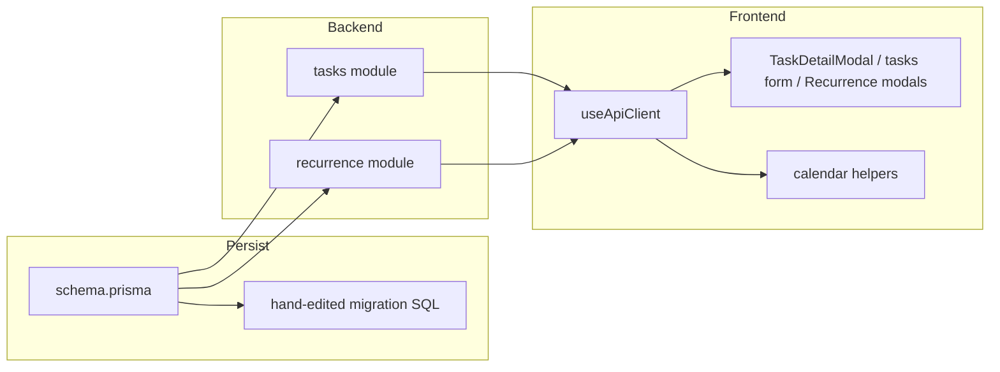
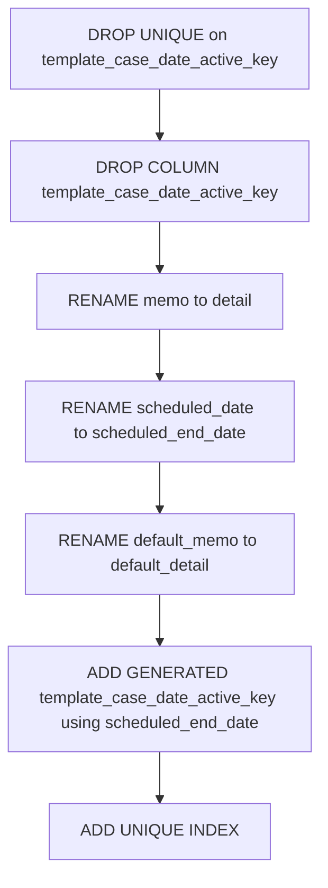

# Technical Design: task-field-rename

## Overview

**Purpose**: タスクの詳細本文・終了予定日、および繰り返しテンプレートの既定詳細について、公開識別名・永続列名・画面文言を `detail` / `scheduledEndDate` / `defaultDetail`（表示名「詳細」「終了予定日」「既定詳細」）へ揃える。

**Users**: ワークスペースのメンバー（画面語彙の一貫性）と、後続の `task-detail` 実装者（二重語彙のない前提）。

**Impact**: `tasks` / `recurring_task_templates` の物理列改名、tasks・recurrence API のリクエスト／レスポンスキー改名、関連 FE・テスト・シードの追随。互換エイリアスは持たない破壊的改名。

### Goals
- 公開・永続の識別名を新語彙に統一し、応答に旧名を残さない
- 既存行の値を失わずに移行する
- 生成列 `template_case_date_active_key` を新列名に合わせて再定義する
- 将来の開始予定日識別名 `scheduledStartDate` を設計上予約する（カラムは追加しない）

### Non-Goals
- `scheduledStartDate` フィールド／UI の追加
- タスク詳細ページ・コメント・操作ログ（`task-detail`）
- 案件の `startDate` / `endDate` および案件「期限超過」の改名
- 完了済み仕様文書の書き換え
- 旧キーの並行受付

## Boundary Commitments

### This Spec Owns
- Prisma／MySQL 上の `memo`→`detail`、`scheduled_date`→`scheduled_end_date`、`default_memo`→`default_detail` 改名とデータ保持マイグレーション
- `template_case_date_active_key` 生成式の `scheduled_end_date` への更新
- tasks / recurrence モジュールの型・ルート・サービス・リポジトリにおける公開キー改名
- FE の型・API クライアント・該当画面文言・DOM id（テスト依存）の更新
- 関連テスト・シードの追随
- `scheduledStartDate` の命名予約の明記（本設計の Naming 節）

### Out of Boundary
- タスク詳細ページ／コメント／操作ログ（`task-detail`）
- カレンダーへの「終了予定日」ラベル新設（現状フィールド名表示が無い。本仕様は既存の旧文言置換のみ）
- 案件期間フィールド、完了済み `.kiro/specs` 歴史文書

### Allowed Dependencies
- 既存 `tasks` / `recurrence` モジュールと Prisma マイグレーション運用
- 既存 soft-delete 拡張・ワークスペースガード（変更しない）

### Revalidation Triggers
- `template_case_date_active_key` の生成式・一意制約の再変更
- タスク／テンプレートの公開 JSON キー形状の追加変更
- `scheduledStartDate` を実際に追加する後続仕様

## Architecture

### Existing Architecture Analysis

feature-first の `tasks` / `recurrence` を横断置換する。新規モジュールは作らない。公開 API は Prisma 行をそのまま返すため、Prisma フィールド名の変更が JSON キー変更になる。`scheduledDate` の書き込みは公開 PATCH には無く、recurrence 生成とシード／内部 create が主経路である。

### Architecture Pattern & Boundary Map



**Architecture Integration**:
- Selected pattern: Option A（既存モジュール横断リネーム）。互換レイヤなし
- Domain boundaries: データ所有は従来どおり tasks / recurrence。本仕様は識別名と文言のみ
- Steering compliance: 一方向依存・Zod 検証・物理列は snake_case `@map` を維持

### Technology Stack

| Layer | Choice | Role in Feature | Notes |
|-------|--------|-----------------|-------|
| Data | Prisma + MySQL | 列改名・生成列再定義 | 生成列は Unsupported + 手書き SQL（既存慣習） |
| Backend | Fastify + Zod | 公開キーを新名のみに | 旧キーはスキーマに載せない |
| Frontend | Nuxt / Vue | 型・文言・DOM id | 新規 npm 依存なし |

## File Structure Plan

### Modified Files（グループ）

スキーマ／移行
- `backend/src/prisma/schema.prisma` — フィールド名・`@map`・先頭コメントの `scheduled_date` 参照を更新
- `backend/src/prisma/migrations/<new>_rename_task_detail_and_scheduled_end/` — 手書き SQL（後述 Migration Strategy）
- `backend/src/prisma/seed-manual-data.ts` — シードキー更新

tasks
- `backend/src/modules/tasks/task.types.ts`
- `backend/src/modules/tasks/task.routes.ts` — Zod `memo`→`detail`
- `backend/src/modules/tasks/task.service.ts` / `task.repository.ts`
- `backend/src/modules/tasks/task.*.test.ts`

recurrence
- `backend/src/modules/recurrence/recurrence.types.ts`
- `backend/src/modules/recurrence/recurrence.routes.ts` — `defaultDetail`
- `backend/src/modules/recurrence/recurrence.service.ts` / `repository.ts` — 生成時 `detail` / `scheduledEndDate`
- `backend/src/modules/recurrence/recurrence.*.test.ts`

横断テスト
- `backend/src/prisma/schema.integration.test.ts`
- `backend/src/validation.integration.test.ts`

フロント
- `frontend/composables/useApiClient.ts` (+ test)
- `frontend/components/kanban/TaskDetailModal.vue` — 「詳細」、空表示、`#task-detail-detail`
- `frontend/pages/workspaces/[workspaceId]/tasks/index.vue` — placeholder「詳細」
- `frontend/components/recurrence/RecurrenceFormModal.vue` / helpers / tests — 「既定詳細」、`#recurrence-form-default-detail`
- `frontend/components/recurrence/RecurrenceDetailModal.vue` (+ test)
- `frontend/pages/workspaces/[workspaceId]/calendar/index.helpers.ts` (+ test) — プロパティ名のみ
- `frontend/pages/workspaces/[workspaceId]/calendar/index.vue` — コメント内識別子
- `frontend/e2e/calendar.spec.ts` — コメント／内部参照の識別子（UI ラベル新設はしない）

steering（本仕様の作業ブランチで更新してよい現行ファイル）
- `.kiro/steering/product.md` / `roadmap.md` — 既に新語彙へ寄せている差分を本仕様に含める

### 新規ファイル
- 上記マイグレーションディレクトリのみ（アプリコードの新規モジュールなし）

## System Flows

### マイグレーション適用順



**Key Decisions**:
- 生成列を先に落としてから列改名し、新式で作り直す（参照列改名中の生成列破綻を避ける）
- `CHANGE`/`RENAME COLUMN` で値を保持する（コピーテーブルは不要）
- `prisma migrate dev` が生成列をドリフト扱いしうる既存警告は維持。本マイグレーションも手書き SQL とし、適用後に `SHOW CREATE TABLE tasks` で生成式を検証する

## Requirements Traceability

| Requirement | Summary | Components | Interfaces |
|---|---|---|---|
| 1.1–1.4 | `detail` 公開・旧 `memo` 排除 | schema, tasks routes/service, FE | POST/PATCH/GET tasks |
| 2.1–2.4 | `scheduledEndDate`、案件日付は不変 | schema, recurrence, calendar helpers | タスク JSON |
| 3.1–3.4 | `defaultDetail` と生成引き継ぎ | recurrence module | templates API |
| 4.1–4.5 | 画面文言 | TaskDetailModal, tasks form, Recurrence* | UI |
| 5.1–5.4 | データ継続・超過対象不変 | migration, calendar helpers | — |
| 6.1–6.2 | 開始予定日を追加せず命名予約 | Naming 節 | — |

## Components and Interfaces

| Component | Domain/Layer | Intent | Req Coverage | Contracts |
|-----------|--------------|--------|--------------|-----------|
| Prisma schema + migration | Data | 物理列・生成列の改名 | 1, 2, 3, 5 | — |
| tasks routes/service | Backend | 公開キー `detail` | 1 | API |
| recurrence routes/service | Backend | `defaultDetail`、生成時の新キー | 2, 3 | API |
| useApiClient + UI | Frontend | 型・文言・DOM id | 1–4 | State |
| calendar helpers | Frontend | `scheduledEndDate` 参照の維持 | 2.3, 5.4 | — |

### Naming map（確定）

| 意味 | 旧 Prisma / JSON | 新 Prisma / JSON | 旧 DB | 新 DB | UI |
|---|---|---|---|---|---|
| 詳細本文 | `memo` | `detail` | `memo` | `detail` | 詳細 |
| 終了予定日 | `scheduledDate` | `scheduledEndDate` | `scheduled_date` | `scheduled_end_date` | 終了予定日（既存ラベルがある場合のみ） |
| テンプレ既定詳細 | `defaultMemo` | `defaultDetail` | `default_memo` | `default_detail` | 既定詳細 |
| 開始予定日（将来） | — | `scheduledStartDate`（予約） | — | `scheduled_start_date`（予約） | 開始予定日 |

本仕様では開始予定日の列・API・UI を追加しない。

### Backend / tasks

#### 公開契約の変更

| Method | Endpoint | 変更 |
|--------|----------|------|
| POST | /api/tasks | body `memo`→`detail`（任意） |
| PATCH | /api/tasks/:id | body `memo`→`detail` |
| GET 等 | /api/tasks… | 応答に `detail` / `scheduledEndDate`。`memo` / `scheduledDate` を含めない |

- Zod スキーマは新キーのみ定義する。旧キー `memo` はスキーマに載せない（デフォルト strip）。`memo` のみ送っても詳細は更新されない（Requirement 1.4）
- 互換エイリアスは実装しない

### Backend / recurrence

| Method | Endpoint | 変更 |
|--------|----------|------|
| POST/PATCH | recurring templates | `defaultMemo`→`defaultDetail` |
| 生成 | TasksService.create 相当 | `detail: template.defaultDetail`、`scheduledEndDate: …` |

### Frontend

- 表示文言: 「詳細」「既定詳細」。空表示は「(メモなし)」をやめ「—」または「(詳細なし)」など「メモ」を含まない語にする（TaskDetailModal は「—」に揃えてもよい）
- DOM id: `#task-detail-memo`→`#task-detail-detail`、`#recurrence-form-memo`→`#recurrence-form-default-detail`
- Requirement 4.4: 現状カレンダー等に終了予定日のフィールド名ラベルは無いため、本仕様ではラベル新設を行わない。プロパティ参照名のみ更新する

## Data Models

### Physical Data Model

**tasks**
- `detail` TEXT NULL（旧 `memo`）
- `scheduled_end_date` DATE NULL（旧 `scheduled_date`）
- `template_case_date_active_key` — 生成式の日付参照を `scheduled_end_date` に変更。一意制約は維持

**recurring_task_templates**
- `default_detail` TEXT NULL（旧 `default_memo`）

Prisma:
```typescript
// Task
detail: String? @db.Text
scheduledEndDate: DateTime? @map("scheduled_end_date") @db.Date

// RecurringTaskTemplate
defaultDetail: String? @db.Text @map("default_detail")
```

`schema.prisma` 先頭コメントの生成式説明も `scheduled_end_date` 表記へ更新する。

## Migration Strategy

1. ユニークインデックス `tasks_template_case_date_active_key_key` を DROP
2. 生成列 `template_case_date_active_key` を DROP
3. `tasks.memo` → `detail`、`tasks.scheduled_date` → `scheduled_end_date`、`recurring_task_templates.default_memo` → `default_detail` を RENAME（値保持）
4. 生成列を再 ADD（式内は `scheduled_end_date`）。UNIQUE を再 ADD
5. 検証: 既存シード／fixture で `detail` / `scheduledEndDate` / `defaultDetail` が読め、テンプレート二重生成の一意制約が維持されること

ロールバック: 逆順の RENAME + 生成列再定義（必要なら別 reverse migration。通常は deploy 前に検証）。

## Error Handling

- 既存の Zod → `badRequest` パターンを維持
- 旧キー単独送信は「詳細未更新」として成功しうる（strip）。クライアント移行漏れはテストと FE 一括更新で防ぐ
- マイグレーション失敗時はデプロイ中断（部分適用しない）

## Testing Strategy

- **Unit / モジュール**
  - tasks: create/update/get が `detail` を扱い、応答に `memo` が無い（1.1–1.4）
  - recurrence: `defaultDetail` 登録と生成タスクの `detail` / `scheduledEndDate`（3.1–3.4, 2.3）
  - calendar helpers: `scheduledEndDate` で従来どおりグルーピング・超過判定（5.4）
- **Integration**
  - マイグレーション後、旧値が新キーで取得できる（5.1–5.3）
  - `schema.integration.test.ts` の一意制約（同一 template/case/scheduledEndDate）が通る
  - `memo` のみの PATCH で本文が変わらない（1.4）
- **UI**
  - TaskDetailModal / 一覧 / Recurrence モーダルの文言と DOM id
  - 案件の開始日・終了日文言が未変更（4.5, 2.4）
