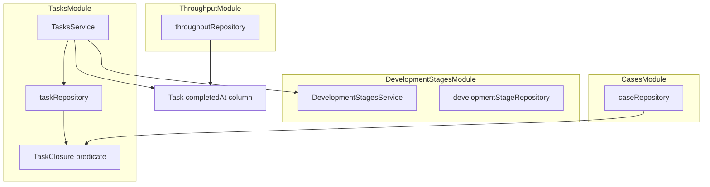
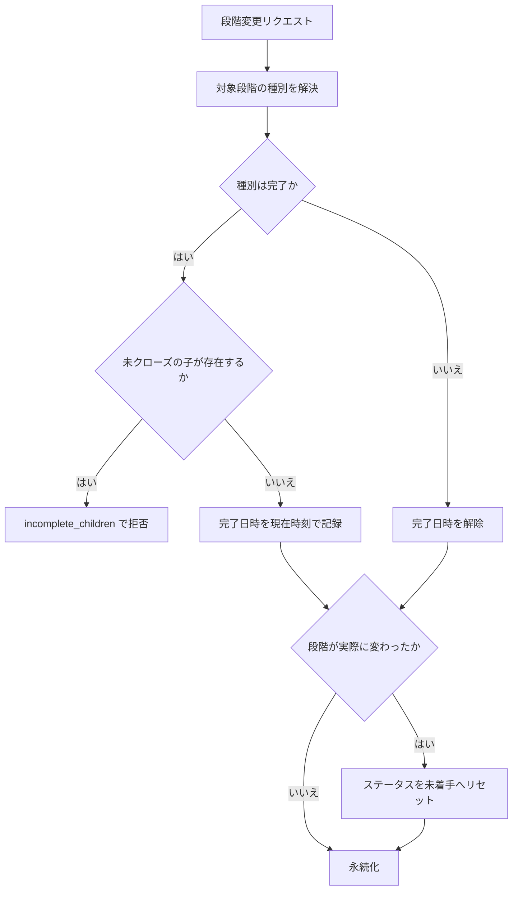
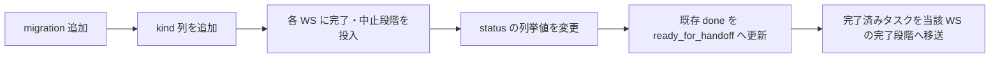

# Technical Design: task-status-model

> **claude design ゲート: 充足済み**（REV.3 で確定）。確定した視覚仕様と根拠は `research.md` の「ビジュアルデザイン確定(claude design連携)」を参照。本書の画面まわりの記述はその確定内容に従う。

## Overview

**Purpose**: 本機能は、タスク全体の完了をシステムが判定できる状態を、タスクを運用するチームに提供する。完了の判定基準をステータスから開発段階の到達へ移し、消化数の自動集計を成立させる。

**Users**: タスクを運用するメンバーが、段階を進める運用（要求仕様 → 設計 → 実装 …）のまま完了を記録し、案件管理者が中止を含む案件を正しく完了まで到達させるために利用する。

**Impact**: 完了日時の打刻責務が `TasksService.updateStatus` から `TasksService.updateDevelopmentStage` へ移動する。`status === "done"` を完了判定に用いている 9 箇所が、開発段階の種別に基づく判定へ置き換わる。`TaskStatus` の列挙値 `done` が `ready_for_handoff` へ改称される。

### 完了を参照している箇所（全 9 箇所）

| 箇所 | 現在の判定 | 変更後の基準 |
|---|---|---|
| `task.repository.ts` `countIncompleteChildren` | `status != "done"` | クローズ済みでない |
| `task.service.ts` `updateStatus` | `status === "done"` | 撤去し段階変更へ移設 |
| `case.repository.ts` `countRequiredCompletedTasks` | `status: "done"` | 完了段階にある |
| `frontend/components/cases/CaseDetailModal.vue` | `status === 'done'` | 完了段階にある |
| `frontend/pages/workspaces/[workspaceId]/calendar/index.helpers.ts` | `status !== "done"` | クローズ済みでない |
| `frontend/pages/workspaces/[workspaceId]/kanban/index.helpers.ts` `computeFocusedTasks` | `status !== "done"` | クローズ済みでない（8.7） |
| `frontend/pages/workspaces/[workspaceId]/kanban/index.helpers.ts` `computeWorkloadCounts` | `status === "done"` | クローズ済みでない（8.7） |
| `frontend/pages/workspaces/[workspaceId]/kanban/index.helpers.ts` `computeTaskProgressById` | `status === "done"` | 完了段階の子を数え、中止段階の子を母数から除外（8.6） |
| `backend/src/prisma/seed.ts` | `status: "done"` | 新しい列挙値へ追従。シードが作るワークスペースでも終端段階を種別つきでちょうど 1 つずつ作る（後述） |

### Goals

- 完了種別の開発段階への到達をもって完了日時を確定し、段階を進める運用のままで消化数を集計できる状態にする
- 「完了」と「クローズ」を区別し、中止したタスクが親タスク・案件・カレンダーを塞がない状態にする
- ステータスを段階内の作業状態に限定し、「完了」の語がタスク全体の完了のみを指す状態にする
- 各ワークスペースで完了・中止の開発段階が常に 1 つずつ存在することを保証する

### Non-Goals

- 段階別リードタイム／サイクルタイムの分析・可視化
- ストーリーポイントと消化ペース予測（velocity-dashboard の管掌）
- 開発段階の遷移順序の強制、遷移をトリガーとする通知、遷移の権限制御
- 段階遷移の履歴を保持する専用モデルの新設（task-detail の操作ログに委ねる）
- 開発段階が論理削除された際に、その段階を参照するタスクをどう扱うかの再設計（既存の挙動を維持する）

## Boundary Commitments

### This Spec Owns

- `DevelopmentStage` の種別（通常・完了・中止）と、その不変条件（各ワークスペースで完了・中止は常に 1 つずつ存在し、削除も種別変更もできない）
- タスクのクローズ状態（未クローズ／完了／中止）の定義と、その唯一の判定元
- `Task.completedAt` の打刻・解除の責務
- `TaskStatus` の値の意味と、開発段階の移動に伴うステータスのリセット
- 親子タスクの完了制約の判定基準

### Out of Boundary

- 開発段階およびステータスの変更を操作ログとして記録すること（task-detail）
- タスク・案件の可視範囲の判定と強制（workspace-resource-scope）
- 消化ペースの予測、ストーリーポイント（velocity-dashboard）
- `throughput` モジュールの集計ロジック本体。本仕様は同モジュールを変更しない
- 案件の進捗を「どう見せるか」（本仕様が変えるのは数え方のみ）

### Allowed Dependencies

- `tasks` → `development-stages`（サービスの公開インターフェース経由で段階の種別を解決する）
- `cases` → `tasks`（クローズ判定の述語を参照する。後述の「クローズ述語の共有」を参照）
- 既存の共有インフラ（`shared/db.ts`、`shared/http-errors.ts`、ソフトデリート拡張、`Result` 型）

**制約**: `throughput` は新しい概念に依存させない。同モジュールは `completedAt` のみを見る現在の実装を維持する。

### Revalidation Triggers

- `TaskStatus` の列挙値の変更 → task-detail（操作ログが記録する語彙）、フロントエンドの表示全般
- クローズ判定の定義変更（中止の扱いを変えるなど）→ `cases` の進捗算出、カレンダーの期限超過判定
- `completedAt` の打刻契機の変更 → `throughput` の集計結果
- 開発段階の種別の追加 → クローズ述語、カンバンの列描画

## Architecture

### Existing Architecture Analysis

`backend/src/modules/<domain>/` の feature-first 構成と、`routes → service → repository` の一方向依存を維持する。完了判定に関わる既存の作りで、本設計が尊重すべき制約は次のとおり。

- `caseRepository` は `db.task.count` でタスクを直接数えている。本設計はこの構造自体は変えず、数え方の条件のみを差し替える
- `taskRepository.countIncompleteChildren` は、ソフトデリート済みの子タスクが親の完了をブロックしない挙動をコメントで明示している。この意図を保持する
- `throughputRepository.countCompleted` は、ソフトデリート済みタスクを過去期間に計上し続けるためにソフトデリート既定フィルタを意図的にバイパスしている。この意図を保持する
- `Task` ドメイン型は Prisma モデルの再エクスポート（`export type { Task } from "@prisma/client"`）である。API ペイロードに導出値を足すと、この規約から外れる

### Architecture Pattern & Boundary Map



**Architecture Integration**:

- **Selected pattern**: 既存の feature-first モジュール構成を維持し、新規概念（クローズ判定）を `tasks` モジュール内の単一ファイルへ集約する
- **Domain boundaries**: 段階の種別は `development-stages` が所有し、タスクのクローズ状態は `tasks` が所有する。両者の結節点は `TasksService.updateDevelopmentStage` の 1 箇所に集約する
- **Existing patterns preserved**: 一方向依存、`Result<T, E>` によるタスクのエラー表現、`HttpError` による開発段階のエラー表現、ソフトデリート拡張の既定フィルタ
- **New components rationale**: クローズ述語を単一ファイルに切り出すのは、同じ判定を `tasks` と `cases` の 2 モジュールが必要とし、定義の重複がドリフトの主要因になるため
- **Steering compliance**: `structure.md` の依存方向と命名規約に従う。後述の 1 点のみ意図的な例外を置く

#### クローズ述語の共有（意図的な例外）

`cases` は `tasks` の**リポジトリ層で用いるクエリ条件**を参照する。`structure.md` の「他モジュールへはサービスの公開インターフェース経由でのみ依存する」から外れるため、根拠を明示する。

- 代替案（`tasksService` に案件向けの集計メソッドを置く）は、案件進捗という `cases` 固有の意味を `tasks` へ持ち込む
- 代替案（各モジュールが独自に条件を書く）は、クローズの定義を 2 箇所に複製する。中止の扱いを将来変えた際に片方だけ変更される事故が起きやすい
- 共有するのは**読み取り専用のクエリ条件と型のみ**であり、`cases` が `tasks` の内部状態を操作することはない

### Technology Stack

| Layer | Choice / Version | Role in Feature | Notes |
|-------|------------------|-----------------|-------|
| Frontend | Nuxt 4 / Vue 3 | ステータス表示の追従、クローズ判定に基づく表示制御 | 新規依存なし |
| Backend | Fastify 5 + Zod | ステータス列挙値の検証更新、段階種別の返却 | 新規依存なし |
| Data | Prisma + MySQL | `DevelopmentStageKind` 列挙型の追加、`TaskStatus` 列挙値の改称 | 新規依存なし |

## File Structure Plan

### Directory Structure

```
backend/src/
├── modules/
│   ├── development-stages/
│   │   ├── development-stage.types.ts      # ドメイン型に kind を追加
│   │   ├── development-stage.repository.ts # findById 追加
│   │   ├── development-stage.service.ts    # 種別の不変条件を強制
│   │   └── development-stage.routes.ts     # kind をレスポンスに含める
│   ├── tasks/
│   │   ├── task.closure.ts                 # 新規: クローズ判定の唯一の定義
│   │   ├── task.types.ts                   # TaskError にエラー型を追加
│   │   ├── task.repository.ts              # 子タスク判定をクローズ基準へ
│   │   ├── task.service.ts                 # 完了日時の打刻責務を段階変更へ移動
│   │   └── task.routes.ts                  # ステータス列挙値の更新
│   └── cases/
│       └── case.repository.ts              # 必須タスクの数え方をクローズ基準へ
└── prisma/
    ├── schema.prisma                       # 種別列挙型・kind 列・ステータス改称
    └── migrations/<ts>_add_development_stage_kind/migration.sql  # 新規

frontend/
├── composables/
│   ├── useApiClient.ts                     # TaskStatus 型・DevelopmentStage 型の更新
│   └── useTaskClosure.ts                   # 新規: クライアント側クローズ判定の唯一の定義
├── components/
│   ├── shared/StatusBadge.vue              # ラベル追従
│   ├── tasks/TaskNode.vue                  # 選択肢追従
│   ├── kanban/TaskDetailModal.vue          # 終端段階でステータスを出さない
│   └── cases/CaseDetailModal.vue           # 必須タスクの完了表示をクローズ基準へ
└── pages/workspaces/[workspaceId]/
    ├── calendar/index.helpers.ts           # 期限超過判定をクローズ基準へ（段階一覧は取得済み）
    ├── cases/index.vue                     # 段階一覧の取得を追加
    ├── tasks/index.vue                     # 段階一覧の取得を追加
    ├── kanban/index.helpers.ts             # 進捗・トレイ・負荷をクローズ基準へ
    ├── kanban/index.vue                    # 完了列へのドラッグ拒否を復旧・通知する
    └── kanban/stages.vue                   # 種別の表示、終端段階の削除を抑止
```

### Modified Files

| ファイル | 変更内容 |
|---|---|
| `schema.prisma` | `DevelopmentStageKind` 列挙型を追加、`DevelopmentStage.kind` を追加、`TaskStatus.done` を `ready_for_handoff` へ改称 |
| `development-stage.service.ts` | `create` が常に通常種別を割り当て通常段階の直後へ挿入、`delete` が終端種別を拒否、`getById` を追加 |
| `task.service.ts` | `updateStatus` から完了日時と子タスク判定を撤去し終端段階での変更を拒否、`updateDevelopmentStage` に完了日時・ステータスリセット・子タスク判定を集約 |
| `task.repository.ts` | `countIncompleteChildren` をクローズ基準へ、`updateDevelopmentStage` が status と completedAt も更新できるようにする |
| `case.repository.ts` | `countRequiredTasks` が中止を除外、`countRequiredCompletedTasks` がクローズ基準で完了を数える |
| `useApiClient.ts` | `TaskStatus` の値を更新、`DevelopmentStage` に `kind` を追加 |
| `pages/workspaces/[workspaceId]/kanban/index.vue` | `onDropOnStage` に失敗時の復旧を追加する。完了列へのドラッグが `incomplete_children` で拒否されうるようになるため |

## System Flows

### 開発段階の変更（本仕様の中核）



**Key Decisions**:

- 子タスクの判定は**完了種別への移動時のみ**行う。中止種別への移動は子タスクの状態にかかわらず許可する（5.3）。中止は積み残しを認めたうえで打ち切る操作であり、制約を課すと打ち切れなくなる
- ステータスのリセットは、段階が実際に変わった場合にのみ行う。同一段階を指定した更新でステータスが失われないようにする（4.4）
- 段階未設定（`null`）への移動は「完了でない」経路として扱われ、完了日時が解除される

### ステータス変更

`updateStatus` は完了日時に一切触れなくなる（2.4）。現在の段階が終端種別である場合は、ステータスが表示・編集の対象外であるため（4.5）、サーバー側でも変更を拒否する。

## Requirements Traceability

| Requirement | Summary | Components | Interfaces |
|-------------|---------|------------|------------|
| 1.1 | 種別の保持 | DevelopmentStage モデル / ドメイン型 | `DevelopmentStage.kind` |
| 1.2, 1.3 | 各ワークスペースで完了・中止は常に 1 つ | マイグレーション（既存 WS への初期投入） / DevelopmentStagesService / seed | 1.4〜1.6 の複合で維持 |
| 1.4 | 新規は通常種別 | DevelopmentStagesService | `create` |
| 1.5 | 終端段階の削除拒否 | DevelopmentStagesService | `delete` |
| 1.6 | 種別変更の拒否 | development-stage.routes | 変更経路を設けない |
| 1.7 | 名称・並び順の変更を許可 | DevelopmentStagesService | `rename` / `reorder`（変更なし） |
| 1.8 | 一覧で種別を識別 | development-stage.routes / stages.vue | `GET /api/development-stages` |
| 2.1, 2.2, 2.3 | 完了日時の打刻・解除 | TasksService | `updateDevelopmentStage` |
| 2.4 | ステータス変更を契機にしない | TasksService | `updateStatus` |
| 2.5 | 段階未設定からの直接移動 | TasksService | `updateDevelopmentStage`（既存の null 許容） |
| 2.6 | 完了日時を直接編集させない | task.routes | `updateTaskBodySchema`（変更なし） |
| 3.1, 3.2, 3.3 | クローズ／完了の定義 | TaskClosure | `closedTaskFilter` / `completedTaskFilter` / `openTaskFilter` |
| 3.4 | 中止日時を保持しない | — | 列を追加しない |
| 4.1, 4.2, 4.3 | ステータス値の再定義 | schema.prisma / task.routes / useApiClient | `TaskStatus` |
| 4.4 | 段階移動時のリセット | TasksService | `updateDevelopmentStage` |
| 4.5 | 終端段階では非表示・非編集 | TasksService / TaskDetailModal / TaskNode | `updateStatus` の拒否＋表示制御 |
| 5.1, 5.2, 5.4 | 親子完了制約 | TasksService / taskRepository / kanban/index.vue | `countIncompleteChildren` ＋ 拒否時の復旧 |
| 5.3 | 親の中止は子によらず許可 | TasksService | `updateDevelopmentStage` |
| 5.5, 5.6 | クローズ済みに未クローズの子を付けさせない | TasksService | `splitTask` / 親の付け替え |
| 6.1, 6.2, 6.3 | 案件の必須タスク進捗 | caseRepository | `countRequiredTasks` / `countRequiredCompletedTasks` |
| 6.4, 6.5 | 終了日超過警告 | CaseService | `getProgress`（算術により追従） |
| 6.6, 8.9 | 母数 0 のとき進捗を出さない | CaseDetailModal / TaskCard | 表示の抑止 |
| 8.6, 8.7, 8.8 | カンバンの進捗・トレイ・負荷の追従 | `pages/workspaces/[workspaceId]/kanban/index.helpers.ts` | `computeTaskProgressById` ほか |
| 8.10 | 終端段階では分割操作を出さない | TaskNode | 表示の抑止 |
| 7.1〜7.4 | 消化数 | throughputRepository | **変更なし**（後述） |
| 8.1 | 終端段階も列として表示 | kanban/index.vue | **変更なし** |
| 8.2, 8.3 | 用語の追従 | StatusBadge / TaskNode / CaseDetailModal | — |
| 8.4, 8.5 | カレンダーの期限超過 | calendar/index.helpers.ts / useTaskClosure | `isOverdue` の判定 |

### Requirement 7 が実装を伴わない理由

7.1〜7.4 は `throughputRepository.countCompleted` の現在の実装（完了日時の期間フィルタ）と、2.1〜2.3 の打刻規則の組み合わせで自動的に満たされる。

- 7.2（中止を含めない）: 中止段階では完了日時が打刻されないため、除外条件が不要
- 7.3（ステータスに基づかない）: もともとステータスを参照していない
- 7.4（完了段階から戻したら対象外）: 2.2 の打刻解除の副作用

**防御的なフィルタを追加しない**。追加すると「中止は完了日時を持たない」という不変条件が二重に表現され、意図が読みにくくなる。代わりに、この性質をテストで固定する。

## Components and Interfaces

| Component | Domain/Layer | Intent | Req Coverage | Key Dependencies | Contracts |
|-----------|--------------|--------|--------------|------------------|-----------|
| TaskClosure | tasks / predicate | クローズ状態の唯一の定義 | 3.1, 3.2, 3.3 | Prisma 型 (P0) | Service |
| TasksService | tasks / service | 段階遷移に伴う完了日時・ステータス・制約の集約 | 2, 4.4, 4.5, 5 | DevelopmentStagesService (P0), TaskClosure (P0) | Service |
| DevelopmentStagesService | development-stages / service | 種別の不変条件の強制 | 1 | developmentStageRepository (P0) | Service, API |
| caseRepository | cases / repository | 必須タスクの数え方の追従 | 6.1, 6.2, 6.3 | TaskClosure (P0) | Service |
| useTaskClosure | frontend / composable | クライアント側クローズ判定の唯一の定義 | 8.4, 8.5 | DevelopmentStage 一覧 (P0) | Service |

### tasks

#### TaskClosure

| Field | Detail |
|-------|--------|
| Intent | タスクがクローズ済み／完了済みであるかの判定を一元的に定義する |
| Requirements | 3.1, 3.2, 3.3 |

**Responsibilities & Constraints**

- クローズ状態の定義を所有する。`tasks` と `cases` はこのファイルの述語のみを用いて判定する
- 開発段階が未設定のタスクは常に未クローズとして扱う（3.3）
- 状態を持たない。純粋な型とクエリ条件のみを公開する

**Dependencies**

- Inbound: `taskRepository` — 親子完了制約の判定（P0）
- Inbound: `caseRepository` — 必須タスクの集計（P0）
- External: Prisma 生成型 — クエリ条件の型付け（P0）

**Contracts**: Service [x] / API [ ] / Event [ ] / Batch [ ] / State [ ]

##### Service Interface

```typescript
import type { Prisma } from "@prisma/client";

export type TaskClosureState = "open" | "completed" | "cancelled";

/** 完了種別の段階にあるタスクに一致する。 */
export const completedTaskFilter: Prisma.TaskWhereInput;

/** 完了または中止の段階にあるタスクに一致する。 */
export const closedTaskFilter: Prisma.TaskWhereInput;

/** クローズ済みでないタスクに一致する。段階未設定のタスクを含む。 */
export const openTaskFilter: Prisma.TaskWhereInput;

/** 段階の種別からクローズ状態を求める。段階未設定は "open"。 */
export function resolveClosureState(
  kind: DevelopmentStageKind | null,
): TaskClosureState;
```

- **Preconditions**: なし
- **Postconditions**: `openTaskFilter` は `closedTaskFilter` の補集合に一致する
- **Invariants**: `developmentStageId` が `null` のタスクは、常に `openTaskFilter` にのみ一致する

**Implementation Notes**

- Integration: 述語は開発段階リレーション経由の絞り込みとして表現する。ソフトデリート拡張は最上位の `where` にのみ既定フィルタを注入するため、リレーション側の条件には影響しない。終端段階は削除できない（1.5）ので、この差は問題にならない
- Validation: `openTaskFilter` と `closedTaskFilter` が補集合であることをテストで固定する
- Risks: 種別を追加する場合、3 つの述語すべての更新が必要になる。Revalidation Triggers に記載済み

#### TasksService

| Field | Detail |
|-------|--------|
| Intent | 開発段階の遷移に伴う完了日時・ステータス・親子制約を単一の遷移点へ集約する |
| Requirements | 2.1〜2.6, 4.4, 4.5, 5.1〜5.4 |

**Responsibilities & Constraints**

- 完了日時を書き込む唯一の場所である。他のいかなる経路も `completedAt` を変更しない
- 段階の種別解決は `DevelopmentStagesService` に委ね、種別の意味を再実装しない
- 段階変更と、それに伴うステータス・完了日時の更新は 1 回の更新として適用する

**Dependencies**

- Outbound: `DevelopmentStagesService.getById` — 対象段階の種別解決（P0）
- Outbound: `taskRepository` — 永続化と子タスク集計（P0）
- Outbound: `TaskClosure` — 子タスクの未クローズ判定（P0）

**Contracts**: Service [x] / API [ ] / Event [ ] / Batch [ ] / State [ ]

##### Service Interface

```typescript
type TaskError =
  | { type: "not_found"; taskId: string }
  | { type: "incomplete_children"; taskId: string }
  | { type: "validation_error"; message: string }
  // 新規: 終端段階にあるタスクのステータス変更を拒否する (4.5)
  | { type: "status_not_applicable"; taskId: string }
  // 新規: クローズ済みのタスクに未クローズの子を付ける操作を拒否する (5.5, 5.6)
  | { type: "closed_task_cannot_take_children"; taskId: string };

interface TasksService {
  updateStatus(taskId: string, status: TaskStatus): Promise<Result<Task, TaskError>>;
  updateDevelopmentStage(
    taskId: string,
    developmentStageId: string | null,
    assigneeUserId?: string,
  ): Promise<Result<Task, TaskError>>;
  // 既存。クローズ済みのタスクに対しては拒否する (5.5)
  splitTask(taskId: string, workspaceId: VerifiedWorkspaceId, parts: CreateTaskInput[]): Promise<Result<Task[], TaskError>>;
}
```

**不変条件の双方向の保護 (5.5, 5.6)**

Domain Model の不変条件「完了種別の段階にあるタスクは未クローズの子タスクを持たない」は、親を完了段階へ移す経路（5.1）だけでは守れない。逆方向に 2 つの経路がある。

| 経路 | 対処 |
|---|---|
| `splitTask` が子を生成する | クローズ済みのタスクの分割を拒否する（5.5） |
| タスクの親を付け替える | クローズ済みのタスクを親に指定する操作を拒否する（5.6）。task-detail が追加する親タスク編集もこの制約に従う |

**`updateDevelopmentStage` の事前・事後条件**

- Preconditions: `developmentStageId` は既存の開発段階を指すか `null` である
- Postconditions:
  - 対象段階の種別が完了である場合に限り `completedAt` は現在時刻である。それ以外の場合 `completedAt` は `null` である（2.1〜2.3）
  - 段階が実際に変化した場合、`status` は未着手である（4.4）
  - 担当者は、変更前が未設定であった場合にのみ引数の値で設定される（既存挙動を維持）
- Invariants: 完了種別の段階にあるタスクは、未クローズの子タスクを持たない（5.1）

**`updateStatus` の事前・事後条件**

- Preconditions: 対象タスクの現在の開発段階が終端種別でない
- Postconditions: `completedAt` は変更されない（2.4）
- Errors: 現在の段階が終端種別である場合 `status_not_applicable`（4.5）

**Implementation Notes**

- Integration: 子タスクの未クローズ判定は `taskRepository.countIncompleteChildren` を通じて行う。同メソッドの「ソフトデリート済みの子は親をブロックしない」既存挙動を保持する
- Validation: 完了段階への移動 → 通常段階への移動 → 完了段階への再移動、で完了日時が再打刻されることをテストする
- Risks: `updateStatus` から子タスク判定を撤去するため、この制約を検証していた既存テストは段階変更側へ移設が必要

### development-stages

#### DevelopmentStagesService

| Field | Detail |
|-------|--------|
| Intent | 開発段階の種別と、その不変条件を所有する |
| Requirements | 1.1〜1.8 |

**Responsibilities & Constraints**

- 各ワークスペースで完了種別・中止種別の段階がそれぞれ常に 1 つ存在することを保証する
- 種別を変更する手段を提供しない

**Contracts**: Service [x] / API [x] / Event [ ] / Batch [ ] / State [ ]

##### Service Interface

```typescript
export type DevelopmentStageKind = "normal" | "completed" | "cancelled";

export interface DevelopmentStage {
  id: string;
  name: string;
  order: number;
  kind: DevelopmentStageKind;
  workspaceId: string; // 既存。本仕様では変更しない
}

interface DevelopmentStagesService {
  // workspaceId 引数は既存の VerifiedWorkspaceId 規約を維持する
  create(name: string, workspaceId: VerifiedWorkspaceId): Promise<DevelopmentStage>;   // 常に kind = "normal"
  rename(id: string, workspaceId: VerifiedWorkspaceId, name: string): Promise<DevelopmentStage>;
  reorder(orderedIds: string[], workspaceId: VerifiedWorkspaceId): Promise<DevelopmentStage[]>;
  delete(id: string, workspaceId: VerifiedWorkspaceId, requestId?: string): Promise<void>;  // 終端種別は拒否
  getById(id: string, workspaceId: VerifiedWorkspaceId): Promise<DevelopmentStage | null>;  // 新規
  list(workspaceId: VerifiedWorkspaceId): Promise<DevelopmentStage[]>;
}
```

- Preconditions: `create` の `name` は空白のみでない（既存の検証を維持）
- Postconditions: `create` が返す段階の種別は常に通常である（1.4）
- Invariants: 対象ワークスペース内で、完了種別・中止種別の段階はそれぞれちょうど 1 つ存在する（1.2, 1.3）

##### API Contract

| Method | Endpoint | Request | Response | Errors |
|--------|----------|---------|----------|--------|
| GET | /api/development-stages | — | `DevelopmentStage[]`（`kind` を含む） | 401 |
| POST | /api/development-stages | `{ name }` | `DevelopmentStage`（`kind = "normal"`） | 400, 401 |
| PATCH | /api/development-stages/:id | `{ name }` | `DevelopmentStage` | 400, 401, 404 |
| DELETE | /api/development-stages/:id | — | 204 | **400（終端種別）**, 401, 404 |

`PATCH` は `name` のみを受け付ける現在のスキーマを維持する。これにより種別変更の経路が存在しないことが構造的に保証される（1.6）。

**Implementation Notes**

- Integration: `create` の挿入位置を「通常種別の最大 `order` の直後」へ変更し、それ以降の段階の `order` を 1 つ繰り下げる。現在の `max(order) + 1` のままだと、新しい通常段階が完了・中止の後ろに並び、毎回並び替えが必要になる
- Validation: 終端段階の削除が拒否されること、作成した段階が常に通常種別であることをテストする
- Risks: 不変条件をアプリケーション層のみで担保する（後述の Design Decision を参照）

### cases

#### caseRepository（変更）

| Field | Detail |
|-------|--------|
| Intent | 必須タスクの母数と完了数をクローズ基準で数える |
| Requirements | 6.1, 6.2, 6.3 |

**Responsibilities & Constraints**

- `countRequiredTasks` は中止種別の段階にある必須タスクを母数から除外する（6.2）
- `countRequiredCompletedTasks` は完了種別の段階にある必須タスクを数える（6.1）
- `CaseProgress.requiredIncomplete = requiredTotal - requiredCompleted` の算術は変更しない。母数から中止を外した結果として、終了日超過の警告も自動的に追従する（6.4, 6.5）

**Dependencies**

- Outbound: `TaskClosure` — 述語の参照（P0）

### frontend

#### useTaskClosure

| Field | Detail |
|-------|--------|
| Intent | クライアント側でのクローズ判定を 1 箇所に定義する |
| Requirements | 8.3, 8.4, 8.5 |

**Responsibilities & Constraints**

- 開発段階の一覧とタスクからクローズ状態を求める純粋関数のみを提供する
- 権威はサーバー側にある。本関数は表示制御のためだけに用いる

**Contracts**: Service [x] / API [ ] / Event [ ] / Batch [ ] / State [ ]

##### Service Interface

```typescript
export function resolveTaskClosureState(
  task: Pick<Task, "developmentStageId">,
  stages: readonly DevelopmentStage[],
): TaskClosureState;

export function isTaskClosed(
  task: Pick<Task, "developmentStageId">,
  stages: readonly DevelopmentStage[],
): boolean;

export function isTaskCompleted(
  task: Pick<Task, "developmentStageId">,
  stages: readonly DevelopmentStage[],
): boolean;
```

- Preconditions: `stages` は `listDevelopmentStages()` が返した一覧である
- Postconditions: `stages` に一致する段階がない場合、または `developmentStageId` が `null` の場合は `"open"` を返す

**Implementation Notes**

- Integration: タスクの API ペイロードには段階の種別を含めない。`Task` ドメイン型が Prisma モデルの再エクスポートである既存規約を崩さないため、クライアント側で段階一覧と突き合わせる。`cases`・`tasks` は段階一覧の取得を追加する（`kanban`・`calendar` は取得済み）
- Validation: 段階未設定・未知の段階 ID のいずれでも `"open"` になることをテストする
- Risks: 段階一覧の取得が増える画面は 2 つ。一覧は小さく、既存のカンバンと同じ取得方法であるため影響は限定的

#### 表示コンポーネント（Summary のみ）

| Component | 変更内容 | Requirements |
|---|---|---|
| `StatusBadge.vue` | ラベルを 未着手／作業中／引継待ち／保留 に更新。tone `handoff`（ティール `#ccfbf1` / `#0f766e`）を追加し、**`success` を StatusBadge から外す**（緑は完了段階に予約） | 8.2, 8.3 |
| **`StageBadge.vue`（新規）** | 開発段階バッジ。角丸 6px・枠線・接頭辞つき。variant = 通常（白地）／完了（緑地・緑枠）／中止（slate-100 地・**段階名にのみ取り消し線**＋文字色 slate-500）／未設定（白地・破線・「段階: 未設定」）。接頭辞は一覧「段階:」、モーダル「開発段階:」 | 8.2, 8.3 |
| `TaskNode.vue` | 段階バッジを追加（優先度の直後）。終端段階ではステータスのバッジ・選択・分割操作を出さない。行を「タイトル＋バッジ群 ／ スペーサ ／ 操作群」の 3 ブロックにし、**操作群を右端に固定**する | 4.5, 8.2, 8.10 |
| `TaskDetailModal.vue` | 終端段階のタスクではステータスを表示しない。段階バッジを `StageBadge` に置き換える | 4.5, 8.2 |
| `TaskCard.vue` | 終端列では下段のステータスバッジのみを落とし、**担当者の丸は下段右に維持**する。終端列では子タスク進捗を出さない。中止の子がいる親では進捗の右に「中止 N 件を除く」を添える | 4.5, 8.6, 8.9 |
| `CaseDetailModal.vue` | 必須タスクの完了表示を `isTaskCompleted` に置き換える。母数 0 のとき進捗を提示しない | 8.3, 6.6 |
| `pages/workspaces/[workspaceId]/calendar/index.helpers.ts` | 期限超過判定を「クローズ済みでない」に置き換える | 8.4, 8.5 |
| `pages/workspaces/[workspaceId]/kanban/index.helpers.ts` | `computeFocusedTasks` / `computeWorkloadCounts` をクローズ基準へ。`computeTaskProgressById` を「完了段階の子 ÷ 中止を除いた子」へ | 8.6, 8.7, 8.8 |
| `pages/workspaces/[workspaceId]/kanban/stages.vue` | 種別を表示し、終端段階の削除操作を無効化して「この段階は削除できません」を添える | 1.5, 1.8 |

## Data Models

### Domain Model

- **DevelopmentStage**（集約ルート）: `kind` を不変の属性として持つ。生成後に種別は変化しない
- **Task**: `developmentStageId` を通じてクローズ状態が決まる。`completedAt` はクローズ状態から導出される派生値であり、独立した入力ではない
- **不変条件**:
  - 各ワークスペースにおいて、完了種別・中止種別の開発段階はそれぞれちょうど 1 つ存在する
  - `completedAt` が非 `null` であることと、タスクが完了種別の段階にあることは同値である
  - 完了種別の段階にあるタスクは、未クローズの子タスクを持たない

### Logical Data Model

```prisma
enum DevelopmentStageKind {
  normal
  completed
  cancelled
}

enum TaskStatus {
  not_started
  in_progress
  ready_for_handoff   // 旧 done
  on_hold
}

model DevelopmentStage {
  kind DevelopmentStageKind @default(normal)
  // 既存の id / name / order / workspaceId / 監査カラムは変更しない
}
```

`Task` の列構成は変更しない。中止日時の列は追加しない（3.4）。

### Migration Strategy



**手書きの追加マイグレーションを 1 本作成し、`prisma migrate deploy` で適用する**（既存 4 本は温存する）。`prisma migrate dev` は使用しない。

#### 通常の運用が使えない理由

本番データがないため、本プロジェクトのスキーマ改名は通常「手書きの RENAME SQL を書かず、マイグレーションを削除して DB をリセットし、Prisma に作り直させる」方針を採る。本件ではこれが使えない。

`TaskStatus` の改名対象は `tasks` テーブルであり、同テーブルは Prisma スキーマ言語で表現できない **STORED GENERATED COLUMN と UNIQUE INDEX** を持つ（`tasks.template_case_date_active_key`）。同種の資産は `non_business_days.date_active_key` にも存在する。

この状況で `prisma migrate dev` を実行すると、Prisma は生成列とインデックスを「スキーマに存在しない drift」と誤検知して **DROP する追従マイグレーションを自動生成する**。`prisma validate` でも型チェックでも検出できず、適用後に実 DB を見るまで気づけない。これは `.kiro/steering/local-dev-pitfalls.md` の項目 6 に記録済みの既知の罠である。

`schema.prisma` に宣言されている `@@unique` は `@@unique([workspaceId, userId])` の 1 件のみで、**2 つの生成列に対する一意制約は宣言されていない**。したがって再生成による復元はできず、失われるのは次の 2 つの保証である。

- 繰り返しテンプレートが生成したタスクの `(sourceTemplateId, caseId, scheduledDate)` の重複防止
- 非営業日の日付の一意性

#### 適用手順

| 順序 | 操作 |
|---|---|
| 1 | `schema.prisma` に `DevelopmentStageKind` 列挙型・`DevelopmentStage.kind`・`TaskStatus` の新しい値を反映する |
| 2 | マイグレーション SQL を**手書きで**作成する（`kind` 列の追加、初期投入、`tasks.status` の列挙値変更、既存 `done` の更新、既存データの整合） |
| 3 | `prisma migrate deploy` で適用する |
| 4 | マイグレーション SQL の冒頭に、`migrate dev` を使ってはいけない旨と理由をコメントで残す |

初期投入はワークスペース単位で行う。`DevelopmentStage` はすでに `workspaceId` を持つため、グローバルな固定 UUID 1 組では不変条件を満たせない。

| 手順 | 内容 |
|---|---|
| 1 | 既存の各ワークスペースについて、完了種別・中止種別の段階がまだ無い場合に `INSERT` する（識別子はワークスペースごとに採番する） |
| 2 | 名称が「完了」など完了相当とみなせる既存段階がある場合は、新規行を足さず当該行の `kind` を `completed` に昇格してよい |
| 3 | 中止相当の既存段階が無い場合は、中止種別の段階を新規投入する |

リポジトリには seed 機構が存在する（`backend/src/prisma/seed.ts` ＋ `db:seed`）が、seed は開発用データであり本番では実行されない。マイグレーション適用時点で存在するワークスペースについて、不変条件（1.2, 1.3）を成立させる責務はマイグレーションが負う。

#### seed.ts の修正（必須）

seed はマイグレーション後に新しいワークスペースを作るため、マイグレーションが投入した終端段階を参照できない。当該ワークスペース向けに、完了種別・中止種別の段階を種別つきでちょうど 1 つずつ作成する。

既存の seed は完了相当の段階（`STAGE_DONE_ID`）を種別なしで作っている。種別導入後も通常種別のまま残すと、同じワークスペースに完了種別が足りない／余分な通常の「完了」段階が残る、のいずれかで不変条件が破れる。

タスクのステータス値も新しい列挙値へ追従させ、完了済みとして置くタスクは当該ワークスペースの完了段階へ紐づける。

#### 既存データの整合（必須）

追加マイグレーション方式は生成列を守る代わりに、**既存の行をそのまま残す**。何もしなければ、旧 `done` のタスクは `completed_at` を保持したまま完了段階の外に置かれ、Domain Model の不変条件「`completed_at` が非 `null` であることと、完了種別の段階にあることは同値」がマイグレーション直後から破れる。`throughputRepository.countCompleted` は `completed_at` のみを見るため、**本仕様が是正しようとしている消化数が誤った値のままになる**。

マイグレーションの最後に、旧 `done` であったタスクを次のとおり整合させる。

| 列 | 移行後の値 | 理由 |
|---|---|---|
| `development_stage_id` | 当該タスクのワークスペースに投入（または昇格）した完了段階の ID | 完了の判定元を新しい定義へ合わせる |
| `completed_at` | 変更しない | 消化数の履歴を失わない |
| `status` | `not_started` | 段階移動時のリセット規則（4.4）と揃える |

旧 `done` でないタスクは `completed_at` を持たないため、追加の処理を要しない。この整合により、マイグレーション完了時点で不変条件が全行について成立する。

## Error Handling

### Error Strategy

既存の方針を踏襲する。`tasks` は `Result<T, TaskError>` を返し、ルート層で HTTP ステータスへ変換する。`development-stages` は `HttpError` を送出する。

### Error Categories and Responses

| 状況 | 表現 | HTTP | Requirement |
|---|---|---|---|
| 未クローズの子タスクがある状態で親を完了段階へ移動 | `incomplete_children` | 409 | 5.1 |
| 終端段階にあるタスクのステータス変更 | `status_not_applicable` | 409 | 4.5 |
| クローズ済みのタスクの分割、またはクローズ済みのタスクを親に指定 | `closed_task_cannot_take_children` | 409 | 5.5, 5.6 |
| 終端種別の開発段階の削除 | `badRequest` | 400 | 1.5 |
| 存在しない開発段階への移動 | `validation_error` | 400 | 既存挙動 |

`incomplete_children` の HTTP マッピングは既存のものを踏襲する。`status_not_applicable` は同じ「状態が操作を許さない」カテゴリのため、同一のステータスコードに揃える。

#### カンバンボードでの拒否の扱い

`incomplete_children` の性質が変わる点に注意する。従来この拒否はステータス変更でのみ発生したが、本設計では**開発段階の変更で発生する**。段階変更の主要導線はカンバンのドラッグであり、未クローズの子を持つ親カードを完了列へ落とす操作は、誤りではなく**想定される業務上の拒否**になる。

現在の `onDropOnStage` は `updateTaskDevelopmentStage` を例外処理なしで呼んでいる。従来の失敗が「起きないはずの」エラーのみだったためである。本設計では次を満たす必要がある。

- 拒否時に楽観的に更新されたカード配置を元へ戻す
- 拒否の理由を利用者へ提示する

同一ファイル内の `handleFocusTrayAssign` が、`revertOptimisticMove()` による復旧と共有 `ErrorAlert` への提示という同じ形をすでに実装している。この既存パターンを踏襲し、新しい復旧機構は設けない。

### Monitoring

既存の `businessEventLogger` の粒度を維持する。本仕様では新しい業務イベントを追加しない。段階遷移の記録は task-detail の管掌である。

## Testing Strategy

### Unit Tests

- `TaskClosure`: `openTaskFilter` と `closedTaskFilter` が補集合であること、段階未設定のタスクが `open` に分類されること（3.1, 3.3）
- `TasksService.updateDevelopmentStage`: 完了段階への移動で完了日時が打刻され、通常段階へ戻すと解除されること（2.1, 2.2）
- `TasksService.updateDevelopmentStage`: 中止段階への移動で完了日時が打刻されないこと（2.3）
- `TasksService.updateStatus`: ステータス変更が完了日時を変えないこと、終端段階では拒否されること（2.4, 4.5）
- `DevelopmentStagesService`: 作成した段階が常に通常種別であること、終端種別の削除が拒否されること（1.4, 1.5）
- `useTaskClosure`: 段階未設定・未知の段階 ID で `"open"` を返すこと（8.4）

### Integration Tests

- 段階遷移のラウンドトリップ: 通常 → 完了 → 通常 → 完了 で完了日時が再打刻され、消化数の集計対象が期待どおり変化すること（2.1, 2.2, 7.4）
- 親子制約: 未クローズの子を持つ親の完了段階への移動が拒否され、子を中止段階へ移すと親を完了にできること（5.1, 5.2）
- 親の中止: 未クローズの子がある状態でも親を中止段階へ移せること（5.3）
- 不変条件の保護: クローズ済みのタスクの分割が拒否されること、クローズ済みのタスクを親に指定する操作が拒否されること（5.5, 5.6）
- 母数 0: すべての子が中止された親で子タスク進捗が表示されないこと、必須タスクがすべて中止された案件で進捗が提示されないこと（6.6, 8.9）
- カンバンの追従: 中止した子が子タスク進捗の母数から外れること、クローズ済みタスクが担当者フォーカストレイとチーム負荷から除外されること（8.6, 8.7）
- 案件進捗: 必須タスク 5 件のうち 1 件を中止すると母数が 4 になり、残り 3 件完了で「4 件中 3 件」になること（6.1, 6.2）
- 案件終了日超過: 中止した必須タスクが警告を発生させないこと（6.4）
- 消化数: 中止したタスクが集計に現れないこと。**この性質は防御的フィルタではなく打刻規則によって成立するため、テストで固定する**（7.2）
- ソフトデリート既存挙動: 削除済みの子タスクが親の完了を妨げないこと、削除済みタスクが過去期間の消化数に計上され続けること
- **マイグレーション後の整合**: 旧 `done` のタスクが完了段階に置かれ、`completed_at` を保持し、`status` が未着手になっていること。全行について「`completed_at` が非 `null`」と「完了段階にある」が同値であること（2.1, 3.2, 7.1）

### E2E Tests

- カンバンでカードを完了列へドラッグし、消化数の画面に反映されること（2.1, 7.1）
- 未クローズの子を持つ親カードを完了列へドラッグすると、拒否理由が提示され、カードが元の列へ戻ること（5.1）
- 完了列のカードおよびタスク一覧の完了済みタスクで、ステータスが表示されないこと（4.5）
- カレンダーで、期限を過ぎた完了済みタスクと中止済みタスクが期限超過として表示されないこと（8.4）
- 開発段階の管理画面で、完了・中止の段階に削除操作が提示されないこと（1.5, 1.8）

## Risks

1. **既存テストの改修量**: ステータスを参照するテストはバックエンド 20 ファイル・フロントエンド 6 ファイルに及ぶ。多くは列挙値の機械的置換だが、`task.service.test.ts`・`case.service.test.ts`・`kanban/index.helpers.test.ts`・`TaskCard.helpers.test.ts` は判定基準そのものが変わるため書き換えが必要
5. **seed.ts の修正漏れ**: seed は新規ワークスペースを作るため、終端段階を種別つきでちょうど 1 つずつ作らないと不変条件が破れる。マイグレーションと同一タスクで扱う
2. **新しい通常段階の挿入位置**: `create` の挙動を変更する。既存の `reorder` の事前条件（現存集合との完全一致）には影響しない
3. **不変条件の担保範囲**: 各ワークスペースで完了・中止がそれぞれ 1 つであることはアプリケーション層で維持する（後述の決定を参照）。データベースへ直接 SQL を実行した場合は不変条件が破れうる。運用上これを許容する
4. **マイグレーション適用時の操作ミス**: `prisma migrate dev` を誤って実行すると生成列と一意インデックスが失われる。マイグレーション SQL 自体にコメントを残すことで緩和する

## Design Decisions（確認済み）

### 不変条件はアプリケーション層のみで担保する

各ワークスペースで完了・中止の開発段階がそれぞれ 1 つであることは、次の仕組みの組み合わせで維持する。データベース制約（生成列＋一意インデックス）による二重の担保は行わない。

| 仕組み | 対応する要件 |
|---|---|
| マイグレーションでの、既存各ワークスペースへの初期投入 | 1.2, 1.3 |
| seed が新規ワークスペースに終端段階を種別つきでちょうど 1 つずつ作る | 1.2, 1.3 |
| `create` が常に通常種別を割り当てる | 1.4 |
| 種別を変更する API 経路が存在しない | 1.6 |
| 終端種別の削除を拒否する | 1.5 |

API とフロントエンドで担保できているため、データベース制約は不要と判断した。生成列による担保は追加の手編集マイグレーションを必要とし、前述の `migrate dev` の罠を増やす側面もある。
