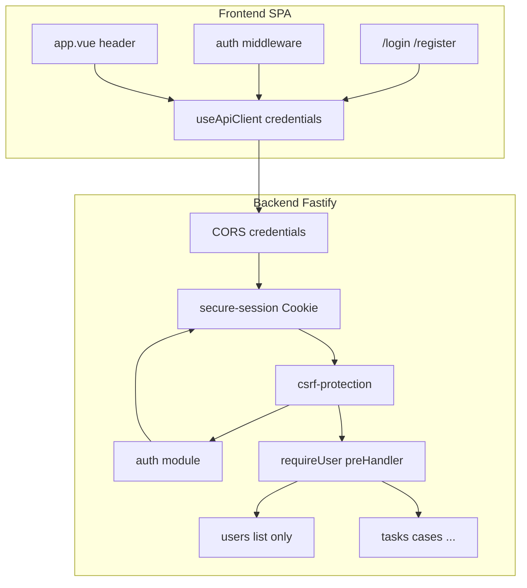
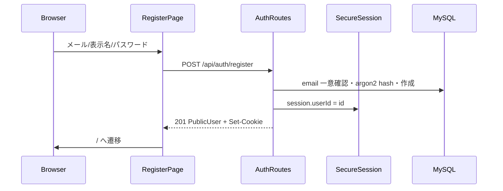
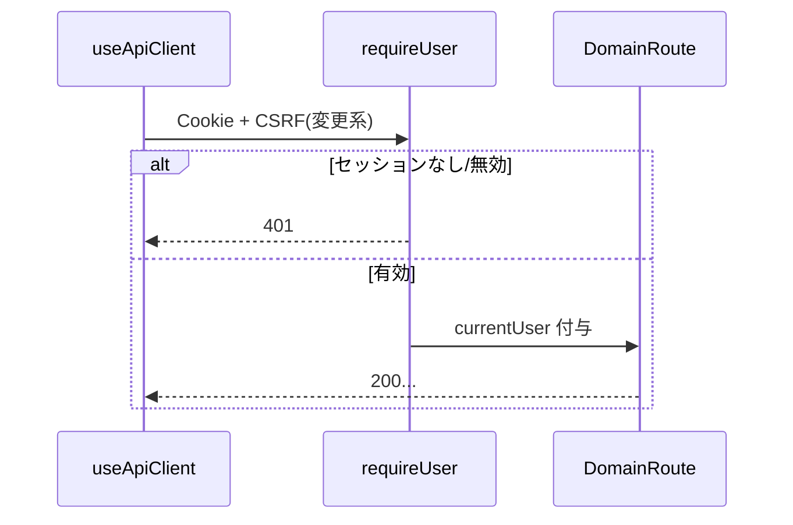
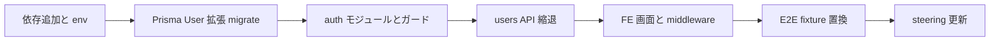

# Design Document: user-auth

## Overview

本機能は、名前だけの担当者レコードであった `User` を、メールアドレス・表示名・パスワードを持つアカウントへ拡張し、公開自己登録と HttpOnly Cookie セッションによるログイン／ログアウト、業務 API／画面の要ログイン化を導入する。登録成功時は自動ログインしてダッシュボードへ遷移する。ログイン済みユーザー間にロール差は設けない。

利用者は未ログインで登録・ログインでき、ログイン後は既存の業務画面を従来どおり利用する。担当者候補は自己登録されたアカウントの表示名一覧から選ぶ。旧「ユーザー」ナビと名前だけの登録／削除 UI・API は廃止する。

Impact: CORS は credentials 対応に変わり、フロントの全 API 呼び出しは Cookie を送る。認証なし前提の steering を更新する。ワークスペースによるデータ分離は後続仕様の対象であり、本仕様ではログインしていれば既存どおり全データを扱える。

### Goals

- 公開自己登録（メール一意・表示名・パスワード）とセッションログインを提供する
- 業務 API／画面を未ログインから保護する
- 担当者候補を登録済みアカウントから供給し続ける
- 認証前提を steering に反映する

### Non-Goals

- ワークスペース・メンバーシップ・データスコープ
- RBAC、招待リンク、メール送信、OAuth、パスワード再設定
- JWT／MCP 用トークン
- 他ユーザーアカウントの削除

## Boundary Commitments

### This Spec Owns

- `User` のアカウント化（email / passwordHash、表示名は既存 `name` を転用）
- 登録・ログイン・ログアウト・現在ユーザー取得の API とセッション発行／破棄
- 業務ルート向けの要ログインガードと公開ルート例外リスト
- CORS credentials・Cookie 属性・CSRF トークン取得と変更系 API への適用方針
- 登録／ログイン画面、未ログイン誘導、ヘッダーの表示名・ログアウト、旧 `/users` の廃止
- `useApiClient` の credentials 付与と auth メソッド
- product.md / tech.md / local-dev-pitfalls.md の認証前提更新

### Out of Boundary

- ワークスペース作成・招待・所属チェック（`workspace-membership` / `workspace-resource-scope`）
- タスク詳細のコメント／操作ログ（`task-detail`）
- ストーリーポイント／消化数（`velocity-dashboard`）
- 案件・タスク・カンバン等の業務ロジック本体（ガード適用と担当者候補の型追従のみ）
- 本番ドメイン構成のインフラ変更（同一親ドメイン前提は制約として記録するのみ）

### Allowed Dependencies

- 既存スタック: Nuxt 4 SPA / Fastify 5 / Prisma / MySQL / Zod / pino / Vitest / Playwright
- 新規依存（採用）: `@fastify/cookie`、`@fastify/secure-session`、`@fastify/csrf-protection`、`@node-rs/argon2`
- 共有: `HttpError`、`soft-delete`、`AppLogger`、`ErrorAlert`、確定モック（claude design）
- 凍結済み spec 文書は更新しない（コードのみ変更）

### Revalidation Triggers

- セッション格納方式の変更（Cookie 内セッション ↔ サーバストア／JWT）
- 公開ルート一覧の変更
- `PublicUser` / 認証 API のレスポンス形状の変更
- CORS Origin または Cookie `SameSite`/`Secure` 方針の変更
- `User` が担当者以外の意味をさらに持つ変更（ワークスペースメンバー検索など）

## Architecture

### Existing Architecture Analysis

- モジュールは `routes → service → repository`。`users` は name のみの CRUD
- `app.ts` が CORS と全ルート登録を担う。認証フックなし
- FE は `useApiClient` が唯一の HTTP 境界。`middleware/` なし
- 担当者 UI は `listUsers()` の `User.name` に依存

### Architecture Pattern & Boundary Map



- Selected pattern: 新規 `auth` モジュールがセッションと認証ユースケースを所有。`users` はログイン必須の一覧に縮退（Option C）
- Domain boundaries: ハンドラは `request.currentUser`（または同等）のみ参照し、Cookie 実装詳細に触れない
- Existing patterns preserved: Zod 検証、`HttpError` throw、ErrorAlert、モジュール分割（他エンティティの soft-delete 拡張は維持。User 自体の削除経路は作らない）
- Steering: 認証 OoB 記述を本仕様で更新する

### Technology Stack

| Layer | Choice / Version | Role in Feature | Notes |
|-------|------------------|-----------------|-------|
| Frontend | Nuxt 4 SPA | 登録／ログイン／middleware／ヘッダー | モック: `Auth Final Spec.dc.html` |
| Backend | Fastify 5 | ルート・ガード | |
| Session | `@fastify/cookie` 11.x + `@fastify/secure-session` 8.x | HttpOnly Cookie セッション | Cookie 内に `userId` のみ。ストア不要 |
| CSRF | `@fastify/csrf-protection` 8.x | 変更系 API 保護 | register／login／csrf GET／health は免除。logout を含むその他の変更系は必須 |
| Password | `@node-rs/argon2` | パスワードハッシュ | ネイティブビルド摩擦を避ける |
| Data | Prisma / MySQL | User 拡張 | 既存データ破棄前提 |
| Config | `SESSION_SECRET` 等 | セッション鍵 | env に追加 |

## File Structure Plan

### Directory Structure

```
backend/src/
├── app.ts                          # CORS credentials、セッション／CSRF 登録、ガード適用
├── config/env.ts                   # SESSION_SECRET, CORS_ORIGIN, COOKIE_SECURE 等
├── prisma/schema.prisma            # User: email, passwordHash, name(表示名)
├── shared/http-errors.ts           # unauthorized() 追加
├── modules/auth/                   # 新設
│   ├── auth.types.ts
│   ├── auth.repository.ts          # email 検索・作成（User 永続化）
│   ├── auth.service.ts             # register/login/logout/me、ハッシュ検証
│   ├── auth.routes.ts              # 公開 auth API
│   ├── auth.guard.ts               # requireUser preHandler
│   └── auth.*.test.ts
└── modules/users/
    ├── user.routes.ts              # GET /api/users（要ログイン。任意 q は後続 workspace-membership が追加）
    ├── user.service.ts             # list のみ（本仕様時点）。create/delete 削除
    └── user.types.ts               # PublicUser

frontend/
├── app.vue                         # 表示名・ログアウト。auth ページでは業務ナビ非表示
├── app.helpers.ts                  # /users ナビ除去
├── middleware/auth.global.ts       # 未ログイン保護と公開ページ例外
├── composables/useApiClient.ts     # credentials:'include'、auth API、createUser/deleteUser 削除
├── composables/useAuth.ts          # me / logout 状態（任意だが推奨）
├── pages/login.vue                 # 新規
├── pages/register.vue              # 新規
└── pages/users/index.vue           # 削除またはリダイレクト廃止

.kiro/steering/
├── product.md
├── tech.md
└── local-dev-pitfalls.md
```

### Modified Files

- `backend/src/app.ts` — プラグイン登録、公開パス以外へ `requireUser`
- `backend/package.json` / lock — 新規依存
- `docker-compose.yml` — セッション秘密鍵・CORS Origin 環境変数
- `frontend/e2e/*` — `/users` 名前登録を「登録＋ログイン」fixture に置換
- `backend/src/**/*.test.ts` / `validation.integration.test.ts` — セッション付与ヘルパ必須化
- 担当者表示を触る FE（型が `User.name` のままなら最小）

## System Flows

### 登録（自動ログイン）



### 業務 API（要ログイン）



### 未ログインで業務 URL

1. `auth.global` が業務ページを描画せず `/login?redirect=<元path>` へリダイレクトする
2. ゲート専用ページ（モックの「ログインが必要です」カード単体）は実装しない。必要ならログイン画面上の説明文として同等の文言を載せてよい
3. ログイン成功後、`redirect` があればそこへ、なければ `/`
4. 登録成功時は常に `/`（ダッシュボード）。`redirect` は使わない

## Requirements Traceability

| Requirement | Summary | Components | Interfaces | Flows |
|-------------|---------|------------|------------|-------|
| 1.1–1.7 | 自己登録・自動ログイン可能な状態 | AuthService, RegisterPage | POST /api/auth/register | 登録 |
| 2.1–2.5 | ログイン／ログアウト／セッション維持 | AuthService, Session, LoginPage, Header | POST login/logout, Cookie | ログイン |
| 3.1–3.4 | 未ログイン保護 | requireUser, auth.global（`/login?redirect=`） | 401 + redirect | 業務 API / 未ログイン |
| 4.1–4.4 | 名前登録廃止・担当者候補 | users list, nav, Assignee* | GET /api/users | — |
| 5.1–5.2 | 権限対等 | （ロールを作らない） | — | — |
| 6.1–6.2 | 誤り表示 | FE ErrorAlert, AuthService メッセージ | 400/401 body | — |
| 7.1–7.2 | steering 更新 | product/tech/local-dev-pitfalls | — | — |

## Components and Interfaces

| Component | Domain/Layer | Intent | Req Coverage | Key Dependencies | Contracts |
|-----------|--------------|--------|--------------|------------------|-----------|
| AuthService | Backend/auth | 登録・認証・セッション紐付け | 1, 2, 6 | auth.repository, argon2, session | Service, API |
| requireUser | Backend/auth | 要ログインガード | 3 | secure-session | — |
| UsersList | Backend/users | 担当者候補一覧 | 4 | User | API |
| useApiClient / useAuth | Frontend | credentials・auth API | 1–4 | $fetch | — |
| Login/Register pages | Frontend | 認証 UI | 1, 2, 6 | モック | — |
| auth.global | Frontend | 画面ガード | 3 | useAuth/me | — |
| App header | Frontend | 表示名・ログアウト、users ナビ削除 | 2, 4 | useAuth | — |

### Backend/auth

#### AuthService

| Field | Detail |
|-------|--------|
| Intent | アカウント作成と認証、セッションへの userId 設定／破棄 |
| Requirements | 1.1–1.7, 2.1–2.5, 6.1–6.2 |

**Responsibilities & Constraints**

- email は trim + 小文字正規化して一意保存する
- `name` は表示名（空／空白のみ不可）。既存カラムを転用する
- パスワードは 8 文字以上。ハッシュのみ永続化し、応答に含めない
- 登録成功時にセッションを確立する（自動ログイン）
- ログイン失敗メッセージは常に同一文言（要件 6.2）
- ロールを永続化・判定しない

**Dependencies**

- Outbound: auth.repository / Prisma User — P0
- External: `@node-rs/argon2`, `@fastify/secure-session` — P0

**Contracts**: Service [x] / API [x]

##### Service Interface

```typescript
interface PublicUser {
  id: string;
  email: string;
  name: string; // 表示名
  createdAt: string;
  updatedAt: string;
}

interface AuthService {
  register(input: { email: string; name: string; password: string }): Promise<PublicUser>;
  login(input: { email: string; password: string }): Promise<PublicUser>;
  getPublicUser(userId: string): Promise<PublicUser | null>;
}
```

- Preconditions: register の password.length >= 8、email 形式妥当
- Postconditions: register/login 成功後、呼び出し側ルートが session に userId を書き込む
- Invariants: passwordHash は PublicUser に現れない

##### API Contract

| Method | Endpoint | Request | Response | Errors |
|--------|----------|---------|----------|--------|
| POST | /api/auth/register | `{ email, name, password }` | 201 PublicUser | 400 |
| POST | /api/auth/login | `{ email, password }` | 200 PublicUser | 400, 401（同一利用者向け文言） |
| POST | /api/auth/logout | （空） | 204 | — |
| GET | /api/auth/me | — | 200 PublicUser | 401 |
| GET | /api/auth/csrf | — | `{ token: string }` | — |

ログイン失敗の利用者向け message は常に  
`メールアドレスまたはパスワードが正しくありません。`  
登録の email 重複は `このメールアドレスはすでに登録されています。` 等、登録用の明確な文言でよい。

##### Session / Cookie

- Cookie: HttpOnly、Path=/、SameSite=Lax
- Secure: 環境変数 `COOKIE_SECURE`（ローカル default false、本番 true）
- ペイロード: `{ userId: string }` のみ（secure-session が暗号化）
- 有効期限: 設計既定 7 日（`expiry`）。ブラウザを閉じずに同一クライアントで維持（要件 2.3）
- logout: session 削除（Cookie 破棄）

##### CSRF

- 変更系（POST/PATCH/DELETE）は CSRF トークン必須。例外: `POST /api/auth/register`、`POST /api/auth/login`、`GET /api/auth/csrf`、`GET /health`
- `POST /api/auth/logout` はログイン中の変更系として CSRF を要求する
- `GET /api/auth/csrf` は未ログインでも成功する（公開ルート）。トークン発行にログイン済みセッションを必須としない
- FE の `useApiClient`（または同等の初期化箇所）は、アプリ起動時およびログイン／登録成功直後に `GET /api/auth/csrf` でトークンを取得・保持する
- 以降の変更系リクエストに、`@fastify/csrf-protection` の既定ヘッダ名（実装時にライブラリドキュメントで確認し、design／tasks で固定）でトークンを付与する
- CSRF トークンの既定ヘッダ名は `csrf-token` とする
- 統合テスト: 未ログインでの csrf GET 成功、CSRF なしの業務 POST／PATCH／DELETE 拒否、register／login が CSRF なしで成功、ことを観点に含める

##### Public routes（ガード除外）

- `GET /health`
- `POST /api/auth/register`
- `POST /api/auth/login`
- `GET /api/auth/csrf`
- `POST /api/client-errors`（ログイン前のクライアントエラー通報を残す）

それ以外の `/api/*` は `requireUser` 必須。未ログインは 401。

**Implementation Notes**

- CORS: `credentials: true`、`origin` は `CORS_ORIGIN`（例: `http://localhost:3001`）。`*` は使わない
- FE `$fetch` / `useApiClient`: `credentials: 'include'`
- 統合テスト: セッション Cookie を付与するテストヘルパを `backend/src/test/` 等に用意する

### Backend/users

#### UsersListService

| Field | Detail |
|-------|--------|
| Intent | ログイン済み利用者向けの担当者候補一覧 |
| Requirements | 4.2, 4.4 |

- `GET /api/users` → `PublicUser[]`（password なし）。要ログイン
- 本仕様時点の契約はクエリなしの全件一覧。後続の`workspace-membership`が任意の`q`（表示名・メールの部分一致検索）を追加する。`q`未指定時は従来どおり全件を返し後方互換を維持する（Revalidation Trigger「User が担当者以外の意味をさらに持つ変更」に該当）
- `POST /api/users` と `DELETE /api/users/:id` は削除する
- User の削除 API は本仕様で設けない。共有 soft-delete 拡張の既定により `deletedAt` 非 null 行は一覧に出ない（通常は削除経路がないため該当行は発生しない）

### Frontend

#### 画面（claude design 準拠）

- `/register`, `/login`: 左右分割（左 slate-900 + アプリ名、右フォーム max 360px）。業務ナビなし
- パスワード表示切替（aria-label 切替）
- エラーは上部アラートのみ
- 登録成功 → 自動ログイン済み Cookie のまま `/` へ
- ログイン成功 → `redirect` クエリがあればそこへ、なければ `/`
- 未ログイン業務 URL: ミドルウェアで業務内容を描画せず `/login?redirect=` へリダイレクト（ゲート専用ルートは作らない）
- ヘッダー: 既存全ナビ維持。`/users` のみ除去。右に表示名＋「ログアウト」
- `/users` ページは削除し、直リンク時は `/` または 404 相当へ

#### auth.global middleware

- 公開: `/login`, `/register`（必要なら完全一致のみ）
- それ以外は `GET /api/auth/me` 成功が必要。失敗時は対象ページを描画せず `/login?redirect=` へリダイレクト
- ログイン済みで `/login` `/register` に来た場合は `/` へ

## Data Models

### Domain Model

- Aggregate: User（アカウント）
- Invariants: email 一意（正規化後）、passwordHash 必須、name 非空、ロール属性なし

### Physical Data Model

```prisma
model User {
  id           String    @id @default(uuid())
  email        String    @unique
  name         String    // 表示名
  passwordHash String    @map("password_hash")
  createdAt    DateTime  @default(now()) @map("created_at")
  updatedAt    DateTime  @updatedAt @map("updated_at")
  deletedAt    DateTime? @map("deleted_at")
  tasks        Task[]
  @@index([deletedAt])
  @@map("users")
}
```

- 既存データは破棄前提。開発 DB は migrate で破壊的変更を許容する（バックアップ不要）
- API の `PublicUser` に `passwordHash` を絶対に載せない（repository の select / mapper で除去）
- User の論理削除は本仕様では行わない。`POST/DELETE /api/users` を廃止し、新規のアカウント削除経路も追加しない
- `deletedAt` 列は既存 soft-delete 拡張とのスキーマ互換のため残してよいが、本仕様および当面は User 行を delete しない（email `@unique` と論理削除の衝突を避ける）。将来アカウント削除が必要なら、アクティブ行のみ一意にする部分ユニーク等を別 spec で設計する

## Error Handling

### Error Strategy

- 検証失敗: 400 + 日本語 message
- 未ログイン API: 401（`unauthorized`）
- ログイン失敗: 401 + 固定文言
- システムエラー: 既存 `setErrorHandler`（500、詳細はログ）

### Error Categories and Responses

| 状況 | status | 利用者向け |
|------|--------|------------|
| 入力不備・email 形式・短すぎるパスワード | 400 | 具体的な不足内容 |
| email 重複 | 400 | このメールアドレスはすでに登録されています。 |
| ログイン失敗 | 401 | メールアドレスまたはパスワードが正しくありません。 |
| 業務 API 未ログイン | 401 | （FE はログインへ誘導） |

### Monitoring

- ログイン失敗は `logError` または business/access に requestId 付きで記録（利用者には固定文言）
- パスワードやハッシュをログに出さない

## Testing Strategy

### Unit Tests

- AuthService.register: 成功、email 重複、短いパスワード、空白表示名
- AuthService.login: 成功、未知 email、誤りパスワード（同一エラー）
- email 正規化（大文字小文字）で同一視されること
- PublicUser に passwordHash が含まれないこと

### Integration Tests

- 未ログインで `GET /api/tasks` → 401
- 登録 → Cookie → `GET /api/auth/me` 200
- ログイン → 業務 API 200
- logout 後 401
- CSRF なしの変更系が拒否されること（設定した例外を除く）
- `POST /api/users` / `DELETE /api/users/:id` が存在しないこと
- `GET /api/users` は要ログインで一覧を返す（後続で任意`q`が付いても、未指定時の全件返却は維持すること）

### E2E / UI Tests

- 登録 → ダッシュボード表示、ヘッダーに表示名
- ログイン失敗で固定エラー文言
- ログアウト後に業務画面へ入れない
- 未ログインで `/tasks` → ログイン誘導 → ログイン後に `/tasks` へ戻る
- 担当者セレクトに登録ユーザーの表示名が出る（旧 `/users` 名登録に依存しない）

## Security Considerations

- パスワードは Argon2 ハッシュのみ保存
- セッション Cookie は HttpOnly + SameSite=Lax。Secure は環境依存
- CSRF を変更系に適用
- ログイン失敗の情報漏洩を抑止（固定文言）
- 将来本番はフロントと API を同一親ドメイン配下に置く（roadmap 制約）。別 eTLD+1 のままでは Cookie が不安定
- MCP／Bearer は本仕様で実装しない。`requireUser` が currentUser を供給する形に閉じ、後続で別認証を追加可能にする

## Migration Strategy



- ロールバック: 開発段階のため、migrate 巻き戻しと依存削除で足りる
- 本番データ移行ツールは作らない（要件の破棄前提）

## Supporting References

- ビジュアル正本: `.kiro/specs/user-auth/research.md`「ビジュアルデザイン確定」
  - https://claude.ai/design/p/159ca27f-ecb8-4e35-8cdc-74e05c366d25 / `Auth Final Spec.dc.html`
- ギャップ分析: 同 `research.md` セクション 1–6
