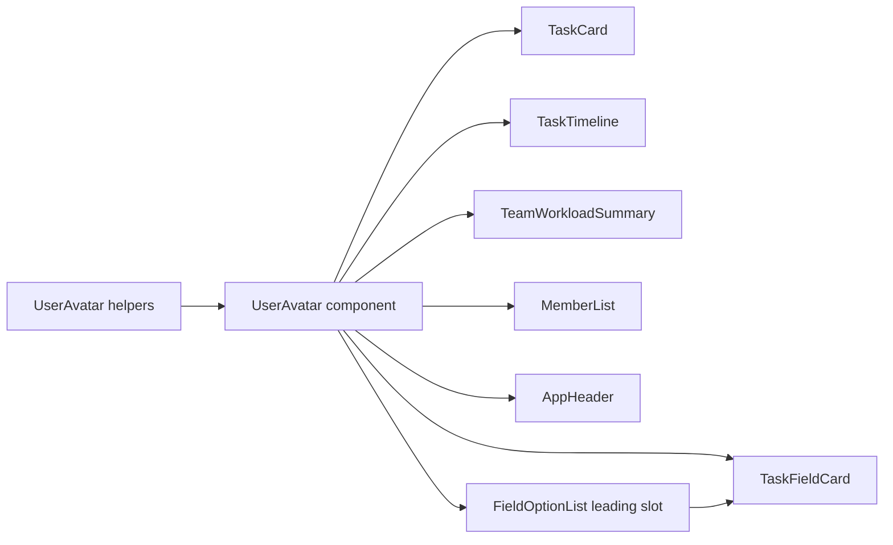

# Design Document: user-avatar

## Overview

**Purpose**: 各ユーザーの識別子から決定的に生成するidenticon(GitHub風・対称グリッド)を、ユーザー名が独立したラベルとして表示される主要箇所に一貫して表示する。プロフィール画像のアップロード機能は存在せず、identiconが常時・唯一の視覚的識別手段になる。

**Users**: タスク管理アプリの全ログインユーザー。カンバンボード・タスク詳細・ワークスペース管理画面を利用する際、担当者・コメント投稿者・メンバーを見た目で識別できるようになる。

**Impact**: `frontend/components/shared/`に新規の`UserAvatar`コンポーネント一式を追加し、既存のユーザー名表示箇所(タスクカード・担当者フィールド・タイムライン・稼働状況・メンバー一覧・ヘッダー等)へ差し込む。`TaskCard.vue`の既存イニシャル円は削除して置き換える。バックエンドAPI・データモデルの変更はない。

### Goals
- `userId`のみを種とした決定的なidenticon生成(同一ユーザーは常に同一の見た目)
- 8つの表示文脈(担当者バッジ・担当者フィールド本体・担当者ドロップダウン・子タスク担当者・コメント投稿者・チーム稼働状況・ワークスペースメンバー一覧・ヘッダー)への一貫した統合
- claude designで確定した視覚仕様(5×5対称グリッド・機械生成12色パレット・3種の対称軸・塗りセル数ガード)をそのまま実装に反映する

### Non-Goals
- ユーザー設定ページ、画像アップロード・アイコン変更機能(将来別仕様)
- 操作ログ文中埋め込みのアクター名への表示
- ネイティブ`<select>`内でのアイコン表示
- パレット分割数`N`の実行時設定化(定数として`N=12`を固定する)

## Boundary Commitments

### This Spec Owns
- `userId`からidenticonパターン(グリッド・配色・対称軸)を決定的に算出する純粋関数
- `UserAvatar.vue`共有コンポーネントの描画実装(SVG・サイズ・アクセシビリティ属性)
- 既存表示文脈(担当者バッジ・担当者フィールド本体・担当者ドロップダウン選択肢・子タスク一覧の担当者ラベル・コメント投稿者・チーム稼働状況・メンバー一覧・ヘッダー)への統合差し込み
- `TaskCard.vue`の`assigneeId`props追加・3呼び出し元の配線
- `TaskTimeline.vue`の既存イニシャル円(`avatarInitial`、自分/他人の色分け)の削除と`UserAvatar`への置き換え
- `FieldOptionList.vue`へのドメイン非依存な`#leading`スロット追加(担当者ドロップダウンのみが利用し、優先度/ステータス/開発段階の既存呼び出しには影響しない)

### Out of Boundary
- ユーザー設定ページの新規・変更
- 画像アップロード・アイコン手動変更のUI/API
- 操作ログ文中埋め込みアクター名への表示
- ネイティブ`<select>`内へのアイコン描画(`AssigneeFilter.vue`等は変更しない)
- `WorkspaceSettingsModal.vue`(ワークスペース名と識別色の編集のみ。ユーザー名を表示しない)
- バックエンドAPI・Prismaスキーマの変更(既存の`userId`のみで完結するため不要)

### Allowed Dependencies
- 既存の`User`/`PublicUser`型(`composables/useApiClient.ts`)の`id`フィールドをpropsとして受け取るのみ。各呼び出し元の既存データ取得ロジック(API呼び出し・一覧解決)は変更しない
- `frontend/components/shared/`の`Badge.vue`系が確立した「コンポーネント + `.helpers.ts` + `.test.ts`」の三点構成を踏襲する

### Revalidation Triggers
- `User.id`の型・意味・生成方法が変わる場合
- 画像アップロード機能が追加され、identiconが「未設定時のフォールバック」に役割変更する場合(`UserAvatar.vue`にフォールバック分岐の追加設計が必要になる)
- 統合先の各画面のDOM構造が大きく変わる場合(差し込み位置の再確認が必要)

## Architecture

### Existing Architecture Analysis
フロントエンドはNuxt 4のファイルベースルーティングと、`components: [{ path: "~/components", pathPrefix: false }]`設定によるプレフィックスなし自動インポートを採用する([[structure]])。`frontend/components/shared/`には`Badge.vue`/`PriorityBadge.vue`等、単一責務の小さな表示コンポーネントが集約されており、各コンポーネントは静的なTailwindクラスルックアップ(JIT purge対策)を用いる。本機能はこの既存パターンをそのまま踏襲する。

### Architecture Pattern & Boundary Map



**Architecture Integration**:
- 選択パターン: 生成ロジック(純粋関数)と描画(プレゼンテーショナルコンポーネント)を分離する2層構成(gap analysis Option C)
- ドメイン境界: `UserAvatar.helpers.ts`は`userId`文字列のみを入力とし、Vue/DOMに一切依存しない。`UserAvatar.vue`はhelpersの出力をSVGとして描画するだけで、生成ロジックを持たない
- 既存パターンの踏襲: `Badge`系コンポーネントの三点構成、静的Tailwindクラスルックアップ、`frontend/composables/useApiClient.ts`が定義する`User`型の`id`フィールド
- 新規コンポーネントの理由: 8箇所以上での再利用と、claude designで比較検討した生成アルゴリズム(3案→対称軸3種+ガード)を1箇所に閉じ込めて単体テスト可能にするため
- Steering準拠: 新規外部ライブラリを追加しない(`tech.md`のKey Librariesに追記不要)。TypeScript strictモード、モジュール間は公開インターフェース経由という規約に従う

### Technology Stack

| Layer | Choice / Version | Role in Feature | Notes |
|-------|------------------|------------------|-------|
| Frontend | Vue 3 (Nuxt 4, 既存) | `UserAvatar.vue`のSVG描画 | 新規ライブラリなし。インラインSVGは既存の手書きSVGアイコンと同じ方針 |
| Frontend / Logic | TypeScript strict (既存) | `UserAvatar.helpers.ts`の決定的生成ロジック | FNV-1aハッシュ・mulberry32系PRNGを自前実装(外部hash/uuidライブラリ不使用) |

## File Structure Plan

### Directory Structure
```
frontend/components/shared/
├── UserAvatar.vue                # 新規: identiconをSVGとして描画する共有コンポーネント
├── UserAvatar.helpers.ts         # 新規: userIdから決定的にパターン/配色を算出する純粋関数
├── UserAvatar.helpers.test.ts    # 新規: 決定性・ガード・パレット生成の単体テスト
└── UserAvatar.test.ts            # 新規: props(userId/size/name)によるレンダリング・a11y属性の検証
```

### Modified Files
- `frontend/components/kanban/TaskCard.vue` — `assigneeId`props追加、既存の`bg-primary-100`イニシャル円(`assigneeInitial`計算含む)を`UserAvatar`に置き換え
- `frontend/components/kanban/AssigneeFocusTray.vue` — `TaskCard`へ`assigneeId`を配線
- `frontend/components/kanban/UnassignedBacklogPanel.vue` — 同上
- `frontend/pages/workspaces/[workspaceId]/kanban/index.vue` — 同上(`TaskCard`呼び出し箇所)
- `frontend/components/tasks/TaskFieldCard.vue` — (a)メイン担当者フィールドの氏名表示(257行目付近)に`UserAvatar`を併記。(b)子タスク一覧の各行の担当者ラベル(`userName(child.assigneeUserId)`、504行目付近)にも`UserAvatar`を併記。(c)担当者ドロップダウン(`FieldOptionList`呼び出し、279行目付近)で、下記`FieldOptionList.vue`の`#leading`スロットに`UserAvatar`(20px)を渡す
- `frontend/components/tasks/FieldOptionList.vue` — 任意の名前付きスロット`#leading="{ option }"`を追加し、オプション行の先頭に汎用的な装飾要素を差し込めるようにする(ドメイン非依存の拡張。優先度/ステータス/開発段階の既存3呼び出しはスロットを渡さないため無変更で動作する)
- `frontend/components/tasks/TaskTimeline.vue` — コメント投稿者行にある既存のイニシャル円(`avatarInitial(authorLabel(...))`、自分/他人で色分け、301〜310行目付近)を削除し`UserAvatar`に置き換える(自分/他人の色分けは廃止)。操作ログ文中埋め込み(`changeMessage`)は変更しない
- `frontend/components/tasks/TaskTimeline.helpers.ts` / `TaskTimeline.helpers.test.ts` — 上記置き換えにより`avatarInitial`関数が他箇所から参照されなくなるため削除する(利用箇所は`TaskTimeline.vue`のみと確認済み)
- `frontend/components/kanban/TeamWorkloadSummary.vue` — チーム稼働状況チップ(通常レイアウトとコンパクトレイアウトの両方)の氏名表示に`UserAvatar`を併記
- `frontend/pages/workspaces/index.vue` — ワークスペースメンバー一覧行に`UserAvatar`を併記。`WorkspaceSettingsModal.vue`はユーザー名を表示しないため変更しない
- `frontend/app.vue` — ヘッダーの現在ユーザー表示(`{{ user?.name }}`)に`UserAvatar`を併記

## Requirements Traceability

| Requirement | Summary | Components | Interfaces | Flows |
|-------------|---------|------------|------------|-------|
| 1.1 | userIdのみからパターン導出 | UserAvatar.helpers.ts | `generateUserAvatarPattern` | - |
| 1.2 | 表示箇所・再読み込みをまたぐ同一性 | UserAvatar.helpers.ts | `generateUserAvatarPattern`(純粋関数・副作用なし) | - |
| 1.3 | 表示名変更でパターン不変 | UserAvatar.helpers.ts | `generateUserAvatarPattern`(引数はuserIdのみ) | - |
| 1.4 | 異なるユーザー間の高い識別性 | UserAvatar.helpers.ts | 12色パレット×対称軸3種×5×5グリッド | - |
| 2.1 | 各文脈への統合表示(担当者ドロップダウン・子タスク行・コメント投稿者の既存円置き換えを含む) | UserAvatar.vue + Modified Files全件、FieldOptionList.vue(`#leading`スロット) | `UserAvatarProps` | - |
| 2.2 | 名前未解決時もアイコン表示 | UserAvatar.vue, TaskTimeline.vue | `UserAvatarProps.userId`(必須・単独で完結) | - |
| 3.1 | TaskCardの既存イニシャル円の置き換え | TaskCard.vue | `UserAvatarProps` | - |
| 4.1 | アクセシビリティ | UserAvatar.vue | `UserAvatarProps.name`(任意) | - |
| 5.1-5.4 | 対象外の明示 | (該当コンポーネントなし。Boundary Commitments参照) | - | - |

## Components and Interfaces

| Component | Domain/Layer | Intent | Req Coverage | Key Dependencies (P0/P1) | Contracts |
|-----------|--------------|--------|---------------|---------------------------|-----------|
| UserAvatar.helpers.ts | Frontend / Shared Logic | userIdから決定的にidenticonパターンを算出する純粋関数群 | 1.1, 1.2, 1.3, 1.4, 2.2 | なし(外部依存なし) | Service |
| UserAvatar.vue | Frontend / Shared UI | helpersの出力をSVGとして描画し、propsに応じてa11y属性を切り替える | 2.1, 3.1, 4.1 | UserAvatar.helpers.ts (P0) | State |
| FieldOptionList.vue | Frontend / Shared UI | 既存の汎用オプション一覧に、ドメイン非依存の任意`#leading`スロットを追加する | 2.1 | UserAvatar.vue (P1、担当者ドロップダウンの呼び出し側のみ) | なし |
| 統合先ファイル群 | Frontend / Integration | 既存の氏名表示・オプション一覧に`UserAvatar`を差し込む(TaskCard/TaskTimelineは既存アバターの置き換え) | 2.1, 2.2, 3.1 | UserAvatar.vue (P0), FieldOptionList.vue (P1) | なし |

### Frontend / Shared Logic

#### UserAvatar.helpers.ts

| Field | Detail |
|-------|--------|
| Intent | `userId`文字列から、5×5対称グリッドの塗り分け・配色・対称軸を決定的に算出する純粋関数を提供する |
| Requirements | 1.1, 1.2, 1.3, 1.4, 2.2 |

**Responsibilities & Constraints**
- 入力は`userId: string`のみ。表示名・その他のユーザー属性を一切参照しない(Requirement 1.3の保証)
- 副作用・非同期処理を持たない。同一入力に対し常に同一出力を返す(Requirement 1.2の保証)
- Vue/DOM/ブラウザAPIに依存しない(SSRを行わない静的SPA構成のため必須ではないが、単体テスト容易性のために純粋関数として分離する)

**Dependencies**
- Inbound: `UserAvatar.vue` — パターン算出結果の取得 (P0)
- Outbound: なし
- External: なし(FNV-1aハッシュ・PRNGは自前実装。外部hash/color/uuidライブラリは追加しない)

**Contracts**: Service [x] / API [ ] / Event [ ] / Batch [ ] / State [ ]

##### Service Interface
```typescript
export type UserAvatarAxis = "leftRight" | "topBottom" | "point";

export interface UserAvatarCell {
  x: number;
  y: number;
  tone: "main" | "alt";
}

export interface UserAvatarPattern {
  gridSize: 5;
  cells: UserAvatarCell[];
  backgroundColor: string;
  mainColor: string;
  altColor: string;
  axis: UserAvatarAxis;
}

export function generateUserAvatarPattern(userId: string): UserAvatarPattern;
```
- Preconditions: `userId`は空文字列を含む任意の文字列を受け付ける(バリデーションはしない。呼び出し元は`User.id`を渡す前提)
- Postconditions: 返り値の`cells`は空白マスを含まない(塗られたマスのみを列挙する)。`backgroundColor`/`mainColor`/`altColor`はCSS `hsl()`文字列
- Invariants:
  - 同一`userId`に対する呼び出しは、実行タイミング・呼び出し順序に関わらず常に同一の`UserAvatarPattern`を返す
  - `axis`は`userId`のFNV-1aハッシュ由来のPRNG(mulberry32系)から3択(`leftRight`/`topBottom`/`point`)を決定する。`point`(点対称)では中心セル(2,2)を単独抽選し、残り24セルは中心点対称のペアで同一トーンを共有する。`leftRight`/`topBottom`は中心列/中心行を軸に鏡写しする
  - 各セルのトーン抽選確率は 空白42% / 主色36% / 差し色22%。独立領域(反転2種は15セル、点対称は13セル)の塗りセル数(空白でないセル数)が独立領域サイズの34%〜74%に収まるまで、同一PRNG列の続きから最大12回reroll(引き直し)する。12回試行しても範囲内に収まらない場合は12回目の結果をそのまま採用する
  - 配色は色相を`N=12`分割(30度刻み)した機械生成パレットから、PRNGでインデックスを1つ選択する。彩度・明度は暖色/緑〜オリーブ/青緑〜青/紫〜ピンクの4つの色相帯ごとに固定の代表値を用いる(帯定義は`research.md`のビジュアルデザイン確定を参照)。差し色・背景色は主色の色相から式で算出し、個別の手動チューニングは行わない

### Frontend / Shared UI

#### UserAvatar.vue

| Field | Detail |
|-------|--------|
| Intent | `UserAvatar.helpers.ts`が算出したパターンをSVGとして描画し、サイズ・アクセシビリティ属性をpropsで制御する |
| Requirements | 2.1, 3.1, 4.1 |

**Responsibilities & Constraints**
- 生成ロジックを持たない。`generateUserAvatarPattern(props.userId)`の結果をSVGとして描画するだけ(配色・格子の算出はhelpers側)
- `size`ごとの角丸(`border-radius = size × 0.1875`)・内側1pxハイライト枠(`inset 0 0 0 1px rgba(15,23,42,.10)`)を適用する
- 角丸で四隅のセルが欠けないよう、viewBoxにグリッド単位の内側余白(`GRID_PAD = 0.35`)を取り、背景色で枠まで塗りつぶす
- `size`が`gridSize`で割り切れないとき隣接セル間にヘアラインが出るため、`shape-rendering="crispEdges"`と塗りセルのわずかな重ね描き(1.04)で隙間を潰す
- `name` propの有無でアクセシビリティ属性を切り替える(下記Contracts参照)

**Dependencies**
- Inbound: 統合先ファイル群 (P0)
- Outbound: `UserAvatar.helpers.ts` — パターン算出 (P0)
- External: なし

**Contracts**: Service [ ] / API [ ] / Event [ ] / Batch [ ] / State [x]

##### State Management
```typescript
export interface UserAvatarProps {
  userId: string;
  size?: 20 | 24 | 28 | 32 | 64; // default: 24
  name?: string; // 指定時のみ aria-label / title を付与
}
```
- State model: `props`から`computed`で`UserAvatarPattern`を導出するのみ。コンポーネント固有の内部状態は持たない
- Persistence & consistency: 該当なし(クライアント側の描画のみ、永続化なし)
- Concurrency strategy: 該当なし(同期的な純粋計算)

**Implementation Notes**
- Integration: `name`が指定された場合は`role="img"` `aria-label="{{ name }}"` `title="{{ name }}"`を付与し`aria-hidden`を外す。`name`が未指定の場合は`aria-hidden="true"`とし装飾要素として扱う。氏名テキストが隣接表示されないTaskCard(3.1)と担当者ドロップダウンの選択肢(`option.label`と同じ行に描画されるため実際は隣接するが、`FieldOptionList`側で`aria-label`を選択肢全体に既に付けているため二重読み上げを避け`name`は渡さない)を除き、氏名テキストが常に隣接する他の箇所では`name`を渡さない(装飾扱いで十分にRequirement 4.1を満たす。氏名の可読性は隣接テキストまたは`FieldOptionList`側の`aria-label`が担保する)
- Validation: `userId`は必須propとしてVueの型チェックで担保する。空文字列や未解決の`userId`が渡っても、helpers側は例外を投げず有効な(ただし無意味な)パターンを返すため、呼び出し元での追加バリデーションは不要
- Risks: `size`に定義外の値を渡すコンパイルエラーは型で防げるが、将来サイズ追加時は`UserAvatarProps.size`のユニオン型を更新する必要がある(意図的な制約。任意サイズを許容すると`border-radius`計算が奇数pxで滲むリスクがあるため)

#### FieldOptionList.vue

| Field | Detail |
|-------|--------|
| Intent | 既存の汎用オプション一覧(優先度/ステータス/開発段階/担当者ドロップダウンで共用)に、ドメイン非依存の任意スロットを追加し、担当者ドロップダウンだけが`UserAvatar`を差し込めるようにする |
| Requirements | 2.1 |

**Implementation Notes**
- Integration: `options: Array<{ value: string; label: string }>`という既存の汎用contractは変更しない。オプション行(`<button role="option">`)の先頭に任意の名前付きスロット`#leading="{ option }"`を追加し、指定されなければ何もレンダリングしない(既存の優先度/ステータス/開発段階の3呼び出しは無変更)。`TaskFieldCard.vue`の担当者ドロップダウン呼び出しのみ`<template #leading="{ option }"><UserAvatar :userId="option.value" :size="20" /></template>`を渡す(propsはcamelCase。vue-tscのテンプレート型検査に合わせる)
- Validation: `FieldOptionList.vue`自体はユーザードメインを一切知らない(`option.value`をuserIdとして解釈するのは呼び出し側の責務)。これにより優先度等の非ユーザーフィールドへの意図しない波及を防ぐ(design review Critical Issue 3への対応)
- Risks: スロット追加はテンプレートの純粋な拡張であり、既存の`role="listbox"`/`role="option"`/`aria-selected`によるアクセシビリティ構造には影響しない

### Frontend / Integration (統合先ファイル群)

**Intent**: 既存の氏名テキスト表示・オプション一覧に`UserAvatar`を差し込む(TaskCard・TaskTimelineは既存アバターの置き換え)。新しいロジック・状態は持たない

**Implementation Notes**
- Integration: `TaskCard.vue`は`assigneeId?: string`をpropsに追加し、`AssigneeFocusTray.vue`・`UnassignedBacklogPanel.vue`・`kanban/index.vue`の3呼び出し元で`task.assigneeUserId`を渡す(既存コードで取得済みであることを確認済み)。氏名テキストが隣にないため`name`に`assigneeName`を渡し、`title`/`aria-label`で担当者名を提供する。既存の`assigneeInitial`計算プロパティと関連テンプレートは削除する。`TaskTimeline.vue`は既存の`avatarInitial(authorLabel(...))`循環(自分/他人の色分け)を削除し`UserAvatar`に置き換える。それに伴い`TaskTimeline.helpers.ts`の`avatarInitial`関数と対応するテストを削除する(他箇所からの参照なしを確認済み)。`TaskFieldCard.vue`はメイン担当者フィールド・子タスク一覧の各行(`userName(child.assigneeUserId)`)・担当者ドロップダウン(`FieldOptionList`の`#leading`スロット経由)の3箇所すべてに`UserAvatar`を差し込む。`TeamWorkloadSummary.vue`は通常・コンパクトの両レイアウトに差し込む。メンバー表示は`pages/workspaces/index.vue`のみとする
- Validation: 他のファイルは既存コードで`user.id`/`userId`/`member.userId`等が既に取得可能であることをgap analysis(`research.md`)および本レビューで確認済み。新規のデータ取得追加は不要
- Risks: `TaskTimeline.vue`のコメント投稿者・活動ログの`userId`解決に失敗するケース(2.2)は、`UserAvatar`へは常に生の`userId`を渡す(名前解決の成否と無関係)ことで担保する。既存の`userLabel`/`authorLabel`のフォールバック文字列表示ロジックは変更しない

## Data Models

本機能は永続化データを持たない。`UserAvatarPattern`はクライアント側で`userId`から都度算出される値オブジェクトであり(Components and Interfacesのservice interfaceを参照)、DBスキーマ・APIレスポンス形状への変更はない。

## Error Handling

### Error Strategy
本機能はネットワーク呼び出し・非同期処理を持たない同期的な純粋計算のため、4xx/5xx相当のエラー状態は発生しない。`userId`の型はTypeScript strictモードでコンパイル時に保証する。

### Error Categories and Responses
- **不正な入力**: 発生しない(`userId`は呼び出し元が既存の`User.id`から渡す。空文字列等の異常値でもhelpersは例外を投げず決定的な結果を返す)
- **塗りセル数ガードの上限到達**: エラーではなく仕様上の正常系(12回reroll後に最後の結果を採用する。`UserAvatar.helpers.ts`の`Invariants`参照)

## Performance & Scalability

カンバンの想定運用規模(`kanban-ux-redesign`: チーム10名程度、開発段階未設定のバックログ約50件、1人あたりの進行中は数件)では、一覧内にアバターが並ぶ。`generateUserAvatarPattern`は5×5グリッド・最大12回rerollの軽量な同期計算であり、1回あたりの計算コストは無視できる規模である。同一`userId`を複数インスタンスがそれぞれ算出しても、この規模では共有キャッシュを置かない。`UserAvatar.vue`内では`computed`により`userId`propが変化しない限り再計算しないようにし、無関係な親の再レンダリングでの重複計算を避ける。

## Testing Strategy

### Unit Tests (`UserAvatar.helpers.test.ts`)
- 同一`userId`への複数回の呼び出しが、グリッド・配色・対称軸すべて同一の`UserAvatarPattern`を返すこと(1.1, 1.2)
- `generateUserAvatarPattern`が`userId`以外の引数を受け付けず、表示名相当の値を渡してもパターンに影響しないこと(1.3)
- 大量(1000件規模)のダミー`userId`に対し、`axis`・パレットインデックス・`cells`の組み合わせが完全一致するケースが実用上ほぼ発生しないこと(1.4)
- 塗りセル数が独立領域の34%〜74%の範囲外になるケースで、同一PRNG列からの reroll により範囲内の結果に収束すること。12回全て範囲外の場合は12回目の結果がそのまま返ること
- `axis`が`leftRight`/`topBottom`/`point`の3値からuserId由来のハッシュで決定的に選ばれ、`point`時は中心セル(2,2)が単独抽選されること

### Integration Tests (`UserAvatar.test.ts`)
- `name` propを渡した場合に`aria-label`・`title`が設定され`aria-hidden`が付与されないこと(4.1)
- `name` propを渡さない場合に`aria-hidden="true"`となること
- `size` propに応じてSVGの`width`/`height`と角丸(`border-radius`)が仕様どおりに変わること

### Integration Tests (統合先)
- `TaskCard.vue`が`assigneeId`ありのカードで`UserAvatar`を描画し、担当者名を`name`として渡して`title`/`aria-label`が付くこと。担当者なしのカードでは何も描画しないこと(既存の`v-if="assigneeName"`相当の挙動を維持)(3.1, 4.1)
- `TaskTimeline.vue`が、既存の`avatarInitial`循環(自分/他人の色分け)を描画せず`UserAvatar`のみを描画すること。`authorUserId`に対応する`User`が`props.users`に見つからない場合でも`UserAvatar`が表示され続けること(2.2, 2.1)
- `TaskFieldCard.vue`が、(a)メイン担当者フィールド、(b)子タスク一覧の各行の担当者ラベル、(c)担当者ドロップダウンの各選択肢、の3箇所すべてで`UserAvatar`を描画すること(2.1)
- `FieldOptionList.vue`が、`#leading`スロット未指定時(優先度/ステータス/開発段階の既存呼び出し)は何も追加描画せず、既存の見た目・DOM構造が変わらないこと
- `TeamWorkloadSummary.vue`(通常レイアウトとコンパクトレイアウトの両方)・ワークスペースメンバー一覧・ヘッダーの各箇所で、既存の氏名表示に`UserAvatar`が併記されること(2.1)

### E2E
新規の操作フロー・画面遷移は発生しないため、既存の`frontend/e2e/*.spec.ts`への新規シナリオ追加は不要と判断する。表示差し込みの確認は上記コンポーネントテストと開発サーバーでの目視確認で代替する。既存の`kanban.spec.ts` / `kanban-backlog.spec.ts`は担当者表示を`[title="${userName}"]`で検証しているため、TaskCardが`name`を渡して`title`を維持すれば既存アサーションは変更不要である。
