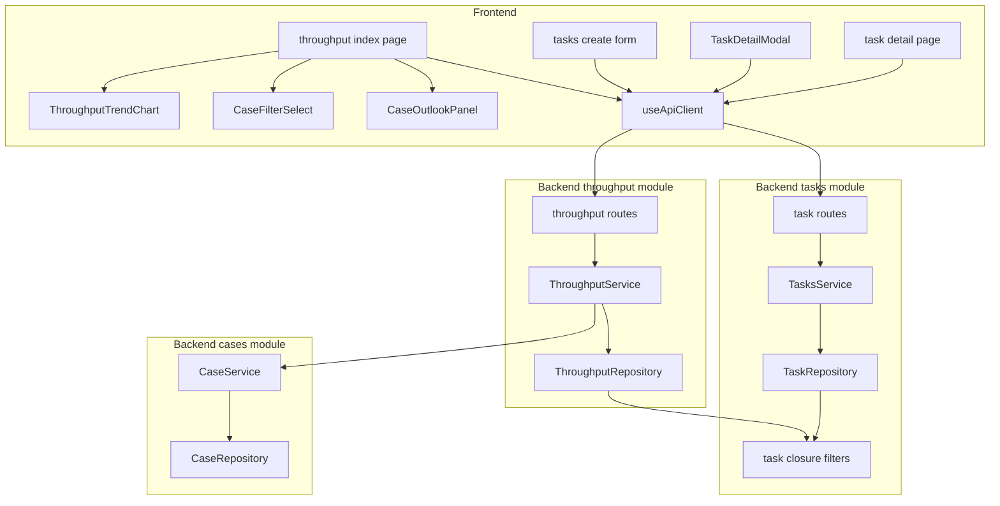
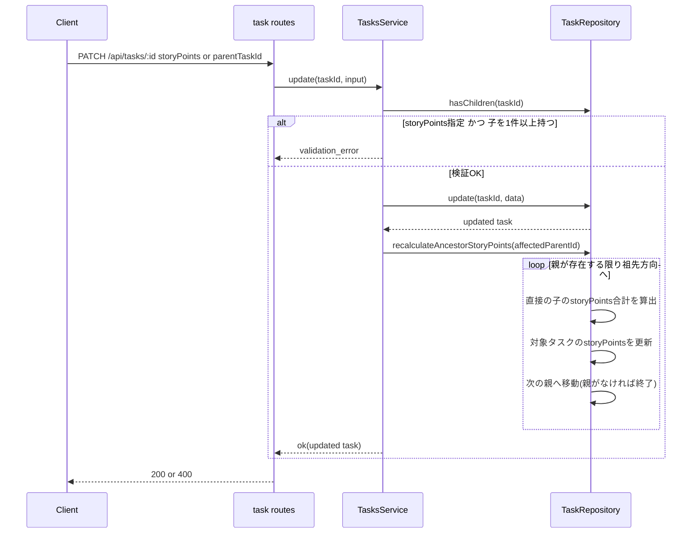

# Design Document: velocity-dashboard

## Overview

本機能は、既存の消化数ダッシュボード(`task-delivery-management` Requirement 6, 実装済み)を、件数のみの表示からストーリーポイント(工数見積もり)を踏まえたグラフ主体の画面へ拡張する。タスク管理者は、件数ベースに加えてポイント合計ベースの消化ペースを期間推移グラフで確認でき、案件を選ぶとその案件スコープのペースと、残タスク・消化ペースを突き合わせた見通し(納期充足・余力)を確認できるようになる。

利用者はタスク管理者(利用者本人)であり、既存の`throughput`ページ・タスク作成/編集フォーム・タスク詳細ページを通じて本機能を利用する。本機能は既存の`backend/src/modules/throughput/`と`backend/src/modules/tasks/`を拡張し、新規並行モジュールは作らない(brief/research.mdで確定済みの方針)。あわせて、`workspace-resource-scope`から申し送られていた`/api/throughput`の未スコープ化(現状は全ワークスペース横断集計)を本機能で解消する。

### Goals
- 葉タスク(子を持たないタスク)にストーリーポイントを設定でき、親タスクは子の合算値を自動的に保持する
- `/api/throughput`を現在ワークスペースにスコープ化し、件数・ポイント両方の期間推移をグラフで確認できる
- 案件を選ぶと、その案件スコープの消化ペースと、残タスク・見通し(必要期間数・残期間数・余力ポイント)を確認できる

### Non-Goals
- 見積もり工数の自動算出、優先度別・担当者別の内訳表示(brief Out of Scope)
- 案件の必須タスク進捗表示ロジック・タスクstatus/開発段階の意味整理の変更
- `task-delivery-management`・`task-detail`・`task-status-model`の仕様文書自体の更新(コードのみ拡張・改修する)

## Boundary Commitments

### This Spec Owns
- `Task.storyPoints`の追加、葉タスクへの直接入力検証、親タスクの子合算の自動再計算(祖先方向への連鎖を含む)
- `/api/throughput`のワークスペーススコープ化(リクエストヘッダーによるスコープ適用)
- 消化数集計へのポイント合計・葉タスク限定計上・案件フィルタ・案件別残タスク集計・案件見通し(必要期間数・残期間数・余力ポイント)の追加
- 消化数ダッシュボード画面の推移グラフ・案件フィルタ・見通しパネルへの作り直し
- タスク作成フォーム・タスク編集モーダル・タスク詳細ページの3箇所へのストーリーポイント入力欄追加

### Out of Boundary
- 案件の必須タスク進捗算出ロジック(`caseRepository.countRequiredTasks`等)の変更 — 参照のみ、変更しない
- `completedAt`の打刻契機・完了/クローズの判定基準(`task.closure.ts`の`completedTaskFilter`/`openTaskFilter`/`closedTaskFilter`) — `task-status-model`が所有し、本specは利用するのみ
- ワークスペース所属判定・`requireWorkspaceMember`ガード自体の実装 — `workspace-resource-scope`が所有し、本specは対象パスに`/api/throughput`を追加するだけ
- `task-detail`(タスク詳細ページ・インライン編集の仕組み)および`kanban-ux-redesign`(`TaskDetailModal.vue`)が実装した既存画面の他の入力項目・レイアウト自体 — ストーリーポイント欄の追加以外は変更しない
- `workspace-resource-scope`が`pages/workspaces/[workspaceId]/throughput/index.vue`に実装済みの、現在ワークスペース未選択時の空状態表示(`currentId === null`分岐) — 本specの画面作り直しでもこの分岐は維持し、削除・変更しない
- 認証・通知機能

### Allowed Dependencies
- `tasks`モジュール: `Task`モデル、`task.closure.ts`の`openTaskFilter`/`completedTaskFilter`(既存)、本specで追加する`leafTaskFilter`
- `cases`モジュール: `Case`モデル(`endDate`/`isCompleted`)、`caseService.getById`(本specで新設する薄い公開メソッド)/`list`(既存、変更なし)
- `workspaces`モジュール: `workspaceService.isMember`経由の所属検証(既存の`requireWorkspaceMember`をそのまま利用)
- `shared/workspace-scope.ts`の`withWorkspaceScope`/`VerifiedWorkspaceId`
- `shared/soft-delete.repository.ts`が提供する既定のアクティブ行フィルタ(トップレベルクエリのみ。ネストしたリレーション条件には作用しないため、`leafTaskFilter`は明示的に`deletedAt: null`を指定する — Data Models参照)

### Revalidation Triggers
- `Task`の親子関係モデル(`parentTaskId`の自己参照)またはクローズ判定(`task.closure.ts`のフィルタ群)の契約が変わった場合、`leafTaskFilter`と再計算連鎖ロジックを再検証する
- `Case.endDate`/`Case.isCompleted`の意味・nullability が変わった場合、案件見通し計算とセレクタ除外条件を再検証する
- `/api/throughput`のワークスペーススコープ対象パスリスト(`backend/src/app.ts`・`frontend/composables/useApiClient.ts`・2つのテストファイル、計4箇所)は重複定義のままなので、いずれかを変更したら他3箇所の同期を必須とする

## Architecture

### Existing Architecture Analysis

- バックエンドは`backend/src/modules/<domain>/`のfeature-firstモジュール構成(`<domain>.types.ts`/`.repository.ts`/`.service.ts`/`.routes.ts`)。`throughput`と`tasks`はこの規約に従う既存モジュールで、本specはこの2モジュールを拡張する
- ワークスペーススコープは`request.currentWorkspaceId`(`VerifiedWorkspaceId`)を`requireWorkspaceMember`が注入し、対象パスは`backend/src/app.ts`の`WORKSPACE_SCOPED_PATH_PREFIXES`配列で決まる。現状`/api/throughput`は対象外
- ソフトデリートは`shared/soft-delete.repository.ts`のPrisma Client Extensionが**トップレベル**のfindMany/findFirst/count等に`deletedAt: null`を自動注入する。ネストしたリレーション条件(例: `childTasks: { none: {...} }`)には作用しないため、リレーションフィルタ内で必要なら呼び出し側が明示的に`deletedAt: null`を書く必要がある(`task.closure.ts`の既存フィルタもこの前提を踏襲していないため、本specの`leafTaskFilter`で新たにこの前提を明示する)
- `task.closure.ts`が`completedTaskFilter`/`closedTaskFilter`/`openTaskFilter`という共有Prismaフィルタを`tasks`モジュールの公開面として提供し、`cases`モジュールが必須タスク集計に再利用している。本specはこの前例に倣い`leafTaskFilter`を追加する
- フロントエンドは`composables/useApiClient.ts`が唯一のHTTP境界。ワークスペーススコープ対象パスは`WORKSPACE_SCOPED_PATH_PREFIXES`(バックエンドと重複定義)で判定し、該当パスには`x-workspace-id`ヘッダーを付与する

### Architecture Pattern & Boundary Map



**Architecture Integration**:
- 選択パターン: 既存feature-firstモジュールの拡張(新規モジュールなし)。research.mdで検討したOption A/B/Cのうち**Option C(ハイブリッド)**を採用 — 列追加・親子整合は`tasks`、集計・見通しは`throughput`、葉タスク判定条件のみ`tasks`が`task.closure.ts`経由で公開する
- ドメイン境界: `throughput`は`tasks`の内部実装(repository/Prismaクエリ)へ直接依存せず、`task.closure.ts`が公開する`leafTaskFilter`(型としてのPrisma `WhereInput`)を通してのみ「葉タスク」概念を参照する。案件データも同様に、`cases`の内部実装(`caseRepository`)へ直接アクセスせず、`caseService`の公開メソッド(`getById`/`list`)経由でのみ参照する(`structure.md`「モジュール間はサービスの公開インターフェース経由でのみ依存する」を厳守。`tasks`モジュールが`caseRepository.findById`を直接呼んでいる既存箇所は本specの対象外の既存実装であり、新設する`throughput`側の依存では踏襲しない)
- 既存パターンの維持: `routes → service → repository`の一方向依存、Zod+`safeParse`によるバリデーション、`withWorkspaceScope`によるスコープ適用、`HttpError`ベースのエラー処理(`tasks`は一部`Result<T, E>`併用)をすべて踏襲する
- 新規コンポーネントの理由: `ThroughputTrendChart`/`CaseFilterSelect`/`CaseOutlookPanel`は画面の複雑さ(2段チャートの同期ホバー、検索可能セレクト、5項目グリッド+進捗バー)に対する単一責務分割。`AssigneeFilter.vue`(既存)と同型の「フィルタ用の小さな専用コンポーネント」という前例に倣う
- Steering準拠: `structure.md`のモジュール境界・依存方向、`tech.md`のZod/Prisma/pino規約、`prisma-migrations.md`の単一initマイグレーション方針をすべて維持する

### Technology Stack

| Layer | Choice / Version | Role in Feature | Notes |
|-------|------------------|------------------|-------|
| Frontend | Vue 3 / Nuxt 4(既存) | ダッシュボード画面・入力欄3箇所 | 新規chart系ライブラリは導入せず自作インラインSVGで描画(claude designモックに準拠、`frontend/package.json`にchart依存を増やさない) |
| Backend | Fastify 5 + Zod + Prisma(既存) | `/api/tasks`・`/api/throughput`の拡張 | 新規依存なし |
| Data | MySQL(Prisma, 既存) | `Task.storyPoints`列追加 | 単一initマイグレーションへ畳み込み([[prisma-migrations]]、本番データなしのため`prisma migrate reset`) |

## File Structure Plan

### Modified Files (Backend)
- `backend/src/prisma/schema.prisma` — `Task`モデルに`storyPoints Int? @map("story_points")`を追加。あわせて`FieldName` enumに`story_points`を追加する(同一マイグレーションに畳み込む)
- `backend/src/modules/activity-logs/activity-log.types.ts` — `FieldName`ユニオン型に`"storyPoints"`を追加
- `backend/src/modules/tasks/task.types.ts` — `CreateTaskInput.storyPoints?: number`、`UpdateTaskInput.storyPoints?: number | null`を追加
- `backend/src/modules/tasks/task.closure.ts` — `leafTaskFilter`(葉タスク判定用Prisma `WhereInput`)を追加
- `backend/src/modules/tasks/task.repository.ts` — `hasChildren(taskId, workspaceId)`、`recalculateAncestorStoryPoints(startTaskId, workspaceId, client)`を追加。既存の`create`/`update`データ組み立てに`storyPoints`を追加
- `backend/src/modules/tasks/task.service.ts` — `update`に「親タスクへの直接`storyPoints`入力を拒否」する検証を追加。`create`/`addChild`/`splitTask`/`update`(`storyPoints`変更・`parentTaskId`変更)/`delete`の各経路の末尾で、影響を受ける親の`recalculateAncestorStoryPoints`を呼び出す
- `backend/src/modules/tasks/task.routes.ts` — 作成/更新Zodスキーマに`storyPoints`(`z.number().int().min(1)`、更新時は`.nullable()`も許可)を追加
- `backend/src/modules/cases/case.service.ts` — `getById(id, workspaceId): Promise<Case | null>`(`caseRepository.findById`への薄いラッパー)を新設し、`throughput`が`caseRepository`を直接参照しなくて済むようにする
- `backend/src/modules/throughput/throughput.types.ts` — `ThroughputPeriod`に`completedPoints`、`ThroughputSummary`に`forecastNextPeriodPoints`・`caseOutlook`(nullable)を追加。`CaseOutlook`型を新設
- `backend/src/modules/throughput/throughput.repository.ts` — 全クエリに`workspaceId`スコープを追加。`countCompleted`→ポイント合計も返す集計に拡張、`caseId`フィルタ対応、案件の残タスク件数・ポイント集計メソッドを追加(`leafTaskFilter`と`openTaskFilter`を利用)
- `backend/src/modules/throughput/throughput.service.ts` — ポイントのフォーキャスト算出(既存件数ロジックと同型)、案件見通し(必要期間数・残期間数・余力ポイント)算出を追加
- `backend/src/modules/throughput/throughput.routes.ts` — クエリスキーマに`caseId`(任意)を追加。`request.currentWorkspaceId`を`ThroughputService`へ渡す
- `backend/src/app.ts` — `WORKSPACE_SCOPED_PATH_PREFIXES`に`/api/throughput`を追加
- `backend/src/app.routes.test.ts` / `backend/src/validation.integration.test.ts` — 同名の`WORKSPACE_SCOPED_PREFIXES`定数に`/api/throughput`を追加(既存の重複定義パターンを踏襲。統合はOut of Boundary、research.md参照)

### Modified Files (Frontend)
- `frontend/composables/useApiClient.ts` — `Task`/`CreateTaskInput`/`UpdateTaskInput`に`storyPoints`追加。`ThroughputPeriod`/`ThroughputSummary`/`CaseOutlook`型を拡張。`getThroughput`に`caseId`引数を追加。`WORKSPACE_SCOPED_PATH_PREFIXES`に`/api/throughput`を追加
- `frontend/pages/workspaces/[workspaceId]/throughput/index.vue` — 表主体から、コントロール行(期間種別・表示件数・案件フィルタ)+推移グラフ+目安サマリー+(案件選択時)見通しパネルの構成に作り直す
- `frontend/pages/workspaces/[workspaceId]/tasks/index.vue` — タスク作成フォームに、対象タスクが葉タスク(常に真、新規作成時)である前提でストーリーポイント入力欄を追加
- `frontend/components/kanban/TaskDetailModal.vue` — 編集フォームにストーリーポイント欄を追加。子タスクを持つタスクでは読み取り専用の「子の合計(自動計算)」表示に切り替える
- `frontend/pages/workspaces/[workspaceId]/tasks/[taskId].vue` — 項目一覧にストーリーポイント行を追加。既存の`InlineEditableField.vue`と同じピッカー方式を踏襲し、親タスクの場合はピッカーを開かせない読み取り専用行にする

### New Files (Frontend)
```
frontend/components/throughput/
├── ThroughputTrendChart.vue   # 完了タスク数(上段)・完了ポイント(下段)を単一軸ずつ独立表示する2段SVGチャート。x軸を縦に整列し、ホバーで上下段の同じ期間を同時ハイライト
├── CaseFilterSelect.vue       # 検索可能な案件セレクト(AssigneeFilter.vueと同型)。isCompleted=trueの案件を候補から除外
└── CaseOutlookPanel.vue       # 案件選択時のみ表示する見通しパネル(未完了件数・ポイント、必要期間数、残期間数、余力ポイント、間に合うかバッジ、進捗バー)
```

## System Flows

### ストーリーポイントの祖先再計算

`update`でのストーリーポイント直接変更、および`parentTaskId`変更(付け替え)を代表例として示す。`create`/`addChild`/`splitTask`/`delete`も同じ`recalculateAncestorStoryPoints`を、影響を受ける親のIDを起点に呼び出す点は共通。



**鍵となる決定**:
- `parentTaskId`変更(付け替え)の場合、`recalculateAncestorStoryPoints`は**旧親**と**新親**それぞれを起点に独立して2回呼び出す
- 子が0件になった祖先は、`storyPoints`を`0`ではなく`null`に戻す(合計値ではなく「未設定の葉タスクに戻った」ことを表すため。要件に明記はないが、直感的な挙動として本designで決定)
- すべての再計算はミューテーションと同一トランザクション内で行う(`runActivityWrite`が提供する`db.$transaction`を利用)

## Requirements Traceability

| Requirement | Summary | Components | Interfaces | Flows |
|---|---|---|---|---|
| 1.1 | 葉タスクへのポイント入力受付 | TasksService, TaskRoutes | POST/PATCH /api/tasks | - |
| 1.2 | 1以上の整数を保存 | TasksService, TaskRoutes(Zod) | POST/PATCH /api/tasks | - |
| 1.3 | 不正値の入力拒否 | TaskRoutes(Zod) | POST/PATCH /api/tasks | - |
| 1.4 | 未入力を許容(任意項目) | TaskRepository | Task.storyPoints (nullable) | - |
| 1.5 | 親タスクへの直接入力拒否 | TasksService, TaskRepository.hasChildren | PATCH /api/tasks/:id | ストーリーポイントの祖先再計算 |
| 2.1 | 子構成変化で親を再計算 | TasksService, TaskRepository.recalculateAncestorStoryPoints | - | ストーリーポイントの祖先再計算 |
| 2.2 | 子のポイント変化で親を再計算 | TasksService, TaskRepository | - | ストーリーポイントの祖先再計算 |
| 2.3 | 葉→親遷移時に直接値を合計値へ置換 | TaskRepository.recalculateAncestorStoryPoints | - | ストーリーポイントの祖先再計算 |
| 2.4 | 多階層の祖先方向への再帰反映 | TaskRepository.recalculateAncestorStoryPoints | - | ストーリーポイントの祖先再計算 |
| 2.5 | 親への直接編集手段を提供しない | TaskRoutes, TasksService | PATCH /api/tasks/:id | - |
| 3.1 | `/api/throughput`のワークスペーススコープ化 | app.ts, ThroughputRoutes, ThroughputService, ThroughputRepository | GET /api/throughput | - |
| 3.2 | 期間ごとの完了数・完了ポイント合計算出 | ThroughputService, ThroughputRepository | GET /api/throughput | - |
| 3.3 | 葉タスクの完了分のみポイント計上 | ThroughputRepository, leafTaskFilter | GET /api/throughput | - |
| 3.4 | 未設定ポイントは0扱い | ThroughputRepository | GET /api/throughput | - |
| 3.5 | 完了タスク数はポイント設定有無を問わず計上 | ThroughputRepository | GET /api/throughput | - |
| 3.6 | 進行中期間を実績母数から除外 | ThroughputService(既存`buildPeriodBoundaries`踏襲) | GET /api/throughput | - |
| 4.1 | 既定は全体(ワークスペース内、案件問わず) | ThroughputService | GET /api/throughput | - |
| 4.2 | 案件選択で当該案件のみに絞り込み | ThroughputService, ThroughputRepository, CaseFilterSelect | GET /api/throughput?caseId | - |
| 4.3 | フィルタ解除で全体表示へ復帰 | CaseFilterSelect, throughput page | GET /api/throughput | - |
| 4.4 | 完了済み案件をフィルタ選択肢から除外 | CaseFilterSelect | GET /api/cases(既存) | - |
| 5.1 | 期間ごとの推移グラフ表示 | ThroughputTrendChart | - | - |
| 5.2 | 条件変更でグラフ更新 | throughput page, ThroughputTrendChart | GET /api/throughput | - |
| 5.3 | 件数・ポイントを見分けられる形で表示 | ThroughputTrendChart | - | - |
| 6.1 | 完了タスク数のフォーキャスト | ThroughputService(既存ロジック踏襲) | GET /api/throughput | - |
| 6.2 | 完了ポイントのフォーキャスト | ThroughputService | GET /api/throughput | - |
| 6.3 | 実績不足時は目安非表示+案内 | ThroughputService, throughput page | GET /api/throughput | - |
| 7.1 | 選択案件の未完了件数・ポイント合計算出 | ThroughputService, ThroughputRepository(openTaskFilter) | GET /api/throughput?caseId | - |
| 7.2 | endDateからの残期間数算出 | ThroughputService, CaseService.getById | GET /api/throughput?caseId | - |
| 7.3 | 必要期間数・余力ポイント算出 | ThroughputService | GET /api/throughput?caseId | - |
| 7.4 | endDate未設定時は3項目とも算出不可 | ThroughputService, CaseOutlookPanel | GET /api/throughput?caseId | - |
| 7.5 | フォーキャスト不足時は必要期間数・余力ポイントのみ算出不可 | ThroughputService, CaseOutlookPanel | GET /api/throughput?caseId | - |
| 7.6 | 完了済み案件をセレクタから除外 | CaseFilterSelect | GET /api/cases(既存) | - |

## Components and Interfaces

| Component | Domain/Layer | Intent | Req Coverage | Key Dependencies (P0/P1) | Contracts |
|---|---|---|---|---|---|
| TasksService(拡張) | Backend/tasks | ポイント入力検証・再計算のオーケストレーション | 1.1-1.5, 2.1-2.5 | TaskRepository (P0) | Service |
| TaskRepository(拡張) | Backend/tasks | ポイント永続化・祖先再計算・葉判定 | 1.1-1.5, 2.1-2.5, 3.3 | Prisma (P0) | State |
| task.closure.ts(拡張) | Backend/tasks | `leafTaskFilter`の公開 | 3.3 | Prisma (P0) | - |
| ThroughputService(拡張) | Backend/throughput | 集計オーケストレーション・フォーキャスト・見通し計算 | 3.1-3.6, 4.1-4.4, 6.1-6.3, 7.1-7.6 | ThroughputRepository (P0), CaseService (P1) | Service |
| CaseService(拡張) | Backend/cases | `getById`の新設(throughputへの公開インターフェース提供) | 7.2 | CaseRepository (P0) | Service |
| ThroughputRepository(拡張) | Backend/throughput | スコープ付き集計クエリ | 3.1-3.6, 4.2, 7.1 | Prisma (P0), task.closure.ts (P0) | State |
| ThroughputRoutes(拡張) | Backend/throughput | HTTPエンドポイント | 3.1-3.6, 4.1-4.4, 6.1-6.3, 7.1-7.6 | ThroughputService (P0) | API |
| app.ts(拡張) | Backend/shared | `/api/throughput`のスコープ対象パス追加 | 3.1 | workspace-scope.guard (P0) | - |
| ThroughputTrendChart | Frontend/throughput | 2段推移グラフ描画 | 5.1-5.3 | - | - |
| CaseFilterSelect | Frontend/throughput | 案件検索・選択・解除 | 4.2-4.4, 7.6 | GET /api/cases (P1) | - |
| CaseOutlookPanel | Frontend/throughput | 見通し表示 | 7.1-7.5 | - | - |
| tasks create form(拡張) | Frontend/tasks | 新規作成時のポイント入力 | 1.1-1.4 | POST /api/tasks (P0) | - |
| TaskDetailModal(拡張) | Frontend/kanban | 編集時のポイント入力/読み取り専用表示 | 1.1-1.5, 2.5 | PATCH /api/tasks/:id (P0) | - |
| task detail page(拡張) | Frontend/tasks | インライン編集/読み取り専用表示 | 1.1-1.5, 2.5 | PATCH /api/tasks/:id (P0) | - |

### Backend/tasks

#### TasksService(拡張)

| Field | Detail |
|-------|--------|
| Intent | ストーリーポイントの直接入力検証と、変更を起点とした祖先再計算の呼び出しを既存の`create`/`update`/`addChild`/`splitTask`/`delete`に組み込む |
| Requirements | 1.1, 1.2, 1.4, 1.5, 2.1, 2.2, 2.3, 2.4, 2.5 |

**Responsibilities & Constraints**
- `update`で`input.storyPoints !== undefined`のとき、`TaskRepository.hasChildren(taskId)`が真なら`validation_error`(親タスクへの直接入力拒否、1.5/2.5)
- `create`/`addChild`/`splitTask`は新規作成される側のタスクが常に葉(子0件)であるため、`storyPoints`の直接入力を無条件に許可する
- 影響を受ける親の`recalculateAncestorStoryPoints`呼び出しは以下の契機で発生させる(いずれも同一トランザクション内)
  - `create`(`parentTaskId`指定あり)・`addChild`: 指定された親IDを起点に1回
  - `splitTask`: 分割元タスクIDを起点に1回
  - `update`(`storyPoints`変更): 現在の`parentTaskId`(存在すれば)を起点に1回
  - `update`(`parentTaskId`変更): 旧`parentTaskId`と新`parentTaskId`それぞれを起点に、独立して2回
  - `delete`: 削除対象タスクの`parentTaskId`(存在すれば)を起点に1回
- `update`で`input.storyPoints`が変化した場合、既存の`title`/`priority`等と同様に`recordFieldChanges`へ`{ field: "storyPoints", beforeValue: current.storyPoints, afterValue: updated.storyPoints }`を追加し、操作ログ(タイムライン)に記録する。他フィールドと同じ扱いにすることで`task-detail`のタイムライン一貫性を保つ。一方、祖先再計算による親タスクの`storyPoints`自動更新は利用者操作ではないため、この操作ログには記録しない

**Dependencies**
- Outbound: TaskRepository — ポイント永続化・葉判定・祖先再計算(P0)

**Contracts**: Service [x]

##### Service Interface
```typescript
interface TasksService {
  // 既存メソッドのシグネチャは変更しない。CreateTaskInput/UpdateTaskInputに
  // storyPointsフィールドが追加される点のみが差分。
  create(input: CreateTaskInput, actor: RecordActorInput, client?: DbClient): Promise<Result<Task, TaskError>>;
  update(taskId: string, workspaceId: VerifiedWorkspaceId, input: UpdateTaskInput, actor: RecordActorInput): Promise<Result<Task, TaskError>>;
}
```
- Preconditions: `input.storyPoints`が指定される場合、`1`以上の整数であることはルート層のZod検証で保証済み
- Postconditions: 更新後、影響を受けたタスクからルートまでの祖先すべての`storyPoints`が「直接の子の合計(子が0件ならnull)」という不変条件を満たす
- Invariants: 子を1件以上持つタスクの`storyPoints`は常に直接の子の合計と一致する

#### TaskRepository(拡張)

| Field | Detail |
|-------|--------|
| Intent | ストーリーポイントの永続化、葉/親判定、祖先方向の再計算 |
| Requirements | 1.1-1.5, 2.1-2.4, 3.3 |

**Responsibilities & Constraints**
- `hasChildren(taskId, workspaceId, client?)`: `client.task.count({ where: withWorkspaceScope({ parentTaskId: taskId }, workspaceId) }) > 0`(トップレベルクエリのためソフトデリート済み子は自動的に除外される)
- `recalculateAncestorStoryPoints(startTaskId, workspaceId, client)`: `startTaskId`から`parentTaskId`を辿ってルートまで、各タスクについて直接の子の`storyPoints`合計(子が0件なら`null`、子はあるが全員未設定なら`0`)を算出し更新する。1階層ごとに実行するため、深い階層でも各レベルは直接の子だけを見ればよい(子タスク自身の`storyPoints`は既にそのレベルで正しい値になっている前提)

**Contracts**: State [x]

##### State Management
- State model: `Task.storyPoints`は「直接入力された値」と「子の合計から導出された値」を同じ列で表現する。区別は`parentTaskId`を持つ子の有無で動的に判定し、別フラグは持たない
- 永続化: 単一トランザクション内で祖先チェーンを1レベルずつ更新する(ループ、バッチSQLではない。ツリーの深さは実運用で数階層程度を想定し、パフォーマンス上の懸念はない)

#### task.closure.ts(拡張)

**Implementation Notes**
- 追加: `leafTaskFilter: Prisma.TaskWhereInput = { childTasks: { none: { deletedAt: null } } }`
- ソフトデリート拡張はネストしたリレーション条件に自動適用されないため(Architecture節参照)、`deletedAt: null`をここで明示する。これにより、子が全員ソフトデリート済みのタスクも正しく「葉」と判定される

### Backend/cases

#### CaseService(拡張)

| Field | Detail |
|-------|--------|
| Intent | `throughput`が案件の`endDate`/`isCompleted`を参照するための、モジュール境界を守った薄い読み取り専用インターフェースを提供する |
| Requirements | 7.2 |

**Responsibilities & Constraints**
- 既存の`caseRepository.findById`をそのまま呼び出すだけの薄いラッパー。業務ロジックは追加しない(`throughput`側で`endDate`/`isCompleted`の解釈を行う)
- `throughput`以外の既存呼び出し元(`tasks`モジュールの`caseRepository.findById`直接呼び出し等)は本specの対象外であり、置き換えない(Out of Boundary)

**Dependencies**
- Inbound: ThroughputService(P0)
- Outbound: CaseRepository(P0)

**Contracts**: Service [x]

##### Service Interface
```typescript
interface CaseService {
  getById(id: string, workspaceId: VerifiedWorkspaceId): Promise<Case | null>;
}
```
- Preconditions: なし
- Postconditions: 現在ワークスペースに属さない、または存在しない`id`の場合は`null`を返す(例外を投げない)
- Invariants: 読み取り専用。副作用を持たない

### Backend/throughput

#### ThroughputService(拡張)

| Field | Detail |
|-------|--------|
| Intent | ワークスペース・案件スコープの集計オーケストレーション、件数/ポイント双方のフォーキャスト、案件見通しの算出 |
| Requirements | 3.1-3.6, 4.1-4.4, 6.1-6.3, 7.1-7.6 |

**Responsibilities & Constraints**
- 既存の期間境界計算(`buildPeriodBoundaries`, 週次UTC月曜始まり/暦月)はそのまま踏襲し、変更しない
- 「未完了タスク」(7.1)は`task.closure.ts`の`openTaskFilter`を用いる(完了・中止のいずれでもない状態)。中止(cancelled)タスクは残タスクの母数から除外する — `caseRepository.countRequiredTasks`が必須タスクの母数から中止を除外している既存の前例に倣う設計判断(research.mdの未決事項を解消)
- フォーキャストが0の場合(直近実績の平均が0pt)、必要期間数・余力ポイントの算出には使わず「算出不可」として扱う(0除算回避)

**見通し(7.1-7.5)の算出ルール**

| 項目 | 算出条件 | 算出式 |
|---|---|---|
| 残期間数 | `Case.endDate`が設定されている | `max(0, (endDate - 今日のUTC 0時) の日数) / 期間長`。週は7日、月は30日で近似する(暦月の可変長は目安値であるため厳密には扱わない) |
| 必要期間数 | `Case.endDate`が設定されている**かつ**次期完了ポイントの目安が算出可能(6.2)かつ0より大きい | `ceil(残ストーリーポイント ÷ 次期完了ポイントの目安)` |
| 余力ポイント | 必要期間数と同じ条件 | `次期完了ポイントの目安 × 残期間数 − 残ストーリーポイント` |

上記条件を満たさない項目は`null`(算出不可)として返す。残期間数のみ、`endDate`さえあればフォーキャストの有無によらず算出する(claude designモック`1f`で確定済み)。

**Dependencies**
- Inbound: ThroughputRoutes(P0)
- Outbound: ThroughputRepository(P0)、CaseService — `getById`で対象案件の`endDate`/`isCompleted`を取得(P1、`caseRepository`への直接依存はしない)

**Contracts**: Service [x]

##### Service Interface
```typescript
interface ThroughputService {
  getSummary(
    periodType: PeriodType,
    rangeCount: number,
    workspaceId: VerifiedWorkspaceId,
    caseId?: string,
    now?: Date,
  ): Promise<ThroughputSummary>;
}
```
- Preconditions: `workspaceId`は`requireWorkspaceMember`検証済み。`caseId`を指定する場合、当該案件が現在ワークスペースに属すること(属さない場合は空集計ではなく`validation_error`(400)を返す。既存の`assertRelatedResourcesInWorkspace`が他ワークスペース参照を400として扱う規約に合わせる)
- Postconditions: `caseId`未指定時は`caseOutlook`は`undefined`。指定時のみ算出して含める
- Invariants: 進行中(未確定)期間は常に実績母数から除外される(既存踏襲)

#### ThroughputRepository(拡張)

| Field | Detail |
|-------|--------|
| Intent | ワークスペース・案件スコープ・葉タスク限定の集計クエリ |
| Requirements | 3.1-3.6, 4.2, 7.1 |

**Responsibilities & Constraints**
- 既存`countCompleted(periodStart, periodEnd)`を`countCompletedWithPoints(periodStart, periodEnd, workspaceId, caseId?)`に拡張し、`{ count, points }`を返す。`points`は`leafTaskFilter`を適用した`_sum.storyPoints`(未設定は0扱い)
- 新規: `countOpenTasksWithPoints(workspaceId, caseId)`(7.1) — 件数は`openTaskFilter`を全タスク(葉/親を問わない)に適用して算出する。ポイント合計は`openTaskFilter`と`leafTaskFilter`を組み合わせ、**葉タスクのみ**を対象に合算する(親タスクの`storyPoints`は子の合計を保持しているため、親と子の両方を合算すると二重計上になる)

**Contracts**: State [x]

##### State Management
- 全メソッドが`withWorkspaceScope`でワークスペーススコープを必須化する(3.1)
- `caseId`が指定された場合はwhere句に`caseId`を追加する(4.2)

#### ThroughputRoutes(拡張)

| Field | Detail |
|-------|--------|
| Intent | `/api/throughput`のワークスペーススコープ化と、案件フィルタ・ポイント・見通しを含むレスポンスへの拡張 |
| Requirements | 3.1-3.6, 4.1-4.4, 6.1-6.3, 7.1-7.6 |

**Dependencies**
- Outbound: ThroughputService(P0)

**Contracts**: API [x]

##### API Contract

| Method | Endpoint | Request | Response | Errors |
|--------|----------|---------|----------|--------|
| GET | /api/throughput | Query: `periodType`(`"week"\|"month"`必須), `rangeCount`(正整数必須), `caseId`(任意、UUID文字列)。Header: `x-workspace-id`必須 | `ThroughputSummary`(下記) | 400(パラメータ不正、`caseId`が現在ワークスペースに存在しない), 403(ワークスペース非所属) |

```typescript
interface ThroughputPeriod {
  periodStart: string;   // ISO 8601
  periodEnd: string;     // ISO 8601
  completedCount: number;
  completedPoints: number; // leafTaskFilter適用、未設定は0扱い(3.3, 3.4)
}

interface CaseOutlook {
  openTaskCount: number;
  openPoints: number;
  requiredPeriods: number | null;   // 算出条件はThroughputService節の表を参照
  remainingPeriods: number | null;
  marginPoints: number | null;
}

interface ThroughputSummary {
  periods: ThroughputPeriod[];
  forecastNextPeriodCount: number | null;
  forecastNextPeriodPoints: number | null;
  caseOutlook?: CaseOutlook; // caseId未指定時はキー自体を含めない
}
```

- `caseId`を指定しない場合、集計対象は現在ワークスペース内の全タスク(案件紐づけの有無を問わない、4.1)で、レスポンスに`caseOutlook`キーは含まれない
- `caseId`を指定した場合、`periods`/フォーキャストは当該案件スコープの値になり、`caseOutlook`が付加される

### Backend/shared

#### app.ts(拡張)

**Implementation Notes**
- `WORKSPACE_SCOPED_PATH_PREFIXES`(`backend/src/app.ts:36`)に`/api/throughput`を追加し、`requireWorkspaceMember`が適用されるようにする
- 同名の配列を持つ`backend/src/app.routes.test.ts`・`backend/src/validation.integration.test.ts`にも同じ追加を行う(統合はOut of Boundary、research.md参照)

### Frontend/throughput

#### ThroughputTrendChart

**Implementation Notes**
- Props: `periods: { periodStart: string; periodEnd: string; completedCount: number; completedPoints: number }[]`
- claude designモック`1c`で確定した構成(上段=完了タスク数を単一軸、下段=完了ストーリーポイントを単一軸、x軸ラベルは下段のみ、ホバーで上下段の同じ期間を同時ハイライト)をそのまま実装する。デュアル軸(棒+折れ線を1つの軸に重ねる案)は不採用(dataviz観点のアンチパターン、research.md参照)
- チャート描画はインラインSVGの自作(ライブラリ非導入)

#### CaseFilterSelect

**Implementation Notes**
- Props: `cases: Case[]`(呼び出し側で`isCompleted === false`のもののみ渡す)、`modelValue: string | null`
- 案件名の部分一致で絞り込む検索可能セレクト(`AssigneeFilter.vue`と同型のUIパターン)。先頭に「全体(ワークスペース)」を固定表示し、選択で`null`に戻す

#### CaseOutlookPanel

**Implementation Notes**
- Props: `caseOutlook: { openTaskCount: number; openPoints: number; requiredPeriods: number | null; remainingPeriods: number | null; marginPoints: number | null } | null`。`null`のときはパネル自体を表示しない(案件未選択時)
- 「算出不可」表示は`requiredPeriods`/`remainingPeriods`/`marginPoints`それぞれが`null`かどうかで個別に判定する
- 進捗バーの「消化率の目安」(`requiredPeriods / remainingPeriods`)はAPIレスポンスに含めず、フロントエンドで表示時に算出する(バックエンドが持つべき値ではない導出表示のため)
- バッジ文言(「このペースなら間に合いそう」等)もフロントエンドが`requiredPeriods <= remainingPeriods`から導出する

## Data Models

### Domain Model

- **Task**(既存集約に`storyPoints`を追加): 自己参照の親子関係(`parentTaskId`)を持つ。不変条件: 「子を1件以上持つタスクの`storyPoints`は、直接の子の`storyPoints`合計(未設定の子は0)と常に一致する」「子を持たないタスクの`storyPoints`は利用者が最後に入力した値、または未設定なら`null`」
- 本specは`storyPoints`が「直接入力値」か「導出値」かを表す別カラムを持たない。判定は常に「子を持つか」で動的に行う(Simplification — フラグを増やすと、子の追加/削除のたびにフラグとの整合を取る必要が生じ、単一の再計算関数だけで不変条件を保つ現設計より複雑になる)

### Logical Data Model

- `Task.storyPoints`: `Int?`。既定値なし(`null`)。範囲制約はアプリケーション層(Zod: 1以上の整数)でのみ課し、DB制約は追加しない(既存の`priority`等の他フィールドと同様の方針)

### Physical Data Model

- `schema.prisma`の`Task`モデルに`storyPoints Int? @map("story_points")`を追加する
- [[prisma-migrations]]方針に従い、`backend/src/prisma/migrations/`配下は単一の`*_init_domain_schema`のみを維持する。追従マイグレーションは作らず、スキーマ変更後に`migrate diff --from-empty`で再生成し、生成列(`template_case_date_active_key`等)を手編集で復元したうえで`prisma migrate reset`を実行する

## Error Handling

### Error Strategy
既存の`TasksService`/`ThroughputService`のエラー方針(`Result<T, TaskError>`と`HttpError`)をそのまま踏襲し、新しいエラー種別は追加しない。

### Error Categories and Responses
- **User Errors (4xx)**
  - ストーリーポイントが1未満または非整数 → ルート層Zod検証で400(`badRequest`)
  - 子を1件以上持つタスクへの直接`storyPoints`指定 → `TasksService.update`が`validation_error`を返し400
  - 存在しない/他ワークスペースの`caseId`を`/api/throughput`の`caseId`パラメータに指定 → 400(既存の関連リソース検証と同じ扱い)
- **Business Logic Errors**
  - フォーキャストが0または未算出の場合の必要期間数・余力ポイント → エラーにはせず`null`(算出不可)として200で返す。UIが「算出不可」表示に変換する
  - 完了済み(`isCompleted=true`)の案件を`caseId`に指定した場合 → 本specではAPI側の特別なバリデーションを追加しない(UIの案件セレクタから除外するのみ。直接APIを叩けば集計自体は返る)。UI操作を前提とした簡素化であり、意図的な決定として明記する

### Monitoring
既存のpino構造化ログ・`business-event-logger`をそのまま利用する。本specで新規のログイベントは追加しない。

## Testing Strategy

### Unit Tests
- `TaskRepository.recalculateAncestorStoryPoints`: 単一階層/多階層(3階層以上)での合計値伝播、子が0件に戻った祖先が`null`に戻ること
- `TasksService.update`: 子を持つタスクへの`storyPoints`指定が`validation_error`になること
- `ThroughputService.getSummary`: フォーキャストが0のとき必要期間数・余力ポイントが`null`になること、`endDate`未設定時に残期間数含む3項目すべてが`null`になること

### Integration Tests
- `POST/PATCH /api/tasks`: ストーリーポイント込みの作成・更新、親タスクへの直接入力拒否(400)
- `GET /api/throughput`: `x-workspace-id`ヘッダー必須化(ヘッダーなし/他ワークスペースIDで403/400)、`caseId`指定時の絞り込み結果、案件見通しの各条件分岐(endDate有無・フォーキャスト有無の組み合わせ)
- 葉タスクの完了のみが`completedPoints`に計上され、親タスクの完了が二重計上されないこと

### E2E/UI Tests
- タスク作成フォーム・カンバン編集モーダル・タスク詳細ページそれぞれで、葉タスクへのポイント入力と親タスクの読み取り専用表示を確認する
- 消化数ダッシュボードで、案件フィルタの選択・解除により推移グラフと見通しパネルが切り替わることを確認する
- 案件終了日未設定・実績データ不足それぞれの状態で、見通しパネルの該当項目が「算出不可」表示になることを確認する
