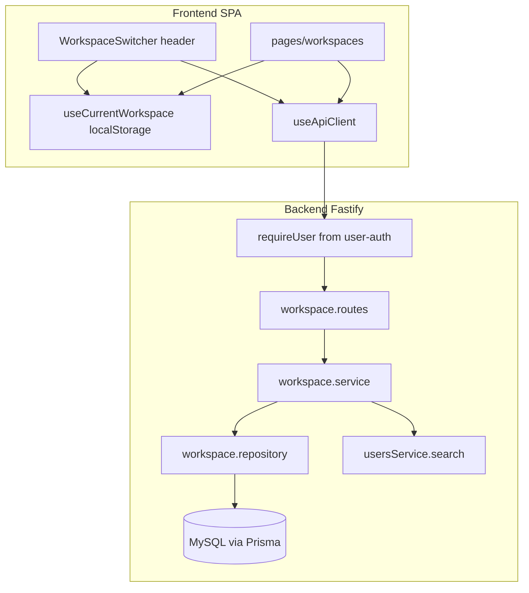
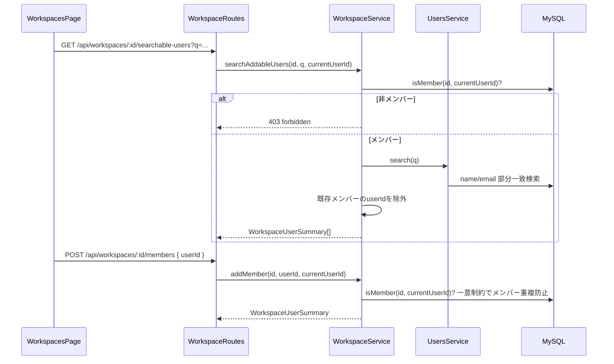
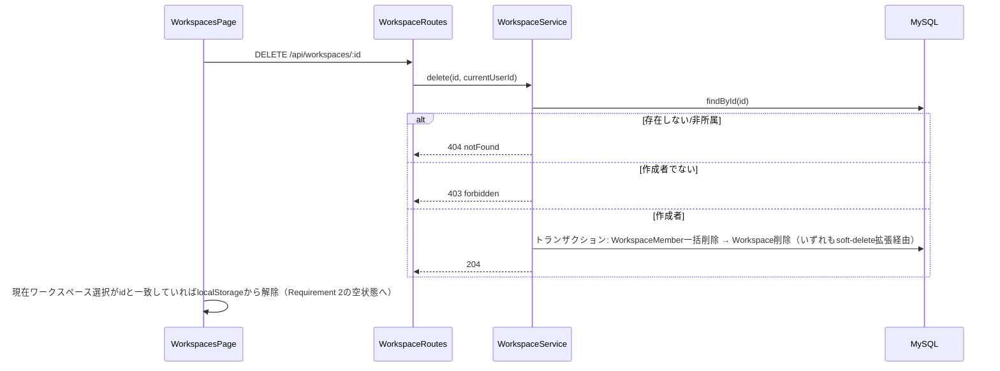

# Design Document: workspace-membership

## Overview

本機能は、ログインユーザーが可視境界としての「ワークスペース」を作成・切替でき、既存の登録ユーザーを検索してメンバー追加できる仕組みを、新規`workspaces`バックエンドモジュールと最小限のフロントエンド画面として追加する。ワークスペース作成者は自動的にメンバーとなり、メンバー間に権限差はない（設定変更は誰でも可、削除のみ作成者限定）。

**Users**: ログイン済み利用者が、案件・タスクを共有したい相手の範囲を表現するために利用する。

**Impact**: `backend/src/prisma/schema.prisma`に`Workspace`／`WorkspaceMember`の2モデルを新設する（本コードベース初の多対多中間テーブル）。`users`モジュールに検索機能を追加する。既存の案件・タスクのデータそのものにはワークスペース概念を持ち込まない（`workspace-resource-scope`が対象）。

### Goals
- ワークスペースの作成・設定変更（名前・識別色）・作成者限定の削除
- 現在ワークスペースの選択とアプリ内での一貫した識別（クライアント側）
- 登録済みユーザーの検索によるメンバー追加、メンバー一覧の閲覧
- メンバー間の対等な権限（ロール概念を持ち込まない）

### Non-Goals
- 案件・タスクなど既存リソースへのワークスペース紐付け・データ絞り込み・アクセス強制（`workspace-resource-scope`）
- 既存の`/cases`等の画面をワークスペース所属でゲートすること（本仕様は`/workspaces`ページのみ実装し、他画面には手を入れない）
- 招待リンク・メール送信・ワークスペース内ロール／RBAC
- メンバーの個別削除・自己脱退
- 現在ワークスペース選択のサーバー側永続化・複数デバイス間同期
- 検索結果・メンバー一覧のページネーション

## Boundary Commitments

### This Spec Owns
- `Workspace`／`WorkspaceMember`のデータモデルとCRUD（作成・設定更新・作成者限定削除・一覧・メンバー一覧・メンバー追加）
- メンバーシップ判定ロジック（`isMember`）。後続の`workspace-resource-scope`が再利用する公開インターフェースとしてここで安定させる
- `users`モジュールへの検索機能追加（`search(query)`、`GET /api/users`への`q`クエリパラメータ）
- 現在ワークスペースのクライアント側選択状態（`localStorage`）とヘッダー切替UI
- `/workspaces`ページ（メンバー管理・検索追加・設定・削除）
- `shared/http-errors.ts`への`forbidden`（403）ファクトリ追加

### Out of Boundary
- 案件・タスクへの`workspaceId`付与とアクセス強制、担当者候補のワークスペース内制限（`workspace-resource-scope`）
- 既存`/cases`・`/tasks`等の画面変更（空状態・ゲート化を含む）。「ワークスペースが無ければ案件を見せない」という体験は`workspace-resource-scope`が案件データを実際にスコープする時点で判断する
- `user-auth`の認証基盤そのもの（Cookieセッション・`requireUser`・CSRF）。本仕様はそれらを前提として利用するのみ
- 招待リンク、メール送信、ワークスペース内ロール／RBAC、メンバーの個別削除・自己脱退

### Allowed Dependencies
- `user-auth`が提供する`requireUser` preHandler（`app.ts`に全非公開ルートへ適用済み）と、それが`request`に付与する`request.currentUser: PublicUser`（`{ id, email, name, createdAt, updatedAt }`）。本仕様の業務ロジックは主に`id`を参照する
- `users`モジュールの既存公開インターフェース（`usersService.list()`）と、本仕様が追加する`usersService.search(query)`
- `shared/db.ts`（`db`）、`shared/soft-delete.repository.ts`（`DbClient`、論理削除規約）、`shared/business-event-logger.ts`、`shared/http-errors.ts`（既存の`badRequest`/`unauthorized`/`notFound`に加え、本仕様で`forbidden`を追加）
- フロントエンド: `useApiClient.ts`（唯一のHTTP境界）、`components/shared/Modal.vue`
- 凍結済みspec文書（`case-management-ux`等）は更新しない。コードに触れる場合も本仕様のスコープ外ファイルには変更を加えない

### Revalidation Triggers
- `WorkspaceService.isMember` / `Workspace` / `WorkspaceMember`の型・シグネチャ変更 → `workspace-resource-scope`が再利用前提を置いているため要再検証
- `user-auth`の`requireUser` / `request.currentUser`の形状変更 → 本仕様の全ルートが影響を受ける
- `GET /api/users`への`q`パラメータ追加は、`user-auth`のdesign.mdが明記する Revalidation Trigger「`User`が担当者以外の意味をさらに持つ変更」に該当する → `user-auth`は`implementation-complete`済み。検索追加の実装着手時に`user-auth`側の再検証要否を確認し、必要なら依頼する
- 現在ワークスペースの永続化方式をクライアント側からサーバー側に変更する場合 → API契約・データモデルの追加が発生するため設計再検討

## Architecture

### Existing Architecture Analysis

- バックエンドは`routes → service → repository`の4点セット構成（`backend/src/modules/<domain>/`）。エラーは`HttpError`（既存: `badRequest`/`unauthorized`/`notFound`、本仕様で`forbidden`追加）をserviceからthrow
- `shared/soft-delete.repository.ts`のPrisma Client Extensionが`$allModels`に一律適用されるため、新設する全モデルは`deletedAt`列を持つ必要がある（持たないと`findMany`等のwhere句構築で実行時エラーになる）
- `user-auth`は`implementation-complete`済み。`app.ts`にはCookieセッション・CSRF・`requireUser`（`/api/*`のうち認証免除パス以外）が配線済みで、ヘッダーには表示名・ログアウトがある。本仕様の全ワークスペースAPIは、この既存ガードを通過済みの`request.currentUser`を前提にする
- フロントエンドは`useApiClient.ts`が唯一のHTTP境界（Cookie credentials・CSRF付与済み）、ページは`frontend/pages/<domain>/index.vue`、共有UIは`components/shared/Modal.vue`。認証状態は`useAuth.ts`、業務ルート保護は`middleware/auth.global.ts`


### Architecture Pattern & Boundary Map



- Selected pattern: 新規`workspaces`モジュールが`Workspace`/`WorkspaceMember`を1モジュール内で所有する（gap分析Option B）。`users`モジュールへの越境は検索機能の追加のみに限定
- Domain boundaries: `workspace.service.ts`が「対象ワークスペースのメンバーか」「作成者か」の判定を一箇所に集約し、ルート層・将来の`workspace-resource-scope`双方から再利用できるようにする
- Existing patterns preserved: Zod検証＋`parseOrBadRequest`、`HttpError` throw、soft-delete、`businessEventLogger`、`Modal.vue`
- 新規性: 本コードベース初の多対多中間テーブル（`WorkspaceMember`）。既存の`cases`↔`tasks`（別モジュール間の1対多）とは異なり、`workspaces`モジュール内で完結させる
- Steering: `structure.md`のドメイン境界原則に従い、`workspace-resource-scope`が肩代わりする「案件・タスクのスコープ強制」には踏み込まない

### Technology Stack

| Layer | Choice / Version | Role in Feature | Notes |
|-------|------------------|------------------|-------|
| Backend | Fastify 5 / Prisma / Zod | `workspaces`モジュール、`users`検索拡張 | 新規外部依存なし |
| Frontend | Nuxt 4 SPA | ヘッダー切替、`/workspaces`ページ | 新規外部依存なし。現在ワークスペースは`localStorage`（ブラウザ標準API）で十分、専用ライブラリ不要 |
| Data | MySQL / Prisma | `Workspace`、`WorkspaceMember`テーブル新設 | 開発データ破棄前提、複雑な移行ツール不要 |

Build vs Adopt: 現在ワークスペースの永続化はサーバー側テーブル（`Research Needed`で検討していた案）ではなく、クライアント側`localStorage`を採用する。理由は Design Decisions（`research.md`）を参照。

## File Structure Plan

### Directory Structure
```
backend/src/
├── modules/workspaces/            # 新設
│   ├── workspace.types.ts         # Workspace/WorkspaceMember/WorkspaceUserSummary型、WORKSPACE_COLORS
│   ├── workspace.repository.ts    # Prisma経由のCRUD、メンバー判定クエリ
│   ├── workspace.service.ts       # 作成・設定更新・削除・一覧・メンバー一覧・検索追加・isMember
│   ├── workspace.routes.ts        # Fastifyプラグイン、Zod検証
│   ├── workspace.repository.test.ts
│   ├── workspace.service.test.ts
│   └── workspace.routes.test.ts
└── modules/users/                 # 既存、検索機能を追加
    ├── user.types.ts              # WorkspaceUserSummary相当の型は workspaces 側で定義し、users側はexportのみ追加
    ├── user.repository.ts         # search(query) を追加
    ├── user.service.ts            # search(query) を追加（trim、空文字は全件扱いにしない）
    └── user.routes.ts             # GET /api/users に任意の q クエリを追加（後方互換）

frontend/
├── components/workspaces/         # 新設
│   ├── WorkspaceSwitcher.vue      # ヘッダー用切替ドロップダウン（モック01）
│   ├── WorkspaceCreateModal.vue   # 作成モーダル（モック03）。切替ドロップダウンと空状態CTAの双方から呼ぶ
│   └── WorkspaceSettingsModal.vue # 名前・色の設定モーダル（モック07）
├── composables/
│   ├── useApiClient.ts            # 既存。Workspace関連の型・メソッドを追記
│   └── useCurrentWorkspace.ts     # 新設。所属ワークスペース一覧・現在選択のlocalStorage永続化・切替
├── pages/workspaces/
│   ├── index.vue                  # メンバー管理画面（モック02空状態・04一覧・05検索・06削除確認を統合）
│   └── index.helpers.ts           # 検索結果フィルタ等の純関数（既存ページの`index.helpers.ts`パターンに追従）
├── app.vue                        # WorkspaceSwitcherをヘッダーに追加（モック案B: ナビと表示名/ログアウトの間）
└── app.helpers.ts                 # navLinksに { to: "/workspaces", label: "メンバー" } を追加
```

### Modified Files
- `backend/src/prisma/schema.prisma` — `Workspace`/`WorkspaceMember`モデル追加。`User`モデルへ`createdWorkspaces Workspace[] @relation("WorkspaceCreator")`と`workspaceMemberships WorkspaceMember[]`のリレーション配列を追加（`tasks Task[]`など既存モジュールが同様に`User`へリレーションを追加している前例に倣う。`User`カラム自体は変更しない）
- `backend/src/shared/http-errors.ts` — `forbidden(message: string): HttpError`（403）を追加
- `backend/src/app.ts` — `workspaceRoutes`を登録
- `frontend/composables/useApiClient.ts` — `Workspace`/`WorkspaceUserSummary`型、`listWorkspaces`/`createWorkspace`/`updateWorkspace`/`deleteWorkspace`/`listWorkspaceMembers`/`searchAddableWorkspaceUsers`/`addWorkspaceMember`メソッド、`listUsers`への任意`q`引数追加
- `frontend/app.vue` / `frontend/app.helpers.ts` — 上記参照

> `app.vue`の変更は、既存のヘッダー構成（左: ブランド／ナビ、右: 表示名・ログアウト）を前提とし、`WorkspaceSwitcher`はナビと表示名／ログアウトの間に置く（claude design案B）。

## System Flows

### メンバー検索・追加（Requirements 4.1, 4.2, 4.3, 4.4, 4.5）



### ワークスペース削除（Requirements 7.1, 7.2, 7.3, 7.4）



## Requirements Traceability

| Requirement | Summary | Components | Interfaces | Flows |
|-------------|---------|------------|------------|-------|
| 1.1, 1.2, 1.3 | ワークスペース作成・作成者自動メンバー化・作成直後の現在選択 | WorkspaceService, WorkspaceCreateModal | POST /api/workspaces | — |
| 2.1, 2.2, 2.3, 2.4 | 現在ワークスペースの選択・切替・空状態・非所属拒否 | useCurrentWorkspace, WorkspaceSwitcher, WorkspaceService(isMember) | GET /api/workspaces, 各エンドポイントのメンバー判定 | — |
| 3.1, 3.2 | メンバー一覧閲覧・非メンバー拒否 | WorkspaceService, pages/workspaces | GET /api/workspaces/:id/members | — |
| 4.1, 4.2, 4.3, 4.4, 4.5 | ユーザー検索・既存メンバー除外・追加・招待手段なし・非メンバー拒否 | WorkspaceService, UsersService(search), pages/workspaces | GET /api/workspaces/:id/searchable-users, POST /api/workspaces/:id/members | メンバー検索・追加 |
| 5.1, 5.2 | メンバー間の対等な権限 | WorkspaceService（ロールフィールドを持たない設計自体が実装） | — | — |
| 6.1, 6.2, 6.3, 6.4, 6.5 | 設定更新（名前・色）・空名拒否・不正色拒否・非メンバー拒否 | WorkspaceService, WorkspaceSettingsModal | PATCH /api/workspaces/:id | — |
| 7.1, 7.2, 7.3, 7.4 | 作成者限定削除・非作成者拒否・非所属拒否・現在選択解除 | WorkspaceService, pages/workspaces | DELETE /api/workspaces/:id | ワークスペース削除 |

## Components and Interfaces

| Component | Domain/Layer | Intent | Req Coverage | Key Dependencies | Contracts |
|-----------|---------------|--------|---------------|-------------------|-----------|
| WorkspaceService | Backend/workspaces | 作成・設定更新・削除・一覧・メンバー一覧・検索追加・所属判定 | 1, 2, 3, 4, 5, 6, 7 | workspace.repository (P0), usersService.search (P0), user-auth requireUser (P0) | Service, API |
| UsersSearchExtension | Backend/users | 表示名／メールでの部分一致検索 | 4.1 | user.repository (P0) | Service, API |
| useCurrentWorkspace | Frontend | 所属ワークスペース一覧の保持、現在選択のlocalStorage永続化・切替 | 2.1, 2.2, 2.3 | useApiClient (P0) | State |
| WorkspaceSwitcher | Frontend | ヘッダーの現在ワークスペース表示・切替・作成/管理への導線 | 2.1, 2.2, 2.3 | useCurrentWorkspace (P0), WorkspaceCreateModal (P1) | — |
| WorkspaceCreateModal | Frontend | ワークスペース作成フォーム、作成成功時の現在ワークスペース選択 | 1.1, 1.2, 1.3 | useApiClient (P0), useCurrentWorkspace (P0), Modal (P1) | — |
| WorkspaceSettingsModal | Frontend | 名前・識別色の編集フォーム | 6.1, 6.2, 6.3, 6.4, 6.5 | useApiClient (P0), Modal (P1) | — |
| pages/workspaces | Frontend | メンバー管理画面（空状態・一覧・検索追加・設定/削除への導線） | 1.1, 2.3, 3.1, 4.1, 4.2, 4.3, 6.1, 6.3, 7.1, 7.2 | useApiClient (P0), useCurrentWorkspace (P0), WorkspaceCreateModal (P1), WorkspaceSettingsModal (P1), Modal (P1) | — |

### Backend/workspaces

#### WorkspaceService

| Field | Detail |
|-------|--------|
| Intent | ワークスペースのライフサイクル管理とメンバーシップ判定の単一の入口 |
| Requirements | 1.1, 1.2, 1.3, 2.4, 3.1, 3.2, 4.1, 4.2, 4.3, 4.4, 4.5, 5.1, 5.2, 6.1, 6.2, 6.3, 6.4, 6.5, 7.1, 7.2, 7.3, 7.4 |

**Responsibilities & Constraints**
- `name`は空白のみ不可（trim後空文字は400）。`color`は固定6色（`WORKSPACE_COLORS`）のいずれかのみ許可
- 作成時、作成者を`WorkspaceMember`として同一トランザクションで登録する
- 設定更新（名前・色）はワークスペースの**メンバーであれば誰でも**実行可（Requirement 5との整合）
- 削除は**作成者のみ**実行可。削除はトランザクション内で`WorkspaceMember`を先に削除してから`Workspace`を削除する（いずれもsoft-delete拡張により論理削除される）
- `isMember`/作成者判定は本サービス内の判定に一本化し、ルート層・将来の`workspace-resource-scope`の双方から同じ関数を参照できるようにする（他モジュールへの越境判定ロジック複製を避ける）
- ロールフィールドは一切持たない（Requirement 5.1, 5.2 はデータモデルにロール列を追加しないことで満たす）

**Dependencies**
- Inbound: workspace.routes — HTTPエントリポイント (P0)
- Outbound: workspace.repository — 永続化 (P0), usersService.search — 検索委譲 (P0)
- External: `user-auth`の`request.currentUser`（`PublicUser`） — 呼び出し元ルートから渡される (P0、実装済み)

**Contracts**: Service [x] / API [x]

##### Service Interface
```typescript
export const WORKSPACE_COLORS = [
  "#2563eb", "#0f766e", "#b45309", "#be123c", "#6d28d9", "#475569",
] as const;
export type WorkspaceColor = (typeof WORKSPACE_COLORS)[number];

export interface Workspace {
  id: string;
  name: string;
  color: WorkspaceColor;
  createdByUserId: string;
  createdAt: Date;
  updatedAt: Date;
}

export interface WorkspaceUserSummary {
  userId: string;
  name: string;
  email: string;
}

export interface WorkspaceService {
  create(input: { name: string; createdByUserId: string }): Promise<Workspace>;
  update(
    id: string,
    input: { name?: string; color?: WorkspaceColor },
    requestingUserId: string,
  ): Promise<Workspace>;
  delete(id: string, requestingUserId: string): Promise<void>;
  /** 呼び出しユーザーが所属するワークスペースのみ返す */
  list(userId: string): Promise<Workspace[]>;
  listMembers(id: string, requestingUserId: string): Promise<WorkspaceUserSummary[]>;
  searchAddableUsers(id: string, query: string, requestingUserId: string): Promise<WorkspaceUserSummary[]>;
  addMember(id: string, targetUserId: string, requestingUserId: string): Promise<WorkspaceUserSummary>;
  /** workspace-resource-scope 等、他モジュールから再利用する所属判定 */
  isMember(id: string, userId: string): Promise<boolean>;
}
```
- Preconditions: `create`/`update`の`name`は非空文字列、`update`の`color`は`WORKSPACE_COLORS`のいずれか
- Postconditions: `create`成功後、呼び出し元userは即座に`isMember`が`true`を返す状態になる
- Invariants: `WorkspaceMember`は`(workspaceId, userId)`の組で一意。ロールに相当する列は存在しない

##### API Contract
| Method | Endpoint | Request | Response | Errors |
|--------|----------|---------|----------|--------|
| POST | /api/workspaces | `{ name }` | 201 Workspace | 400 |
| GET | /api/workspaces | — | 200 Workspace[]（呼び出しユーザーの所属分のみ） | — |
| PATCH | /api/workspaces/:id | `{ name?, color? }` | 200 Workspace | 400, 403, 404 |
| DELETE | /api/workspaces/:id | — | 204 | 403, 404 |
| GET | /api/workspaces/:id/members | — | 200 WorkspaceUserSummary[] | 403, 404 |
| GET | /api/workspaces/:id/searchable-users | `?q=` | 200 WorkspaceUserSummary[]（既存メンバー除外済み） | 403, 404 |
| POST | /api/workspaces/:id/members | `{ userId }` | 201 WorkspaceUserSummary | 400, 403, 404 |

**Implementation Notes**
- Integration: 全エンドポイントは`user-auth`が適用する`requireUser`を通過済みである前提で`request.currentUser.id`を参照する。本モジュール自身は認証ガードを持たない
- Validation: Zod `z.object({ name: z.string() })`、`color: z.enum(WORKSPACE_COLORS)`。`searchable-users`の`q`は`z.string().optional()`（空/未指定は空配列を返す。全件検索は行わない — Requirement 4.1が「検索した場合」を前提とするため）
- Risks: `addMember`の競合（同時に同じユーザーを2箇所から追加）は`(workspaceId, userId)`の一意制約違反を捕捉し400に変換する

### Backend/users（拡張）

#### UsersSearchExtension

| Field | Detail |
|-------|--------|
| Intent | 表示名またはメールアドレスの部分一致検索 |
| Requirements | 4.1 |

- `usersService.search(query: string): Promise<PublicUser[]>` を追加。`GET /api/users`（クエリなし）と同じ`PublicUser`型を返すことで、既存の担当者候補取得等の呼び出し元との型互換を保つ。`query`をtrimし、空文字なら空配列を返す（`workspace.service.ts`側で空クエリ時に呼ばないため二重防御）
- `user.repository.ts`に`search(query)`を追加: `name`/`email`への`contains`（大文字小文字を区別しない）
- `GET /api/users`に任意の`q`クエリパラメータを追加。既存の呼び出し（`q`なし）は従来どおり全件を返し後方互換を維持する
- `WorkspaceService.searchAddableUsers`（本ページ後述）が`usersService.search`の`PublicUser[]`を受け取り、既存メンバーの除外と`WorkspaceUserSummary`（`{ userId, name, email }`）への変換を行う。この変換責務は`users`モジュールではなく`workspaces`モジュール側が持つ
- **Revalidation Trigger**: この変更は`user-auth`design.mdの「`User`が担当者以外の意味をさらに持つ変更」に該当する。実装着手前に`user-auth`側の設計状況を確認すること

**Contracts**: Service [x] / API [x]

##### API Contract
| Method | Endpoint | Request | Response | Errors |
|--------|----------|---------|----------|--------|
| GET | /api/users | `?q=`（任意） | 200 PublicUser[]（`q`指定時は部分一致のみ） | — |

### Frontend

#### useCurrentWorkspace

| Field | Detail |
|-------|--------|
| Intent | 所属ワークスペース一覧の取得、現在選択のクライアント側永続化・切替を提供する単一のcomposable |
| Requirements | 2.1, 2.2, 2.3 |

**Responsibilities & Constraints**
- 初期化時に`listWorkspaces()`を呼び、`localStorage`の`currentWorkspaceId`が所属一覧に含まれるか検証する。含まれなければ（未設定・削除済み・非所属）先頭のワークスペースに自動選択、所属が0件なら空状態として扱う
- `select(id)`は所属一覧に含まれるIDのみ受け付け、`localStorage`へ書き込み後リアクティブ状態を更新する
- サーバー側には「現在ワークスペース」を表す概念を一切持たない。Requirement 2.4（非所属ワークスペースを現在ワークスペースとして指定できない）は、本compasableが所属一覧外のIDを拒否することに加え、`/api/workspaces/:id/...`系エンドポイントが呼び出しごとに`isMember`を検証することで二重に担保される（クライアント側の選択表示のみに依存しない）

**Contracts**: State [x]

##### State Management
- State model: `{ workspaces: Workspace[]; currentId: string | null }`（`ref`/`reactive`。既存ページの「local ref + `useApiClient`直呼び」パターンを踏襲し、専用の状態管理ライブラリは追加しない）
- Persistence & consistency: `localStorage['currentWorkspaceId']`。同一ブラウザ内のタブ間でのみ有効、複数デバイス間の同期は行わない（Non-Goal）
- Concurrency strategy: 単純な最終書き込み優先。同時編集の高度な整合性は対象外（個人〜小規模チーム利用が前提）

#### WorkspaceSwitcher / pages/workspaces

- Presentational + `useCurrentWorkspace`/`useApiClient`の呼び出しのみで新規の状態境界を持たないため summary row + 実装ノートに留める
- `WorkspaceSwitcher`: ヘッダーに表示。`useCurrentWorkspace`が空状態の場合は淡色の「ワークスペース未選択」表示（モック02準拠）。ドロップダウンから作成モーダル・`/workspaces`への遷移を提供
- `WorkspaceCreateModal`: `createWorkspace()`成功後、返された新規`Workspace.id`で`useCurrentWorkspace().select(id)`を呼び、作成直後にそのワークスペースを現在ワークスペースへ切り替える（Requirement 1.3）。呼び出し元（`WorkspaceSwitcher`のドロップダウン／`/workspaces`の空状態CTA）によらずこの処理を行う
- `pages/workspaces/index.vue`: `useCurrentWorkspace().currentId`が`null`なら空状態カード（モック02の「ワークスペースがありません」相当、案件一覧ページではなく本ページに実装）を表示。存在すればメンバー一覧・検索追加パネル（モック05、インライン展開）・設定/削除操作（作成者のみ削除ボタン表示）を表示

## Data Models

### Domain Model
- Aggregate: `Workspace`（ルート）。`WorkspaceMember`は`Workspace`の子エンティティで、`Workspace`削除時にライフサイクルが連動する
- Invariants: `WorkspaceMember`は`(workspaceId, userId)`一意。`Workspace.color`は固定6値のいずれか。ロール属性を持たない

### Physical Data Model

```prisma
model Workspace {
  id              String    @id @default(uuid())
  name            String
  color           String    @default("#2563eb")
  createdByUserId String    @map("created_by_user_id")
  createdAt       DateTime  @default(now()) @map("created_at")
  updatedAt       DateTime  @updatedAt @map("updated_at")
  deletedAt       DateTime? @map("deleted_at")

  createdBy User              @relation("WorkspaceCreator", fields: [createdByUserId], references: [id])
  members   WorkspaceMember[]

  @@index([deletedAt])
  @@map("workspaces")
}

model WorkspaceMember {
  id          String    @id @default(uuid())
  workspaceId String    @map("workspace_id")
  userId      String    @map("user_id")
  createdAt   DateTime  @default(now()) @map("created_at")
  updatedAt   DateTime  @updatedAt @map("updated_at")
  deletedAt   DateTime? @map("deleted_at")

  workspace Workspace @relation(fields: [workspaceId], references: [id])
  user      User      @relation(fields: [userId], references: [id])

  @@unique([workspaceId, userId])
  @@index([deletedAt])
  @@map("workspace_members")
}
```

`User`モデルへ以下のリレーション配列を追加する（既存の`tasks Task[]`と同様の前例に倣う。`User`自身のカラムは変更しない）:
```prisma
createdWorkspaces    Workspace[]       @relation("WorkspaceCreator")
workspaceMemberships WorkspaceMember[]
```

- `color`はPrisma上は`String`（MySQLの`enum`変更は将来の値追加のたびにマイグレーションが必要になるため採用しない）。妥当性はZod `z.enum(WORKSPACE_COLORS)`で入力時に強制する
- `deletedAt`は本コードベース共通の`soft-delete` Prisma Client Extensionを機能させるために両モデルへ必須で付与する（削除は物理削除ではなく論理削除）
- ワークスペース削除時、`WorkspaceMember`の削除は`Workspace`の削除と同一トランザクションで行う

## Error Handling

### Error Strategy
- 入力検証エラー（空名・不正な色）: 400
- 対象ワークスペースの非メンバーによるアクセス: 403（新設`forbidden`）
- 削除操作を作成者以外が実行: 403
- 存在しない・削除済みのワークスペースID: 404
- メンバー追加時の一意制約違反（競合）: 400

### Error Categories and Responses
| 状況 | status | 内容 |
|------|--------|------|
| ワークスペース名が空 | 400 | `name is required` |
| 識別色が固定6色に含まれない | 400 | `color must be one of the allowed values` |
| 対象ワークスペースのメンバーでない（閲覧・検索・追加・設定変更） | 403 | `forbidden` |
| 削除を作成者以外が実行 | 403 | `forbidden` |
| ワークスペースが存在しない／削除済み | 404 | `notFound` |
| 既にメンバーのユーザーを追加しようとした（競合） | 400 | `badRequest` |

### Monitoring
- `workspace.created` / `workspace.updated` / `workspace.deleted` / `workspace.member_added`を`businessEventLogger`経由で記録する（既存`cases`/`users`モジュールと同じ粒度）

## Testing Strategy

### Unit Tests
- `WorkspaceService.create`: 成功（作成者が自動メンバー化される）／名前空文字で400
- `WorkspaceService.update`: メンバーなら成功／非メンバーは403／空名は400／固定色以外は400
- `WorkspaceService.delete`: 作成者は成功（`WorkspaceMember`も消える）／非作成者メンバーは403／非所属は404
- `WorkspaceService.searchAddableUsers`: 既存メンバーが結果から除外されることを検証
- `usersService.search`: 表示名／メールの部分一致、大文字小文字を区別しないこと

### Integration Tests
- `POST /api/workspaces` → `GET /api/workspaces/:id/members`で作成者が含まれることを確認
- 各ワークスペーススコープAPI（members/searchable-users/members POST/PATCH/DELETE）を非メンバーで呼ぶと403になること
- ワークスペース削除後、`GET /api/workspaces`にその後もう含まれないこと（soft-delete）
- `GET /api/users`が`q`なしでは従来どおり全件を返すこと（後方互換）

> テストでのcurrentUser注入は、既存の`withSessionCookie` / `withCsrfToken`（`backend/src/test/auth.fixture.ts`）を再利用する。本仕様自身でセッション偽装の仕組みを新設しない

### E2E/UI Tests
- ワークスペース0件 → `/workspaces`の空状態表示 → 作成 → ヘッダー切替に反映
- ヘッダーで別ワークスペースへ切替 → ページ再訪後も選択が保持される（`localStorage`）
- メンバー追加のインライン検索 → 追加 → 一覧に即時反映 → 再検索でその相手が除外される
- 設定モーダルで名前・色を変更 → ヘッダー・見出しに反映
- 作成者アカウントでのみ「ワークスペースを削除」ボタンが表示される／削除確認後にワークスペースが消える

## Security Considerations

- すべてのワークスペーススコープAPIは、リクエストごとに`isMember`（または作成者判定）をサーバー側で検証する。クライアント側の現在ワークスペース選択・ヘッダー表示は利便性のためのUI状態であり、アクセス制御の根拠にはしない
- 現在ワークスペースの`localStorage`値は機密情報を含まないUI状態のみ（ワークスペースIDのみ）
- `color`/`name`の入力はZodで検証し、Prismaのパラメータ化クエリでSQLインジェクションを防ぐ（既存モジュールと同一の防御線）
- 本仕様のAPIは`user-auth`が適用する`requireUser`・CSRF保護の対象になる前提であり、本仕様自身は認証・CSRFの仕組みを実装しない

## Supporting References
- ビジュアル正本: `.kiro/specs/workspace-membership/research.md`「8. ビジュアルデザイン確定（claude design連携）」
  - https://claude.ai/design/p/8e1071f6-44d1-4a2b-9353-d9a376082c6e?file=Workspace+Membership.dc.html
- ギャップ分析・設計判断の詳細: 同`research.md`セクション1–8
