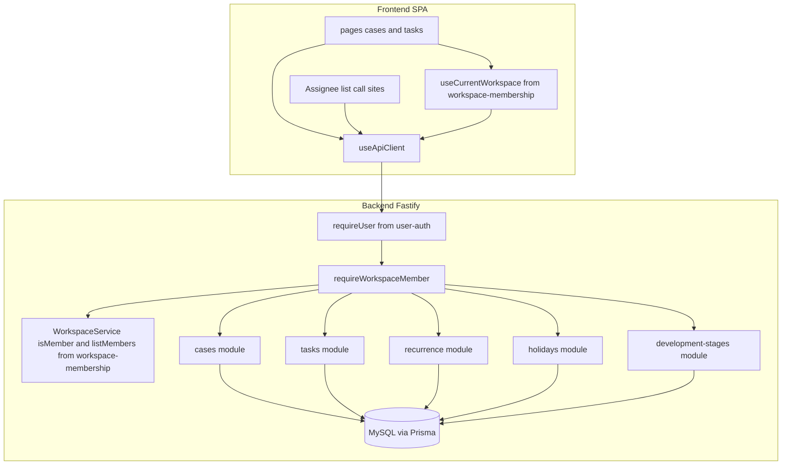
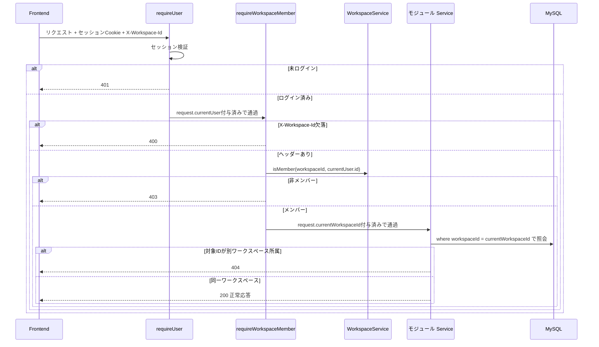
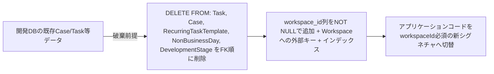

# Technical Design: workspace-resource-scope

## Overview

**Purpose**: 本機能は、ワークスペース（`workspace-membership`が提供する可視境界）を、案件（Case）・タスク（Task）・繰り返しタスクテンプレート（RecurringTaskTemplate）・非営業日マスタ（NonBusinessDay）・開発ステージ列（DevelopmentStage）の5リソースに対する実効的なアクセス境界として機能させる。

**Users**: ログイン済みで1つ以上のワークスペースに所属する利用者が、自分の現在ワークスペースに属するデータのみを一覧・操作できるようになる。

**Impact**: 現状これら5リソースは全ワークスペース共通のグローバルデータであり、ログイン済みであれば誰でも全件を読み書きできる。本機能により、各リソースが`workspaceId`を持ち、リクエストごとに「現在ワークスペースのメンバーであるか」がバックエンドで検証されるようになる。

### Goals
- Case／Task／RecurringTaskTemplate／NonBusinessDay／DevelopmentStageの5リソースを、作成時に操作者の現在ワークスペースへ帰属させる
- 上記5リソースのlist／get／update／deleteを、リクエストごとの現在ワークスペース＋メンバーシップ判定で一元的に強制する
- タスクの担当者候補・担当者指定を現在ワークスペースのメンバーに制限する
- 繰り返しタスクテンプレートの適用対象を、テンプレートと同一ワークスペースの案件に限定する

### Non-Goals
- クロスワークスペースでのリソース検索・共有・移動
- 招待リンク発行、ワークスペース内ロール／RBAC
- コメント機能、操作ログ、消化ペース可視化（velocity-dashboard）の機能追加
- 既存グローバルデータの保全付き移行（開発段階につき破棄前提）
- `workspace-membership`・`user-auth`が提供するメンバーシップ／認証の仕組み自体の実装

## Boundary Commitments

### This Spec Owns
- Case／Task／RecurringTaskTemplate／NonBusinessDay／DevelopmentStageの各Prismaモデルへの`workspaceId`列追加
- 上記5モジュールの`repository.ts`／`service.ts`／`routes.ts`における、ワークスペーススコープの適用（作成時の帰属付与、list／get／update／deleteでの検証）
- リクエストからワークスペース文脈を解決し、メンバーシップを検証する共有の仕組み（`backend/src/workspace-scope.guard.ts`の`requireWorkspaceMember`、`shared/workspace-scope.ts`の汎用ヘルパー、`app.ts`への配線）
- タスクの担当者指定時のワークスペースメンバーシップ検証（`assigneeUserId`が現在ワークスペースのメンバーであることの確認）
- 繰り返しタスクテンプレート適用時の、テンプレートと案件のワークスペース一致検証
- フロントエンドの`useApiClient.ts`へのワークスペース文脈（`X-Workspace-Id`ヘッダー）自動付与
- Case／Taskの一覧・作成画面における、現在ワークスペース未選択時の空状態表示（`workspace-membership`が確定させる空状態パターンの再利用）
- タスクの担当者候補（作成時の候補一覧・カンバン上の再割当候補）の参照先を、全ユーザー一覧から現在ワークスペースのメンバー一覧へ切り替え（既存の担当者フィルタ・カレンダー表示は対象外、Out of Boundary参照）

### Out of Boundary
- `Workspace`／`WorkspaceMember`モデルそのもの、ワークスペースの作成・設定変更・削除・メンバー追加（`workspace-membership`が所有）
- `WorkspaceService.isMember`／`listMembers`の実装そのもの（本仕様は呼び出し側であり、これらのインターフェースを再定義・変更しない）
- ログインセッション・CSRF・`requireUser`の実装（`user-auth`が所有）
- `User`（アカウント）モデルの一覧・検索範囲の変更
- 招待・RBAC・クロスワークスペース機能
- `shared/http-errors.ts`への`forbidden`ヘルパー追加そのもの（`workspace-membership`のBoundary Commitmentであり、実装時点で既に存在する場合はそれを利用する。存在しない場合に限り本仕様が追加する）
- 担当者フィルタ（`components/users/AssigneeFilter.vue`）・カレンダー表示（`pages/calendar/index.vue`）のユーザー一覧取得元の変更（Requirement 4.1は担当者「候補」の制限であり、既にアサイン済みのタスクを絞り込むフィルタは対象外。過去にメンバーだった利用者がアサイン済みのタスクを引き続き検索・表示できる状態を維持する）

### Allowed Dependencies
- `user-auth`が提供する`requireUser` preHandlerと、それが`request.currentUser`に付与する`PublicUser`（`{ id, email, name, createdAt, updatedAt }`）
- `workspace-membership`が提供する`WorkspaceService`の公開インターフェース：`isMember(workspaceId, userId): Promise<boolean>`、`listMembers(workspaceId, requestingUserId): Promise<WorkspaceUserSummary[]>`
- `workspace-membership`が提供するフロントエンドの`useCurrentWorkspace`（所属ワークスペース一覧・現在選択のlocalStorage永続化）、および`pages/workspaces`の空状態コンポーネント・視覚パターン
- `shared/http-errors.ts`の`badRequest`／`notFound`／`forbidden`、`shared/soft-delete.repository.ts`の論理削除規約
- **制約**: 本仕様は`workspace-membership`の実コード（`Workspace`／`WorkspaceMember`モデル、`WorkspaceService`）が存在しない状態では実装に着手できない（research.md参照、ハードな順序ゲート）

### Revalidation Triggers
- `WorkspaceService.isMember`／`listMembers`のシグネチャ変更
- `request.currentUser`の型・付与条件の変更（`user-auth`側）
- `useCurrentWorkspace`が管理する現在ワークスペースIDの取得手段・永続化方式の変更（クライアント側からサーバー側永続化への変更等）
- `workspace-membership`が確定させる空状態コンポーネントの見た目・構成の変更（research.md「UIデザインゲートの適用判断」で本仕様が流用を前提にしているため）
- ワークスペース文脈の伝達方式（`X-Workspace-Id`ヘッダー）を変更する場合、本仕様の全モジュールが影響を受ける

## Architecture

### Existing Architecture Analysis

- バックエンドは`routes → service → repository`の一方向依存を持つドメインモジュール構成（`backend/src/modules/<domain>/`）。`cases`／`tasks`／`recurrence`／`holidays`／`development-stages`はいずれもこの4点セット構成
- `app.ts`は`onRequest`フックでCSRF検証、`preHandler`フックで`requireUser`をパス除外リスト方式（`/health`・`/api/auth/*`・`/api/client-errors`を除く全`/api/*`）で適用済み。同じ「除外リスト方式のグローバルpreHandlerフック」パターンが確立している
- `shared/soft-delete.repository.ts`のPrisma Client Extensionは`$allModels`の`where`句へ`deletedAt: null`を注入するが、`create`の`data`側には関与しない。同種の仕組みを`workspaceId`に適用する場合も同じ制約を受ける（research.md参照）
- `case.repository.ts`／`task.repository.ts`の`findById`／`update`／`delete`は`id`のみで`where`を構成しており、スコープ用パラメータを持たない。`task.repository.ts`の`list(filter)`は`caseId`／`assigneeUserId`をwhere句に合成する先例があり、`workspaceId`合成もこの延長で実装できる
- フロントエンドは`useApiClient.ts`が唯一のHTTP境界で、CSRFトークンを`request()`内でヘッダーへ自動付与する仕組みが既にある（`useApiClient.ts:185-201`）
- `structure.md`は「`shared/`は全モジュール共通のインフラであり、モジュール固有のロジックはここに置かない」と定めており、現状`shared/`配下のどのファイルも特定の`modules/<domain>/`をimportしていない（依存方向は常にmodules→shared）。一方`app.ts`は合成ルートとして`modules/auth/auth.guard.js`を直接importしている先例がある

### Architecture Pattern & Boundary Map

**Selected pattern**: 共有ガード関数＋モジュール個別のwhere句拡張（research.md Option C）。`requireUser`と同じ「除外／対象リストに基づくグローバルpreHandlerフック」で新設の`requireWorkspaceMember`を配線し、メンバーシップ判定という最もミスが許されない処理を一箇所に集約する。各モジュールのクエリ構造（`caseId`／`assigneeUserId`フィルタ等）はモジュール内に残す。



**Architecture Integration**:
- Selected pattern: 上記の共有ガード＋モジュール個別拡張
- Domain/feature boundaries: 「メンバーか否か」の判定と「どのワークスペースを対象にするか」の解決は`requireWorkspaceMember`に一本化。各モジュールは`request.currentWorkspaceId`を受け取ってクエリに反映するだけで、`WorkspaceService`を直接呼び出さない
- Existing patterns preserved: `routes → service → repository`の依存方向、Zod検証＋`parseOrBadRequest`、`HttpError`throw、soft-delete規約、`preHandler`フックによる横断的ガードの配線方式
- New components rationale: 新規コンポーネントは2つに分離する。(1) `shared/workspace-scope.ts` — ヘッダー名定数・`VerifiedWorkspaceId`型・`withWorkspaceScope`のみを持つ、モジュール非依存の汎用ヘルパー。(2) `backend/src/workspace-scope.guard.ts` — `workspacesService.isMember`と`request.currentUser`を組み合わせる`requireWorkspaceMember`本体。`structure.md`は「`shared/`にモジュール固有のロジックを置かない」と定めており、`workspaces`モジュールへの依存を持つ判定ロジックを`shared/`に置くとこの原則に反するため分離した。`app.ts`は既に`modules/auth/auth.guard.js`を直接importする合成ルートであり、`workspace-scope.guard.ts`も同じ立ち位置（`app.ts`と同階層、特定モジュールの実装詳細を組み合わせてよい層）に置く
- Steering compliance: `structure.md`の「モジュール間はサービスの公開インターフェース経由でのみ依存する」原則、および「`shared/`にモジュール固有ロジックを置かない」原則の双方を維持

### Technology Stack

| Layer | Choice / Version | Role in Feature | Notes |
|-------|------------------|------------------|-------|
| Backend | Fastify 5 / Prisma / Zod | 5モジュールの拡張、共有ガード新設 | 新規外部依存なし |
| Frontend | Nuxt 4 SPA | `useApiClient`拡張、担当者ピッカー・一覧/作成画面の空状態対応 | 新規外部依存なし |
| Data | MySQL / Prisma | 5テーブルへの`workspace_id`列追加 | 開発データ破棄前提の破壊的migrate |

Build vs Adopt の詳細根拠は`research.md`「8. Design Decisions」を参照。

## File Structure Plan

### Directory Structure
```
backend/src/
├── workspace-scope.guard.ts        # 新設: requireWorkspaceMember（workspacesServiceに依存する検証本体）
├── shared/
│   └── workspace-scope.ts          # 新設: WORKSPACE_HEADER_NAME, VerifiedWorkspaceId型, withWorkspaceScope（モジュール非依存）
├── modules/cases/                  # 既存4点セットを拡張（workspaceId追加）
├── modules/tasks/                  # 既存4点セットを拡張（workspaceId追加 + 担当者メンバーシップ検証）
├── modules/recurrence/             # 既存4点セットを拡張（workspaceId追加 + 案件との一致検証）
├── modules/holidays/                # 既存4点セットを拡張（workspaceId追加）
└── modules/development-stages/      # 既存4点セットを拡張（workspaceId追加）

frontend/
├── composables/
│   └── useApiClient.ts             # 既存。X-Workspace-Idヘッダー自動付与を追加
├── pages/cases/index.vue           # 既存。現在ワークスペース未選択時の空状態を追加
├── pages/tasks/index.vue           # 既存。空状態 + 担当者候補の参照先切替
```
recurrence/holidays/development-stagesの3モジュールは、cases/tasksと同じ「schema.prisma追加 → repository/service/routesへworkspaceId param追加」パターンに従うため、個別のファイル列挙は省略する。

### Modified Files
- `backend/src/prisma/schema.prisma` — `Case`/`Task`/`RecurringTaskTemplate`/`NonBusinessDay`/`DevelopmentStage`の5モデルへ`workspaceId String @map("workspace_id")`（NOT NULL）と`Workspace`への`@relation`を追加。`Workspace`モデル自体は`workspace-membership`が追加する前提（本仕様は追加しない）
- `backend/src/shared/http-errors.ts` — `forbidden(message: string): HttpError`（403）が存在しない場合のみ追加（Boundary Commitments参照）
- `backend/src/app.ts` — `requireUser`の`preHandler`フックの後段に、`requireWorkspaceMember`（`workspace-scope.guard.ts`からimport）を対象パス（`/api/cases`, `/api/tasks`, `/api/recurring-templates`, `/api/holidays`, `/api/development-stages`のいずれかで始まる）に適用する2つ目の`preHandler`フックを追加
- `backend/src/modules/cases/{case.types,case.repository,case.service,case.routes}.ts` — `workspaceId`（`VerifiedWorkspaceId`型）をCreateCaseInput/クエリ条件へ追加。`case.repository.ts:list()`の`client`引数無視も合わせて修正
- `backend/src/modules/tasks/{task.types,task.repository,task.service,task.routes}.ts` — `workspaceId`（`VerifiedWorkspaceId`型）追加に加え、`assigneeUserId`指定時に`workspacesService.isMember(workspaceId, assigneeUserId)`を検証
- `backend/src/modules/recurrence/{recurrence.types,recurrence.repository,recurrence.service,recurrence.routes}.ts` — `workspaceId`追加。`applyToCase`が参照するテンプレート一覧を、対象案件と同一`workspaceId`のものに限定
- `backend/src/modules/holidays/{holiday.types,holiday.repository,holiday.service,holiday.routes}.ts` — `workspaceId`追加
- `backend/src/modules/development-stages/{development-stage.types,development-stage.repository,development-stage.service,development-stage.routes}.ts` — `workspaceId`追加
- `frontend/composables/useApiClient.ts` — `request()`内で、対象パスへのリクエストに`useCurrentWorkspace().currentId`を`X-Workspace-Id`ヘッダーとして付与
- `frontend/pages/cases/index.vue`, `frontend/pages/tasks/index.vue` — `useCurrentWorkspace().currentId`が`null`の場合、`workspace-membership`の空状態パターンを表示し一覧取得・作成導線を出さない
- `frontend/pages/tasks/index.vue`, `frontend/pages/kanban/index.vue` — `api.listUsers()`の呼び出しを`api.listWorkspaceMembers(currentWorkspaceId)`へ置換（`kanban/index.vue`の置換により、props経由でユーザー一覧を受け取る`TaskDetailModal.vue`／`AssigneeFocusTray.vue`の担当者候補も連動して現在ワークスペースのメンバーに限定される）。`components/users/AssigneeFilter.vue`と`pages/calendar/index.vue`は担当者「候補選択」ではなくフィルタ／表示用途のため変更しない（Boundary Commitments「Out of Boundary」参照）

## System Flows

### スコープ検証付きリクエスト処理（Requirements 3.1, 3.2, 3.3, 3.4）



**Key Decisions**:
- `requireWorkspaceMember`は「ヘッダー欠落=400」「非メンバー=403」を区別し、`M`（各モジュールのservice）は「メンバー資格はあるが対象リソースが別ワークスペース=404」を返す。403と404を意図的に使い分けることで、所属外リソースの存在を漏らさない
- `X-Workspace-Id`はGET/POST/PATCH/DELETEすべてで同一の解決経路を通る

## Requirements Traceability

| Requirement | Summary | Components | Interfaces | Flows |
|-------------|---------|------------|------------|-------|
| 1.1, 1.2 | 作成時の現在ワークスペースへの帰属、5リソース全てに帰属必須 | CaseService, TaskService, RecurrenceService, HolidayService, DevelopmentStageService | POST各エンドポイント（`request.currentWorkspaceId`から付与） | スコープ検証付きリクエスト処理 |
| 1.3 | テンプレート生成の同一ワークスペース整合性 | RecurrenceService | `applyToCase`内部のテンプレート選択 | — |
| 2.1, 2.2 | 現在ワークスペース未選択時の一覧・作成アクセス制限 | pages/cases, pages/tasks, WorkspaceScopeGuard | `useCurrentWorkspace().currentId`判定、`requireWorkspaceMember`の400 | スコープ検証付きリクエスト処理 |
| 3.1, 3.2, 3.3, 3.4 | 現在ワークスペース＋メンバーシップに基づく読み書き制御 | WorkspaceScopeGuard, 各モジュールRepository/Service | `requireWorkspaceMember`, 各`list`/`findById`/`update`/`delete`のwhere句 | スコープ検証付きリクエスト処理 |
| 4.1, 4.2 | 担当者候補（作成・カンバン再割当）・指定のワークスペース内制限 | TaskService, 担当者候補呼び出し箇所（pages/tasks, pages/kanban） | `GET /api/workspaces/:id/members`（workspace-membership提供）, TaskServiceの`assigneeUserId`検証 | — |

## Components and Interfaces

| Component | Domain/Layer | Intent | Req Coverage | Key Dependencies | Contracts |
|-----------|---------------|--------|---------------|-------------------|-----------|
| WorkspaceScopeGuard | Backend/root（`workspace-scope.guard.ts`） | ワークスペース文脈の解決とメンバーシップ検証を一元化 | 1.1, 2.2, 3.1, 3.2, 3.3, 3.4 | WorkspaceService.isMember (P0), user-auth requireUser (P0), shared/workspace-scope.ts (P0) | Service |
| CaseService (拡張) | Backend/cases | Case CRUD へのワークスペーススコープ適用 | 1.1, 1.2, 3.1, 3.2, 3.3 | WorkspaceScopeGuard (P0), case.repository (P0) | Service, API |
| TaskService (拡張) | Backend/tasks | Task CRUD へのワークスペーススコープ適用 + 担当者検証 | 1.1, 1.2, 3.1, 3.2, 3.3, 4.2 | WorkspaceScopeGuard (P0), WorkspaceService.isMember (P0), task.repository (P0) | Service, API |
| RecurrenceService (拡張) | Backend/recurrence | テンプレートCRUDへのスコープ適用 + 案件との一致検証 | 1.1, 1.2, 1.3, 3.1, 3.2, 3.3 | WorkspaceScopeGuard (P0), recurrence.repository (P0) | Service, API |
| HolidayService (拡張) | Backend/holidays | 非営業日マスタへのスコープ適用 | 1.1, 1.2, 3.1, 3.2, 3.3 | WorkspaceScopeGuard (P0), holiday.repository (P0) | Service, API |
| DevelopmentStageService (拡張) | Backend/development-stages | 開発ステージ列へのスコープ適用 | 1.1, 1.2, 3.1, 3.2, 3.3 | WorkspaceScopeGuard (P0), development-stage.repository (P0) | Service, API |
| useApiClient (拡張) | Frontend | 全リクエストへの`X-Workspace-Id`自動付与 | 2.1, 2.2, 3.1 | useCurrentWorkspace (P0, workspace-membership提供) | State |
| pages/cases, pages/tasks (拡張) | Frontend | 未選択時の空状態表示 | 2.1, 2.2 | useCurrentWorkspace (P0) | — |
| 担当者候補呼び出し箇所 (拡張) | Frontend | タスク作成・カンバン再割当の担当者候補を現在ワークスペースのメンバーに限定 | 4.1 | useApiClient.listWorkspaceMembers (P0, workspace-membership提供) | — |

### Backend/shared（`shared/workspace-scope.ts`）

汎用・モジュール非依存のヘルパーのみを置く（`structure.md`の「`shared/`にモジュール固有ロジックを置かない」原則に従う）。

```typescript
export const WORKSPACE_HEADER_NAME = "x-workspace-id";

/** requireWorkspaceMemberの検証を経た値であることを型で示すbranded type */
export type VerifiedWorkspaceId = string & { readonly __brand: "VerifiedWorkspaceId" };

export interface WorkspaceScopedWhere {
  workspaceId: VerifiedWorkspaceId;
}

export function withWorkspaceScope<T extends object>(
  where: T,
  workspaceId: VerifiedWorkspaceId,
): T & WorkspaceScopedWhere;
```
- `VerifiedWorkspaceId`は`workspace-scope.guard.ts`の`requireWorkspaceMember`だけが生成できる（型としてはbrand用のマーカーを外部に公開しないため、他の場所で生の`string`から作ろうとすると`as VerifiedWorkspaceId`という明示的なキャストが必要になり、コードレビューで検出しやすくなる）
- 各モジュールの`list`/`findById`/`update`/`delete`/`create`のシグネチャは、素の`string`ではなくこの`VerifiedWorkspaceId`を要求する。これにより、routes層が誤ってリクエストボディ等の未検証の値を渡そうとするとコンパイルエラーになる（Critical Issue 1対応）

### Backend/root（`workspace-scope.guard.ts`）

#### WorkspaceScopeGuard

| Field | Detail |
|-------|--------|
| Intent | リクエストからワークスペース文脈を解決し、操作者がそのメンバーであることを検証する単一の入口 |
| Requirements | 1.1, 2.2, 3.1, 3.2, 3.3, 3.4 |

**Responsibilities & Constraints**
- `X-Workspace-Id`ヘッダーを読み取り、欠落または空文字は`badRequest`（400）とする
- `workspacesService.isMember(workspaceId, request.currentUser.id)`を呼び出し、非メンバーは`forbidden`（403）とする
- 検証成功時、`request.currentWorkspaceId`（`VerifiedWorkspaceId`型）にワークスペースIDを付与する（`requireUser`が`request.currentUser`を付与するのと同じ方式）
- `app.ts`にて、`requireUser`の後段・対象パス（`/api/cases`, `/api/tasks`, `/api/recurring-templates`, `/api/holidays`, `/api/development-stages`のいずれかで始まるパス）にのみ適用する。`/api/workspaces`, `/api/users`, `/api/auth/*`, `/api/throughput`, `/api/client-errors`, `/health`は対象外
- `shared/workspace-scope.ts`とは異なり、`modules/workspaces`（`workspace-membership`所有）への依存を持つのはこのファイルのみに限定する。`app.ts`と同階層（`backend/src/`直下）に置くことで、「特定モジュールの実装詳細を組み合わせる合成ロジックはapp.ts周辺に置く」という既存の先例（`app.ts`が`modules/auth/auth.guard.js`を直接importしている）と一貫させる

**Dependencies**
- Inbound: `app.ts`のグローバル`preHandler`フック (P0)
- Outbound: `workspace-membership`の`WorkspaceService.isMember` (P0), `shared/workspace-scope.ts`の`VerifiedWorkspaceId`/`WORKSPACE_HEADER_NAME` (P0)
- External: なし

**Contracts**: Service [x]

##### Service Interface
```typescript
export async function requireWorkspaceMember(request: FastifyRequest): Promise<void>;
```
- Preconditions: `request.currentUser`が付与済み（`requireUser`が先に実行されていること）
- Postconditions: 検証成功時、`request.currentWorkspaceId: VerifiedWorkspaceId`が付与される
- Invariants: `requireWorkspaceMember`はキャッシュを持たず、リクエストごとに`isMember`を再検証する（Requirement 3.4: メンバー資格喪失を即座に反映するため）

**Implementation Notes**
- Integration: `declare module "fastify" { interface FastifyRequest { currentWorkspaceId?: VerifiedWorkspaceId } }`で型拡張する（`auth.guard.ts`の`currentUser`拡張と同じ方式）
- Validation: ヘッダー名は小文字`x-workspace-id`固定（Fastifyはヘッダー名を小文字化して公開するため）
- Risks: 対象パスの判定漏れが新設リソースの追加時に起きうる。テストで「対象5パス全てにガードが適用されている」ことを横断的に検証する統合テストを設ける

### Backend/tasks（拡張、代表例）

#### TaskService

| Field | Detail |
|-------|--------|
| Intent | Task CRUDへのワークスペーススコープ適用と、担当者指定のメンバーシップ検証 |
| Requirements | 1.1, 1.2, 3.1, 3.2, 3.3, 4.2 |

**Responsibilities & Constraints**
- `create`は`workspaceId`を`request.currentWorkspaceId`から受け取り、`CreateTaskInput`に含めて`repository.create`へ渡す（クライアントからの`workspaceId`指定は受け付けない）
- `list`/`findById`/`update`/`delete`は`workspaceId`を必須パラメータとして受け取り、`repository`側の`where`句に`withWorkspaceScope`で合成する。対象が別ワークスペース所属の場合は`notFound`（404）とする
- `assigneeUserId`を指定する`create`/`update`では、`workspacesService.isMember(workspaceId, assigneeUserId)`を検証し、非メンバーの場合は`badRequest`（400、指定値の妥当性エラーとして扱う）とする

**Dependencies**
- Inbound: `task.routes.ts` (P0)
- Outbound: `task.repository.ts` (P0), `workspace-membership`の`WorkspaceService.isMember` (P0)
- External: なし

**Contracts**: Service [x] / API [x]

##### Service Interface
```typescript
import type { VerifiedWorkspaceId } from "../../shared/workspace-scope.js";

export interface CreateTaskInput {
  // 既存フィールドに追加
  workspaceId: VerifiedWorkspaceId;
}

export interface TaskListFilter {
  // 既存フィールドに追加
  workspaceId: VerifiedWorkspaceId;
}

export interface TasksService {
  create(input: CreateTaskInput): Promise<Task>;
  list(filter: TaskListFilter): Promise<Task[]>;
  findById(id: string, workspaceId: VerifiedWorkspaceId): Promise<Task>;
  update(id: string, workspaceId: VerifiedWorkspaceId, input: UpdateTaskInput): Promise<Task>;
  delete(id: string, workspaceId: VerifiedWorkspaceId): Promise<void>;
}
```
- Preconditions: `workspaceId`は呼び出し元（routes層）が`request.currentWorkspaceId`から解決済みであること
- Postconditions: `findById`/`update`/`delete`は、対象が`workspaceId`に帰属しない場合`notFound`をthrowする
- Invariants: `Task.workspaceId`は作成後不変（ワークスペース間移動は本仕様の対象外）

##### API Contract
| Method | Endpoint | Request | Response | Errors |
|--------|----------|---------|----------|--------|
| POST | /api/tasks | ヘッダー`X-Workspace-Id` + 既存body | 201 Task | 400, 403 |
| GET | /api/tasks | ヘッダー`X-Workspace-Id` + 既存query | 200 Task[]（当該ワークスペースのみ） | 400, 403 |
| GET/PATCH/DELETE | /api/tasks/:id | ヘッダー`X-Workspace-Id` | 200/204 | 400, 403, 404 |

**Implementation Notes**
- Integration: `cases`/`recurrence`/`holidays`/`development-stages`の各`Service`/`Repository`/`Routes`も同一パターン（`workspaceId`の必須パラメータ化、`withWorkspaceScope`によるwhere句合成、対象外は404）に従う。担当者検証のみ`tasks`固有
- Validation: `case.repository.ts:list()`が`client`引数を無視し`db`を直接使用している既存の不整合は、本仕様の変更に合わせて修正する（`workspaceId`スコープを一貫して適用するため）
- Risks: 5モジュール横断での「ガード漏れ」が最大リスク（brief.md）。各モジュールの`list`/`findById`/`update`/`delete`全てで`workspaceId`パラメータを必須かつ`VerifiedWorkspaceId`型で受け取ることで、未検証の生`string`（例: リクエストボディから誤って取り出した値）を渡そうとするとコンパイルエラーになる。単なる必須パラメータ化より一段強い防御線とする

### Backend/cases, recurrence, holidays, development-stages（拡張、summary）

上記TaskServiceと同一パターンを適用する。担当者検証に相当する固有ロジックはrecurrenceの「テンプレートと案件のワークスペース一致」のみで、`applyToCase`内部のテンプレート選択クエリに`workspaceId = 対象案件のworkspaceId`を合成することで実現する（新しい検証関数は不要、既存の`withWorkspaceScope`を再利用）。

### Frontend

#### useApiClient（拡張）

| Field | Detail |
|-------|--------|
| Intent | ワークスペーススコープ対象のリクエストに`X-Workspace-Id`ヘッダーを自動付与する |
| Requirements | 2.1, 2.2, 3.1 |

**Responsibilities & Constraints**
- `request()`内で、パスが`/api/cases`, `/api/tasks`, `/api/recurring-templates`, `/api/holidays`, `/api/development-stages`のいずれかで始まる場合、`useCurrentWorkspace().currentId`の値を`X-Workspace-Id`ヘッダーとして付与する（CSRFトークンの既存付与パターンと同じ実装形）
- `currentId`が`null`の場合はヘッダーを付与せず送信する（バックエンドが400を返し、UIは`pages/cases`・`pages/tasks`の空状態判定によって通常はこのリクエスト自体が発生しない）

**Contracts**: State [x]

##### State Management
- State model: 既存の`csrfToken`同様、`request()`内でヘッダー合成に利用するのみで新規状態は持たない（状態自体は`workspace-membership`の`useCurrentWorkspace`が保持）
- Persistence & consistency: `useCurrentWorkspace`に委譲
- Concurrency strategy: 対象外（`useCurrentWorkspace`側の方針に従う）

#### pages/cases, pages/tasks（拡張）／担当者一覧呼び出し箇所（拡張）

- `pages/cases/index.vue`・`pages/tasks/index.vue`: `useCurrentWorkspace().currentId`が`null`の場合、一覧取得・作成ボタンを表示せず、`workspace-membership`の空状態コンポーネント（`pages/workspaces`の「ワークスペースがありません」相当）と同一の視覚パターンを表示する。新規の見た目は作らない（research.md「6. UIデザインゲートの適用判断」）
- `pages/tasks/index.vue`・`pages/kanban/index.vue`: `api.listUsers()`の呼び出しを`api.listWorkspaceMembers(currentWorkspaceId)`（`workspace-membership`が`useApiClient.ts`に追加する予定のメソッド）に置換する。`kanban/index.vue`はユーザー一覧をpropsで`TaskDetailModal.vue`／`AssigneeFocusTray.vue`へ渡しているため、この1箇所の置換でカンバン上の再割当候補も連動して制限される。`components/users/AssigneeFilter.vue`・`pages/calendar/index.vue`は担当者「候補選択」ではなくフィルタ／表示用途のため変更しない（Boundary Commitments「Out of Boundary」参照）。新規のUIコンポーネントは追加しない

## Data Models

### Domain Model
- `Case`／`Task`／`RecurringTaskTemplate`／`NonBusinessDay`／`DevelopmentStage`はいずれも`Workspace`（`workspace-membership`が所有する集約）に対する子エンティティとなる。`workspaceId`は作成時に確定し、以後不変（ワークスペース間移動は非対応）
- 不変条件: 各エンティティの`workspaceId`は必ず有効な`Workspace`を指す。生成された`Task`（`RecurringTaskTemplate`由来）は、生成元の案件と同一の`workspaceId`を持つ

### Physical Data Model

```prisma
// 5モデルそれぞれへ追加（例: Task）
model Task {
  // 既存フィールドは変更なし
  workspaceId String @map("workspace_id")
  workspace   Workspace @relation(fields: [workspaceId], references: [id])

  @@index([workspaceId])
}
```
同様の`workspaceId`列・`@relation`・インデックスを`Case`／`RecurringTaskTemplate`／`NonBusinessDay`／`DevelopmentStage`にも追加する。`Workspace`側には`cases Case[]`／`tasks Task[]`等の逆リレーション配列を追加する（`workspace-membership`が定義した`Workspace`モデルへの追記）。

## Error Handling

### Error Strategy
既存の`HttpError`（`badRequest`/`notFound`/`unauthorized`、`forbidden`を追加利用）パターンをそのまま適用する。

### Error Categories and Responses
- **400 Bad Request**: `X-Workspace-Id`ヘッダー欠落・空文字。担当者に非メンバーを指定した場合も、指定値の妥当性エラーとして400とする
- **403 Forbidden**: `X-Workspace-Id`で指定されたワークスペース自体のメンバーではない場合（`requireWorkspaceMember`が検出）
- **404 Not Found**: 操作者は現在ワークスペースのメンバーだが、対象リソースIDが別のワークスペースに帰属する場合（各モジュールのService層が検出）。403ではなく404とすることで、所属外リソースの存在を利用者に開示しない

## Testing Strategy

### Unit Tests
- `WorkspaceScopeGuard.requireWorkspaceMember`: ヘッダー欠落時に400、非メンバー時に403、メンバー時に`currentWorkspaceId`付与を確認
- `TaskService.create`/`update`: `assigneeUserId`が現在ワークスペースの非メンバーの場合に400で拒否されることを確認
- `RecurrenceService.applyToCase`: 対象案件と異なる`workspaceId`のテンプレートが適用候補から除外されることを確認
- 各モジュール（Case/Task/RecurringTaskTemplate/NonBusinessDay/DevelopmentStage）の`repository`: `workspaceId`を指定した`list`/`findById`が他ワークスペースのレコードを返さないことを確認

### Integration Tests
- 5つの対象パス（`/api/cases`, `/api/tasks`, `/api/recurring-templates`, `/api/holidays`, `/api/development-stages`）全てに対し、`X-Workspace-Id`欠落で400、非メンバーのワークスペースIDで403、他ワークスペース所属のリソースIDへのget/update/deleteで404になることを横断的に検証する（ガード漏れの一括検出）
- タスク作成時、`workspaceId`をリクエストボディで明示指定してもヘッダー由来の値が優先され、ボディの値が無視されることを確認
- 担当者候補APIの代替（`GET /api/workspaces/:id/members`）が、ログイン済み・当該ワークスペースメンバーのみアクセスできることを確認（`workspace-membership`側のテストと重複しない範囲で、tasks側の利用箇所からの疎通のみ確認）

### E2E/UI Tests
- ワークスペースA・Bを作成し、Aのメンバーとしてログインした状態でBの案件・タスクが一覧に表示されないこと、直接URL操作でも到達できないことを確認
- 現在ワークスペース未選択の状態で`/cases`・`/tasks`にアクセスすると空状態が表示され、作成導線がワークスペース作成へ誘導されることを確認
- タスク作成時・カンバン上の再割当時の担当者候補が、現在ワークスペースのメンバーのみに絞り込まれていることを確認
- 既存の`kanban*.spec.ts`等、単一グローバルデータ前提だったE2Eを「ワークスペース作成・参加」を含む共有fixture経由に更新した上でgreenになることを確認

## Migration Strategy



- `user-auth`のUserスキーマ拡張migration（`DELETE FROM users`を`ALTER`前に配置）と同じ考え方を踏襲する
- 削除順序はFK依存関係を考慮する（`Task`は`Case`／`RecurringTaskTemplate`／`DevelopmentStage`を参照するため先に削除）
- 本migrationは`workspace-membership`のmigration（`Workspace`／`WorkspaceMember`テーブル作成）が適用済みであることが前提
