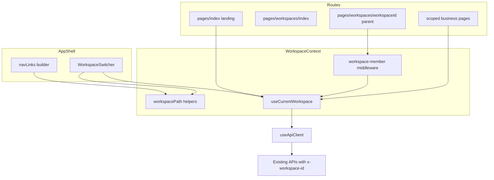
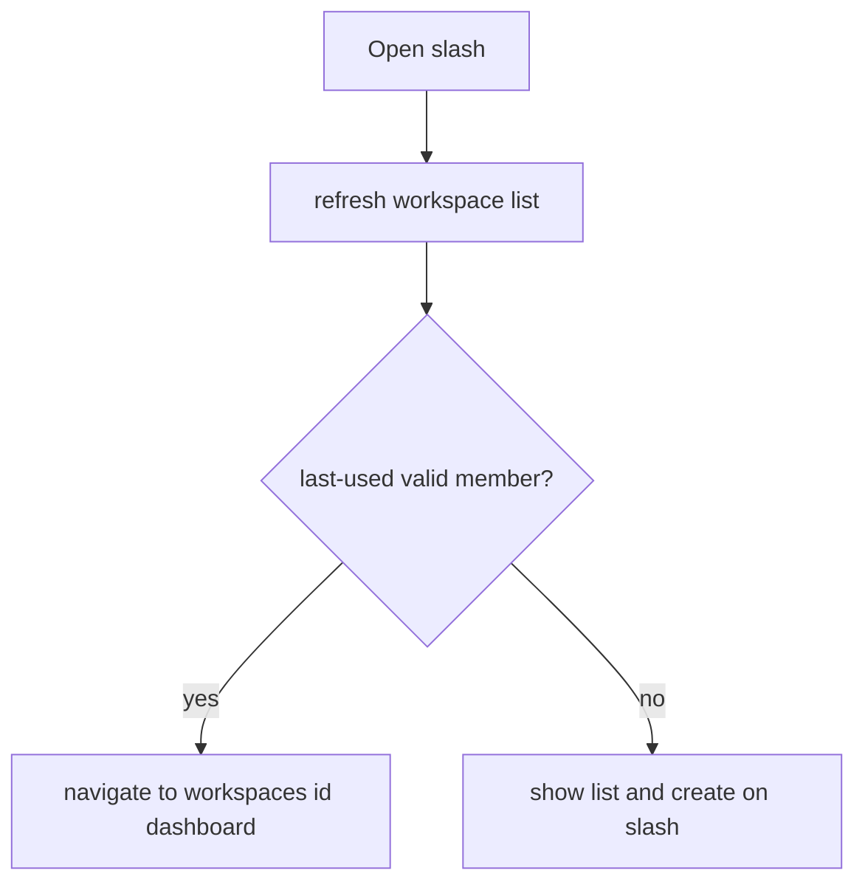
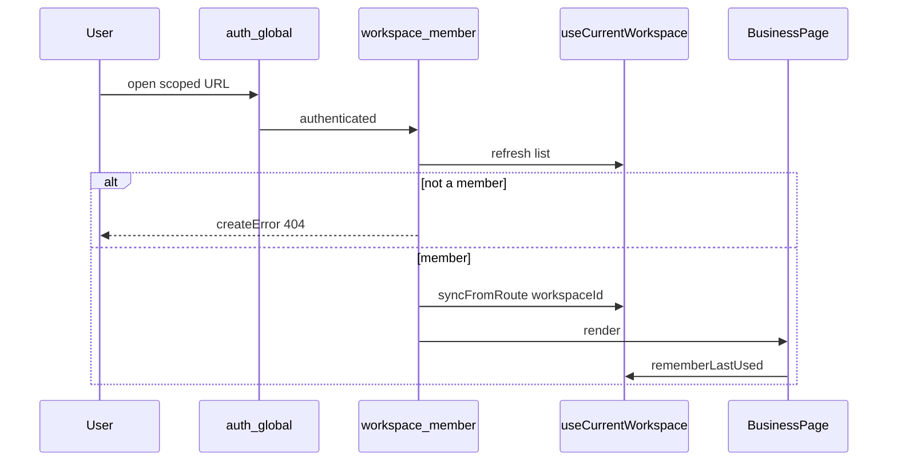
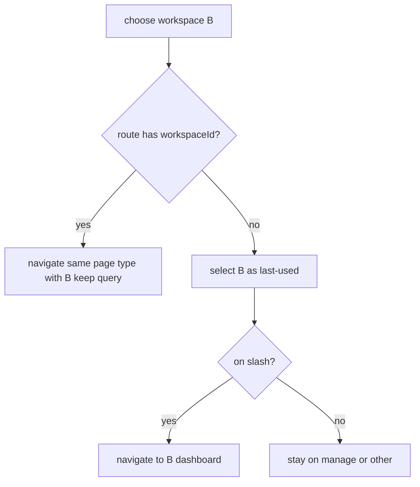
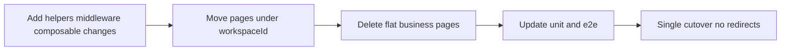

# Design Document: workspace-url-routing

## Overview

本機能は、ログインユーザーが業務画面のアドレスからワークスペースを識別できるようにし、ブックマーク共有・履歴・複数タブでも操作対象がズレないようにする。業務画面を `/workspaces/:workspaceId/...` 配下へ移し、当該画面では URL のワークスペース識別子を現在ワークスペースの正本とする。API パスは変更せず、既存の `x-workspace-id` ヘッダ連携を継続する。

**Users**: ログイン済み利用者が、特定ワークスペースのダッシュボード・タスク・カンバン等へ直接到達・共有するために利用する。

**Impact**: フロントエンドのページ配置・ナビ・現在ワークスペース composable・Switcher を変更する。バックエンドのルート階層は変えない。旧フラット業務 URL はページ削除により 404 となる。

### Goals
- 業務画面 URL を `/workspaces/:workspaceId/...` 形式に統一する（requirements URL 対応表）
- scoped 画面では URL を現在ワークスペースの正本とし、ヘッダー切替は同一画面種で識別子のみ付け替える
- `/` は前回利用ワークスペースのダッシュボードへ進むか、一覧・追加を表示する
- 旧フラット業務 URL・非所属／不明識別子は見つからない画面（404）とする
- ログイン戻り先と案件絞り込みクエリ（`caseId`）を維持する

### Non-Goals
- API パスの `/api/workspaces/:id/...` 化
- `/api/throughput` のワークスペーススコープ化
- 旧 URL 互換リダイレクト
- 404／500 の本格的なエラーページデザイン
- ワークスペース CRUD・メンバーシップ業務ルールの変更
- 案件・タスク等の可視境界ルール自体の変更
- Claude Design による新規ビジュアル（制限中のため既存 UI 踏襲。スキップ記録は `research.md`）

## Boundary Commitments

### This Spec Owns
- フロントエンド業務画面の URL 規約とページ配置（`pages/workspaces/[workspaceId]/...`）
- ルート `/` の分岐（前回利用 WS → ダッシュボード／一覧・追加）
- URL と現在ワークスペース文脈の同期（正本は scoped 画面の route param）
- 前回利用ワークスペースのクライアント記憶（`/` 分岐・管理画面の文脈用）
- WorkspaceSwitcher の同一画面種ナビゲーション
- 所属外・不明 `workspaceId` および旧フラット業務 URL の 404
- ナビ・画面内リンク・空状態導線の新 URL 整合
- 上記に伴うユニット／E2E のパス更新

### Out of Boundary
- Fastify ルートパスの階層化、`x-workspace-id` ガード／リポジトリスコープの再設計（`workspace-resource-scope`）
- ワークスペース作成・所属・メンバー追加・設定・削除の業務ルール（`workspace-membership`。導線と遷移のみ本仕様）
- Cookie セッション認証そのもの（`user-auth`。`redirect=fullPath` は既存を利用）
- 消化数 API のスコープ化（`velocity-dashboard`）
- エラーページのビジュアルデザインシステム（`docs/ideas.md`）

### Allowed Dependencies
- `user-auth`: `auth.global.ts` の未ログイン誘導と `login.vue` の戻り先復元
- `workspace-membership`: `listWorkspaces`・メンバーシップ・Switcher／CreateModal／`/workspaces` 管理画面
- `workspace-resource-scope`: `useApiClient` の `x-workspace-id` 付与と API 側所属検証（ヘッダ方式を維持）
- Nuxt 4 ファイルベースルーティング、`navigateTo`、`createError`、既存共有 UI（`Modal`、空状態の見た目）

### Revalidation Triggers
- 業務画面の path セグメント名や `/workspaces/:workspaceId` 配下の画面一覧が変わる → 後続画面仕様（`task-detail` 等）の URL 前提を再確認
- 現在ワークスペース正本を URL 以外へ戻す／サーバー永続化する → 本設計の前提崩壊
- API をパス階層化する → 本仕様 Out だった契約が変わり、クライアント配線を再設計
- ホスティングの SPA fallback 方針変更 → 動的 `workspaceId` 直リンクの到達性を再検証

## Architecture

### Existing Architecture Analysis

- フロントは Nuxt 4（`ssr: false`）のファイルベースルーティング。業務ページはフラット（`pages/tasks` 等）。`pages/workspaces/index.vue` は管理画面のみ
- 現在 WS は `useCurrentWorkspace`（`localStorage` + `useState`）。`refresh()` は保存 ID 無効時に先頭 WS を自動選択する（本仕様の `/` 一覧分岐と衝突するため廃止する）
- API 文脈は `useApiClient` が `currentId` を見て `x-workspace-id` を付与。本仕様はこの供給元の意味を URL 正本に合わせるのみ
- 認証は `auth.global.ts` が `to.fullPath` を `redirect` に載せる。新 URL でも追加変更は最小
- カスタム `error.vue` は無い。未定義ルート／`createError(404)` は Nuxt 標準表示で最低限を満たす

### Architecture Pattern & Boundary Map



- Selected pattern: URL-as-source-of-truth for scoped pages + last-used memory for `/` and management context（gap 分析 Option C）
- Domain boundaries: ルーティング／文脈同期はフロントのみ。API 契約は触らない
- Existing patterns preserved: `useApiClient` 単一 HTTP 境界、auth global middleware、CreateModal／管理画面
- New pieces: path helper、所属 middleware、親 `[workspaceId]` レイアウト、`/` ランディング分岐

### Technology Stack

| Layer | Choice / Version | Role in Feature | Notes |
|-------|------------------|-----------------|-------|
| Frontend | Nuxt 4 SPA（`ssr: false`） | ページ移動・middleware・ナビ | 新規ルーターライブラリなし |
| Frontend state | `useState` + `localStorage` | last-used 記憶 | キーは既存 `currentWorkspaceId` を転用（意味を last-used に縮退） |
| Backend | 変更なし | 既存ヘッダスコープを利用 | Out of Boundary |

Build vs Adopt: Nuxt のファイルベースルーティングと `createError` を採用。専用ルーターやテナント SDK は導入しない。

## File Structure Plan

### Directory Structure
```
frontend/
├── utils/
│   └── workspacePath.ts              # path 構築・画面種抽出・workspaceId 差し替え（新規）
├── utils/
│   └── workspacePath.test.ts
├── middleware/
│   ├── auth.global.ts                # 変更なし（fullPath 維持を確認）
│   └── workspace-member.ts           # 所属検証 → 404（新規 named）
├── composables/
│   └── useCurrentWorkspace.ts        # last-used 専用化、URL 同期 API、先頭自動選択廃止
├── components/workspaces/
│   ├── WorkspaceSwitcher.vue         # 同一画面種 navigate
│   ├── WorkspaceCreateModal.vue      # 作成後の遷移先整合
│   └── WorkspacePickerPanel.vue      # `/` 用一覧・追加（既存見た目踏襲、新規）
├── app.helpers.ts                    # buildNavLinks(workspaceId) 化
├── app.vue                           # 動的ナビ・active 判定
└── pages/
    ├── index.vue                     # ランディング分岐のみ（ダッシュボード本体は移動）
    ├── login.vue / register.vue      # 据え置き
    ├── workspaces/
    │   ├── index.vue                 # 管理画面（据え置き、currentId=last-used 文脈）
    │   ├── [workspaceId].vue         # 親: NuxtPage + middleware
    │   └── [workspaceId]/
    │       ├── index.vue             # 旧 pages/index.vue のダッシュボード本体
    │       ├── tasks/index.vue
    │       ├── kanban/index.vue
    │       ├── kanban/stages.vue
    │       ├── cases/index.vue
    │       ├── calendar/index.vue
    │       ├── recurrence/index.vue
    │       ├── holidays/index.vue
    │       └── throughput/index.vue
    └── (delete flat) tasks|kanban|cases|calendar|recurrence|holidays|throughput
```

業務ページの `*.helpers.ts` / `*.test.ts` はページと一緒に移動する。E2E（`frontend/e2e/**`）と `fixtures.ts` は新 path／選択手順に合わせて更新する。

### Modified Files
- `frontend/composables/useCurrentWorkspace.ts` — 先頭自動選択削除、`syncFromRoute`／`rememberLastUsed`、scoped 外での select
- `frontend/composables/useCurrentWorkspace.test.ts` — 上記振る舞い
- `frontend/components/workspaces/WorkspaceSwitcher.vue` — path rewrite
- `frontend/components/workspaces/WorkspaceCreateModal.vue` — 作成後: scoped なら同一画面種、それ以外は新 WS ダッシュボードへ
- `frontend/app.helpers.ts` / `app.vue` — WS 付きナビ
- `frontend/pages/index.vue` — リダイレクト or Picker
- `frontend/pages/workspaces/index.vue` — 管理画面の「現在」は last-used。削除後は Req6 に従い遷移
- 各業務ページ — ルート移動、`currentId === null` 空状態ブロック削除（所属は middleware 保証）、内部リンクを helper 経由に
- `frontend/middleware/auth.global.test.ts` / `login.test.ts` 等 — 期待 path 更新

## System Flows

### `/` 分岐



### scoped 画面入場



### Switcher 切替



## Requirements Traceability

| Requirement | Summary | Components | Interfaces | Flows |
|-------------|---------|------------|------------|-------|
| 1.1, 1.2 | 業務 URL 対応表 | scoped pages, workspacePath | `workspacePath` | — |
| 1.3 | ナビ／内部リンクが同一 WS | app.helpers, app.vue, business pages | `buildNavLinks` | — |
| 1.4 | `caseId` 維持 | workspacePath, index→tasks links | `workspacePath` + query | Switcher |
| 2.1–2.3 | `/` 分岐と last-used 記憶 | pages/index, useCurrentWorkspace, WorkspacePickerPanel | `refresh`, `rememberLastUsed` | `/` 分岐 |
| 3.1–3.3 | URL 正本 | workspace-member, useCurrentWorkspace | `syncFromRoute` | scoped 入場 |
| 4.1–4.2 | Switcher 画面種維持 | WorkspaceSwitcher, workspacePath | `replaceWorkspaceIdInPath` | Switcher |
| 5.1–5.3 | 不正／旧 URL 404 | workspace-member, page deletion, Nuxt error | `createError` | scoped 入場 |
| 6.1–6.3 | WS 消失時退避 | useCurrentWorkspace, Switcher/pages delete handlers | `relocateAfterWorkspaceLost` | — |
| 7.1–7.3 | 認証・管理据え置き・戻り先 | auth.global, login, pages/workspaces | 既存 redirect | — |
| 8.1–8.2 | 所属ゼロ | pages/index Picker, workspace-member | — | `/` 分岐 / 404 |

## Components and Interfaces

| Component | Domain/Layer | Intent | Req Coverage | Key Dependencies | Contracts |
|-----------|--------------|--------|--------------|------------------|-----------|
| workspacePath | Frontend utils | WS 付き path の構築・差し替え | 1.1–1.4, 4.1–4.2 | Nuxt route shape (P1) | Service |
| useCurrentWorkspace | Frontend composable | last-used と一覧、URL 同期 | 2.x, 3.x, 6.x, 8.x | useApiClient (P0) | State, Service |
| workspace-member middleware | Frontend middleware | 所属検証と sync | 3.x, 5.1, 8.2 | useCurrentWorkspace (P0) | — |
| WorkspaceSwitcher | UI | 切替 UX | 4.x, 6.x | workspacePath, useCurrentWorkspace (P0) | — |
| WorkspacePickerPanel | UI | `/` の一覧・追加 | 2.2, 8.1 | CreateModal, useCurrentWorkspace (P0) | — |
| App nav | UI shell | WS 付きリンク | 1.3 | workspacePath (P0) | — |
| Landing `/` | Page | 分岐 | 2.x, 8.1 | useCurrentWorkspace (P0) | — |
| Scoped pages + parent | Page | 業務画面提供 | 1.x, 5.2 | middleware (P0) | — |
| Manage `/workspaces` | Page | 管理据え置き | 7.1, 6.x | last-used currentId (P1) | — |

### Frontend utils

#### workspacePath

| Field | Detail |
|-------|--------|
| Intent | ワークスペース付き URL の単一の構築・解析口 |
| Requirements | 1.1, 1.2, 1.3, 1.4, 4.1, 4.2 |

**Responsibilities & Constraints**
- 画面種（`""` ダッシュボード / `tasks` / `kanban` / `kanban/stages` / …）と `workspaceId` から path を生成する
- 現在 path から画面種を抽出し、別 `workspaceId` へ差し替える
- クエリは呼び出し側が渡した `query` を付与する。Switcher は移行元の `route.query` をそのまま引き継ぐ（最低限 `caseId` を含む）
- `/login` `/register` `/workspaces`（管理）は workspace 付きに変換しない

**Contracts**: Service [x]

```typescript
type WorkspacePageKind =
  | ""
  | "tasks"
  | "kanban"
  | "kanban/stages"
  | "cases"
  | "calendar"
  | "recurrence"
  | "holidays"
  | "throughput";

function workspacePath(workspaceId: string, kind: WorkspacePageKind): string;
function parseWorkspaceRoute(path: string): { workspaceId: string; kind: WorkspacePageKind } | null;
function replaceWorkspaceIdInPath(path: string, workspaceId: string): string | null;
function buildNavLinks(workspaceId: string | null): NavLink[];
```

- Preconditions: `workspacePath` / `replaceWorkspaceIdInPath` に渡す `workspaceId` は非空文字列
- `buildNavLinks` の入力は常に `currentId`（scoped 中は URL 同期済み、管理画面等では last-used）とする
- `buildNavLinks(null)`: 「ダッシュボード(`/`)」と「メンバー(`/workspaces`)」のみを返す。業務リンクは出さない
- Postconditions: 生成 path は requirements URL 対応表に一致する

**Implementation Notes**
- Integration: Switcher・ナビ・ダッシュボードの `caseId` リンクがここだけを通る
- Validation: ユニットで対応表の全 kind を固定
- Risks: `kanban/stages` のネスト抽出ミス

### Frontend composable

#### useCurrentWorkspace

| Field | Detail |
|-------|--------|
| Intent | 所属一覧と last-used、および URL 正本との同期 |
| Requirements | 2.1–2.3, 3.1–3.3, 6.1–6.3, 8.1 |

**Responsibilities & Constraints**
- `refresh()`: 一覧を取得する。保存済み last-used が所属に含まれるときのみ `currentId` に載せる。含まれない／未設定なら `currentId = null` とし、先頭自動選択はしない
- scoped 表示中: `syncFromRoute(workspaceId)` が `currentId` を URL に合わせ、`rememberLastUsed` する。URL と異なる ID へ黙って戻さない
- `select(id)`: 所属内のみ。scoped 外（管理画面等）での切替と、Switcher が navigate する前の状態更新に使う
- `relocateAfterWorkspaceLost(lostId)`: 現在／表示中 WS を失ったと分かったとき、他所属があれば同一画面種（特定不能ならダッシュボード）へ、無ければ `/` の一覧・追加へ導く
- リアルタイム監視（ポーリング／プッシュ）は行わない。検知は次の操作タイミングに限定する（下記 Error Handling）

**Contracts**: State [x] / Service [x]

```typescript
interface UseCurrentWorkspace {
  workspaces: Ref<Workspace[]>;
  currentId: Ref<string | null>;
  refresh(): Promise<void>;
  select(id: string): void;
  syncFromRoute(workspaceId: string): void;
  rememberLastUsed(workspaceId: string): void;
  clearCurrent(): void;
  clearCurrentIf(id: string): void;
  relocateAfterWorkspaceLost(lostId: string): Promise<void> | void;
}
```

**State Management**
- Persistence: `localStorage["currentWorkspaceId"]` は last-used 専用
- Consistency: scoped 中の正本は route param。`currentId` はそれに同期された結果であり、API ヘッダ供給に使う

**Implementation Notes**
- Integration: `useApiClient` は引き続き `currentId` を読む（供給元の意味だけ変わる）
- Validation: `refresh` が所属ありでも自動選択しないことをユニットで固定
- Risks: 既存 E2E／fixtures が「作成後に自動選択」前提 → 明示 select または URL 遷移に更新

### Frontend middleware

#### workspace-member

| Field | Detail |
|-------|--------|
| Intent | scoped ルートの所属検証と URL 同期 |
| Requirements | 3.1–3.3, 5.1, 8.2 |

**Responsibilities & Constraints**
- `pages/workspaces/[workspaceId].vue` に named middleware として適用（`/workspaces` 管理には適用しない）
- `auth.global` の後に走る前提で一覧を `refresh` し、`params.workspaceId` が所属に無ければ `createError({ statusCode: 404 })`
- 所属なら `syncFromRoute` して通過

**Implementation Notes**
- Integration: 親ページの `definePageMeta({ middleware: ["workspace-member"] })`
- Risks: global 化すると管理画面を誤って 404 にする → named に限定

### UI components

#### WorkspaceSwitcher / WorkspacePickerPanel / App nav / pages

Summary-only（新規境界は上記 utils／composable／middleware）。

- WorkspaceSwitcher: 所属選択時、`parseWorkspaceRoute` 成功なら `replaceWorkspaceIdInPath` + `navigateTo({ path, query })`。失敗時は `select` のみ。`/` 上で選んだ場合はダッシュボードへ
- WorkspacePickerPanel: 既存空状態・`/workspaces` 一覧の見た目を流用し、所属 WS を並べてクリックでダッシュボードへ。作成は `WorkspaceCreateModal`
- Scoped business pages: フラットから移動。`workspace-empty-state`（`currentId === null`）は削除。内部リンクは `workspacePath(currentId, kind)`
- Landing `/`: last-used 有効なら `navigateTo(workspacePath(id, ""))`。否则 Picker
- App nav: 常に `buildNavLinks(currentId)`。`currentId === null` のときは `/` と `/workspaces` のみ
- Manage `/workspaces`: path 据え置き。表示対象 WS は last-used（`currentId`）。削除成功時は `clearCurrentIf` + `relocateAfterWorkspaceLost`（他所属の同一画面種、なければ `/`）

## Data Models

スキーマ変更なし。クライアント記憶のみ。

| Key | Location | Meaning after this spec |
|-----|----------|-------------------------|
| `currentWorkspaceId` | `localStorage` | 前回利用ワークスペース ID（last-used）。scoped 正本ではない |

## Error Handling

| Case | Response |
|------|----------|
| 非所属／不明 `workspaceId` を URL で開いた | `createError(404)` → Nuxt 標準エラー表示（最初から無効なアドレス。Req 5 / 8.2） |
| 旧フラット業務 URL | ページ無し → 同じく 404 |
| 有効だった現在 WS を失ったと分かった | 業務画面を維持せず `relocateAfterWorkspaceLost`（他所属あり → 同一画面種、なし → `/` 一覧・追加。Req 6） |
| 所属ゼロで `/` | Picker（作成導線） |

Req 6 の検知タイミング（リアルタイム強制遷移はしない）:

1. 自操作のワークスペース削除成功直後
2. 次の scoped 画面入場時（`workspace-member` が `refresh` した結果、当該 ID が所属外 → 404。ただし削除直後など「失った」と分かっている遷移では `relocateAfterWorkspaceLost` を優先）
3. scoped API が所属拒否相当を返したとき → 一覧を `refresh` し、現在 WS が所属から消えていれば `relocateAfterWorkspaceLost`

「最初から無効な URL を開く」（404）と「今まで見ていた WS を失った」（Req 6 退避）を混同しない。

本格的なエラーページデザインは行わない。

## Testing Strategy

### Unit
- `workspacePath`: URL 対応表の全 kind、`replaceWorkspaceIdInPath`、`kanban/stages`、非対象 path は null
- `useCurrentWorkspace.refresh`: 所属あり＋ last-used 無し → `currentId === null`（自動選択しない）
- `useCurrentWorkspace.syncFromRoute`: URL ID を current にし persist
- `buildNavLinks`: 付与された workspaceId で業務リンクが `/workspaces/:id/...` になる
- middleware: 非メンバーで 404 相当（テスト可能な形で `createError` 呼び出しを検証）
- login redirect: scoped fullPath（例 `/workspaces/ws1/tasks?caseId=c1`）を復元

### Component / Page
- Landing: last-used 有効ならダッシュボードへ navigate、無効なら Picker 表示
- Switcher: `/workspaces/a/kanban?x=1` から b 選択 → `/workspaces/b/kanban?x=1`
- ダッシュボードの案件リンク: `/workspaces/:id/tasks?caseId=`

### E2E
- 作成 → `/` または作成導線からダッシュボード `/workspaces/:id` に入れる
- 旧 `/tasks` `/kanban` が 404
- 非所属 workspaceId の URL が 404
- Switcher で画面種維持
- ログイン redirect が scoped URL を保持
- 所属ゼロで `/` に作成導線、scoped は 404
- 既存業務シナリオ（タスク・カンバン等）が新 path で通る

## Security Considerations

- 画面 URL のワークスペース識別子は秘匿ではない。所属外 ID は 404 とし、存在有無を画面上で区別しない（API の所属外リソース 404 方針と揃える）
- 認可の正本は引き続き API 側メンバーシップ検証。フロント 404 は UX と誤操作防止であり、セキュリティ境界の代替ではない

## Migration Strategy



- 互換リダイレクトは置かない（5.2）
- 旧ブックマークは 404 になることを受け入れ、README／開発メモが必要なら実装時コメントまたは steering 追記は任意（必須ではない）
- 静的ホスティングは既存どおり SPA fallback 前提。動的セグメントのプリレンダは行わない

## Supporting References

- URL 対応表の規範: `requirements.md`「URL 対応表」
- ギャップ分析と決定ログ: `research.md`
